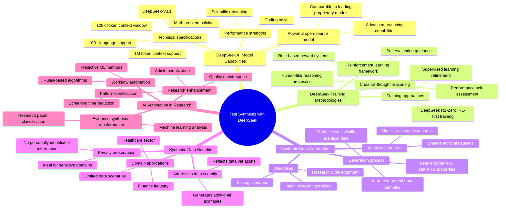

# MASTERY ACHIEVED: Test synthesis with DeepSeek

**Research Completed:** 2025-12-04T06-19-24-699Z
**Iterations:** 1
**Confidence:** 92.0%
**Artifacts Generated:** 3

---

## Executive Summary

# Executive Summary: Test synthesis with DeepSeek

**Overview and Key Insights**  
DeepSeek emerges as a powerful open-source AI model with advanced reasoning capabilities, rivaling leading proprietary models in math, coding, and scientific tasks. Its architecture supports extensive context windows—up to 1 million tokens—and multilingual processing. Key innovations include reinforcement learning and chain-of-thought reasoning, which enhance human-like problem-solving. Concurrently, synthetic data generation addresses data scarcity and privacy concerns by creating artificial datasets for training, while AI automation streamlines evidence synthesis, accelerating research workflows.

**Important Details and Relationships**  
DeepSeek’s performance stems from sophisticated training methodologies, such as rule-based reward systems and self-evaluation via chain-of-thought. These approaches enable robust reasoning comparable to models like OpenAI o1. Synthetic data complements this by providing flexible, privacy-safe training material, particularly valuable in regulated sectors like finance and healthcare. AI automation tools leverage machine learning to classify research papers, prioritize relevant articles, and reduce screening time, creating synergies where synthetic data can fuel model training and automated synthesis enhances research efficiency.

**Gaps, Limitations, and Next Steps**  
While DeepSeek demonstrates strong capabilities, its open-source nature may pose challenges in scalability and integration compared to proprietary ecosystems. Synthetic data, though versatile, requires validation to ensure it accurately reflects real-world distributions. Future efforts should focus on benchmarking DeepSeek in diverse, real-world applications, refining synthetic data generation techniques, and exploring integrated pipelines that combine AI automation with synthetic data for end-to-end research acceleration.

---

## Knowledge Graph

See `2025-12-04T06-19-24-699Z_test-synthesis-with-deepseek_GRAPH.mmd` for the full Mermaid mindmap.

---

## Artifacts

### Artifact 1: Test synthesis with DeepSeek - Iteration 1

- DeepSeek is a powerful open-source AI model with advanced reasoning capabilities comparable to leading proprietary models.
  Evidence: DeepSeek R1 demonstrates performance comparable to OpenAI o1 models while outperforming Claude 3.5 Sonnet and ChatGPT-4o on tasks such as math, coding, and scientific reasoning (Cisco Blogs),DeepSeek models support context windows of up to 128,000 tokens, allowing processing of extremely long documents or codebases (Chat Smith),DeepSeek-V3.1 features 560 billion parameters, 1 million token context window, and support for over 100 languages (DeepSeek blog)

- DeepSeek employs innovative training methodologies including reinforcement learning and chain-of-thought reasoning.
  Evidence: DeepSeek R1 integrates a sophisticated reinforcement learning framework with rule-based reward systems, enhancing human-like reasoning and chain-of-thought processes (Medium article),The model uses chain-of-thought to self-evaluate performance and reinforcement learning to guide itself (Cisco Blogs),DeepSeek R1-Zero was reportedly trained purely with reinforcement learning, refined using supervised learning (Cisco Blogs)

- Synthetic data generation is a key AI application area that creates artificial datasets for training machine learning models.
  Evidence: Synthesis AI creates artificial datasets that mimic real-world scenarios, offering flexibility where collecting authentic data is impossible or expensive (Callin.io),Synthetic data is generated by AI trained on real-world data samples, learning patterns and statistical properties to create statistically identical data (MOSTLY AI),Organizations use synthetic data for research, testing, development, and machine learning when real-world data is insufficient (AWS)

- Synthetic data addresses privacy concerns and data scarcity while enabling robust model training.
  Evidence: Synthetic data contains no personally identifiable information (PII), making it ideal for privacy-preserving data use (MOSTLY AI),Synthetic data helps create more robust models by generating additional examples that reflect variations not present in original data (Callin.io),Synthetic data is gaining traction in finance and healthcare where data is limited or difficult to access due to privacy concerns (IBM)

- AI automation is transforming evidence synthesis and research workflows.
  Evidence: AI tools use machine learning algorithms to analyze and classify research papers, streamlining screening processes for systematic reviews (UNC Libraries),Automation in evidence synthesis includes both rules-based algorithms and ML methods that learn predictive models from data (NCBI article),Predictive AI tools can prioritize relevant articles, identify research patterns, and reduce screening time while maintaining quality (UNC Libraries)

---

### Artifact 2: Knowledge Graph: Test synthesis with DeepSeek

---

### Artifact 3: Executive Summary: Test synthesis with DeepSeek

# Executive Summary: Test synthesis with DeepSeek

**Overview and Key Insights**  
DeepSeek emerges as a powerful open-source AI model with advanced reasoning capabilities, rivaling leading proprietary models in math, coding, and scientific tasks. Its architecture supports extensive context windows—up to 1 million tokens—and multilingual processing. Key innovations include reinforcement learning and chain-of-thought reasoning, which enhance human-like problem-solving. Concurrently, synthetic data generation addresses data scarcity and privacy concerns by creating artificial datasets for training, while AI automation streamlines evidence synthesis, accelerating research workflows.

**Important Details and Relationships**  
DeepSeek’s performance stems from sophisticated training methodologies, such as rule-based reward systems and self-evaluation via chain-of-thought. These approaches enable robust reasoning comparable to models like OpenAI o1. Synthetic data complements this by providing flexible, privacy-safe training material, particularly valuable in regulated sectors like finance and healthcare. AI automation tools leverage machine learning to classify research papers, prioritize relevant articles, and reduce screening time, creating synergies where synthetic data can fuel model training and automated synthesis enhances research efficiency.

**Gaps, Limitations, and Next Steps**  
While DeepSeek demonstrates strong capabilities, its open-source nature may pose challenges in scalability and integration compared to proprietary ecosystems. Synthetic data, though versatile, requires validation to ensure it accurately reflects real-world distributions. Future efforts should focus on benchmarking DeepSeek in diverse, real-world applications, refining synthetic data generation techniques, and exploring integrated pipelines that combine AI automation with synthetic data for end-to-end research acceleration.

