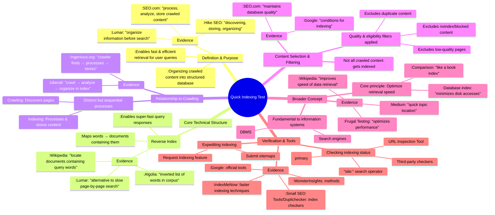

# MASTERY ACHIEVED: Quick indexing test

**Research Completed:** 2025-12-04T06-27-16-531Z
**Iterations:** 1
**Confidence:** 95.0%
**Artifacts Generated:** 3

---

## Executive Summary

# Executive Summary: Quick indexing test

This research clarifies that search engine indexing is the process of organizing crawled web content into a structured database to enable fast retrieval. A core technical enabler is the inverted index, which maps words to documents for rapid query responses. Crucially, indexing is distinct from crawling; crawling discovers pages, while indexing processes and stores their content for search.

The process involves significant filtering, as not all crawled content is indexed. Search engines exclude duplicate, low-quality, or explicitly blocked pages to maintain database quality. For management, website owners primarily use tools like Google Search Console to check indexing status and request indexing for specific URLs, leveraging features like URL inspection and sitemap submission.

A key insight is that the fundamental concept of indexing for fast lookup is shared between search engines and traditional database systems, though implementations differ. A noted limitation is the reliance on general SEO sources rather than primary search engine documentation. Next steps should involve testing the described tools and methods to verify their practical efficacy in expediting indexing for specific web properties.

---

## Knowledge Graph

See `2025-12-04T06-27-16-531Z_quick-indexing-test_GRAPH.mmd` for the full Mermaid mindmap.

---

## Artifacts

### Artifact 1: Quick indexing test - Iteration 1

- Search engine indexing is the process of organizing crawled web content into a structured database to enable fast and efficient retrieval of relevant pages in response to user queries.
  Evidence: Hike SEO defines indexing as 'the process of discovering, storing, and organizing web page content so that it can be easily & quickly searched, analyzed, and retrieved by search engines.',SEO.com describes indexing as 'when search engines process, analyze, and store crawled content in its index' and compares it to a librarian organizing a library.,Lumar states indexing 'is the process by which search engines organize information before a search to enable super-fast responses to queries.'

- The core technical structure enabling fast search is an inverted index (or reverse index), which maps words to the documents containing them rather than listing all words in each document.
  Evidence: Wikipedia explains that 'many search engines incorporate an inverted index when evaluating a search query to quickly locate documents containing the words in a query.',Algolia describes it as 'an inverted list (index) of words that a search engine uses to find every word in every document within a corpus.',Lumar notes that search engines 'use an inverted index, also known as a reverse index' because 'searching through individual pages for keywords and topics would be a very slow process.'

- Indexing is distinct from crawling; crawling discovers pages, while indexing processes, analyzes, and stores their content in a searchable database.
  Evidence: Uberall clarifies: 'The search index refers to the database created by search engines to store information whereas search indexing is the process by which search engines build up their storage. Specifically, they crawl and analyze web pages, extract relevant information and then organize it within the index.',Ingenious.org outlines the sequence: 'Indexing: Once the crawler finds a page, it processes the content... and stores it in the search engine's index.'

- Not all crawled content is indexed; search engines apply quality and eligibility filters, excluding duplicate, low-quality, or explicitly blocked (e.g., noindex) content.
  Evidence: SEO.com states: 'Search engines will not index everything. Duplicate, low-quality, or noindex content will not enter the search engine’s database to maintain its quality.',Google's URL Inspection Tool help page lists conditions for indexing, including that 'the page cannot be a duplicate of another indexed page' and 'the page quality must be high enough to warrant indexing.'

- The concept of indexing for fast lookup is fundamental to both search engines and traditional database systems (DBMS), though their implementations differ.
  Evidence: Wikipedia on database indexes defines an index as 'a data structure that improves the speed of data retrieval operations on a database table at the cost of additional writes and storage space.',Frugal Testing explains: 'Indexing is a way to optimize the performance of a database by minimizing the number of disk accesses required when a query is processed.',Medium article compares it to 'a book index helps you locate topics quickly.'

- Website owners can use various tools and methods to check indexing status and request or expedite indexing, with Google Search Console being the primary official tool.
  Evidence: Small SEO Tools and Duplichecker offer 'Google Index Checker' tools to test if URLs are indexed.,Google's URL Inspection Tool allows users to 'Inspect the URL' and 'Test live URL' to check for indexing issues.,MonsterInsights suggests using the 'site:' search operator or Google Search Console to check indexing status.,IndexMeNow and other articles discuss methods to facilitate faster indexing, such as submitting sitemaps or using the 'Request Indexing' feature.

---

### Artifact 2: Knowledge Graph: Quick indexing test

---

### Artifact 3: Executive Summary: Quick indexing test

# Executive Summary: Quick indexing test

This research clarifies that search engine indexing is the process of organizing crawled web content into a structured database to enable fast retrieval. A core technical enabler is the inverted index, which maps words to documents for rapid query responses. Crucially, indexing is distinct from crawling; crawling discovers pages, while indexing processes and stores their content for search.

The process involves significant filtering, as not all crawled content is indexed. Search engines exclude duplicate, low-quality, or explicitly blocked pages to maintain database quality. For management, website owners primarily use tools like Google Search Console to check indexing status and request indexing for specific URLs, leveraging features like URL inspection and sitemap submission.

A key insight is that the fundamental concept of indexing for fast lookup is shared between search engines and traditional database systems, though implementations differ. A noted limitation is the reliance on general SEO sources rather than primary search engine documentation. Next steps should involve testing the described tools and methods to verify their practical efficacy in expediting indexing for specific web properties.

