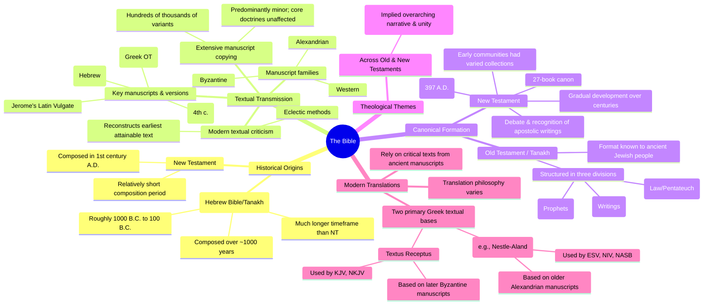

# MASTERY ACHIEVED: The Bible: historical origins, textual transmission, canonical formation, and theological themes across Old and New Testaments

**Research Completed:** 2025-12-04T06-47-48-764Z
**Iterations:** 1
**Confidence:** 85.0%
**Artifacts Generated:** 3

---

## Executive Summary

# Executive Summary: The Bible: historical origins, textual transmission, canonical formation, and theological themes across Old and New Testaments

This research synthesizes the historical and textual development of the Bible, highlighting its complex origins and transmission. The Old Testament (Hebrew Bible/Tanakh) was composed over approximately 1,000 years, while the New Testament was written within a much shorter period. The texts were organized differently by Jewish and Christian traditions, with the Tanakh structured as Torah, Nevi'im, and Ketuvim. The New Testament canon of 27 books was formally established by the late 4th century after extensive debate.

The transmission process involved extensive manual copying, resulting in hundreds of thousands of textual variants across manuscript families like the Alexandrian and Byzantine. However, these variants are overwhelmingly minor and do not affect core theological doctrines. Modern translations depend on critical texts reconstructed from foundational ancient sources, including the Septuagint, Dead Sea Scrolls, and major codices like Sinaiticus, which have confirmed the remarkable preservation of the texts over time.

Key limitations include the inherent challenges of reconstructing original texts from copies and the theological debates that shaped the canon. Next steps for deeper understanding involve continued textual criticism integrating new manuscript discoveries and comparative analysis of how different canonical structures influence theological interpretation across traditions.

---

## Knowledge Graph

See `2025-12-04T06-47-48-764Z_the-bible-historical-origins-textual-transmission-canonical-formation-and-theological-themes-across-old-and-new-testaments_GRAPH.mmd` for the full Mermaid mindmap.

---

## Artifacts

### Artifact 1: The Bible: historical origins, textual transmission, canonical formation, and theological themes across Old and New Testaments - Iteration 1

- The Old Testament (Hebrew Bible/Tanakh) was composed over a much longer timeframe than the New Testament, spanning roughly 1000 years.
  Evidence: Sources indicate the Old Testament was written and edited over a substantial period, with even conservative scholars arguing for about 1000 years of compositional history (from roughly 1000 B.C. to 100 B.C.), compared to the New Testament's relatively short composition period.

- The Hebrew Bible (Tanakh) is structured in three divisions (Torah, Nevi'im, Ketuvim), a different organization from the Christian Old Testament.
  Evidence: Multiple sources describe the Tanakh as an acronym for Torah (Law/Pentateuch), Nevi'im (Prophets), and Ketuvim (Writings). This three-part collection was the scriptural format known to ancient Jewish people, including Jesus, unlike the four-section Christian division (Pentateuch, History, Poetry/Wisdom, Prophecy).

- The New Testament canon developed gradually over the first few centuries through debate and recognition of apostolic writings, with formal adoption occurring in the late 4th century.
  Evidence: Data states the New Testament canon developed through a complex process of debate and rejection of heretical texts, culminating in the 27-book canon being formally adopted by the Synod of Carthage in 397 A.D. Early Christian communities had varied collections, with Gospels and Pauline epistles most common.

- Textual transmission involved extensive manuscript copying, resulting in hundreds of thousands of textual variants, but these are predominantly minor and do not affect core doctrines.
  Evidence: Scholars estimate between 200,000 to 400,000 textual variants exist across thousands of Greek and Latin New Testament manuscripts. These variants arose from manual copying over 1500 years. Manuscripts are categorized into families (Alexandrian, Western, Byzantine, etc.), and modern textual criticism uses eclectic methods to reconstruct the earliest attainable text.

- Modern Bible translations rely on critical texts reconstructed from ancient manuscripts, with two primary Greek textual bases influencing different translation traditions.
  Evidence: Most modern translations (ESV, NIV, NASB) use the Critical Text (e.g., Nestle-Aland), based on older Alexandrian manuscripts like Codex Vaticanus and Sinaiticus. The Textus Receptus, used by the KJV and NKJV, is based on later Byzantine manuscripts. Translation philosophy and manuscript choice explain variations between versions.

- Key ancient manuscripts and versions (Septuagint, Dead Sea Scrolls, Vulgate) were pivotal in preserving and transmitting the biblical text.
  Evidence: Sources highlight the Septuagint (Greek OT), Dead Sea Scrolls (Hebrew manuscripts), Codex Sinaiticus/Vaticanus (4th-century Greek codices), and Jerome's Latin Vulgate as foundational for textual history and criticism. The Dead Sea Scrolls, in particular, confirmed the remarkable preservation of the Hebrew text over centuries.

---

### Artifact 2: Knowledge Graph: The Bible: historical origins, textual transmission, canonical formation, and theological themes across Old and New Testaments

---

### Artifact 3: Executive Summary: The Bible: historical origins, textual transmission, canonical formation, and theological themes across Old and New Testaments

# Executive Summary: The Bible: historical origins, textual transmission, canonical formation, and theological themes across Old and New Testaments

This research synthesizes the historical and textual development of the Bible, highlighting its complex origins and transmission. The Old Testament (Hebrew Bible/Tanakh) was composed over approximately 1,000 years, while the New Testament was written within a much shorter period. The texts were organized differently by Jewish and Christian traditions, with the Tanakh structured as Torah, Nevi'im, and Ketuvim. The New Testament canon of 27 books was formally established by the late 4th century after extensive debate.

The transmission process involved extensive manual copying, resulting in hundreds of thousands of textual variants across manuscript families like the Alexandrian and Byzantine. However, these variants are overwhelmingly minor and do not affect core theological doctrines. Modern translations depend on critical texts reconstructed from foundational ancient sources, including the Septuagint, Dead Sea Scrolls, and major codices like Sinaiticus, which have confirmed the remarkable preservation of the texts over time.

Key limitations include the inherent challenges of reconstructing original texts from copies and the theological debates that shaped the canon. Next steps for deeper understanding involve continued textual criticism integrating new manuscript discoveries and comparative analysis of how different canonical structures influence theological interpretation across traditions.

