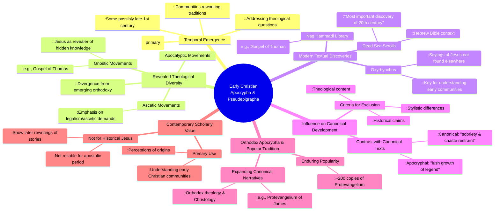

# MASTERY ACHIEVED: Early Christian apocrypha and pseudepigrapha: textual discovery, theological diversity, and their influence on canonical development

**Research Completed:** 2025-12-04T06-50-00-323Z
**Iterations:** 1
**Confidence:** 85.0%
**Artifacts Generated:** 3

---

## Executive Summary

# Executive Summary: Early Christian apocrypha and pseudepigrapha: textual discovery, theological diversity, and their influence on canonical development

This research examines early Christian apocrypha and pseudepigrapha, texts largely composed in the 2nd-3rd centuries CE. These writings emerged as diverse Christian communities reworked traditions to address theological questions and support unique beliefs. Modern discoveries, such as the Nag Hammadi and Oxyrhynchus finds, have dramatically expanded access to these texts, fundamentally altering scholarly understanding of the theological diversity present in formative Christianity.

The texts reveal a spectrum of early Christian movements, including Gnostic, ascetic, and apocalyptic groups, whose beliefs often diverged from what later became mainstream orthodoxy. The subsequent development of the New Testament canon involved the conscious exclusion of many such texts based on criteria of apostolic authorship, theological coherence, and stylistic restraint. However, not all apocryphal works were heterodox; many, like the popular Protevangelium of James, offered orthodox expansions of canonical narratives and remained influential in Christian piety and art.

Contemporary scholarship primarily values these texts not as sources for the historical Jesus, but as crucial windows into the concerns, debates, and literary creativity of early Christian communities. A key limitation is that most apocrypha are later compositions, reflecting secondary developments. Next steps involve continued textual analysis and integrating these sources to construct a more nuanced, pluralistic picture of early Christianity's development alongside and in reaction to the canonical tradition.

---

## Knowledge Graph

See `2025-12-04T06-50-00-323Z_early-christian-apocrypha-and-pseudepigrapha-textual-discovery-theological-diversity-and-their-influence-on-canonical-development_GRAPH.mmd` for the full Mermaid mindmap.

---

## Artifacts

### Artifact 1: Early Christian apocrypha and pseudepigrapha: textual discovery, theological diversity, and their influence on canonical development - Iteration 1

- Early Christian apocrypha and pseudepigrapha emerged primarily in the 2nd-3rd centuries CE as diverse communities reworked traditions to address theological questions and support unique beliefs.
  Evidence: Sources indicate these texts were created when 'ancient authors reworked the traditions of the earliest Christian texts in order to support their own unique beliefs and practices in the second century AD' (BYU Noncanonical Gospels) and were 'written in the first three centuries, some perhaps as early as the late first century' (Apocryphicity.ca).

- These texts reveal significant theological diversity in early Christianity, including Gnostic, ascetic, and apocalyptic movements that diverged from what became mainstream orthodoxy.
  Evidence: Sources describe 'a variety of Christianities—or groups professing divergent beliefs about Christ and His gospel' (BYU False Gospels), noting that Gnostic texts like the Gospel of Thomas present Jesus as 'a revealer of hidden knowledge rather than the atoning Lamb' (UASV Bible), while others emphasize 'legalism or ascetic demands' contrasting with Pauline grace.

- Modern discoveries (Oxyrhynchus, Dead Sea Scrolls, Nag Hammadi) have dramatically expanded access to these texts, changing scholarly understanding of early Christian diversity.
  Evidence: The Oxyrhynchus discoveries included 'some of the most important texts for understanding... the earliest Christian communities' with 'many sayings of Jesus not found anywhere else' (RationalFaiths). The Dead Sea Scrolls are called 'the most important discovery of the 20th century' for understanding the Hebrew Bible context.

- Canonical development involved conscious exclusion of apocryphal texts based on theological, stylistic, and historical criteria.
  Evidence: Early Christians noted that 'the style and theological content of these spurious works differed starkly from that of the writings they knew to be genuine' (UASV Bible). The canonical texts show 'remarkable sobriety and chaste restraint' compared to apocrypha's 'lush growth of legend' (DBTS).

- Many apocryphal texts were orthodox in theology and served to expand rather than challenge canonical narratives, remaining popular in Christian tradition.
  Evidence: Some texts 'are orthodox in their theology and Christology and essentially expand upon rather than challenge the texts that became canonical' with 'somewhere around 200 copies of the Protevangelium of James' (Apocryphicity.ca).

- Contemporary scholarship values these texts primarily for understanding early Christian communities rather than as sources for the historical Jesus.
  Evidence: While 'not reliable sources regarding the historical Jesus or the apostolic period, they help scholars understand how later generations of Christians perceived and rewrote the stories about the origins of the Christian movement' (St Andrews Encyclopaedia).

---

### Artifact 2: Knowledge Graph: Early Christian apocrypha and pseudepigrapha: textual discovery, theological diversity, and their influence on canonical development

---

### Artifact 3: Executive Summary: Early Christian apocrypha and pseudepigrapha: textual discovery, theological diversity, and their influence on canonical development

# Executive Summary: Early Christian apocrypha and pseudepigrapha: textual discovery, theological diversity, and their influence on canonical development

This research examines early Christian apocrypha and pseudepigrapha, texts largely composed in the 2nd-3rd centuries CE. These writings emerged as diverse Christian communities reworked traditions to address theological questions and support unique beliefs. Modern discoveries, such as the Nag Hammadi and Oxyrhynchus finds, have dramatically expanded access to these texts, fundamentally altering scholarly understanding of the theological diversity present in formative Christianity.

The texts reveal a spectrum of early Christian movements, including Gnostic, ascetic, and apocalyptic groups, whose beliefs often diverged from what later became mainstream orthodoxy. The subsequent development of the New Testament canon involved the conscious exclusion of many such texts based on criteria of apostolic authorship, theological coherence, and stylistic restraint. However, not all apocryphal works were heterodox; many, like the popular Protevangelium of James, offered orthodox expansions of canonical narratives and remained influential in Christian piety and art.

Contemporary scholarship primarily values these texts not as sources for the historical Jesus, but as crucial windows into the concerns, debates, and literary creativity of early Christian communities. A key limitation is that most apocrypha are later compositions, reflecting secondary developments. Next steps involve continued textual analysis and integrating these sources to construct a more nuanced, pluralistic picture of early Christianity's development alongside and in reaction to the canonical tradition.

