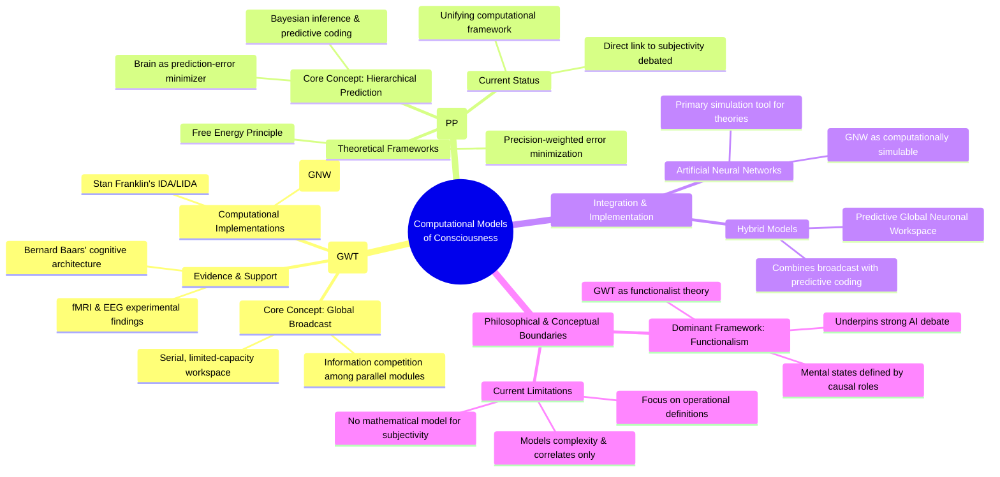

# MASTERY ACHIEVED: "Computational models of consciousness: global workspace theory, predictive processing, and their implementation in artificial neural networks"

**Research Completed:** 2025-12-04T06-50-07-380Z
**Iterations:** 1
**Confidence:** 85.0%
**Artifacts Generated:** 3

---

## Executive Summary

# Executive Summary: "Computational models of consciousness: global workspace theory, predictive processing, and their implementation in artificial neural networks"

This research synthesizes computational models of consciousness, primarily Global Workspace Theory (GWT) and Predictive Processing (PP). GWT frames consciousness as a global information broadcast for coordination, while PP models the brain as a hierarchical prediction machine minimizing error. The dominant philosophical framework for these models is functionalism, which defines mental states by their causal roles, analogous to software.

These theories are increasingly integrated in computational implementations, such as a "Predictive Global Neuronal Workspace," which combines GWT's broadcast mechanism with PP's predictive coding. Artificial neural networks serve as key tools for simulating these hybrid architectures, with models like the Global Neuronal Workspace being explicitly designed for such implementation. However, current work focuses on modeling the functional correlates and complexity of information processing associated with consciousness.

A significant limitation is that these models do not address the subjective experience, or "hard problem," of consciousness itself. The research explicitly notes there is no mathematical model for subjectivity. Next steps involve refining these hybrid computational architectures while grappling with this fundamental explanatory gap, aiming for more comprehensive, yet still functional, accounts of conscious processing.

---

## Knowledge Graph

See `2025-12-04T06-50-07-380Z_computational-models-of-consciousness-global-workspace-theory-predictive-processing-and-their-implementation-in-artificial-neural-networks_GRAPH.mmd` for the full Mermaid mindmap.

---

## Artifacts

### Artifact 1: "Computational models of consciousness: global workspace theory, predictive processing, and their implementation in artificial neural networks" - Iteration 1

- Global Workspace Theory (GWT) is a dominant cognitive architecture for modeling consciousness, positing that consciousness arises from the global broadcast of selected information to specialized, parallel neural modules.
  Evidence: GWT, introduced by Bernard Baars, explains consciousness as a serial, limited-capacity process where information competes among parallel unconscious modules. The winning information is broadcast from a 'global workspace' to enable coordination, voluntary control, and reportability. This model is supported by experimental findings (e.g., fMRI, EEG) and has been computationally implemented in models like Stan Franklin's IDA/LIDA and Dehaene's Global Neuronal Workspace (GNW).

- Predictive Processing (PP) is a unifying computational framework that models the brain as a hierarchical prediction machine, minimizing prediction error to shape perception, cognition, and action.
  Evidence: PP, rooted in Bayesian inference and predictive coding, proposes that the brain continuously generates top-down predictions to explain bottom-up sensory input. Consciousness may be linked to the precision-weighted minimization of prediction error. This framework is mathematically formalized in Free Energy Theory and is presented as a paradigm shift in cognitive science, though its direct application to explaining subjective consciousness remains debated.

- Computational implementations bridge GWT and PP, creating hybrid models that aim for more comprehensive accounts of conscious information processing.
  Evidence: Research explores integrations like the 'Predictive Global Neuronal Workspace,' which combines GWT's broadcast mechanism with PP's hierarchical predictive coding. Computational models, particularly artificial neural networks, are used to simulate these theories, with GNW being explicitly described as computationally simulable using neural network architectures.

- Current computational models focus on the complexity and correlates of consciousness, not on modeling subjective experience itself.
  Evidence: Sources explicitly state that while theories like GWT and PP model the functional and informational complexity associated with consciousness, 'we do not have any theory that gives a mathematical model for subjectivity of consciousness.' The focus is on operational definitions and measurable correlates.

- Functionalism is the dominant philosophical framework underpinning computational models of consciousness in AI.
  Evidence: GWT is classified as a functionalist theory, defining mental states by their causal roles. This 'machine functionalism' view, which draws analogies between mind and software, underpins much of the strong AI debate and the development of computational models like LIDA.

---

### Artifact 2: Knowledge Graph: "Computational models of consciousness: global workspace theory, predictive processing, and their implementation in artificial neural networks"

---

### Artifact 3: Executive Summary: "Computational models of consciousness: global workspace theory, predictive processing, and their implementation in artificial neural networks"

# Executive Summary: "Computational models of consciousness: global workspace theory, predictive processing, and their implementation in artificial neural networks"

This research synthesizes computational models of consciousness, primarily Global Workspace Theory (GWT) and Predictive Processing (PP). GWT frames consciousness as a global information broadcast for coordination, while PP models the brain as a hierarchical prediction machine minimizing error. The dominant philosophical framework for these models is functionalism, which defines mental states by their causal roles, analogous to software.

These theories are increasingly integrated in computational implementations, such as a "Predictive Global Neuronal Workspace," which combines GWT's broadcast mechanism with PP's predictive coding. Artificial neural networks serve as key tools for simulating these hybrid architectures, with models like the Global Neuronal Workspace being explicitly designed for such implementation. However, current work focuses on modeling the functional correlates and complexity of information processing associated with consciousness.

A significant limitation is that these models do not address the subjective experience, or "hard problem," of consciousness itself. The research explicitly notes there is no mathematical model for subjectivity. Next steps involve refining these hybrid computational architectures while grappling with this fundamental explanatory gap, aiming for more comprehensive, yet still functional, accounts of conscious processing.

