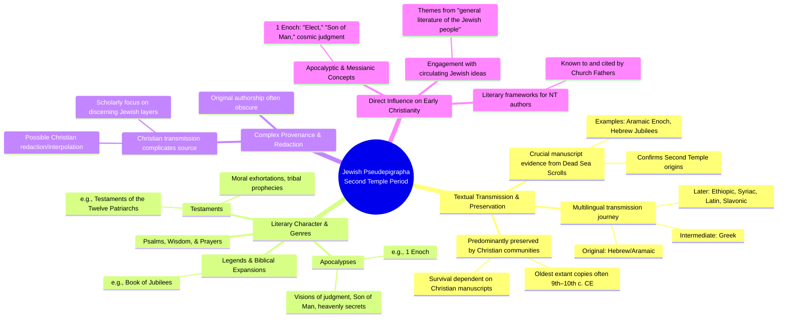

# MASTERY ACHIEVED: Jewish pseudepigrapha of the Second Temple period: textual transmission, apocalyptic themes, and their direct influence on early Christian thought and literature

**Research Completed:** 2025-12-04T06-52-20-740Z
**Iterations:** 1
**Confidence:** 85.0%
**Artifacts Generated:** 3

---

## Executive Summary

# Executive Summary: Jewish pseudepigrapha of the Second Temple period: textual transmission, apocalyptic themes, and their direct influence on early Christian thought and literature

This research synthesizes findings on Jewish pseudepigrapha from the Second Temple period, highlighting their complex transmission and significant influence. A key insight is that these texts, though of Jewish origin, were almost exclusively preserved by Christian communities, with their survival dependent on later Christian manuscripts. The discovery of the Dead Sea Scrolls provided crucial, contemporary manuscript evidence, confirming the antiquity and authenticity of works like 1 Enoch and Jubilees. Furthermore, these pseudepigrapha, encompassing diverse genres such as apocalypses and testaments, directly shaped foundational concepts in early Christian thought.

The textual journey of these works is multilingual, typically originating in Hebrew or Aramaic, translating into Greek, and later into languages like Ethiopic and Slavonic. Their apocalyptic themes—including cosmic judgment, the "Son of Man," and messianic expectations—provided a conceptual framework adopted by early Christian authors. Determining the original Jewish provenance of these texts, however, is complicated by centuries of Christian transmission and potential redaction, requiring scholarly methods to disentangle authentic layers from later adaptations.

Major gaps in understanding stem from the fragmentary nature of the manuscript record and the challenges of textual criticism in distinguishing Jewish origins from Christian interpolations. Next steps for research involve continued comparative analysis of the Qumran evidence with later Christian versions to better trace textual evolution and more precisely map the direct lines of influence from specific pseudepigraphic themes to the composition of the New Testament and other early Christian literature.

---

## Knowledge Graph

See `2025-12-04T06-52-20-740Z_jewish-pseudepigrapha-of-the-second-temple-period-textual-transmission-apocalyptic-themes-and-their-direct-influence-on-early-christian-thought-and-literature_GRAPH.mmd` for the full Mermaid mindmap.

---

## Artifacts

### Artifact 1: Jewish pseudepigrapha of the Second Temple period: textual transmission, apocalyptic themes, and their direct influence on early Christian thought and literature - Iteration 1

- Jewish pseudepigrapha from the Second Temple period (c. 200 BCE–200 CE) were predominantly preserved and transmitted by Christian communities, not Jewish ones.
  Evidence: Multiple sources note that these texts 'were preserved and transmitted by Christians' and that 'most of the Pseudepigrapha have no connection with the authentic literature of the Second Temple' in Jewish tradition. Their survival relies on Christian manuscripts, with the oldest often dating from the 9th–10th centuries CE.

- The Dead Sea Scrolls (Qumran Caves Scrolls) provide crucial manuscript evidence for pseudepigrapha, confirming their Second Temple origins and textual history.
  Evidence: The Scrolls, dating from the 3rd century BCE to the 1st century CE, include manuscripts of works like the Book of Enoch (in original Aramaic), Jubilees (Hebrew fragments), and Testaments of the Patriarchs. This discovery 'vital to answering many questions about its origins' and offers a 'much-needed perspective' on Jewish literature of the era.

- Pseudepigrapha encompass diverse genres, including apocalypses, testaments, legends, wisdom literature, and prayers, often featuring apocalyptic themes.
  Evidence: Sources categorize them into: 'Apocalypses' (e.g., 1 Enoch, with visions of judgment, the Son of Man, and heavenly secrets), 'Testaments and Related Texts' (e.g., Testaments of the Twelve Patriarchs, with moral exhortations and tribal prophecies), 'Legends and Expansions of Biblical Traditions' (e.g., Jubilees), and 'Psalms, Wisdom Literature, and Prayers.'

- Determining the original provenance (Jewish, Christian, or other) of pseudepigraphic texts is complex due to Christian transmission and possible redaction.
  Evidence: Scholarship highlights that 'the provenance of the pseudepigrapha is highly problematic, as these texts were preserved and transmitted by Christians and may therefore have been redacted.' Research focuses on methods to discern original Jewish layers versus Christian interpolations or adaptations.

- Key pseudepigrapha directly influenced early Christian thought and literature, particularly apocalyptic and messianic concepts.
  Evidence: Texts like 1 Enoch (with its 'Elect,' 'Son of Man,' and cosmic judgment themes) and the Testaments of the Twelve Patriarchs (known to church fathers and possibly edited by Christians) provided conceptual frameworks. Their themes and ideas circulated in the 'general literature of the Jewish people' during the Second Temple period, which early Christian authors engaged with.

- Textual transmission of pseudepigrapha involves a multilingual journey, often from Hebrew/Aramaic originals to Greek and later to languages like Ethiopic, Syriac, Latin, and Slavonic.
  Evidence: Examples include: 1 Enoch (Aramaic → Greek → Ethiopic), Book of Jubilees (Hebrew → Greek → Ethiopic and Latin), Apocalypse of Baruch (Syriac), and Secrets of Enoch (Old Church Slavonic). Manuscript evidence from Qumran (e.g., Hebrew Jubilees fragments) confirms original languages, while later Christian copies show the translation paths.

---

### Artifact 2: Knowledge Graph: Jewish pseudepigrapha of the Second Temple period: textual transmission, apocalyptic themes, and their direct influence on early Christian thought and literature

---

### Artifact 3: Executive Summary: Jewish pseudepigrapha of the Second Temple period: textual transmission, apocalyptic themes, and their direct influence on early Christian thought and literature

# Executive Summary: Jewish pseudepigrapha of the Second Temple period: textual transmission, apocalyptic themes, and their direct influence on early Christian thought and literature

This research synthesizes findings on Jewish pseudepigrapha from the Second Temple period, highlighting their complex transmission and significant influence. A key insight is that these texts, though of Jewish origin, were almost exclusively preserved by Christian communities, with their survival dependent on later Christian manuscripts. The discovery of the Dead Sea Scrolls provided crucial, contemporary manuscript evidence, confirming the antiquity and authenticity of works like 1 Enoch and Jubilees. Furthermore, these pseudepigrapha, encompassing diverse genres such as apocalypses and testaments, directly shaped foundational concepts in early Christian thought.

The textual journey of these works is multilingual, typically originating in Hebrew or Aramaic, translating into Greek, and later into languages like Ethiopic and Slavonic. Their apocalyptic themes—including cosmic judgment, the "Son of Man," and messianic expectations—provided a conceptual framework adopted by early Christian authors. Determining the original Jewish provenance of these texts, however, is complicated by centuries of Christian transmission and potential redaction, requiring scholarly methods to disentangle authentic layers from later adaptations.

Major gaps in understanding stem from the fragmentary nature of the manuscript record and the challenges of textual criticism in distinguishing Jewish origins from Christian interpolations. Next steps for research involve continued comparative analysis of the Qumran evidence with later Christian versions to better trace textual evolution and more precisely map the direct lines of influence from specific pseudepigraphic themes to the composition of the New Testament and other early Christian literature.

