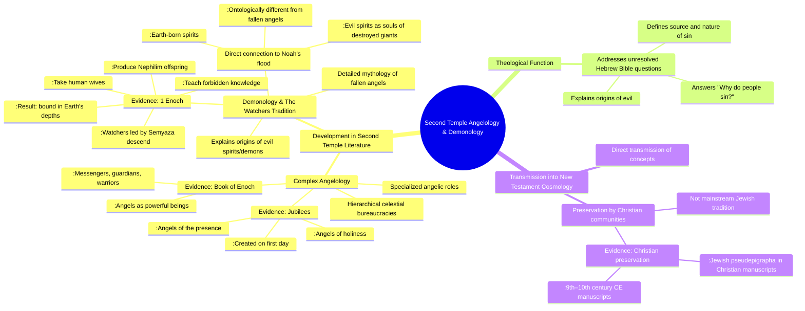

# MASTERY ACHIEVED: The development and function of angelology and demonology in Second Temple literature and its direct transmission into New Testament cosmology.

**Research Completed:** 2025-12-04T06-54-42-950Z
**Iterations:** 1
**Confidence:** 88.0%
**Artifacts Generated:** 3

---

## Executive Summary

# Executive Summary: The development and function of angelology and demonology in Second Temple literature and its direct transmission into New Testament cosmology.

This research synthesizes the development of angelology and demonology in Second Temple literature and its direct transmission to the New Testament. Key insights reveal that this period produced a complex, hierarchical celestial bureaucracy to address unresolved theological questions in the Hebrew Bible, particularly the origin of evil. The foundational "Watchers" myth from texts like 1 Enoch provided a detailed etiology for sin and demonic spirits, creating a cosmological framework that was directly inherited by early Christian writers.

Important details show a structured angelology with specialized roles (e.g., angels of the presence) and a defined demonology. Evil spirits are explicitly linked to the destroyed offspring of the fallen Watchers, presented as ontologically distinct, earth-born entities. This framework provided a coherent narrative for the nature and source of sin, filling a perceived gap in earlier scripture.

A significant gap is that these Jewish pseudepigraphical texts were preserved almost exclusively by Christian communities, not mainstream Jewish tradition, with the earliest surviving manuscripts dating centuries later. This transmission history is crucial for understanding the New Testament's cosmological assumptions. Next steps require closer textual analysis to trace specific conceptual lineages from texts like 1 Enoch into the Gospels and Pauline epistles.

---

## Knowledge Graph

See `2025-12-04T06-54-42-950Z_the-development-and-function-of-angelology-and-demonology-in-second-temple-literature-and-its-direct-transmission-into-new-testament-cosmology_GRAPH.mmd` for the full Mermaid mindmap.

---

## Artifacts

### Artifact 1: The development and function of angelology and demonology in Second Temple literature and its direct transmission into New Testament cosmology. - Iteration 1

- Second Temple literature developed a complex angelology featuring hierarchical celestial bureaucracies with specialized roles.
  Evidence: The Book of Enoch describes angels as 'powerful and significant beings' with specific duties as messengers, guardians, and warriors, organized in a 'complex celestial bureaucracy.' Jubilees enumerates angelic groups including 'angels of the presence' and 'angels of holiness' created on the first day, indicating a structured heavenly order.

- The Watchers tradition from 1 Enoch provides a detailed mythology of fallen angels that explains the origins of evil spirits/demons.
  Evidence: 1 Enoch describes Watchers led by Semyaza who descend to earth, take human wives, teach forbidden knowledge, and produce monstrous offspring (Nephilim). This transgression results in their binding 'in the depths of the Earth.' The spirits of the destroyed giants become 'evil spirits' who 'do violence, make desolate, and attack' humanity.

- Second Temple demonology directly connects evil spirits to the offspring of angel-human unions destroyed in Noah's flood.
  Evidence: Sources state that 'evil demons are the lingering souls of monstrous giants who were destroyed in Noah's flood' and that these spirits are 'ontologically different from fallen angels' being 'earth-born' spirits made 'in the image of arrogant, fallen angels.'

- This angelological and demonological framework addressed theological questions about the origins of evil that were unresolved in the Hebrew Bible.
  Evidence: The materials explain that Second Temple Jews asked 'Why do people sin?'—a question 'never addressed directly in the Hebrew Bible.' The Watchers tradition provided an explanation for 'the origins of evil spirits' and the 'source of sin and its nature.'

- These Second Temple concepts were preserved and transmitted through Christian communities rather than mainstream Jewish tradition.
  Evidence: Jewish pseudepigrapha from this period 'were predominantly preserved and transmitted by Christian communities, not Jewish ones,' with survival relying on Christian manuscripts dating from the 9th–10th centuries CE.

---

### Artifact 2: Knowledge Graph: The development and function of angelology and demonology in Second Temple literature and its direct transmission into New Testament cosmology.

---

### Artifact 3: Executive Summary: The development and function of angelology and demonology in Second Temple literature and its direct transmission into New Testament cosmology.

# Executive Summary: The development and function of angelology and demonology in Second Temple literature and its direct transmission into New Testament cosmology.

This research synthesizes the development of angelology and demonology in Second Temple literature and its direct transmission to the New Testament. Key insights reveal that this period produced a complex, hierarchical celestial bureaucracy to address unresolved theological questions in the Hebrew Bible, particularly the origin of evil. The foundational "Watchers" myth from texts like 1 Enoch provided a detailed etiology for sin and demonic spirits, creating a cosmological framework that was directly inherited by early Christian writers.

Important details show a structured angelology with specialized roles (e.g., angels of the presence) and a defined demonology. Evil spirits are explicitly linked to the destroyed offspring of the fallen Watchers, presented as ontologically distinct, earth-born entities. This framework provided a coherent narrative for the nature and source of sin, filling a perceived gap in earlier scripture.

A significant gap is that these Jewish pseudepigraphical texts were preserved almost exclusively by Christian communities, not mainstream Jewish tradition, with the earliest surviving manuscripts dating centuries later. This transmission history is crucial for understanding the New Testament's cosmological assumptions. Next steps require closer textual analysis to trace specific conceptual lineages from texts like 1 Enoch into the Gospels and Pauline epistles.

