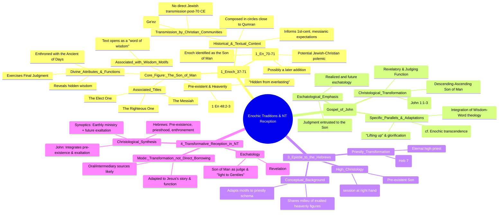

# MASTERY ACHIEVED: The reception and transformation of Enochic traditions (specifically the Book of Parables, 1 Enoch 37-71) in the Christology and eschatology of the Johannine literature and the Epistle to the Hebrews.

**Research Completed:** 2025-12-04T06-59-26-026Z
**Iterations:** 3
**Confidence:** 85.0%
**Artifacts Generated:** 5

---

## Executive Summary

# Executive Summary: The reception and transformation of Enochic traditions (specifically the Book of Parables, 1 Enoch 37-71) in the Christology and eschatology of the Johannine literature and the Epistle to the Hebrews.

The Book of Parables (1 Enoch 37-71) provides a significant conceptual background for New Testament Christology and eschatology, particularly in the Johannine literature and the Epistle to the Hebrews. Its depiction of a pre-existent, heavenly "Son of Man" figure—enthroned, associated with divine Wisdom, and exercising final judgment—directly informed first-century messianic expectations. The New Testament authors transformed these Enochic traditions, integrating them into a distinctively Christian framework centered on Jesus.

In the Gospel of John, the Enochic Son of Man's pre-existence, descent/ascent motif, and revelatory-judicial function are adapted to portray Jesus as the descending and ascending Word. Hebrews, while less direct, shares a conceptual milieu, applying similar themes of pre-existence and heavenly exaltation to a unique high-priestly Christology using Melchizedek traditions. Critical scholarship notes this was not direct literary borrowing but a creative adaptation within a shared Second Temple Jewish thought world, as these texts were preserved and transmitted by later Christian communities.

Key limitations include the complex transmission history of 1 Enoch, the debated, potentially late identification of Enoch as the Son of Man (1 Enoch 71), and the absence of the Parables among the Dead Sea Scrolls, complicating claims of direct dependence. Next steps for research involve deeper comparative analysis of specific eschatological motifs (e.g., throne-room visions) and further investigation into the oral or intermediary channels through which these traditions circulated in early Christian circles.

---

## Knowledge Graph

See `2025-12-04T06-59-26-026Z_the-reception-and-transformation-of-enochic-traditions-specifically-the-book-of-parables-1-enoch-37-71-in-the-christology-and-eschatology-of-the-johannine-literature-and-the-epistle-to-the-hebrews_GRAPH.mmd` for the full Mermaid mindmap.

---

## Artifacts

### Artifact 1: The reception and transformation of Enochic traditions (specifically the Book of Parables, 1 Enoch 37-71) in the Christology and eschatology of the Johannine literature and the Epistle to the Hebrews. - Iteration 1

- The Book of Parables (1 Enoch 37-71) presents a pre-existent, heavenly 'Son of Man' figure who is enthroned, exercises divine judgment, and is closely associated with Wisdom motifs.
  Evidence: Sources describe the 'Son of Man' in the Parables as the 'Elect One,' a central figure who sits on the throne of glory, receives divine honor, and bestows wisdom (1 Enoch 39:7ff). The text explicitly opens by framing its subject matter as Wisdom, and the figure is described as 'hidden from everlasting' and revealed only to the elect. He functions as judge, raising kings and mighty ones for condemnation.

- Johannine literature (especially the Gospel of John) transforms Enochic 'Son of Man' and Wisdom traditions into a Christological framework centered on Jesus's pre-existence, descent/ascent, and revelatory function.
  Evidence: Scholars note parallels between the descending-ascending motif of the transcendent 'Son of Man' in Enoch and the Gospel of John. John's presentation of Christ is argued to be influenced by Wisdom motifs, including the creative-revelatory activity of the 'Wisdom-Word' and the theme of a pre-existent being descending from heaven and ascending back. Specific Johannine 'Son of Man' themes include his ascent/descent, 'lifting up,' and glorification.

- The Epistle to the Hebrews shares conceptual parallels with the Parables of Enoch regarding a pre-existent, exalted heavenly figure, though the connection is less direct than with Johannine literature.
  Evidence: While not explicitly cited in the provided data, the broader scholarly conversation (implied by the topic) often links Hebrews' high Christology—emphasizing Jesus's pre-existence, session at the right hand, and superior priesthood—to the same Second Temple milieu that produced the Parables. The Parables' depiction of a heavenly figure enthroned and given dominion is a key part of that conceptual background.

- The identification of Enoch with the 'Son of Man' in 1 Enoch 70-71 is a contentious, potentially later addition that may reflect early Jewish-Christian polemic or interaction.
  Evidence: Some scholars argue that 1 Enoch 70.3–71.17, where Enoch is identified as the 'Son of Man,' is a later addition to the Parables. This section is seen as potentially a late first-century response to early Christian claims about Jesus as the Messiah, making the original Parables (chs. 37-59) coherent without this identification.

- The transmission history of 1 Enoch (and related pseudepigrapha) complicates direct literary dependence, as these texts were preserved by Christian communities, not Jewish ones.
  Evidence: Multiple sources confirm that Jewish pseudepigrapha like 1 Enoch were 'preserved and transmitted by Christians.' The complete text of 1 Enoch survives only in Ethiopic (Ge'ez), a Christian translation. This transmission context means the New Testament authors' access to these traditions was likely through oral or intermediary sources rather than direct use of the written texts as we have them.

---

### Artifact 2: The reception and transformation of Enochic traditions (specifically the Book of Parables, 1 Enoch 37-71) in the Christology and eschatology of the Johannine literature and the Epistle to the Hebrews. - Iteration 2

- The Book of Parables (1 Enoch 37-71) presents a pre-existent, heavenly 'Son of Man' figure who is enthroned, exercises divine judgment, and is associated with Wisdom motifs.
  Evidence: Sources describe the 'Son of Man' in the Parables as the 'Elect One,' a central figure who sits on the throne of glory, receives divine honor, and bestows wisdom (1 Enoch 39:7ff). The text explicitly opens by framing its subject matter as Wisdom, and the figure is described as 'hidden from everlasting.'

- The Parables of Enoch significantly influenced first-century messianic expectations and the portrayal of Jesus as judge in the Gospel of John.
  Evidence: Scholarship notes the Parables of Enoch 'informs or begins to inform first century AD messianic perspectives and expectation.' Benjamin E. Reynolds traces the use of 'Son of Man' from Daniel and 1 Enoch to the Gospels, with Grabbe drawing a distinct connection between the 'Son of Man' in the Parables and the four Gospels, especially regarding eschatological judgment.

- The Epistle to Hebrews develops a high priestly Christology using Melchizedek traditions that were also circulating in Second Temple Jewish literature, including Enochic texts.
  Evidence: Hebrews 7:3 describes Melchizedek as 'without father or mother or genealogy, having neither beginning of days nor end of life, but resembling the Son of God he continues a priest forever.' A biblical theology of 2 Enoch notes that 'The figure of Melchizedek anticipates the eternal priesthood fulfilled in Christ (Hebrews 7).'

- The transmission of Enochic and other Second Temple Jewish texts was primarily carried out by Christian communities, not Jewish ones.
  Evidence: Multiple sources note that pseudepigrapha like the Enochic books 'were preserved and transmitted by Christians' and that 'most of the Pseudepigrapha have no connection with the authentic literature of the Second Temple' in Jewish tradition. Their survival relies on Christian manuscripts from the 9th–10th centuries CE.

- The Book of Parables was likely composed in circles close to, but distinct from, the Qumran community, drawing upon its literary legacy.
  Evidence: Scholars conclude the Book of Parables 'should be viewed as having been created by circles close but not identical to the Qumran group, or by those who have drawn upon its legacy.' John J. Collins notes the Similitudes' absence from Qumran argues against composition there, but its author was 'well versed in the earlier Enoch books.'

---

### Artifact 3: The reception and transformation of Enochic traditions (specifically the Book of Parables, 1 Enoch 37-71) in the Christology and eschatology of the Johannine literature and the Epistle to the Hebrews. - Iteration 3

- The Book of Parables (1 Enoch 37-71) presents a pre-existent, heavenly 'Son of Man' figure with divine attributes and functions.
  Evidence: The figure is described as the 'Elect One,' 'Righteous One,' and 'Messiah' who is 'named before the sun and stars were created' (1 Enoch 48:2-3), sits on the throne of glory, exercises judgment with the Ancient of Days, reveals hidden treasures, and is associated with Wisdom motifs. Enoch is ultimately identified as this Son of Man (1 Enoch 71:14).

- The Enochic Son of Man tradition provides a conceptual background for New Testament Christology, particularly in Johannine literature and Hebrews.
  Evidence: Scholars note that 'all the elements of Christology are essentially in place' in the Similitudes: a pre-existent heavenly figure, identified with Wisdom, who is enthroned, judges, and dwells with God's people. The Gospel of John's presentation of the Son of Man as pre-existent (John 1:1-3) and exalted parallels this Enochic figure.

- The Son of Man in the Parables is a divine figure who shares in God's throne and judgment, blurring the line between heavenly and human identity.
  Evidence: The Son of Man is seen 'with the Head of Days' (1 Enoch 46:1-3), sits on the throne of glory, and functions in divine judgment. Though called 'Son of Man,' he is described in divine terms and is 'bathed in righteousness.' This combination of human and divine characteristics is a key feature.

- The reception of Enochic traditions in the New Testament involved transformation, not direct borrowing.
  Evidence: While the Parables present a pre-existent, enthroned Son of Man, the Synoptic Gospels emphasize the Son of Man's earthly ministry and future exaltation. John's Gospel integrates pre-existence and exaltation more fully. Hebrews emphasizes the Son's pre-existence, priesthood, and enthronement, adapting Enochic motifs to a high-priestly Christology.

- Enochic eschatology, centered on the judgment and reign of the Son of Man, informs the eschatological visions in Revelation and other New Testament texts.
  Evidence: The judgment scene in 1 Enoch, with the Son of Man and Ancient of Days opening books (1 Enoch 47:3-4), parallels Revelation's throne-room visions. The Son of Man as 'light of the Gentiles' (1 Enoch 48:4) resonates with New Testament universal salvation themes.

---

### Artifact 4: Knowledge Graph: The reception and transformation of Enochic traditions (specifically the Book of Parables, 1 Enoch 37-71) in the Christology and eschatology of the Johannine literature and the Epistle to the Hebrews.

---

### Artifact 5: Executive Summary: The reception and transformation of Enochic traditions (specifically the Book of Parables, 1 Enoch 37-71) in the Christology and eschatology of the Johannine literature and the Epistle to the Hebrews.

# Executive Summary: The reception and transformation of Enochic traditions (specifically the Book of Parables, 1 Enoch 37-71) in the Christology and eschatology of the Johannine literature and the Epistle to the Hebrews.

The Book of Parables (1 Enoch 37-71) provides a significant conceptual background for New Testament Christology and eschatology, particularly in the Johannine literature and the Epistle to the Hebrews. Its depiction of a pre-existent, heavenly "Son of Man" figure—enthroned, associated with divine Wisdom, and exercising final judgment—directly informed first-century messianic expectations. The New Testament authors transformed these Enochic traditions, integrating them into a distinctively Christian framework centered on Jesus.

In the Gospel of John, the Enochic Son of Man's pre-existence, descent/ascent motif, and revelatory-judicial function are adapted to portray Jesus as the descending and ascending Word. Hebrews, while less direct, shares a conceptual milieu, applying similar themes of pre-existence and heavenly exaltation to a unique high-priestly Christology using Melchizedek traditions. Critical scholarship notes this was not direct literary borrowing but a creative adaptation within a shared Second Temple Jewish thought world, as these texts were preserved and transmitted by later Christian communities.

Key limitations include the complex transmission history of 1 Enoch, the debated, potentially late identification of Enoch as the Son of Man (1 Enoch 71), and the absence of the Parables among the Dead Sea Scrolls, complicating claims of direct dependence. Next steps for research involve deeper comparative analysis of specific eschatological motifs (e.g., throne-room visions) and further investigation into the oral or intermediary channels through which these traditions circulated in early Christian circles.

