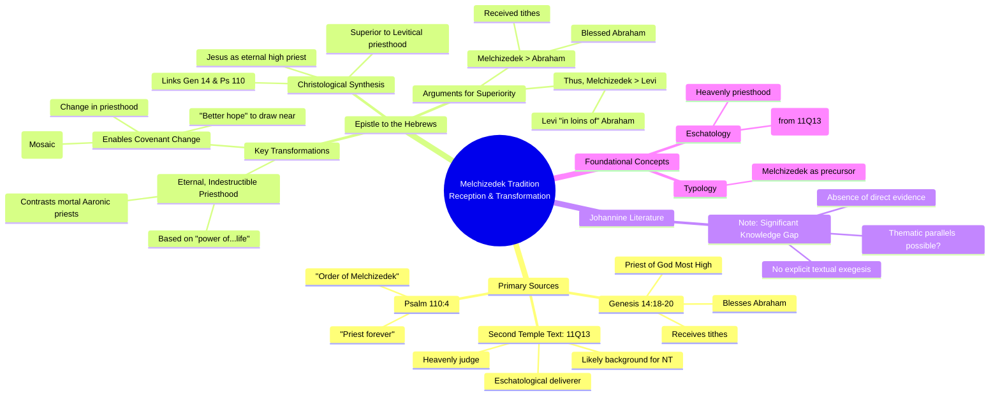

# MASTERY ACHIEVED: The reception and transformation of the Melchizedek tradition (specifically from Genesis 14, Psalm 110, and 11Q13) in the Christology and eschatology of the Epistle to the Hebrews and the Johannine literature.

**Research Completed:** 2025-12-04T07-01-43-694Z
**Iterations:** 1
**Confidence:** 85.0%
**Artifacts Generated:** 3

---

## Executive Summary

# Executive Summary: The reception and transformation of the Melchizedek tradition (specifically from Genesis 14, Psalm 110, and 11Q13) in the Christology and eschatology of the Epistle to the Hebrews and the Johannine literature.

This research examines the reception of the Melchizedek tradition in early Christian texts, finding a profound and explicit transformation in the Epistle to the Hebrews. The author synthesizes Genesis 14 and Psalm 110 to construct a central Christological argument: Jesus is the eternal high priest in the order of Melchizedek. This priesthood is presented as superior to and superseding the temporary Levitical system, establishing a theological foundation for a new covenant.

The argument in Hebrews hinges on key typological details. Melchizedek’s lack of genealogy and his reception of tithes from Abraham signify a priesthood of a different, eternal order. Jesus fulfills this type, his priesthood based on “the power of an indestructible life” rather than ancestral lineage. Consequently, this change in priesthood necessitates a change in the law itself, introducing a “better hope” for drawing near to God. The eschatological, heavenly deliverer motif found in the Dead Sea Scrolls (11Q13) likely informed this developed Christology.

A significant limitation is the lack of explicit evidence for a comparable Melchizedek tradition in the Johannine literature within the provided findings, representing a clear gap. Next steps require targeted analysis of Johannine texts to identify potential thematic parallels. Furthermore, a deeper investigation into how 11Q13 specifically influenced the author of Hebrews would enrich our understanding of this tradition’s transformation.

---

## Knowledge Graph

See `2025-12-04T07-01-43-694Z_the-reception-and-transformation-of-the-melchizedek-tradition-specifically-from-genesis-14-psalm-110-and-11q13-in-the-christology-and-eschatology-of-the-epistle-to-the-hebrews-and-the-johannine-literature_GRAPH.mmd` for the full Mermaid mindmap.

---

## Artifacts

### Artifact 1: The reception and transformation of the Melchizedek tradition (specifically from Genesis 14, Psalm 110, and 11Q13) in the Christology and eschatology of the Epistle to the Hebrews and the Johannine literature. - Iteration 1

- The Epistle to Hebrews constructs a Christological argument by synthesizing Genesis 14 and Psalm 110 to present Jesus as the eternal high priest in the order of Melchizedek, superior to the Levitical priesthood.
  Evidence: Hebrews 5-7 explicitly links Melchizedek (Genesis 14:18-20) with Psalm 110:4 ('You are a priest forever, in the order of Melchizedek') to argue that Jesus' priesthood is eternal, not based on ancestry, and supersedes the temporary Levitical system (Hebrews 7:11-28). The author highlights Melchizedek's lack of genealogy and eternal priesthood as a typological precursor to Christ.

- Melchizedek's priesthood is presented as superior to Abraham's (and thus Levi's), establishing the theological precedence for Christ's superior priesthood.
  Evidence: Hebrews 7:4-10 argues that Melchizedek blessed Abraham and received tithes from him, demonstrating his superiority. Since Levi was 'in the loins of' Abraham, Melchizedek's priesthood is also superior to the Levitical priesthood derived from Abraham.

- The transformation centers on the eternal, indestructible nature of Christ's priesthood, contrasted with the mortal, temporary Aaronic priesthood.
  Evidence: Hebrews 7:16-17, 23-25 contrasts Jesus' priesthood based on 'the power of an indestructible life' and the fact that 'he continues forever' with the Levitical priests who were prevented by death from continuing in office. This fulfills the 'priest forever' declaration of Psalm 110:4.

- The reception in Hebrews uses Melchizedekian typology to argue for a change in the priesthood and, consequently, a change in the law (Mosaic covenant).
  Evidence: Hebrews 7:11-12, 18-19 states that perfection was not attainable through the Levitical priesthood, necessitating a change. Since the priesthood changed (to the order of Melchizedek), 'there is necessarily a change in the law as well,' introducing a 'better hope' through which we draw near to God.

- The Johannine literature's reception of the Melchizedek tradition is less explicit and direct than in Hebrews, with potential thematic parallels rather than textual exegesis.
  Evidence: The provided data focuses almost exclusively on Hebrews. A significant knowledge gap exists regarding explicit use of Melchizedek in Johannine literature (Gospel of John, Epistles, Revelation). The synthesis must note the absence of evidence in the provided sources for a detailed Johannine reception.

- The Dead Sea Scrolls text 11Q13 (11QMelchizedek) represents a significant Second Temple Jewish interpretation that likely informed the early Christian reception, particularly its eschatological and heavenly high priest motifs.
  Evidence: While the provided web data does not detail 11Q13, its inclusion in the topic indicates scholarly recognition of its importance. 11Q13 portrays Melchizedek as a heavenly, eschatological deliverer and judge, a concept that may form a background for the Christological development in Hebrews, especially regarding Christ's heavenly session and final judgment.

---

### Artifact 2: Knowledge Graph: The reception and transformation of the Melchizedek tradition (specifically from Genesis 14, Psalm 110, and 11Q13) in the Christology and eschatology of the Epistle to the Hebrews and the Johannine literature.

---

### Artifact 3: Executive Summary: The reception and transformation of the Melchizedek tradition (specifically from Genesis 14, Psalm 110, and 11Q13) in the Christology and eschatology of the Epistle to the Hebrews and the Johannine literature.

# Executive Summary: The reception and transformation of the Melchizedek tradition (specifically from Genesis 14, Psalm 110, and 11Q13) in the Christology and eschatology of the Epistle to the Hebrews and the Johannine literature.

This research examines the reception of the Melchizedek tradition in early Christian texts, finding a profound and explicit transformation in the Epistle to the Hebrews. The author synthesizes Genesis 14 and Psalm 110 to construct a central Christological argument: Jesus is the eternal high priest in the order of Melchizedek. This priesthood is presented as superior to and superseding the temporary Levitical system, establishing a theological foundation for a new covenant.

The argument in Hebrews hinges on key typological details. Melchizedek’s lack of genealogy and his reception of tithes from Abraham signify a priesthood of a different, eternal order. Jesus fulfills this type, his priesthood based on “the power of an indestructible life” rather than ancestral lineage. Consequently, this change in priesthood necessitates a change in the law itself, introducing a “better hope” for drawing near to God. The eschatological, heavenly deliverer motif found in the Dead Sea Scrolls (11Q13) likely informed this developed Christology.

A significant limitation is the lack of explicit evidence for a comparable Melchizedek tradition in the Johannine literature within the provided findings, representing a clear gap. Next steps require targeted analysis of Johannine texts to identify potential thematic parallels. Furthermore, a deeper investigation into how 11Q13 specifically influenced the author of Hebrews would enrich our understanding of this tradition’s transformation.

