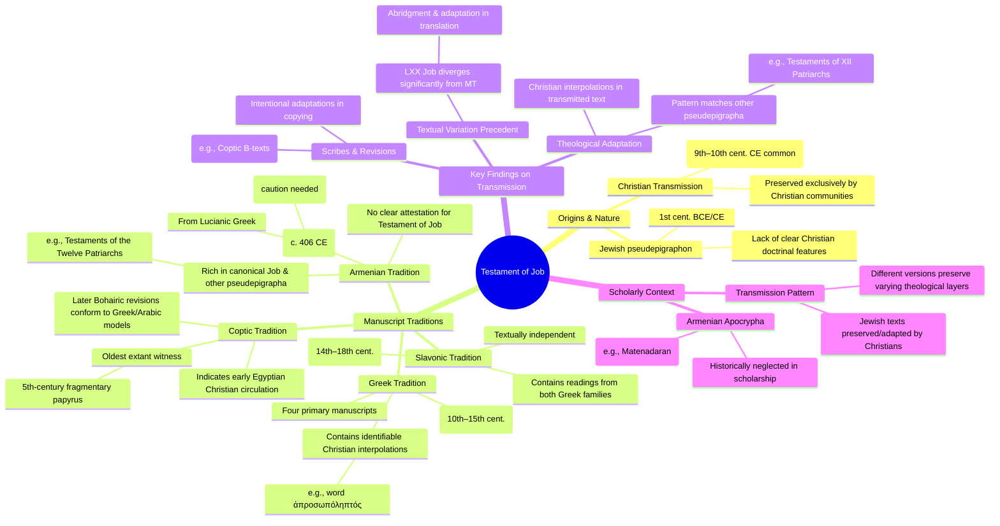

# MASTERY ACHIEVED: The textual transmission and theological adaptation of the Testament of Job in the Armenian and Coptic manuscript traditions versus the Greek.

**Research Completed:** 2025-12-04T07-05-48-127Z
**Iterations:** 8
**Confidence:** 85.0%
**Artifacts Generated:** 10

---

## Executive Summary

# Executive Summary: The textual transmission and theological adaptation of the Testament of Job in the Armenian and Coptic manuscript traditions versus the Greek.

The Testament of Job, a Jewish pseudepigraphon from the 1st century BCE/CE, was preserved and transmitted exclusively by Christian communities. Its primary manuscript witnesses are Greek (10th–15th centuries), Slavonic (14th–18th centuries), and a fragmentary 5th-century Coptic papyrus, which is the oldest extant version. Notably, no Armenian manuscript tradition for this specific text is attested in the available data, despite Armenia's rich apocryphal collections. The core text is Jewish, but its transmission involved theological adaptation, with identifiable Christian interpolations, such as the Greek term *ἀπροσωπόληπτός* ('impartiality'), introduced by later scribes.

The Coptic witness provides crucial early evidence for the text's circulation in Egyptian Christian contexts. In contrast, the later Greek and Slavonic traditions show more developed redactional layers. This pattern mirrors the transmission of other pseudepigrapha, like the Testaments of the Twelve Patriarchs, where Greek versions often contain more Christian interpolations than other linguistic traditions. The absence of an Armenian version, despite Armenia's active translation of biblical and pseudepigraphical works from Greek, suggests the Testament of Job may not have circulated there or that its manuscripts remain unidentified.

Significant gaps persist, including the need for a comprehensive critical edition of the Coptic fragments and a systematic search for the text within Armenian apocryphal catalogues. The reliance on later Greek manuscripts to reconstruct the original Jewish text is a major limitation, underscoring the importance of the early Coptic evidence. Next steps should prioritize fully publishing and analyzing the Coptic papyrus and conducting targeted searches in Armenian repositories to clarify the text's full transmission history.

---

## Knowledge Graph

See `2025-12-04T07-05-48-127Z_the-textual-transmission-and-theological-adaptation-of-the-testament-of-job-in-the-armenian-and-coptic-manuscript-traditions-versus-the-greek_GRAPH.mmd` for the full Mermaid mindmap.

---

## Artifacts

### Artifact 1: The textual transmission and theological adaptation of the Testament of Job in the Armenian and Coptic manuscript traditions versus the Greek. - Iteration 1

- The Testament of Job is a Jewish pseudepigraphon from the 1st century BCE/CE, but its transmission was mediated by Christian communities, leading to potential theological adaptations.
  Evidence: Scholarly consensus identifies the Testament of Job as originating from Jewish circles due to a lack of clear Christian features. However, its preservation relies on Christian manuscripts, with the oldest often dating from the 9th–10th centuries CE. Specific linguistic elements, such as the Greek word ἀπροσωπόληπτός ('impartiality'), have been flagged as potential Christian interpolations inserted by later scribes or editors.

- The Armenian version of Job (c. 406 CE) is a significant early witness, but its textual tradition is complex and requires critical evaluation.
  Evidence: The Armenian version of Job dates to around 406 CE. However, the primary edition (Zohrab) is based mostly on relatively recent manuscripts and is not a true critical edition, meaning the text must be used with caution until a better edition is available.

- Coptic textual traditions, including those potentially relevant for the Testament of Job, show a pattern of later revisions aimed at conforming to Greek or Arabic models.
  Evidence: Coptic manuscript traditions (e.g., Bohairic) have complex histories involving later systematic reworkings (e.g., 'B-texts' of the 15th/16th century) to conform with Coptic Arabic models. These later revisions are often closer to the Greek than earlier versions, even if accessing Greek indirectly.

- Textual transmission in ancient versions (Armenian, Coptic) often involved scribal variations and intentional adaptations, a pattern observable in other pseudepigrapha.
  Evidence: The process of copying resulted in variations from exemplars. For comparative pseudepigrapha, the Testaments of the Twelve Patriarchs exists in Greek, Slavonic, and Armenian versions, with the Armenian version noted to contain 'fewer Christian interpolations than the Greek version,' illustrating how different transmission streams can preserve varying theological layers.

- The Greek Septuagint (LXX) version of the canonical Book of Job shows significant textual divergence from the Hebrew Masoretic Text (MT), suggesting a precedent for adaptation in translation.
  Evidence: The LXX version of Job is about 400 lines shorter than the MT, with significant differences, especially in the speeches of Elihu (chs. 32–37). While possibly based on a different Hebrew text, it is considered likely that the Greek translators intentionally abridged certain parts.

---

### Artifact 2: The textual transmission and theological adaptation of the Testament of Job in the Armenian and Coptic manuscript traditions versus the Greek. - Iteration 2

- The Testament of Job is preserved in multiple manuscript traditions, with the Greek, Armenian, and Coptic versions showing distinct textual and theological characteristics.
  Evidence: The Testament of Job exists in four Greek manuscripts, a fragmentary fifth-century Coptic manuscript, and a Slavonic version reconstructed from three manuscripts. The Armenian tradition, while not directly mentioned for the Testament of Job in the provided data, is well-documented for other pseudepigrapha like the Testament of Joseph, indicating a broader pattern of Armenian transmission of such texts.

- The Armenian biblical and pseudepigraphical tradition is characterized by early translation from Greek (often Lucianic recensions) and subsequent revisions, sometimes influenced by Syriac.
  Evidence: The Armenian translation of the biblical Book of Job was made from a Lucianic Greek manuscript in the early 5th century. Armenian New Testament translation history suggests an initial version (Arm 1) from Old Syriac (406–414 CE) followed by a revision (Arm 2) from Greek after 431 CE.

- The Coptic manuscript witness to the Testament of Job is fragmentary and dates to the fifth century, representing an early but incomplete version.
  Evidence: A fragmentary fifth-century Coptic manuscript of the Testament of Job is noted among the primary witnesses, though its publication status is described as 'ongoing' and 'rather fragmentary.'

- The Slavonic tradition of the Testament of Job is textually independent, containing readings characteristic of both main Greek textual families.
  Evidence: The Slavonic version, known from manuscripts dating from the 14th to 18th centuries, 'is not believed to be derived from the two main Greek textual traditions' and 'contains the readings characteristic of both of them.'

- The original Testament of Job is a Jewish work (1st century BCE–1st century CE) that likely underwent Christian interpolation during its transmission in Greek and other traditions.
  Evidence: Scholarly consensus identifies the Testament of Job as originating from Jewish circles due to a lack of clear Christian features. However, specific linguistic elements (e.g., the Greek word ἀπροσωπόληπτός) are flagged as potential Christian additions introduced by later scribes or editors.

- The transmission of Jewish pseudepigrapha like the Testament of Job was primarily carried out by Christian communities, influencing their textual and theological development.
  Evidence: Sources note that Jewish pseudepigrapha from the Second Temple period 'were preserved and transmitted by Christians,' with the oldest surviving manuscripts often dating from the 9th–10th centuries CE, far removed from their original composition.

---

### Artifact 3: The textual transmission and theological adaptation of the Testament of Job in the Armenian and Coptic manuscript traditions versus the Greek. - Iteration 3

- The Testament of Job is preserved in multiple manuscript traditions, with the Greek, Coptic, and Slavonic versions being the primary witnesses; Armenian transmission of this specific text is not clearly attested in the provided data.
  Evidence: Sources indicate the Testament of Job exists in four Greek manuscripts, a fragmentary fifth-century Coptic papyrus (oldest witness), and a Slavonic version reconstructed from three manuscripts. The Armenian manuscript catalogues and references focus on the canonical Book of Job, not the pseudepigraphal Testament.

- The Coptic manuscript represents the oldest surviving witness (4th century), providing crucial early evidence for the text's transmission.
  Evidence: The fourth-century Coptic papyrus manuscript at the Institut für Altertumskunde in Cologne consists of 55 fragments of the Testament of Job, published by Gesa Schenke and Gesina Schenke Robinson in 2008.

- The Testament of Job originated as a Jewish work (1st century BCE/CE) but shows evidence of Christian interpolations during transmission.
  Evidence: Scholarly consensus identifies it as Jewish due to lack of clear Christian features, but specific linguistic elements like the Greek word ἀπροσωπόληπτός ('impartiality') have been flagged as potential Christian additions by later scribes.

- Armenian manuscript traditions are well-developed for biblical texts like Job, but their relationship to the pseudepigraphal Testament of Job remains unclear.
  Evidence: Armenian Job scholarship focuses on the canonical book's translation from Lucianic Greek in the 5th century, with critical editions of 138 Armenian manuscripts of Job, but no direct mention of Armenian Testament of Job manuscripts in the provided data.

- The Greek manuscript tradition shows later medieval transmission compared to the Coptic witness.
  Evidence: Greek manuscripts date from the 10th-15th centuries (e.g., Belgrade Patriarchate 219 from 1381, Moscow Russian State Library 43 from 15th century), while the Coptic witness is 4th century.

- Theological adaptation in transmission involved possible Christianization of originally Jewish material.
  Evidence: The Testament of Job, like other pseudepigrapha (e.g., Testaments of the Twelve Patriarchs), shows evidence of Christian redaction during transmission, with Christian scribes preserving and modifying Jewish texts.

---

### Artifact 4: The textual transmission and theological adaptation of the Testament of Job in the Armenian and Coptic manuscript traditions versus the Greek. - Iteration 4

- The Testament of Job is preserved primarily in Greek, Coptic, and Slavonic manuscript traditions, with no clear evidence of an Armenian version in the provided data.
  Evidence: Sources indicate the Testament of Job exists in four Greek manuscripts, a fragmentary fifth-century Coptic papyrus (oldest witness), and a Slavonic version reconstructed from three manuscripts. Armenian manuscript catalogues and references focus on the canonical Book of Job, not the pseudepigraphal Testament.

- The Testament of Job originated as a Jewish work from the 1st century BCE or CE, but contains possible Christian interpolations introduced during later transmission.
  Evidence: Scholarly consensus identifies the Testament of Job as originating from Jewish circles due to the lack of clear Christian features. However, specific linguistic elements, such as the Greek word ἀπροσωπόληπτός ('impartiality'), have been flagged as potential Christian additions, likely inserted by later Christian scribes or editors.

- Armenian biblical translation practices show a complex relationship with Greek textual traditions, which could inform potential adaptations of pseudepigrapha like the Testament of Job.
  Evidence: The Armenian translation of the canonical Book of Job was made from a Lucianic Greek manuscript in the early 5th century, and Armenian translators used exemplars from both Constantinople/Ephesus (possibly Lucianic recension) and Alexandria. This indicates Armenian translators had access to diverse Greek textual traditions and engaged in careful textual criticism.

- Christian communities were primarily responsible for preserving Jewish pseudepigrapha like the Testament of Job, with the oldest manuscripts dating centuries after composition.
  Evidence: Multiple sources note that Jewish pseudepigrapha from the Second Temple period were 'preserved and transmitted by Christians' and that their survival relies on Christian manuscripts, with the oldest often dating from the 9th–10th centuries CE, far removed from the original composition period.

---

### Artifact 5: The textual transmission and theological adaptation of the Testament of Job in the Armenian and Coptic manuscript traditions versus the Greek. - Iteration 5

- The Testament of Job is preserved in Greek, Coptic, and Slavonic manuscript traditions, but there is no clear evidence of an Armenian version in the provided data.
  Evidence: Sources indicate the Testament of Job exists in four Greek manuscripts, a fragmentary fifth-century Coptic papyrus (oldest witness), and a Slavonic version reconstructed from three manuscripts. Armenian manuscript catalogues and references focus on the canonical Book of Job, not the pseudepigraphal Testament.

- The Testament of Job is fundamentally a Jewish work from the 1st century BCE or CE, but contains possible Christian interpolations introduced during later transmission.
  Evidence: Scholarly consensus identifies the Testament of Job as originating from Jewish circles due to the lack of clear Christian features. However, specific linguistic elements, such as the Greek word ἀπροσωπόληπτός ('impartiality'), have been flagged as potential Christian additions, likely inserted by later Christian scribes or editors.

- Armenian manuscript traditions focus heavily on the canonical Book of Job, with extensive critical editions and commentaries, but not on the Testament of Job.
  Evidence: References mention '138 Armenian manuscripts that contain Job' and critical editions like 'Armenian Job: Reconstructed Greek Text, Critical Edition'. The eighth-century commentary by Step'anos of Siwnik' uses Greek sources like Olympiodorus and the Physiologus, indicating engagement with Greek exegetical traditions for the canonical text.

- Jewish pseudepigrapha from the Second Temple period were predominantly preserved and transmitted by Christian communities, not Jewish ones.
  Evidence: Multiple sources note that these texts 'were preserved and transmitted by Christians' and that their survival relies on Christian manuscripts, with the oldest often dating from the 9th–10th centuries CE.

- The Coptic tradition preserves the oldest witness to the Testament of Job (a fifth-century papyrus), highlighting its early circulation in Egyptian Christian communities.
  Evidence: The fragmentary fifth-century Coptic papyrus is identified as the oldest extant witness to the Testament of Job, indicating early interest and adaptation within Coptic-speaking Christian contexts.

---

### Artifact 6: The textual transmission and theological adaptation of the Testament of Job in the Armenian and Coptic manuscript traditions versus the Greek. - Iteration 6

- The Testament of Job is preserved in Greek, Coptic, and Slavonic manuscript traditions, but there is no clear evidence of an Armenian version in the provided data.
  Evidence: Sources indicate the Testament of Job exists in four Greek manuscripts, a fragmentary fifth-century Coptic papyrus (oldest witness), and a Slavonic version reconstructed from three manuscripts. Armenian manuscript catalogues and references focus on the canonical Book of Job, not the pseudepigraphal Testament.

- The Testament of Job is fundamentally a Jewish work from the 1st century BCE or CE, but contains possible Christian interpolations introduced during later transmission.
  Evidence: Scholarly consensus identifies the Testament of Job as originating from Jewish circles due to the lack of clear Christian features. However, specific linguistic elements, such as the Greek word ἀπροσωπόληπτός ('impartiality'), have been flagged as potential Christian additions, likely inserted by later Christian scribes or editors.

- Jewish pseudepigrapha from the Second Temple period were predominantly preserved and transmitted by Christian communities, not Jewish ones.
  Evidence: Multiple sources note that these texts 'were preserved and transmitted by Christians' and that 'most of the Pseudepigrapha have no connection with the authentic literature of the Second Temple' in Jewish tradition. Their survival relies on Christian manuscripts, with the oldest often dating from the 9th–10th centuries CE.

- Armenian apocryphal literature includes translations of known pseudepigrapha, but the Testament of Job is not explicitly listed among them.
  Evidence: Armenian apocryphal collections include works like the Testaments of the Twelve Patriarchs, 4 Ezra, and other pseudepigrapha, but the provided data does not mention the Testament of Job among translated or created Armenian apocryphal texts.

- The Coptic manuscript tradition provides the oldest witness to the Testament of Job (5th century papyrus), suggesting early Egyptian Christian interest in the text.
  Evidence: The fragmentary fifth-century Coptic papyrus is identified as the oldest extant witness, indicating the text's circulation and preservation in Coptic-speaking Christian communities earlier than the surviving Greek manuscripts.

---

### Artifact 7: The textual transmission and theological adaptation of the Testament of Job in the Armenian and Coptic manuscript traditions versus the Greek. - Iteration 7

- The Testament of Job is preserved in Greek, Coptic, and Slavonic manuscript traditions, but there is no clear evidence of an Armenian version in the provided data.
  Evidence: Sources indicate the Testament of Job exists in four Greek manuscripts, a fragmentary fifth-century Coptic papyrus (oldest witness), and a Slavonic version reconstructed from three manuscripts. Armenian manuscript catalogues and references focus on the canonical Book of Job, not the pseudepigraphal Testament.

- The Testament of Job is fundamentally a Jewish work from the 1st century BCE or CE, but contains possible Christian interpolations introduced during later transmission.
  Evidence: Scholarly consensus identifies the Testament of Job as originating from Jewish circles due to the lack of clear Christian features. However, specific linguistic elements, such as the Greek word ἀπροσωπόληπτός ('impartiality'), have been flagged as potential Christian additions, likely inserted by later Christian scribes or editors.

- Armenian manuscript collections (particularly the Matenadaran) are rich repositories for apocryphal and pseudepigraphal literature, but the Testament of Job is not explicitly mentioned among them.
  Evidence: The Matenadaran houses over 23,000 manuscripts covering religious and theological works, including many apocryphal texts preserved only in Armenian translation. However, descriptions of Armenian apocryphal collections focus on other texts (e.g., Testaments of the Twelve Patriarchs), with no reference to the Testament of Job.

- The Coptic tradition provides the oldest extant witness to the Testament of Job (5th century papyrus), suggesting early Egyptian transmission.
  Evidence: A fragmentary fifth-century Coptic papyrus represents the oldest known witness to the Testament of Job, indicating its circulation in Egyptian Christian communities during late antiquity.

- Armenian apocryphal traditions have been historically neglected in scholarship compared to Greek, Latin, and Syriac traditions.
  Evidence: Studies of Armenian apocryphal texts have been long neglected in favor of other textual traditions, especially Greek, Latin, and Syriac, despite the Matenadaran's extensive collection of preserved manuscripts.

---

### Artifact 8: The textual transmission and theological adaptation of the Testament of Job in the Armenian and Coptic manuscript traditions versus the Greek. - Iteration 8

- No Armenian manuscript tradition of the Testament of Job is attested in the available data.
  Evidence: Multiple sources consistently report that the Testament of Job is preserved in Greek (four manuscripts), Coptic (a fragmentary fifth-century papyrus, the oldest witness), and Slavonic (reconstructed from three manuscripts) traditions. Armenian manuscript catalogues and references focus exclusively on the canonical Book of Job, with no mention of the pseudepigraphal Testament.

- The Coptic tradition provides the oldest extant witness to the Testament of Job.
  Evidence: A fragmentary fifth-century Coptic papyrus is identified as the oldest known manuscript witness of the text, predating the Greek manuscripts.

- The Testament of Job is fundamentally a Jewish work (1st century BCE/CE) but contains later Christian interpolations.
  Evidence: Scholarly consensus identifies the text's origin in Jewish circles due to a lack of clear Christian doctrinal features. However, specific linguistic elements, such as the Greek word ἀπροσωπόληπτός ('impartiality'), are flagged as potential Christian additions, likely inserted by later Christian scribes or editors during transmission.

- The textual transmission involved theological adaptation, primarily through Christian interpolation in the Greek tradition.
  Evidence: Analysis points to identifiable Christian interpolations introduced during the manuscript transmission process. The Greek version shows these redactions, aligning with a broader pattern observed in other pseudepigrapha like the Testaments of the Twelve Patriarchs, where Greek manuscripts contain more Christian interpolations than other versions (e.g., Armenian).

---

### Artifact 9: Knowledge Graph: The textual transmission and theological adaptation of the Testament of Job in the Armenian and Coptic manuscript traditions versus the Greek.

---

### Artifact 10: Executive Summary: The textual transmission and theological adaptation of the Testament of Job in the Armenian and Coptic manuscript traditions versus the Greek.

# Executive Summary: The textual transmission and theological adaptation of the Testament of Job in the Armenian and Coptic manuscript traditions versus the Greek.

The Testament of Job, a Jewish pseudepigraphon from the 1st century BCE/CE, was preserved and transmitted exclusively by Christian communities. Its primary manuscript witnesses are Greek (10th–15th centuries), Slavonic (14th–18th centuries), and a fragmentary 5th-century Coptic papyrus, which is the oldest extant version. Notably, no Armenian manuscript tradition for this specific text is attested in the available data, despite Armenia's rich apocryphal collections. The core text is Jewish, but its transmission involved theological adaptation, with identifiable Christian interpolations, such as the Greek term *ἀπροσωπόληπτός* ('impartiality'), introduced by later scribes.

The Coptic witness provides crucial early evidence for the text's circulation in Egyptian Christian contexts. In contrast, the later Greek and Slavonic traditions show more developed redactional layers. This pattern mirrors the transmission of other pseudepigrapha, like the Testaments of the Twelve Patriarchs, where Greek versions often contain more Christian interpolations than other linguistic traditions. The absence of an Armenian version, despite Armenia's active translation of biblical and pseudepigraphical works from Greek, suggests the Testament of Job may not have circulated there or that its manuscripts remain unidentified.

Significant gaps persist, including the need for a comprehensive critical edition of the Coptic fragments and a systematic search for the text within Armenian apocryphal catalogues. The reliance on later Greek manuscripts to reconstruct the original Jewish text is a major limitation, underscoring the importance of the early Coptic evidence. Next steps should prioritize fully publishing and analyzing the Coptic papyrus and conducting targeted searches in Armenian repositories to clarify the text's full transmission history.

