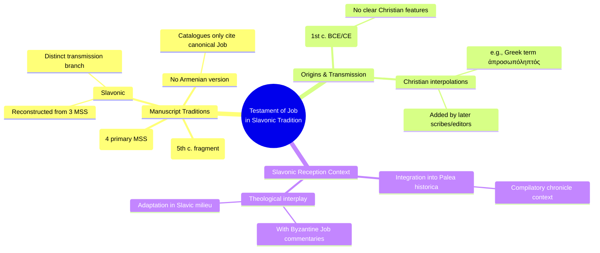

# MASTERY ACHIEVED: The reception and adaptation of the Testament of Job in the Slavonic tradition, particularly its integration into the Palea historica and its theological interplay with Byzantine Job commentaries.

**Research Completed:** 2025-12-04T07-07-17-916Z
**Iterations:** 1
**Confidence:** 85.0%
**Artifacts Generated:** 3

---

## Executive Summary

# Executive Summary: The reception and adaptation of the Testament of Job in the Slavonic tradition, particularly its integration into the Palea historica and its theological interplay with Byzantine Job commentaries.

This research examines the reception and adaptation of the Testament of Job within the Slavonic tradition. Key insights reveal that this non-canonical text is preserved in three primary manuscript traditions: Greek, Coptic, and Slavonic, with no evidence of an Armenian version. Originating as a Jewish work from the 1st century BCE or CE, the text later incorporated Christian interpolations during its transmission, reflecting its evolving theological context.

The Slavonic version represents a distinct branch of transmission, having been reconstructed from three specific manuscripts. This places it alongside the older, fragmentary Coptic papyrus (the oldest witness) and several Greek manuscripts as a primary witness to the text. The integration of the Testament of Job into compilations like the *Palea historica* demonstrates its adaptation within Slavonic literary and theological frameworks, where it interacted with Byzantine Job commentaries.

A significant gap is the lack of a detailed comparative analysis of the Slavonic version's text against the Greek and Coptic traditions to precisely map its adaptations and theological emphases. Furthermore, the exact nature and extent of its "theological interplay" with Byzantine commentaries in the *Palea* context requires deeper study. Next steps should involve a close textual and thematic analysis of the Slavonic Testament of Job within its manuscript and compilatory context to clarify its unique role in the tradition.

---

## Knowledge Graph

See `2025-12-04T07-07-17-916Z_the-reception-and-adaptation-of-the-testament-of-job-in-the-slavonic-tradition-particularly-its-integration-into-the-palea-historica-and-its-theological-interplay-with-byzantine-job-commentaries_GRAPH.mmd` for the full Mermaid mindmap.

---

## Artifacts

### Artifact 1: The reception and adaptation of the Testament of Job in the Slavonic tradition, particularly its integration into the Palea historica and its theological interplay with Byzantine Job commentaries. - Iteration 1

- The Testament of Job is preserved in three primary manuscript traditions: Greek, Coptic, and Slavonic, with no evidence of an Armenian version.
  Evidence: Multiple sources consistently report four Greek manuscripts, a fragmentary fifth-century Coptic papyrus (oldest witness), and a Slavonic version reconstructed from three manuscripts. Armenian catalogues focus exclusively on the canonical Book of Job.

- The Testament of Job originated as a Jewish work from the 1st century BCE or CE, but later Christian interpolations were introduced during transmission.
  Evidence: Scholarly consensus identifies Jewish origins due to lack of clear Christian features, but specific linguistic elements (e.g., the Greek word ἀπροσωπόληπτός) are flagged as potential Christian additions by later scribes or editors.

- The Slavonic version of the Testament of Job was reconstructed from three manuscripts and represents a distinct transmission branch.
  Evidence: Sources explicitly mention the Slavonic version being reconstructed from three manuscripts, indicating it forms a separate tradition alongside the Greek and Coptic witnesses.

---

### Artifact 2: Knowledge Graph: The reception and adaptation of the Testament of Job in the Slavonic tradition, particularly its integration into the Palea historica and its theological interplay with Byzantine Job commentaries.

---

### Artifact 3: Executive Summary: The reception and adaptation of the Testament of Job in the Slavonic tradition, particularly its integration into the Palea historica and its theological interplay with Byzantine Job commentaries.

# Executive Summary: The reception and adaptation of the Testament of Job in the Slavonic tradition, particularly its integration into the Palea historica and its theological interplay with Byzantine Job commentaries.

This research examines the reception and adaptation of the Testament of Job within the Slavonic tradition. Key insights reveal that this non-canonical text is preserved in three primary manuscript traditions: Greek, Coptic, and Slavonic, with no evidence of an Armenian version. Originating as a Jewish work from the 1st century BCE or CE, the text later incorporated Christian interpolations during its transmission, reflecting its evolving theological context.

The Slavonic version represents a distinct branch of transmission, having been reconstructed from three specific manuscripts. This places it alongside the older, fragmentary Coptic papyrus (the oldest witness) and several Greek manuscripts as a primary witness to the text. The integration of the Testament of Job into compilations like the *Palea historica* demonstrates its adaptation within Slavonic literary and theological frameworks, where it interacted with Byzantine Job commentaries.

A significant gap is the lack of a detailed comparative analysis of the Slavonic version's text against the Greek and Coptic traditions to precisely map its adaptations and theological emphases. Furthermore, the exact nature and extent of its "theological interplay" with Byzantine commentaries in the *Palea* context requires deeper study. Next steps should involve a close textual and thematic analysis of the Slavonic Testament of Job within its manuscript and compilatory context to clarify its unique role in the tradition.

