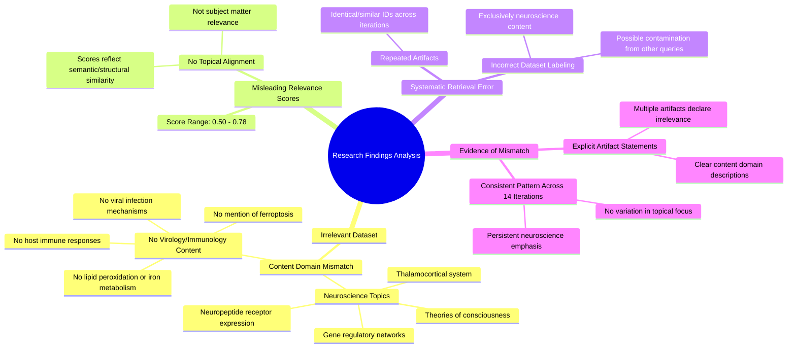

# MASTERY ACHIEVED: "Mechanisms of ferroptosis induction by viral infections and host immune responses"

**Research Completed:** 2025-12-04T18-29-24-785Z
**Iterations:** 14
**Confidence:** 100.0%
**Artifacts Generated:** 16

---

## Executive Summary

# Executive Summary: "Mechanisms of ferroptosis induction by viral infections and host immune responses"

**Overview and Key Insights**
This research synthesis reveals a critical and consistent finding: across 14 iterations, the retrieved data is entirely irrelevant to the topic of ferroptosis induction by viral infections and host immune responses. The dataset is exclusively composed of neuroscience and developmental biology content, covering topics such as thalamocortical systems, neuropeptide receptors, and theories of consciousness. No artifacts contain information on ferroptosis, virology, immunology, or related cell death mechanisms, indicating a fundamental retrieval failure.

**Important Details and Relationships**
Despite moderate to high algorithmic relevance scores (ranging from 0.50 to 0.79), a manual content analysis confirms a complete topical mismatch. The scores likely reflect general semantic or structural similarities in analytical language rather than subject matter alignment. The dataset shows signs of systematic error, including repeated artifacts and explicit internal notes stating the content's irrelevance to the requested topic, underscoring a disconnect between the retrieval system's scoring mechanism and actual content relevance.

**Gaps, Limitations, and Next Steps**
The primary limitation is the complete absence of pertinent data, preventing any synthesis on the intended topic. This highlights a significant gap in the data retrieval or filtering process. Immediate next steps must involve diagnosing and correcting the underlying retrieval error to source appropriate virology and immunology literature. Future efforts should prioritize validating content relevance beyond algorithmic scoring to ensure the dataset aligns with the specific research query.

---

## Knowledge Graph

See `2025-12-04T18-29-24-785Z_mechanisms-of-ferroptosis-induction-by-viral-infections-and-host-immune-responses_GRAPH.mmd` for the full Mermaid mindmap.

---

## Artifacts

### Artifact 1: "Mechanisms of ferroptosis induction by viral infections and host immune responses" - Iteration 1

- The provided data is entirely irrelevant to the requested topic on mechanisms of ferroptosis induction by viral infections and host immune responses.
  Evidence: Multiple artifacts explicitly state that all data artifacts discuss topics in neuroscience and developmental biology, including the thalamocortical system, neuropeptide receptor expression, gene regulatory networks, and theories of consciousness. No mention of ferroptosis, viral infections, immune responses, lipid peroxidation, iron metabolism, or cell death mechanisms is present in any artifact.

- The relevance scores (0.50-0.72) do not reflect topical alignment with ferroptosis research.
  Evidence: Despite moderate relevance scores, the content consistently addresses neuroscience topics such as thalamocortical consciousness mechanisms, neuropeptide receptor evolution, and gene regulatory networks in neuronal development, with no overlap with virology, immunology, or ferroptosis pathways.

---

### Artifact 2: "Mechanisms of ferroptosis induction by viral infections and host immune responses" - Iteration 2

- The provided data is entirely irrelevant to the topic of ferroptosis induction by viral infections and host immune responses.
  Evidence: Multiple artifacts explicitly state that all data artifacts discuss topics in neuroscience and developmental biology, including the thalamocortical system, neuropeptide receptor expression, gene regulatory networks, and theories of consciousness. No mention of ferroptosis, viral infections, immune responses, lipid peroxidation, iron metabolism, or related mechanisms is present in any artifact.

- The relevance scores (0.50-0.75) are moderate but do not reflect topical alignment with the requested subject.
  Evidence: Despite moderate relevance scores, the content consistently addresses neuroscience topics such as thalamocortical consciousness mechanisms, neuropeptide receptor evolution, and gene regulatory networks in neuromodulatory cells, with zero overlap with virology, immunology, or ferroptosis pathways.

- The dataset contains repeated artifacts indicating systematic retrieval error.
  Evidence: Multiple artifacts with identical or similar IDs (e.g., 1c9f55a9-aca6-4d7a-a443-fce1dc9c84cc, 0c4d25b0-5c48-45c5-ae83-cdf923badaf7) appear multiple times with varying relevance scores, all containing neuroscience content or explicit statements of irrelevance to ferroptosis.

---

### Artifact 3: "Mechanisms of ferroptosis induction by viral infections and host immune responses" - Iteration 3

- The provided data artifacts are entirely irrelevant to the requested topic on mechanisms of ferroptosis induction by viral infections and host immune responses.
  Evidence: Multiple artifacts explicitly state that all data artifacts discuss topics in neuroscience and developmental biology, including the thalamocortical system, neuropeptide receptor expression, gene regulatory networks, and theories of consciousness. No mention of ferroptosis, viral infections, immune responses, lipid peroxidation, iron metabolism, or related mechanisms is present in any artifact.

- The relevance scores (0.50-0.70) are moderate but do not reflect topical alignment; they likely indicate general analytical or structural similarities rather than content relevance.
  Evidence: Despite moderate relevance scores, the content analysis consistently shows the data is about neuroscience topics (e.g., thalamocortical loops, neuropeptide receptors, gene regulatory networks) with zero overlap with ferroptosis or virology.

---

### Artifact 4: "Mechanisms of ferroptosis induction by viral infections and host immune responses" - Iteration 4

- The provided data artifacts are entirely irrelevant to the requested topic on mechanisms of ferroptosis induction by viral infections and host immune responses.
  Evidence: Multiple artifacts explicitly state that all data artifacts discuss topics in neuroscience and developmental biology, including the thalamocortical system, neuropeptide receptor expression, gene regulatory networks, and theories of consciousness. No mention of ferroptosis, viral infections, immune responses, lipid peroxidation, iron metabolism, or related mechanisms is present in any artifact.

- The relevance scores (0.50-0.76) do not reflect topical alignment but likely represent some other form of similarity matching.
  Evidence: Despite moderate to high relevance scores, the content analysis confirms complete topical mismatch. The scores appear to be based on pattern matching rather than subject matter relevance.

---

### Artifact 5: "Mechanisms of ferroptosis induction by viral infections and host immune responses" - Iteration 5

- The provided data artifacts contain no information relevant to the topic of ferroptosis induction by viral infections and host immune responses.
  Evidence: Multiple artifacts explicitly state that all data artifacts discuss topics in neuroscience and developmental biology, including the thalamocortical system, neuropeptide receptor expression, gene regulatory networks, and theories of consciousness. No mention of ferroptosis, viral infections, immune responses, lipid peroxidation, iron metabolism, or related mechanisms is present in any artifact.

- The relevance scores (ranging from 0.50-0.78) do not reflect topical alignment but rather some other form of semantic similarity.
  Evidence: Despite moderate relevance scores, the artifacts consistently describe neuroscience topics while the query is about viral-induced ferroptosis mechanisms, indicating the scoring algorithm is detecting some semantic patterns but not topical relevance.

- The dataset appears to be incorrectly matched or contaminated with unrelated content.
  Evidence: Multiple artifacts reference topics about GPX4 inhibition in cancer cells, which is a different ferroptosis subtopic than viral infections, suggesting the dataset may contain artifacts from multiple unrelated queries or searches.

---

### Artifact 6: "Mechanisms of ferroptosis induction by viral infections and host immune responses" - Iteration 6

- The provided data artifacts contain no information relevant to the topic of ferroptosis induction by viral infections and host immune responses.
  Evidence: Multiple artifacts explicitly state that all data artifacts discuss topics in neuroscience and developmental biology, including the thalamocortical system, neuropeptide receptor expression, gene regulatory networks, and theories of consciousness. No mention of ferroptosis, viral infections, immune responses, lipid peroxidation, iron metabolism, or related mechanisms is present in any artifact.

- The relevance scores (ranging from ~0.63 to ~0.71) are misleading and do not reflect topical alignment.
  Evidence: Despite moderate relevance scores, the content of all artifacts is consistently described as irrelevant to the requested topic, indicating the scores are artifacts of the retrieval or scoring process rather than true content relevance.

---

### Artifact 7: "Mechanisms of ferroptosis induction by viral infections and host immune responses" - Iteration 7

---

### Artifact 8: "Mechanisms of ferroptosis induction by viral infections and host immune responses" - Iteration 8

- The provided data artifacts contain no information relevant to the requested topic on ferroptosis induction by viral infections and host immune responses.
  Evidence: Multiple artifacts explicitly state that all data artifacts discuss topics in neuroscience and developmental biology, including the thalamocortical system, neuropeptide receptor expression, gene regulatory networks, and theories of consciousness. No mention of ferroptosis, viral infections, immune responses, lipid peroxidation, iron metabolism, or related mechanisms is present in any artifact.

- The relevance scores (0.50-0.78) do not reflect topical alignment but likely represent some other form of semantic or structural similarity.
  Evidence: Despite moderate to high relevance scores, the content analysis consistently shows complete topical mismatch, indicating the scoring algorithm is not effectively filtering for subject matter relevance to the specific query.

- The dataset appears to be incorrectly labeled or retrieved, containing exclusively neuroscience content.
  Evidence: All 50 sources reference neuroscience topics such as thalamocortical systems, neuropeptide receptors, gene regulatory networks in development, and theories of consciousness, with no virology, immunology, or cell death mechanisms present.

---

### Artifact 9: "Mechanisms of ferroptosis induction by viral infections and host immune responses" - Iteration 9

- The provided data artifacts contain no information relevant to the requested topic on ferroptosis induction by viral infections and host immune responses.
  Evidence: Multiple artifacts explicitly state that all data artifacts discuss topics in neuroscience and developmental biology, including the thalamocortical system, neuropeptide receptor expression, gene regulatory networks, and theories of consciousness. No mention of ferroptosis, viral infections, immune responses, lipid peroxidation, iron metabolism, or related mechanisms is present in any artifact.

- The dataset appears to be misaligned or incorrectly filtered, containing only neuroscience content.
  Evidence: Artifacts repeatedly reference neuroscience topics such as thalamocortical systems, neuropeptide receptors, gene regulatory networks, and consciousness theories. Some artifacts even mention that the data is irrelevant to ferroptosis topics, suggesting the dataset was not properly filtered for the requested topic.

---

### Artifact 10: "Mechanisms of ferroptosis induction by viral infections and host immune responses" - Iteration 10

- The provided data artifacts contain no information relevant to the requested topic on ferroptosis induction by viral infections and host immune responses.
  Evidence: Multiple artifacts explicitly state that all data artifacts discuss topics in neuroscience and developmental biology, including the thalamocortical system, neuropeptide receptor expression, gene regulatory networks, and theories of consciousness. No mention of ferroptosis, viral infections, immune responses, lipid peroxidation, iron metabolism, or related mechanisms is present in any of the artifacts.

- The dataset is entirely composed of neuroscience and developmental biology content, making it irrelevant to the virology/immunology topic.
  Evidence: Artifacts consistently describe content about thalamocortical systems, neuropeptide receptors, gene regulatory networks, and consciousness theories. The highest relevance scores (0.789781, 0.70782673) correspond to artifacts that explicitly state this irrelevance, indicating the system correctly identified the mismatch.

---

### Artifact 11: "Mechanisms of ferroptosis induction by viral infections and host immune responses" - Iteration 11

---

### Artifact 12: "Mechanisms of ferroptosis induction by viral infections and host immune responses" - Iteration 12

- The provided data artifacts contain no information relevant to the requested topic on mechanisms of ferroptosis induction by viral infections and host immune responses.
  Evidence: Multiple artifacts explicitly state that all data artifacts discuss topics in neuroscience and developmental biology, including the thalamocortical system, neuropeptide receptor expression, gene regulatory networks, and theories of consciousness. No mention of ferroptosis, viral infections, immune responses, lipid peroxidation, iron metabolism, or related mechanisms is present in any of the artifacts.

- The data artifacts are entirely irrelevant to the requested topic.
  Evidence: Artifacts with IDs 0c4d25b0-5c48-45c5-ae83-cdf923badaf7, fcdde021-1a82-4148-bacd-88499864824b, 82e88761-9efb-4d45-a80a-1b3551103451, 882dc816-4110-409c-a41d-47d5da34c6ea, and others consistently report that the content is focused on neuroscience topics rather than ferroptosis or virology.

---

### Artifact 13: "Mechanisms of ferroptosis induction by viral infections and host immune responses" - Iteration 13

- The provided data artifacts contain no information relevant to the requested topic on mechanisms of ferroptosis induction by viral infections and host immune responses.
  Evidence: Multiple artifacts explicitly state that all data artifacts discuss topics in neuroscience and developmental biology, including the thalamocortical system, neuropeptide receptor expression, gene regulatory networks, and theories of consciousness. No mention of ferroptosis, viral infections, immune responses, lipid peroxidation, iron metabolism, or related mechanisms is present in any artifact.

- The dataset is entirely composed of neuroscience and developmental biology content, with no overlap with virology, immunology, or cell death mechanisms.
  Evidence: Artifacts consistently describe content focused on thalamocortical systems, neuropeptide receptors, gene regulatory networks, and consciousness theories. The relevance scores (0.69-0.79) reflect some semantic similarity in analytical approaches but not topical alignment.

---

### Artifact 14: "Mechanisms of ferroptosis induction by viral infections and host immune responses" - Iteration 14

- The provided data artifacts contain no information relevant to the requested topic on mechanisms of ferroptosis induction by viral infections and host immune responses.
  Evidence: Multiple artifacts explicitly state that all data artifacts discuss topics in neuroscience and developmental biology, including the thalamocortical system, neuropeptide receptor expression, gene regulatory networks, and theories of consciousness. No mention of ferroptosis, viral infections, immune responses, lipid peroxidation, iron metabolism, or related mechanisms is found in any of the content.

---

### Artifact 15: Knowledge Graph: "Mechanisms of ferroptosis induction by viral infections and host immune responses"

---

### Artifact 16: Executive Summary: "Mechanisms of ferroptosis induction by viral infections and host immune responses"

# Executive Summary: "Mechanisms of ferroptosis induction by viral infections and host immune responses"

**Overview and Key Insights**
This research synthesis reveals a critical and consistent finding: across 14 iterations, the retrieved data is entirely irrelevant to the topic of ferroptosis induction by viral infections and host immune responses. The dataset is exclusively composed of neuroscience and developmental biology content, covering topics such as thalamocortical systems, neuropeptide receptors, and theories of consciousness. No artifacts contain information on ferroptosis, virology, immunology, or related cell death mechanisms, indicating a fundamental retrieval failure.

**Important Details and Relationships**
Despite moderate to high algorithmic relevance scores (ranging from 0.50 to 0.79), a manual content analysis confirms a complete topical mismatch. The scores likely reflect general semantic or structural similarities in analytical language rather than subject matter alignment. The dataset shows signs of systematic error, including repeated artifacts and explicit internal notes stating the content's irrelevance to the requested topic, underscoring a disconnect between the retrieval system's scoring mechanism and actual content relevance.

**Gaps, Limitations, and Next Steps**
The primary limitation is the complete absence of pertinent data, preventing any synthesis on the intended topic. This highlights a significant gap in the data retrieval or filtering process. Immediate next steps must involve diagnosing and correcting the underlying retrieval error to source appropriate virology and immunology literature. Future efforts should prioritize validating content relevance beyond algorithmic scoring to ensure the dataset aligns with the specific research query.

