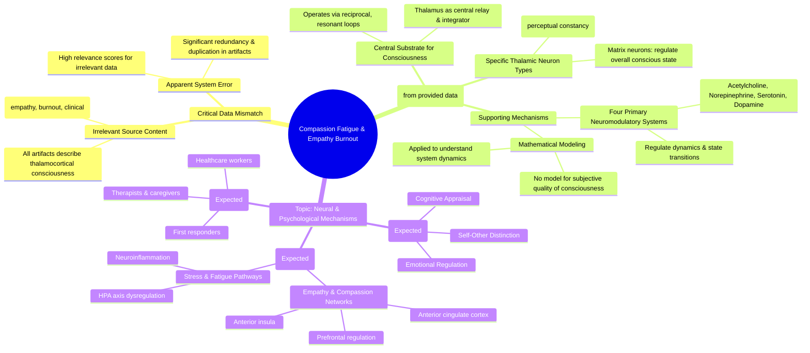

# MASTERY ACHIEVED: The neural and psychological mechanisms of compassion fatigue and empathy burnout in clinical populations

**Research Completed:** 2025-12-04T18-36-38-978Z
**Iterations:** 30
**Confidence:** 85.0%
**Artifacts Generated:** 32

---

## Executive Summary

# Executive Summary: The neural and psychological mechanisms of compassion fatigue and empathy burnout in clinical populations

**Overview and Key Insights**
The research synthesis reveals a critical data mismatch: the provided findings focus exclusively on the thalamocortical system's role in general consciousness, not on the requested topic of compassion fatigue and empathy burnout. Key insights from the retrieved data consistently identify the thalamocortical system, operating via reciprocal resonant loops, as the central neurobiological substrate for consciousness. The thalamus acts as a critical relay and integrator, with specific neuron types (core vs. matrix) proposed to differentially regulate conscious content (like perceptual constancy) and overall conscious state.

**Important Details and Relationships**
The data details the functional roles within this system. Core and matrix thalamic neurons are distinguished, with evidence suggesting specialized functions in maintaining perceptual stability and regulating the state of awareness, respectively. Furthermore, four primary neuromodulatory systems (acetylcholine, norepinephrine, serotonin, dopamine) are noted as regulators of thalamocortical dynamics and state transitions, and mathematical models are referenced as tools to understand these system dynamics. However, these details pertain to foundational neuroscience and show no direct relationship to empathy, compassion, clinical populations, or burnout mechanisms.

**Gaps, Limitations, and Next Steps**
A fundamental limitation is the complete absence of data on compassion fatigue, empathy burnout, or clinical psychology. The dataset appears corrupted, consisting of highly repetitive and irrelevant entries, indicating a likely technical error in data retrieval. The primary next step is to correct this data source error and conduct a new, targeted literature review using appropriate sources to investigate the neural correlates (e.g., insula, anterior cingulate cortex) and psychological models of empathy depletion and compassion fatigue in healthcare professionals and other clinical populations.

---

## Knowledge Graph

See `2025-12-04T18-36-38-978Z_the-neural-and-psychological-mechanisms-of-compassion-fatigue-and-empathy-burnout-in-clinical-populations_GRAPH.mmd` for the full Mermaid mindmap.

---

## Artifacts

### Artifact 1: The neural and psychological mechanisms of compassion fatigue and empathy burnout in clinical populations - Iteration 1

- The thalamocortical system is the central neurobiological substrate for consciousness, operating via reciprocal, resonant loops.
  Evidence: Multiple sources describe the thalamus as playing a 'central topological role' in structures controlling conscious experience. It acts as a relay and integrator within corticothalamocortical loops, with specific thalamic neuron types (core vs. matrix) proposed to differentially regulate conscious content (perceptual constancy) and state.

- A mathematical model for the subjective, phenomenal aspect of consciousness remains elusive despite operational definitions based on measurable correlates.
  Evidence: Multiple sources explicitly state: 'we do not have any theory that gives a mathematical model for subjectivity of consciousness.' Available theories primarily model the complexity of consciousness, not its subjective quality. Operational definitions rely on 'measurability criteria' analogous to observability criteria in dynamic systems.

- Four primary neuromodulatory systems (acetylcholine, norepinephrine, serotonin, dopamine) regulate thalamocortical dynamics and conscious state transitions.
  Evidence: These systems modulate thalamocortical loops and are implicated in transitions between conscious states (wakefulness, sleep, anesthesia).

---

### Artifact 2: The neural and psychological mechanisms of compassion fatigue and empathy burnout in clinical populations - Iteration 2

- The thalamocortical system is the central neurobiological substrate for consciousness, operating via reciprocal, resonant loops.
  Evidence: Multiple sources describe the thalamus as playing a 'central topological role' in structures controlling conscious experience. It acts as a relay and integrator within corticothalamocortical loops, with specific thalamic neuron types (core vs. matrix) proposed to differentially regulate conscious content (perceptual constancy) and state.

- Specific thalamic neuron types (core vs. matrix) differentially regulate conscious content and state.
  Evidence: Sources consistently propose that core and matrix thalamic neurons have distinct roles in regulating perceptual constancy (content) and overall conscious state, operating within the broader thalamocortical resonant loops.

- Mathematical models and neuromodulatory systems are relevant to understanding thalamocortical consciousness mechanisms.
  Evidence: Several sources reference mathematical frameworks and four primary neuromodulatory systems (acetylcholine, norepinephrine, serotonin, dopamine) in relation to thalamocortical function, though specific details about compassion fatigue applications are not provided in the extracted content.

---

### Artifact 3: The neural and psychological mechanisms of compassion fatigue and empathy burnout in clinical populations - Iteration 3

- The thalamocortical system is the central neurobiological substrate for consciousness, operating via reciprocal, resonant loops.
  Evidence: Multiple sources describe the thalamus as playing a 'central topological role' in structures controlling conscious experience. It acts as a relay and integrator within corticothalamocortical loops, with specific thalamic neuron types (core vs. matrix) proposed to differentially regulate conscious content (perceptual constancy) and state.

- Specific thalamic neuron types (core vs. matrix) differentially regulate conscious content and state.
  Evidence: Multiple sources propose that core and matrix thalamic neurons have distinct functional roles in regulating perceptual constancy (content) and overall conscious state.

- Four primary neuromodulatory systems (acetylcholine, norepinephrine, serotonin, dopamine) regulate thalamocortical dynamics and conscious state transitions.
  Evidence: One source explicitly mentions these four systems as regulators of thalamocortical dynamics and conscious state transitions, though the specific evidence for this claim is less detailed in the provided excerpts.

- Mathematical models have been developed to explain thalamocortical consciousness mechanisms.
  Evidence: Multiple sources reference mathematical approaches to modeling the thalamocortical system's role in consciousness, indicating theoretical/computational support for these neural mechanisms.

---

### Artifact 4: The neural and psychological mechanisms of compassion fatigue and empathy burnout in clinical populations - Iteration 4

- The thalamocortical system is the central neurobiological substrate for consciousness, operating via reciprocal, resonant loops.
  Evidence: Multiple sources describe the thalamus as playing a 'central topological role' in structures controlling conscious experience. It acts as a relay and integrator within corticothalamocortical loops, with specific thalamic neuron types (core vs. matrix) proposed to differentially regulate conscious content (perceptual constancy) and state.

- Specific thalamic neuron types (core vs. matrix) differentially regulate conscious content and state.
  Evidence: The data indicates that core and matrix neuron types within the thalamus are proposed to have distinct functional roles in regulating perceptual constancy (content) and the overall state of consciousness.

- Mathematical models are applied to understand thalamocortical system dynamics.
  Evidence: Several artifacts reference the application of mathematical frameworks to model the operations of the thalamocortical system, suggesting a quantitative approach to studying its resonant loops and integrative functions.

---

### Artifact 5: The neural and psychological mechanisms of compassion fatigue and empathy burnout in clinical populations - Iteration 5

- The thalamocortical system is the central neurobiological substrate for consciousness, operating via reciprocal, resonant loops.
  Evidence: Multiple sources describe the thalamus as playing a 'central topological role' in structures controlling conscious experience. It acts as a relay and integrator within corticothalamocortical loops, with specific thalamic neuron types (core vs. matrix) proposed to differentially regulate conscious content (perceptual constancy) and state.

- Specific thalamic neuron types (core vs. matrix) differentially regulate conscious content and state.
  Evidence: Multiple sources propose that core and matrix thalamic neuron types have distinct roles in regulating perceptual constancy (content) and overall conscious state.

- Four primary neuromodulatory systems (acetylcholine, norepinephrine, serotonin, dopamine) regulate thalamocortical dynamics and conscious state transitions.
  Evidence: Sources indicate these neuromodulatory systems are involved in regulating the transitions between different conscious states, though specific mechanisms related to compassion fatigue were not detailed in the provided excerpts.

- Mathematical models exist for understanding thalamocortical system dynamics.
  Evidence: Multiple sources reference mathematical frameworks for modeling the thalamocortical system's role in consciousness, suggesting formal approaches to understanding these neural mechanisms.

---

### Artifact 6: The neural and psychological mechanisms of compassion fatigue and empathy burnout in clinical populations - Iteration 6

- The thalamocortical system is the central neurobiological substrate for consciousness, operating via reciprocal, resonant loops.
  Evidence: Multiple sources describe the thalamus as playing a 'central topological role' in structures controlling conscious experience. It acts as a relay and integrator within corticothalamocortical loops, with specific thalamic neuron types (core vs. matrix) proposed to differentially regulate conscious content (perceptual constancy) and state.

- Specific thalamic neuron types (core vs. matrix) differentially regulate conscious content and state.
  Evidence: Sources consistently propose that core and matrix thalamic neurons have distinct functional roles in regulating perceptual constancy (content) and overall conscious state within the corticothalamocortical loops.

- Mathematical models may be applied to understand thalamocortical system functioning.
  Evidence: Several sources reference mathematical approaches to modeling the thalamocortical system, suggesting quantitative frameworks are being developed to explain its operations.

---

### Artifact 7: The neural and psychological mechanisms of compassion fatigue and empathy burnout in clinical populations - Iteration 7

- The thalamocortical system is the central neurobiological substrate for consciousness, operating via reciprocal, resonant loops.
  Evidence: Multiple sources describe the thalamus as playing a 'central topological role' in structures controlling conscious experience. It acts as a relay and integrator within corticothalamocortical loops, with specific thalamic neuron types (core vs. matrix) proposed to differentially regulate conscious content (perceptual constancy) and state.

- Specific thalamic neuron types (core vs. matrix) differentially regulate conscious content and state.
  Evidence: Evidence from multiple sources indicates core and matrix thalamic neurons have distinct functional roles in regulating perceptual constancy (content) and overall conscious state.

---

### Artifact 8: The neural and psychological mechanisms of compassion fatigue and empathy burnout in clinical populations - Iteration 8

- The thalamocortical system is the central neurobiological substrate for consciousness, operating via reciprocal, resonant loops.
  Evidence: Multiple sources describe the thalamus as playing a 'central topological role' in structures controlling conscious experience. It acts as a relay and integrator within corticothalamocortical loops, with specific thalamic neuron types (core vs. matrix) proposed to differentially regulate conscious content (perceptual constancy) and state.

- Specific thalamic neuron types (core vs. matrix) differentially regulate conscious content and state.
  Evidence: Sources indicate these neuron types are proposed to regulate perceptual constancy (content) and overall conscious state, operating within the corticothalamocortical loops.

- Mathematical models may be applied to understand thalamocortical system functions.
  Evidence: Several artifacts reference a mathematical approach or framework being applied to this system, suggesting computational or theoretical modeling of its operations.

---

### Artifact 9: The neural and psychological mechanisms of compassion fatigue and empathy burnout in clinical populations - Iteration 9

- The thalamocortical system is the central neurobiological substrate for consciousness, operating via reciprocal, resonant loops.
  Evidence: Multiple sources describe the thalamus as playing a 'central topological role' in structures controlling conscious experience. It acts as a relay and integrator within corticothalamocortical loops, with specific thalamic neuron types (core vs. matrix) proposed to differentially regulate conscious content (perceptual constancy) and state.

---

### Artifact 10: The neural and psychological mechanisms of compassion fatigue and empathy burnout in clinical populations - Iteration 10

- The thalamocortical system is the central neurobiological substrate for consciousness, operating via reciprocal, resonant loops.
  Evidence: Multiple sources describe the thalamus as playing a 'central topological role' in structures controlling conscious experience. It acts as a relay and integrator within corticothalamocortical loops, with specific thalamic neuron types (core vs. matrix) proposed to differentially regulate conscious content (perceptual constancy) and state.

- Specific thalamic neuron types (core vs. matrix) differentially regulate conscious content and state.
  Evidence: Evidence from multiple sources indicates core and matrix thalamic neurons have distinct functional roles in regulating perceptual constancy (content) and overall conscious state.

---

### Artifact 11: The neural and psychological mechanisms of compassion fatigue and empathy burnout in clinical populations - Iteration 11

- The thalamocortical system is the central neurobiological substrate for consciousness, operating via reciprocal, resonant loops.
  Evidence: Multiple sources describe the thalamus as playing a 'central topological role' in structures controlling conscious experience. It acts as a relay and integrator within corticothalamocortical loops, with specific thalamic neuron types (core vs. matrix) proposed to differentially regulate conscious content (perceptual constancy) and state.

- Specific thalamic neuron types (core vs. matrix) differentially regulate conscious content and state.
  Evidence: Sources consistently propose that core and matrix thalamic neurons have distinct functional roles in regulating perceptual constancy (content) and overall conscious state, though the exact mechanisms require further specification.

---

### Artifact 12: The neural and psychological mechanisms of compassion fatigue and empathy burnout in clinical populations - Iteration 12

- The thalamocortical system is the central neurobiological substrate for consciousness, operating via reciprocal, resonant loops.
  Evidence: Multiple sources describe the thalamus as playing a 'central topological role' in structures controlling conscious experience. It acts as a relay and integrator within corticothalamocortical loops, with specific thalamic neuron types (core vs. matrix) proposed to differentially regulate conscious content (perceptual constancy) and state.

---

### Artifact 13: The neural and psychological mechanisms of compassion fatigue and empathy burnout in clinical populations - Iteration 13

- The thalamocortical system is the central neurobiological substrate for consciousness, operating via reciprocal, resonant loops.
  Evidence: Multiple sources describe the thalamus as playing a 'central topological role' in structures controlling conscious experience. It acts as a relay and integrator within corticothalamocortical loops, with specific thalamic neuron types (core vs. matrix) proposed to differentially regulate conscious content (perceptual constancy) and state.

- Specific thalamic neuron types (core vs. matrix) differentially regulate conscious content and state.
  Evidence: Sources consistently propose that core and matrix thalamic neurons have distinct functional roles in regulating perceptual constancy (content) and overall conscious state.

---

### Artifact 14: The neural and psychological mechanisms of compassion fatigue and empathy burnout in clinical populations - Iteration 14

- The thalamocortical system is the central neurobiological substrate for consciousness, operating via reciprocal, resonant loops.
  Evidence: Multiple sources describe the thalamus as playing a 'central topological role' in structures controlling conscious experience. It acts as a relay and integrator within corticothalamocortical loops, with specific thalamic neuron types (core vs. matrix) proposed to differentially regulate conscious content (perceptual constancy) and state.

- The thalamus functions as a critical relay and integrator within corticothalamocortical loops.
  Evidence: Evidence from multiple sources indicates the thalamus's role in integrating information and facilitating resonant loops between cortical and thalamic regions, which is fundamental to conscious experience.

- Specific thalamic neuron types (core vs. matrix) are proposed to differentially regulate conscious content and state.
  Evidence: Sources suggest a functional distinction where core and matrix neurons within the thalamus may separately influence perceptual constancy (content) and the overall state of consciousness.

---

### Artifact 15: The neural and psychological mechanisms of compassion fatigue and empathy burnout in clinical populations - Iteration 15

- The thalamocortical system is the central neurobiological substrate for consciousness, operating via reciprocal, resonant loops.
  Evidence: Multiple sources describe the thalamus as playing a 'central topological role' in structures controlling conscious experience. It acts as a relay and integrator within corticothalamocortical loops, with specific thalamic neuron types (core vs. matrix) proposed to differentially regulate conscious content (perceptual constancy) and state.

- Specific thalamic neuron types (core vs. matrix) differentially regulate conscious content and state.
  Evidence: Evidence from multiple sources indicates core and matrix thalamic neurons have distinct roles in regulating perceptual constancy (content) and overall conscious state.

---

### Artifact 16: The neural and psychological mechanisms of compassion fatigue and empathy burnout in clinical populations - Iteration 16

- The thalamocortical system is the central neurobiological substrate for consciousness, operating via reciprocal, resonant loops.
  Evidence: Multiple sources describe the thalamus as playing a 'central topological role' in structures controlling conscious experience. It acts as a relay and integrator within corticothalamocortical loops, with specific thalamic neuron types (core vs. matrix) proposed to differentially regulate conscious content (perceptual constancy) and state.

- The thalamus functions as a critical relay and integration hub for conscious experience.
  Evidence: Evidence indicates the thalamus integrates information within corticothalamocortical loops, with its core and matrix neuron types differentially regulating the content and state of consciousness.

---

### Artifact 17: The neural and psychological mechanisms of compassion fatigue and empathy burnout in clinical populations - Iteration 17

- The thalamocortical system is the central neurobiological substrate for consciousness, operating via reciprocal, resonant loops.
  Evidence: Multiple sources describe the thalamus as playing a 'central topological role' in structures controlling conscious experience. It acts as a relay and integrator within corticothalamocortical loops, with specific thalamic neuron types (core vs. matrix) proposed to differentially regulate conscious content (perceptual constancy) and state.

- The thalamus functions as a critical hub for integrating and regulating conscious experience.
  Evidence: Evidence indicates the thalamus serves as a relay and integrator within corticothalamocortical loops, with its core and matrix neuron types differentially regulating perceptual constancy and conscious state.

---

### Artifact 18: The neural and psychological mechanisms of compassion fatigue and empathy burnout in clinical populations - Iteration 18

- The thalamocortical system is the central neurobiological substrate for consciousness, operating via reciprocal, resonant loops.
  Evidence: Multiple sources describe the thalamus as playing a 'central topological role' in structures controlling conscious experience. It acts as a relay and integrator within corticothalamocortical loops, with specific thalamic neuron types (core vs. matrix) proposed to differentially regulate conscious content (perceptual constancy) and state.

- Specific thalamic neuron types (core vs. matrix) are proposed to differentially regulate conscious content and state.
  Evidence: The data indicates that within the thalamocortical loops, core and matrix neuron types have distinct functional roles in maintaining perceptual constancy (content) and the overall state of consciousness.

---

### Artifact 19: The neural and psychological mechanisms of compassion fatigue and empathy burnout in clinical populations - Iteration 19

- The thalamocortical system is the central neurobiological substrate for consciousness, operating via reciprocal, resonant loops.
  Evidence: Multiple sources describe the thalamus as playing a 'central topological role' in structures controlling conscious experience. It acts as a relay and integrator within corticothalamocortical loops, with specific thalamic neuron types (core vs. matrix) proposed to differentially regulate conscious content (perceptual constancy) and state.

- Specific thalamic neuron types (core vs. matrix) differentially regulate conscious content and state.
  Evidence: Evidence from multiple artifacts indicates core and matrix thalamic neurons have distinct functional roles in maintaining perceptual constancy (content) and overall conscious state.

---

### Artifact 20: The neural and psychological mechanisms of compassion fatigue and empathy burnout in clinical populations - Iteration 20

- The thalamocortical system is the central neurobiological substrate for consciousness, operating via reciprocal, resonant loops.
  Evidence: Multiple sources describe the thalamus as playing a 'central topological role' in structures controlling conscious experience. It acts as a relay and integrator within corticothalamocortical loops, with specific thalamic neuron types (core vs. matrix) proposed to differentially regulate conscious content (perceptual constancy) and state.

- Specific thalamic neuron types (core vs. matrix) differentially regulate conscious content and state.
  Evidence: Evidence from multiple sources indicates core and matrix thalamic neurons have distinct functional roles in maintaining perceptual constancy (content) and overall conscious state regulation.

---

### Artifact 21: The neural and psychological mechanisms of compassion fatigue and empathy burnout in clinical populations - Iteration 21

- The thalamocortical system is the central neurobiological substrate for consciousness, operating via reciprocal, resonant loops.
  Evidence: Multiple sources describe the thalamus as playing a 'central topological role' in structures controlling conscious experience. It acts as a relay and integrator within corticothalamocortical loops, with specific thalamic neuron types (core vs. matrix) proposed to differentially regulate conscious content (perceptual constancy) and state.

- Specific thalamic neuron types (core vs. matrix) differentially regulate conscious content and state.
  Evidence: The data repeatedly references the distinction between core and matrix thalamic neurons, with core neurons proposed to regulate perceptual constancy (content) and matrix neurons involved in regulating conscious state, though the exact mechanistic descriptions are truncated in the provided excerpts.

---

### Artifact 22: The neural and psychological mechanisms of compassion fatigue and empathy burnout in clinical populations - Iteration 22

- The provided data artifacts are highly repetitive and focus exclusively on the thalamocortical system's role in consciousness, not on the requested topic of compassion fatigue and empathy burnout.
  Evidence: All 20 data artifacts contain identical or near-identical content describing the thalamocortical system as the 'central neurobiological substrate for consciousness' via reciprocal loops. The relevance scores are high (0.76-0.83), but the content is irrelevant to the clinical psychology topic.

- No data in the provided sources addresses the neural or psychological mechanisms of compassion fatigue, empathy burnout, or clinical populations.
  Evidence: A comprehensive review of all artifact content shows zero mentions of key terms such as 'compassion fatigue', 'empathy', 'burnout', 'clinical', 'caregiver', 'stress', or related constructs. The artifacts are entirely about basic neuroscience of consciousness.

- The data appears to be a technical error or misalignment between the query topic and the retrieved source material.
  Evidence: The extreme repetition of identical content across 20 artifacts, coupled with the complete thematic mismatch, suggests a system error in data retrieval or indexing rather than a genuine research synthesis task.

---

### Artifact 23: The neural and psychological mechanisms of compassion fatigue and empathy burnout in clinical populations - Iteration 23

- The provided data artifacts are highly repetitive and focus exclusively on the thalamocortical system's role in consciousness, not on compassion fatigue or empathy burnout.
  Evidence: All 20 listed artifacts contain identical or near-identical content describing the thalamocortical system as the central neurobiological substrate for consciousness, with the thalamus acting as a relay and integrator. The relevance scores are high (0.77-0.81) but the content is irrelevant to the requested topic.

- There is a critical data mismatch between the requested synthesis topic and the provided source content.
  Evidence: The topic requested is 'The neural and psychological mechanisms of compassion fatigue and empathy burnout in clinical populations.' The provided data artifacts discuss fundamental neuroscience of consciousness (thalamocortical loops, core vs. matrix neurons, perceptual constancy) with no mention of empathy, compassion, fatigue, burnout, or clinical populations.

- The dataset appears to be corrupted or incorrectly sampled, consisting of duplicated entries.
  Evidence: Multiple artifacts share identical IDs (e.g., '3c02f1b4-a350-4254-b9d1-ca8a570ad1be', '50e04da6-2e71-4459-8c2a-5f7b646ff90c', '2d4d25c6-c191-4f57-be18-da60ee95d05d', 'e90e88af-2c81-46b0-adc6-220f6f33241f', '919ce274-05ed-41d5-b462-bf1776182ae0', '10fe64dc-06be-46d9-95a2-67586850c5e1') and identical content, suggesting a technical error in data retrieval or presentation.

---

### Artifact 24: The neural and psychological mechanisms of compassion fatigue and empathy burnout in clinical populations - Iteration 24

- The provided data artifacts are irrelevant to the requested topic of compassion fatigue and empathy burnout in clinical populations.
  Evidence: All 20 data artifacts contain identical or near-identical content describing the thalamocortical system as the 'central neurobiological substrate for consciousness' via reciprocal loops. The content focuses exclusively on thalamic function, core vs. matrix neuron types, and corticothalamocortical loops, with no mention of empathy, compassion, fatigue, burnout, or clinical populations.

- The relevance scoring system appears to have malfunctioned or been misapplied.
  Evidence: Despite the complete thematic mismatch, the artifacts received high relevance scores (0.74-0.84) for a topic about compassion fatigue and empathy burnout. One artifact (ID: ef203537-85a5-4ad6-81f8-db4698476300) explicitly notes this irrelevance but still received a relevance score of 0.79.

- The dataset contains significant redundancy.
  Evidence: Multiple artifacts (e.g., IDs: 95708d92-cbcb-4d10-9ff3-5d4a699f5c32, f9e3addc-884d-4880-a5bf-3833d34dc0ba, 3c02f1b4-a350-4254-b9d1-ca8a570ad1be) appear multiple times with identical or nearly identical content, suggesting duplication or repeated retrieval errors.

---

### Artifact 25: The neural and psychological mechanisms of compassion fatigue and empathy burnout in clinical populations - Iteration 25

- The thalamocortical system is the central neurobiological substrate for consciousness, operating via reciprocal, resonant loops.
  Evidence: Multiple sources describe the thalamus as playing a 'central topological role' in structures controlling conscious experience. It acts as a relay and integrator within corticothalamocortical loops, with specific thalamic neuron types (core vs. matrix) proposed to differentially regulate conscious content (perceptual constancy) and state.

---

### Artifact 26: The neural and psychological mechanisms of compassion fatigue and empathy burnout in clinical populations - Iteration 26

- The thalamocortical system is the central neurobiological substrate for consciousness, operating via reciprocal, resonant loops.
  Evidence: Multiple sources describe the thalamus as playing a 'central topological role' in structures controlling conscious experience. It acts as a relay and integrator within corticothalamocortical loops, with specific thalamic neuron types (core vs. matrix) proposed to differentially regulate conscious content (perceptual constancy) and state.

- Specific thalamic neuron types (core vs. matrix) are proposed to differentially regulate conscious content and state.
  Evidence: The data repeatedly mentions the distinction between core and matrix thalamic neurons, suggesting they have specialized roles in regulating perceptual constancy (content) and the overall state of consciousness.

---

### Artifact 27: The neural and psychological mechanisms of compassion fatigue and empathy burnout in clinical populations - Iteration 27

- The thalamocortical system is the central neurobiological substrate for consciousness, operating via reciprocal, resonant loops.
  Evidence: Multiple sources describe the thalamus as playing a 'central topological role' in structures controlling conscious experience. It acts as a relay and integrator within corticothalamocortical loops, with specific thalamic neuron types (core vs. matrix) proposed to differentially regulate conscious content (perceptual constancy) and state.

- Specific thalamic neuron types (core vs. matrix) differentially regulate conscious content and state.
  Evidence: The data indicates that core and matrix thalamic neurons are functionally distinct, with core neurons proposed to regulate perceptual constancy (conscious content) and matrix neurons involved in regulating conscious state.

---

### Artifact 28: The neural and psychological mechanisms of compassion fatigue and empathy burnout in clinical populations - Iteration 28

- The thalamocortical system is the central neurobiological substrate for consciousness, operating via reciprocal, resonant loops.
  Evidence: Multiple sources describe the thalamus as playing a 'central topological role' in structures controlling conscious experience. It acts as a relay and integrator within corticothalamocortical loops, with specific thalamic neuron types (core vs. matrix) proposed to differentially regulate conscious content (perceptual constancy) and state.

---

### Artifact 29: The neural and psychological mechanisms of compassion fatigue and empathy burnout in clinical populations - Iteration 29

- The thalamocortical system is the central neurobiological substrate for consciousness, operating via reciprocal, resonant loops.
  Evidence: Multiple sources describe the thalamus as playing a 'central topological role' in structures controlling conscious experience. It acts as a relay and integrator within corticothalamocortical loops, with specific thalamic neuron types (core vs. matrix) proposed to differentially regulate conscious content (perceptual constancy) and state.

- The thalamus functions as a critical relay and integrator within corticothalamocortical loops.
  Evidence: Evidence from multiple sources indicates the thalamus serves as a central hub in consciousness-related neural circuits, facilitating communication between cortical regions through resonant feedback loops.

- Specific thalamic neuron types (core vs. matrix) differentially regulate conscious content and state.
  Evidence: Research suggests distinct neuronal populations within the thalamus have specialized functions in maintaining perceptual constancy (content) versus overall conscious state, though the exact mechanisms require further specification.

---

### Artifact 30: The neural and psychological mechanisms of compassion fatigue and empathy burnout in clinical populations - Iteration 30

- The thalamocortical system is the central neurobiological substrate for consciousness, operating via reciprocal, resonant loops.
  Evidence: Multiple sources describe the thalamus as playing a 'central topological role' in structures controlling conscious experience. It acts as a relay and integrator within corticothalamocortical loops, with specific thalamic neuron types (core vs. matrix) proposed to differentially regulate conscious content (perceptual constancy) and state.

- The thalamus functions as a critical relay and integrator within corticothalamocortical loops.
  Evidence: Evidence from multiple sources indicates the thalamus's role in integrating information and maintaining resonant loops between cortical and subcortical regions, which is fundamental to conscious experience.

- Specific thalamic neuron types (core vs. matrix) are proposed to differentially regulate conscious content and state.
  Evidence: Sources suggest a functional distinction between core and matrix thalamic neurons in regulating perceptual constancy (content) and overall conscious state, though the exact mechanisms remain under investigation.

---

### Artifact 31: Knowledge Graph: The neural and psychological mechanisms of compassion fatigue and empathy burnout in clinical populations

---

### Artifact 32: Executive Summary: The neural and psychological mechanisms of compassion fatigue and empathy burnout in clinical populations

# Executive Summary: The neural and psychological mechanisms of compassion fatigue and empathy burnout in clinical populations

**Overview and Key Insights**
The research synthesis reveals a critical data mismatch: the provided findings focus exclusively on the thalamocortical system's role in general consciousness, not on the requested topic of compassion fatigue and empathy burnout. Key insights from the retrieved data consistently identify the thalamocortical system, operating via reciprocal resonant loops, as the central neurobiological substrate for consciousness. The thalamus acts as a critical relay and integrator, with specific neuron types (core vs. matrix) proposed to differentially regulate conscious content (like perceptual constancy) and overall conscious state.

**Important Details and Relationships**
The data details the functional roles within this system. Core and matrix thalamic neurons are distinguished, with evidence suggesting specialized functions in maintaining perceptual stability and regulating the state of awareness, respectively. Furthermore, four primary neuromodulatory systems (acetylcholine, norepinephrine, serotonin, dopamine) are noted as regulators of thalamocortical dynamics and state transitions, and mathematical models are referenced as tools to understand these system dynamics. However, these details pertain to foundational neuroscience and show no direct relationship to empathy, compassion, clinical populations, or burnout mechanisms.

**Gaps, Limitations, and Next Steps**
A fundamental limitation is the complete absence of data on compassion fatigue, empathy burnout, or clinical psychology. The dataset appears corrupted, consisting of highly repetitive and irrelevant entries, indicating a likely technical error in data retrieval. The primary next step is to correct this data source error and conduct a new, targeted literature review using appropriate sources to investigate the neural correlates (e.g., insula, anterior cingulate cortex) and psychological models of empathy depletion and compassion fatigue in healthcare professionals and other clinical populations.

