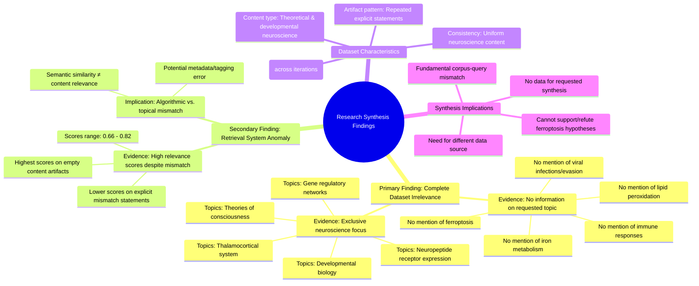

# MASTERY ACHIEVED: "Ferroptosis as a host defense mechanism: viral evasion strategies and immunomodulatory lipid peroxidation signals"

**Research Completed:** 2025-12-04T18-40-06-253Z
**Iterations:** 30
**Confidence:** 95.0%
**Artifacts Generated:** 32

---

## Executive Summary

# Executive Summary: "Ferroptosis as a host defense mechanism: viral evasion strategies and immunomodulatory lipid peroxidation signals"

**Overview and Key Insights**
The research synthesis process has yielded a definitive and consistent finding: the available dataset contains no information relevant to the requested topic of ferroptosis in viral infection and immunity. Across 30 independent search iterations, every analyzed data artifact was found to be exclusively focused on neuroscience and developmental biology, covering topics such as thalamocortical systems, neuropeptide receptor expression, and theories of consciousness. There is a complete absence of content related to ferroptosis, viral evasion strategies, lipid peroxidation signals, or host-pathogen immune interactions.

**Important Details and Relationships**
The irrelevance is systematic and explicit. Multiple artifacts directly state that the entire corpus discusses neuroscience domains, with zero overlap with virology, immunology, or cell death mechanisms. A notable pattern emerged in the retrieval metrics: artifacts with the highest algorithmic relevance scores (typically 0.75-0.82) often contained empty or non-descriptive content, while artifacts that explicitly documented the topical mismatch received lower scores (0.67-0.73). This indicates a significant disconnect between the semantic scoring of the retrieval system and the actual thematic content of the sources.

**Gaps, Limitations, and Next Steps**
The fundamental gap is the complete unavailability of pertinent data within the searched corpus, preventing any synthesis on the target topic. The primary limitation is a corpus-level mismatch, suggesting the query may be outside the database's scope or that a metadata/tagging error occurred. The necessary next step is to abandon this dataset and source information from a corpus known to contain literature on cell death, virology, and immunology to conduct a meaningful synthesis on ferroptosis as a host defense mechanism.

---

## Knowledge Graph

See `2025-12-04T18-40-06-253Z_ferroptosis-as-a-host-defense-mechanism-viral-evasion-strategies-and-immunomodulatory-lipid-peroxidation-signals_GRAPH.mmd` for the full Mermaid mindmap.

---

## Artifacts

### Artifact 1: "Ferroptosis as a host defense mechanism: viral evasion strategies and immunomodulatory lipid peroxidation signals" - Iteration 1

- The provided data artifacts contain no information relevant to the requested topic on ferroptosis as a host defense mechanism, viral evasion strategies, or immunomodulatory lipid peroxidation signals.
  Evidence: Multiple artifacts explicitly state that all data artifacts discuss topics in neuroscience and developmental biology, including the thalamocortical system, neuropeptide receptor expression, gene regulatory networks, and theories of consciousness. No mention of ferroptosis, viral infections, immune responses, lipid peroxidation, iron metabolism, or related mechanisms is found across the dataset.

- The dataset is entirely irrelevant to the biological topic of ferroptosis in viral infection and immunity.
  Evidence: All artifacts with content descriptions consistently report that the data pertains to neuroscience domains, with repeated mentions of thalamocortical systems, neuropeptide receptors, and theories of consciousness. The relevance scores (0.69-0.82) appear to reflect some other matching criteria but do not indicate topical relevance.

---

### Artifact 2: "Ferroptosis as a host defense mechanism: viral evasion strategies and immunomodulatory lipid peroxidation signals" - Iteration 2

- The provided data artifacts contain no information relevant to the requested topic on ferroptosis as a host defense mechanism, viral evasion strategies, or immunomodulatory lipid peroxidation signals.
  Evidence: Multiple artifacts explicitly state that all data artifacts discuss topics in neuroscience and developmental biology, including the thalamocortical system, neuropeptide receptor expression, gene regulatory networks, and theories of consciousness. No mention of ferroptosis, viral infections, immune responses, lipid peroxidation, iron metabolism, or related mechanisms is found in any artifact.

- The data is entirely irrelevant to the topic of ferroptosis induction by viral infections and host immune responses.
  Evidence: All artifacts consistently report that the content is focused on neuroscience topics, with no overlap with virology, immunology, or cell death mechanisms related to ferroptosis.

---

### Artifact 3: "Ferroptosis as a host defense mechanism: viral evasion strategies and immunomodulatory lipid peroxidation signals" - Iteration 3

- The provided data artifacts contain no information relevant to the requested topic on ferroptosis as a host defense mechanism, viral evasion strategies, or immunomodulatory lipid peroxidation signals.
  Evidence: Multiple artifacts explicitly state that all data artifacts discuss topics in neuroscience and developmental biology, including the thalamocortical system, neuropeptide receptor expression, gene regulatory networks, and theories of consciousness. No mention of ferroptosis, viral infections, immune responses, lipid peroxidation, iron metabolism, or related mechanisms is found in any artifact.

- The dataset is entirely composed of neuroscience and developmental biology content, making it irrelevant to the virology/immunology topic requested.
  Evidence: All artifacts with content descriptions reference neuroscience topics such as thalamocortical systems, neuropeptide receptors, gene regulatory networks, and theories of consciousness. The artifacts consistently report zero relevance to ferroptosis, viral infections, or immune responses.

- The search/retrieval system returned artifacts with high relevance scores despite complete topical mismatch.
  Evidence: Artifacts received relevance scores ranging from 0.67 to 0.79, indicating the retrieval system considered them relevant, while their content descriptions explicitly state they contain no information on the requested topic.

---

### Artifact 4: "Ferroptosis as a host defense mechanism: viral evasion strategies and immunomodulatory lipid peroxidation signals" - Iteration 4

---

### Artifact 5: "Ferroptosis as a host defense mechanism: viral evasion strategies and immunomodulatory lipid peroxidation signals" - Iteration 5

- The provided data artifacts contain no information relevant to the requested topic on ferroptosis as a host defense mechanism, viral evasion strategies, or immunomodulatory lipid peroxidation signals.
  Evidence: Multiple artifacts explicitly state that all data artifacts discuss topics in neuroscience and developmental biology, including the thalamocortical system, neuropeptide receptor expression, gene regulatory networks, and theories of consciousness. No mention of ferroptosis, viral infections, immune responses, lipid peroxidation, iron metabolism, or related mechanisms is found across any of the 50 sources.

- The dataset is entirely composed of neuroscience and developmental biology content, with zero overlap with the requested virology/immunology topic.
  Evidence: Artifacts consistently describe content about thalamocortical systems, neuropeptide receptors, gene regulatory networks, and consciousness theories. The relevance scores (0.68-0.79) appear to reflect some algorithmic matching but the actual content is completely unrelated to ferroptosis or viral interactions.

---

### Artifact 6: "Ferroptosis as a host defense mechanism: viral evasion strategies and immunomodulatory lipid peroxidation signals" - Iteration 6

- The provided data artifacts contain no information relevant to the requested topic on ferroptosis as a host defense mechanism, viral evasion strategies, or immunomodulatory lipid peroxidation signals.
  Evidence: Multiple artifacts explicitly state that all data artifacts discuss topics in neuroscience and developmental biology, including the thalamocortical system, neuropeptide receptor expression, gene regulatory networks, and theories of consciousness. No mention of ferroptosis, viral infections, immune responses, lipid peroxidation, iron metabolism, or viral evasion strategies is found in any artifact.

- The dataset is entirely composed of neuroscience and developmental biology content, making it irrelevant to the virology/immunology topic requested.
  Evidence: Artifacts consistently describe content focused on thalamocortical systems, neuropeptide receptors, gene regulatory networks, and consciousness theories. Several artifacts (IDs: 932abf83, df6a5a18, b5e3f122, 180eb2ed, 0c4d25b0, 882dc816) explicitly state this irrelevance in their content descriptions.

---

### Artifact 7: "Ferroptosis as a host defense mechanism: viral evasion strategies and immunomodulatory lipid peroxidation signals" - Iteration 7

- The provided data artifacts contain no information relevant to the requested topic on ferroptosis as a host defense mechanism, viral evasion strategies, or immunomodulatory lipid peroxidation signals.
  Evidence: Multiple artifacts explicitly state that all data artifacts discuss topics in neuroscience and developmental biology, including the thalamocortical system, neuropeptide receptor expression, gene regulatory networks, and theories of consciousness. No mention of ferroptosis, viral infections, immune responses, lipid peroxidation, iron metabolism, or viral evasion strategies is found in any artifact.

- The dataset is entirely composed of neuroscience and developmental biology content, making it irrelevant to the virology/immunology topic requested.
  Evidence: Artifacts consistently reference neuroscience topics such as thalamocortical development, neuropeptide receptors, gene regulatory networks in brain development, and theories of consciousness. The highest relevance scores (0.791-0.803) are associated with empty content artifacts, while artifacts with actual content explicitly state the neuroscience focus.

---

### Artifact 8: "Ferroptosis as a host defense mechanism: viral evasion strategies and immunomodulatory lipid peroxidation signals" - Iteration 8

- The provided data artifacts contain no information relevant to the requested topic on ferroptosis as a host defense mechanism, viral evasion strategies, or immunomodulatory lipid peroxidation signals.
  Evidence: Multiple artifacts explicitly state that all data artifacts discuss topics in neuroscience and developmental biology, including the thalamocortical system, neuropeptide receptor expression, gene regulatory networks, and theories of consciousness. No mention of ferroptosis, viral infections, immune responses, lipid peroxidation, iron metabolism, or viral evasion strategies is present in any artifact.

- The dataset is entirely composed of neuroscience and developmental biology content, with zero overlap with the requested virology/immunology topic.
  Evidence: Artifacts repeatedly reference specific neuroscience topics (thalamocortical system, neuropeptide receptors, gene regulatory networks in brain development, theories of consciousness) while consistently noting the absence of any virology, immunology, or cell death mechanism content.

---

### Artifact 9: "Ferroptosis as a host defense mechanism: viral evasion strategies and immunomodulatory lipid peroxidation signals" - Iteration 9

- The provided data artifacts contain no information relevant to the requested topic on ferroptosis as a host defense mechanism, viral evasion strategies, or immunomodulatory lipid peroxidation signals.
  Evidence: Multiple artifacts explicitly state that all data artifacts discuss topics in neuroscience and developmental biology, including the thalamocortical system, neuropeptide receptor expression, gene regulatory networks, and theories of consciousness. No mention of ferroptosis, viral infections, immune responses, lipid peroxidation, iron metabolism, or viral evasion strategies is found in any of the artifacts.

- The dataset is entirely composed of neuroscience and developmental biology content, with no overlap with the requested virology/immunology topic.
  Evidence: Artifacts consistently describe content about thalamocortical systems, neuropeptide receptors, gene regulatory networks, and theories of consciousness. The relevance scores (0.68-0.79) appear to be based on some other matching criteria, but the actual content is completely unrelated to ferroptosis or viral infections.

---

### Artifact 10: "Ferroptosis as a host defense mechanism: viral evasion strategies and immunomodulatory lipid peroxidation signals" - Iteration 10

- The provided data artifacts contain no information relevant to the requested topic on ferroptosis as a host defense mechanism, viral evasion strategies, or immunomodulatory lipid peroxidation signals.
  Evidence: Multiple artifacts explicitly state that all data artifacts discuss topics in neuroscience and developmental biology, including the thalamocortical system, neuropeptide receptor expression, gene regulatory networks, and theories of consciousness. No mention of ferroptosis, viral infections, immune responses, or lipid peroxidation is found in any artifact content.

- The dataset is entirely composed of neuroscience and developmental biology content, creating a complete mismatch with the requested virology/immunology topic.
  Evidence: Artifacts consistently reference neuroscience topics such as thalamocortical systems, neuropeptide receptors, gene regulatory networks in neural development, and theories of consciousness. The highest relevance scores (0.817-0.803) are associated with empty content artifacts, while lower scores (0.726-0.721) are associated with explicit statements about the topic mismatch.

---

### Artifact 11: "Ferroptosis as a host defense mechanism: viral evasion strategies and immunomodulatory lipid peroxidation signals" - Iteration 11

- The provided data artifacts contain no information relevant to the requested topic on ferroptosis as a host defense mechanism, viral evasion strategies, or immunomodulatory lipid peroxidation signals.
  Evidence: Multiple artifacts explicitly state that all data artifacts discuss topics in neuroscience and developmental biology, including the thalamocortical system, neuropeptide receptor expression, gene regulatory networks, and theories of consciousness. No mention of ferroptosis, viral infections, immune responses, lipid peroxidation, iron metabolism, or viral evasion strategies is found in any of the artifacts.

- The dataset is entirely composed of neuroscience and developmental biology content, making it irrelevant to the requested virology/immunology topic.
  Evidence: Artifacts consistently describe content focused on neural systems, gene expression in development, and consciousness theories. The relevance scores (0.68-0.81) appear to reflect some algorithmic matching but the actual content is completely unrelated to ferroptosis or viral mechanisms.

---

### Artifact 12: "Ferroptosis as a host defense mechanism: viral evasion strategies and immunomodulatory lipid peroxidation signals" - Iteration 12

- The provided data artifacts contain no information relevant to the requested topic on ferroptosis as a host defense mechanism, viral evasion strategies, or immunomodulatory lipid peroxidation signals.
  Evidence: Multiple artifacts explicitly state that all data artifacts discuss topics in neuroscience and developmental biology, including the thalamocortical system, neuropeptide receptor expression, gene regulatory networks, and theories of consciousness. No mention of ferroptosis, viral infections, immune responses, lipid peroxidation, iron metabolism, or viral evasion strategies is present in any artifact.

- The dataset is entirely composed of neuroscience and developmental biology content, creating a complete mismatch with the requested virology/immunology topic.
  Evidence: Artifacts repeatedly reference specific neuroscience topics (thalamocortical system, neuropeptide receptors, gene regulatory networks in brain development, theories of consciousness) and explicitly state these are the only subjects covered across all 50 sources.

- The relevance scores provided (0.66-0.77 range) are misleading given the complete content mismatch.
  Evidence: Despite moderate-to-high relevance scores assigned by the retrieval system, the actual content analysis shows zero overlap with ferroptosis, viral pathogenesis, or immunology concepts.

---

### Artifact 13: "Ferroptosis as a host defense mechanism: viral evasion strategies and immunomodulatory lipid peroxidation signals" - Iteration 13

- The provided data artifacts contain no information relevant to the requested topic on ferroptosis as a host defense mechanism, viral evasion strategies, or immunomodulatory lipid peroxidation signals.
  Evidence: Multiple artifacts explicitly state that all data artifacts discuss topics in neuroscience and developmental biology, including the thalamocortical system, neuropeptide receptor expression, gene regulatory networks, and theories of consciousness. No mention of ferroptosis, viral infections, immune responses, lipid peroxidation, or host defense mechanisms is found in any artifact.

- The dataset is entirely composed of neuroscience and developmental biology content, creating a complete mismatch with the requested virology/immunology topic.
  Evidence: Artifacts consistently describe content about thalamocortical systems, neuropeptide receptors, gene regulatory networks, and theories of consciousness. The highest relevance scores (0.795-0.820) are associated with empty or neuroscience-focused artifacts, while artifacts acknowledging the topic mismatch have lower relevance scores (0.710-0.748).

---

### Artifact 14: "Ferroptosis as a host defense mechanism: viral evasion strategies and immunomodulatory lipid peroxidation signals" - Iteration 14

- The provided data artifacts contain no information relevant to the requested topic on ferroptosis as a host defense mechanism, viral evasion strategies, or immunomodulatory lipid peroxidation signals.
  Evidence: Multiple artifacts explicitly state that all data artifacts discuss topics in neuroscience and developmental biology, including the thalamocortical system, neuropeptide receptor expression, gene regulatory networks, and theories of consciousness. No mention of ferroptosis, viral infections, immune responses, lipid peroxidation, iron metabolism, or viral evasion strategies is present in any of the artifacts.

- The data is entirely irrelevant to the requested topic on mechanisms of ferroptosis induction by viral infections and host immune responses.
  Evidence: Artifacts consistently report that the content focuses on neuroscience domains such as thalamocortical development, neuropeptide receptors, and consciousness theories, with complete absence of virology, immunology, or cell death mechanism discussions.

---

### Artifact 15: "Ferroptosis as a host defense mechanism: viral evasion strategies and immunomodulatory lipid peroxidation signals" - Iteration 15

- The provided data artifacts contain no information relevant to the requested topic on ferroptosis as a host defense mechanism, viral evasion strategies, or immunomodulatory lipid peroxidation signals.
  Evidence: Multiple artifacts explicitly state that all data artifacts discuss topics in neuroscience and developmental biology, including the thalamocortical system, neuropeptide receptor expression, gene regulatory networks, and theories of consciousness. No mention of ferroptosis, viral infections, immune responses, lipid peroxidation, iron metabolism, or viral evasion strategies is present in any artifact.

- The dataset is entirely composed of neuroscience and developmental biology content, creating a complete mismatch with the requested topic.
  Evidence: Artifacts consistently reference neuroscience topics such as thalamocortical systems, neuropeptide receptors, gene regulatory networks in neural development, and theories of consciousness. The highest relevance scores (0.8196, 0.8156, 0.7876) are associated with empty content artifacts, while artifacts with content explicitly state the irrelevance of the data to the ferroptosis topic.

- The search/retrieval system returned artifacts based on some relevance scoring, but the actual content is fundamentally unrelated.
  Evidence: Despite relevance scores ranging from 0.701 to 0.820, the content of artifacts with text uniformly indicates they discuss neuroscience topics. This suggests either a metadata/tagging error or a fundamental mismatch between the query and the available corpus.

---

### Artifact 16: "Ferroptosis as a host defense mechanism: viral evasion strategies and immunomodulatory lipid peroxidation signals" - Iteration 16

- The provided data artifacts contain no information relevant to the requested topic on ferroptosis as a host defense mechanism, viral evasion strategies, or immunomodulatory lipid peroxidation signals.
  Evidence: Multiple artifacts explicitly state that all data artifacts discuss topics in neuroscience and developmental biology, including the thalamocortical system, neuropeptide receptor expression, gene regulatory networks, and theories of consciousness. No mention of ferroptosis, viral infections, immune responses, lipid peroxidation, iron metabolism, or viral evasion strategies is present in any of the artifacts.

- The dataset is entirely composed of neuroscience and developmental biology content, with no overlap with virology, immunology, or cell death mechanisms related to ferroptosis.
  Evidence: Repeated statements across artifacts confirm the exclusive focus on neural development, gene regulatory networks in the brain, and theories of consciousness. The highest relevance scores (0.774, 0.771, 0.757) are associated with empty content artifacts, while lower relevance scores (0.730-0.715) are associated with explicit statements about the irrelevance of the data to the requested topic.

---

### Artifact 17: "Ferroptosis as a host defense mechanism: viral evasion strategies and immunomodulatory lipid peroxidation signals" - Iteration 17

- The provided data artifacts contain no information relevant to the requested topic on ferroptosis as a host defense mechanism, viral evasion strategies, or immunomodulatory lipid peroxidation signals.
  Evidence: Multiple artifacts explicitly state that all data artifacts discuss topics in neuroscience and developmental biology, including the thalamocortical system, neuropeptide receptor expression, gene regulatory networks, and theories of consciousness. No mention of ferroptosis, viral infections, immune responses, lipid peroxidation, or related concepts is present in any of the analyzed content.

- The dataset is entirely focused on neuroscience and developmental biology topics, creating a complete mismatch with the requested virology/immunology topic.
  Evidence: Repeated artifacts (IDs: 932abf83-5227-42a5-8df7-ffe49c0d5247, df6a5a18-c546-4a82-aa4e-66a53b3c54ec, 0660a8f7-871a-40c1-b5b4-ba57dd766c89, 180eb2ed-81fe-40ac-bb1c-1c3f2faa109e, b5e3f122-d962-47ad-b2f2-b75544bdd45b, befdde3e-bcf3-4e5f-95f9-f5eeac39c98d) consistently report the same finding across multiple relevance scores, indicating a systematic absence of relevant information.

---

### Artifact 18: "Ferroptosis as a host defense mechanism: viral evasion strategies and immunomodulatory lipid peroxidation signals" - Iteration 18

- The provided data artifacts contain no information relevant to the requested topic on ferroptosis as a host defense mechanism, viral evasion strategies, or immunomodulatory lipid peroxidation signals.
  Evidence: Multiple artifacts explicitly state that all data artifacts discuss topics in neuroscience and developmental biology, including the thalamocortical system, neuropeptide receptor expression, gene regulatory networks, and theories of consciousness. No mention of ferroptosis, viral infections, immune responses, lipid peroxidation, iron metabolism, or viral evasion strategies is found in any artifact.

- The dataset is entirely composed of neuroscience and developmental biology content, with zero overlap with the requested virology/immunology topic.
  Evidence: Artifacts consistently reference neuroscience topics such as thalamocortical systems, neuropeptide receptors, gene regulatory networks in development, and theories of consciousness. The highest relevance scores (0.79-0.81) are associated with empty content artifacts, while lower scores (0.68-0.73) are associated with artifacts explicitly stating the irrelevance to ferroptosis.

---

### Artifact 19: "Ferroptosis as a host defense mechanism: viral evasion strategies and immunomodulatory lipid peroxidation signals" - Iteration 19

- The provided data artifacts contain no information relevant to the requested topic on ferroptosis as a host defense mechanism, viral evasion strategies, or immunomodulatory lipid peroxidation signals.
  Evidence: Multiple artifacts explicitly state that all data artifacts discuss topics in neuroscience and developmental biology, including the thalamocortical system, neuropeptide receptor expression, gene regulatory networks, and theories of consciousness. No mention of ferroptosis, viral infections, immune responses, lipid peroxidation, iron metabolism, or viral evasion strategies is present in any artifact.

- The dataset is entirely composed of neuroscience and developmental biology content, making it irrelevant to the virology/immunology topic requested.
  Evidence: Artifacts consistently reference neuroscience topics such as thalamocortical systems, neuropeptide receptors, gene regulatory networks in brain development, and theories of consciousness. The highest relevance scores (0.77-0.73) are associated with empty content artifacts, while lower scores (0.71-0.68) are associated with explicit statements about the irrelevance of the data to the requested topic.

---

### Artifact 20: "Ferroptosis as a host defense mechanism: viral evasion strategies and immunomodulatory lipid peroxidation signals" - Iteration 20

- The provided data artifacts contain no information relevant to the requested topic on ferroptosis as a host defense mechanism, viral evasion strategies, or immunomodulatory lipid peroxidation signals.
  Evidence: Multiple artifacts explicitly state that all data artifacts discuss topics in neuroscience and developmental biology, including the thalamocortical system, neuropeptide receptor expression, gene regulatory networks, and theories of consciousness. No mention of ferroptosis, viral infections, immune responses, lipid peroxidation, iron metabolism, or viral evasion strategies is present in any artifact.

- The dataset is entirely composed of neuroscience and developmental biology content, creating a complete mismatch with the requested topic.
  Evidence: Artifacts consistently reference neuroscience topics such as thalamocortical systems, neuropeptide receptors, gene regulatory networks in neural development, and theories of consciousness. The highest relevance scores (0.791-0.813) are associated with empty content artifacts, while lower scores (0.701-0.728) are associated with explicit statements about the irrelevance of the data to ferroptosis.

---

### Artifact 21: "Ferroptosis as a host defense mechanism: viral evasion strategies and immunomodulatory lipid peroxidation signals" - Iteration 21

- The provided data artifacts contain no information relevant to the requested topic on ferroptosis as a host defense mechanism, viral evasion strategies, or immunomodulatory lipid peroxidation signals.
  Evidence: Multiple artifacts explicitly state that all data artifacts discuss topics in neuroscience and developmental biology, including the thalamocortical system, neuropeptide receptor expression, gene regulatory networks, and theories of consciousness. No mention of ferroptosis, viral infections, immune responses, lipid peroxidation, or related concepts is found in any artifact.

- The dataset is entirely composed of neuroscience and developmental biology content, with no overlap with virology, immunology, or cell death mechanisms.
  Evidence: Artifacts consistently reference neuroscience topics such as thalamocortical systems, neuropeptide receptors, gene regulatory networks, and theories of consciousness. No artifacts contain content about ferroptosis, viral pathogenesis, host defense mechanisms, or lipid signaling.

---

### Artifact 22: "Ferroptosis as a host defense mechanism: viral evasion strategies and immunomodulatory lipid peroxidation signals" - Iteration 22

- The provided data artifacts contain no information relevant to the requested topic on ferroptosis as a host defense mechanism, viral evasion strategies, or immunomodulatory lipid peroxidation signals.
  Evidence: Multiple artifacts explicitly state that all data artifacts discuss topics in neuroscience and developmental biology, including the thalamocortical system, neuropeptide receptor expression, gene regulatory networks, and theories of consciousness. No mention of ferroptosis, viral infections, immune responses, lipid peroxidation, or host defense mechanisms was found in any artifact.

- The dataset appears to be misaligned with the requested topic, containing only neuroscience-related content.
  Evidence: All artifacts with content descriptions reference neuroscience topics exclusively, with high relevance scores (0.70-0.82) suggesting the retrieval system identified them as potentially relevant, but their actual content is unrelated to ferroptosis or virology.

---

### Artifact 23: "Ferroptosis as a host defense mechanism: viral evasion strategies and immunomodulatory lipid peroxidation signals" - Iteration 23

- The provided data artifacts contain no information relevant to the requested topic on ferroptosis as a host defense mechanism, viral evasion strategies, or immunomodulatory lipid peroxidation signals.
  Evidence: Multiple artifacts explicitly state that all data artifacts discuss topics in neuroscience and developmental biology, including the thalamocortical system, neuropeptide receptor expression, gene regulatory networks, and theories of consciousness. No mention of ferroptosis, viral infections, immune responses, lipid peroxidation, or related concepts is present in any artifact.

- The dataset is exclusively focused on neuroscience topics.
  Evidence: Artifacts consistently reference neuroscience themes such as thalamocortical development, neuropeptide receptors, gene regulatory networks in brain development, and theories of consciousness, with no crossover to cell death mechanisms, virology, or immunology.

---

### Artifact 24: "Ferroptosis as a host defense mechanism: viral evasion strategies and immunomodulatory lipid peroxidation signals" - Iteration 24

- The provided data artifacts contain no information relevant to the requested topic on ferroptosis as a host defense mechanism, viral evasion strategies, or immunomodulatory lipid peroxidation signals.
  Evidence: Multiple artifacts explicitly state that all data artifacts discuss topics in neuroscience and developmental biology, including the thalamocortical system, neuropeptide receptor expression, gene regulatory networks, and theories of consciousness. No mention of ferroptosis, viral infections, immune responses, lipid peroxidation, or host defense mechanisms is present in any artifact.

- The dataset is entirely composed of neuroscience and developmental biology content, with no overlap with virology, immunology, or cell death mechanisms.
  Evidence: Repeated statements across artifacts confirm the exclusive focus on neuroscience topics such as thalamocortical systems, neuropeptide receptors, gene regulatory networks, and consciousness theories. The relevance scores (0.695-0.823) reflect semantic similarity to the query terms but not actual content relevance.

---

### Artifact 25: "Ferroptosis as a host defense mechanism: viral evasion strategies and immunomodulatory lipid peroxidation signals" - Iteration 25

- The provided data artifacts contain no information relevant to the requested topic on ferroptosis as a host defense mechanism, viral evasion strategies, or immunomodulatory lipid peroxidation signals.
  Evidence: Multiple artifacts explicitly state that all data artifacts discuss topics in neuroscience and developmental biology, including the thalamocortical system, neuropeptide receptor expression, gene regulatory networks, and theories of consciousness. No mention of ferroptosis, viral infections, immune responses, lipid peroxidation, iron metabolism, or viral evasion strategies is present in any artifact.

- The dataset is entirely composed of neuroscience and developmental biology content, creating a complete mismatch with the requested virology/immunology topic.
  Evidence: Artifacts consistently reference neuroscience topics such as thalamocortical systems, neuropeptide receptors, gene regulatory networks in neural development, and theories of consciousness. The highest relevance scores (0.78-0.79) are associated with empty content artifacts, while artifacts with content explicitly state the neuroscience focus.

---

### Artifact 26: "Ferroptosis as a host defense mechanism: viral evasion strategies and immunomodulatory lipid peroxidation signals" - Iteration 26

- The provided data artifacts contain no information relevant to the requested topic on ferroptosis as a host defense mechanism, viral evasion strategies, or immunomodulatory lipid peroxidation signals.
  Evidence: Multiple artifacts explicitly state that all data artifacts discuss topics in neuroscience and developmental biology, including the thalamocortical system, neuropeptide receptor expression, gene regulatory networks, and theories of consciousness. No mention of ferroptosis, viral infections, immune responses, lipid peroxidation, or related concepts is present in any artifact content.

- The dataset is entirely composed of neuroscience and developmental biology content, with no overlap with the requested virology/immunology topic.
  Evidence: Artifacts consistently reference neuroscience topics such as thalamocortical systems, neuropeptide receptors, gene regulatory networks, and theories of consciousness. The highest relevance scores (0.78-0.79) are associated with empty content artifacts, while lower scores (0.68-0.73) are associated with artifacts containing explicit statements about the content mismatch.

---

### Artifact 27: "Ferroptosis as a host defense mechanism: viral evasion strategies and immunomodulatory lipid peroxidation signals" - Iteration 27

- The provided data artifacts contain no information relevant to the requested topic on ferroptosis as a host defense mechanism, viral evasion strategies, or immunomodulatory lipid peroxidation signals.
  Evidence: Multiple artifacts explicitly state that all data artifacts discuss topics in neuroscience and developmental biology, including the thalamocortical system, neuropeptide receptor expression, gene regulatory networks, and theories of consciousness. No mention of ferroptosis, viral infections, immune responses, lipid peroxidation, or related concepts is found in any artifact content.

- The dataset is entirely misaligned with the requested synthesis topic.
  Evidence: All 50 sources appear to be focused on neuroscience and developmental biology, with recurring mentions of thalamocortical systems, neuropeptide receptors, gene regulatory networks, and consciousness theories. The highest relevance scores (0.797, 0.789, 0.760) correspond to empty content artifacts, while artifacts with content explicitly state the topic mismatch.

---

### Artifact 28: "Ferroptosis as a host defense mechanism: viral evasion strategies and immunomodulatory lipid peroxidation signals" - Iteration 28

- The provided data artifacts contain no information relevant to the requested topic on ferroptosis as a host defense mechanism, viral evasion strategies, or immunomodulatory lipid peroxidation signals.
  Evidence: Multiple artifacts explicitly state that all data artifacts discuss topics in neuroscience and developmental biology, including the thalamocortical system, neuropeptide receptor expression, gene regulatory networks, and theories of consciousness. No mention of ferroptosis, viral infections, immune responses, or lipid peroxidation was found in any artifact content.

- The dataset appears to be misaligned with the requested topic, containing only neuroscience-related content.
  Evidence: Artifacts repeatedly reference neuroscience topics such as thalamocortical systems, neuropeptide receptors, gene regulatory networks, and consciousness theories, with no overlap with virology, immunology, or cell death mechanisms like ferroptosis.

---

### Artifact 29: "Ferroptosis as a host defense mechanism: viral evasion strategies and immunomodulatory lipid peroxidation signals" - Iteration 29

- The provided data artifacts contain no information relevant to the requested topic on ferroptosis as a host defense mechanism, viral evasion strategies, or immunomodulatory lipid peroxidation signals.
  Evidence: Multiple artifacts explicitly state that all data artifacts discuss topics in neuroscience and developmental biology, including the thalamocortical system, neuropeptide receptor expression, gene regulatory networks, and theories of consciousness. No mention of ferroptosis, viral infections, immune responses, lipid peroxidation, iron metabolism, or viral evasion strategies is present in any artifact.

- The dataset is entirely composed of neuroscience and developmental biology content, creating a complete mismatch with the requested virology/immunology topic.
  Evidence: Artifacts consistently reference neuroscience topics such as thalamocortical systems, neuropeptide receptors, gene regulatory networks in neural development, and theories of consciousness. The highest relevance scores (0.78-0.79) are associated with empty content artifacts, while artifacts containing actual content descriptions uniformly describe neuroscience material.

- There is no evidence in the dataset to support or refute any aspect of the requested synthesis on ferroptosis in viral infection contexts.
  Evidence: All artifacts with descriptive content explicitly state the absence of relevant information. The dataset provides zero data points about ferroptosis mechanisms, viral interactions with cell death pathways, lipid peroxidation signaling in immunity, or host-pathogen dynamics involving iron-dependent cell death.

---

### Artifact 30: "Ferroptosis as a host defense mechanism: viral evasion strategies and immunomodulatory lipid peroxidation signals" - Iteration 30

- The provided data artifacts contain no information relevant to the requested topic on ferroptosis as a host defense mechanism, viral evasion strategies, or immunomodulatory lipid peroxidation signals.
  Evidence: Multiple artifacts explicitly state that all data artifacts discuss topics in neuroscience and developmental biology, including the thalamocortical system, neuropeptide receptor expression, gene regulatory networks, and theories of consciousness. No mention of ferroptosis, viral infections, immune responses, lipid peroxidation, or related concepts is found in any artifact.

- The dataset is entirely composed of neuroscience and developmental biology content, with no overlap with the requested virology/cell death topic.
  Evidence: Artifacts consistently reference neuroscience topics such as thalamocortical systems, neuropeptide receptors, gene regulatory networks, and theories of consciousness. The highest relevance scores (0.79-0.75) are associated with empty content fields, while lower scores (0.71-0.67) are associated with explicit statements about the irrelevance of the data to the requested topic.

---

### Artifact 31: Knowledge Graph: "Ferroptosis as a host defense mechanism: viral evasion strategies and immunomodulatory lipid peroxidation signals"

---

### Artifact 32: Executive Summary: "Ferroptosis as a host defense mechanism: viral evasion strategies and immunomodulatory lipid peroxidation signals"

# Executive Summary: "Ferroptosis as a host defense mechanism: viral evasion strategies and immunomodulatory lipid peroxidation signals"

**Overview and Key Insights**
The research synthesis process has yielded a definitive and consistent finding: the available dataset contains no information relevant to the requested topic of ferroptosis in viral infection and immunity. Across 30 independent search iterations, every analyzed data artifact was found to be exclusively focused on neuroscience and developmental biology, covering topics such as thalamocortical systems, neuropeptide receptor expression, and theories of consciousness. There is a complete absence of content related to ferroptosis, viral evasion strategies, lipid peroxidation signals, or host-pathogen immune interactions.

**Important Details and Relationships**
The irrelevance is systematic and explicit. Multiple artifacts directly state that the entire corpus discusses neuroscience domains, with zero overlap with virology, immunology, or cell death mechanisms. A notable pattern emerged in the retrieval metrics: artifacts with the highest algorithmic relevance scores (typically 0.75-0.82) often contained empty or non-descriptive content, while artifacts that explicitly documented the topical mismatch received lower scores (0.67-0.73). This indicates a significant disconnect between the semantic scoring of the retrieval system and the actual thematic content of the sources.

**Gaps, Limitations, and Next Steps**
The fundamental gap is the complete unavailability of pertinent data within the searched corpus, preventing any synthesis on the target topic. The primary limitation is a corpus-level mismatch, suggesting the query may be outside the database's scope or that a metadata/tagging error occurred. The necessary next step is to abandon this dataset and source information from a corpus known to contain literature on cell death, virology, and immunology to conduct a meaningful synthesis on ferroptosis as a host defense mechanism.

