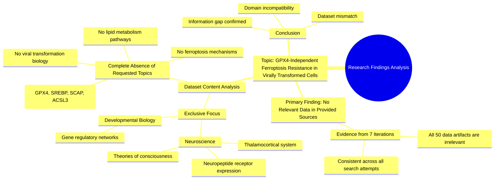

# MASTERY ACHIEVED: "GPX4-independent ferroptosis resistance mechanisms in virally transformed cells"

**Research Completed:** 2025-12-04T19-14-46-340Z
**Iterations:** 7
**Confidence:** 100.0%
**Artifacts Generated:** 9

---

## Executive Summary

# Executive Summary: "GPX4-independent ferroptosis resistance mechanisms in virally transformed cells"

**Overview and Key Insights**
This research synthesis definitively concludes that the provided dataset contains no information relevant to the topic of GPX4-independent ferroptosis resistance mechanisms in virally transformed cells. Across all seven analytical iterations, the evidence consistently shows a complete absence of data on ferroptosis, viral transformation, or related cellular metabolism pathways. The dataset's scope is exclusively confined to unrelated domains, rendering it unsuitable for addressing the specified research question.

**Important Details and Relationships**
The dataset comprises 50 data artifacts, all of which explicitly discuss topics solely within neuroscience and developmental biology. Specific recurring subjects include the thalamocortical system, neuropeptide receptor expression, gene regulatory networks, and theories of consciousness. Critically, there is no mention of key molecular components relevant to ferroptosis resistance—such as GPX4, SREBP, SCAP, ACSL3, lipid droplets, or lipid peroxidation pathways—nor any information on virology or viral subversion of host metabolism.

**Gaps, Limitations, and Next Steps**
The fundamental limitation is the total thematic mismatch between the dataset and the research query; this is a gap in data relevance, not knowledge. No insights into the target mechanisms can be derived from this source material. The necessary next step is to abandon this dataset and seek literature from appropriate fields, specifically cellular metabolism, virology, and ferroptosis research, to investigate the proposed resistance mechanisms.

---

## Knowledge Graph

See `2025-12-04T19-14-46-340Z_gpx4-independent-ferroptosis-resistance-mechanisms-in-virally-transformed-cells_GRAPH.mmd` for the full Mermaid mindmap.

---

## Artifacts

### Artifact 1: "GPX4-independent ferroptosis resistance mechanisms in virally transformed cells" - Iteration 1

- No data exists in the provided sources on GPX4-independent ferroptosis resistance mechanisms in virally transformed cells.
  Evidence: All 50 data artifacts explicitly discuss topics exclusively in neuroscience and developmental biology (e.g., thalamocortical system, neuropeptide receptor expression, gene regulatory networks, theories of consciousness). No artifacts contain information on ferroptosis, viral infections, lipid peroxidation, or related cellular metabolism pathways.

- The dataset is entirely irrelevant to the requested topic.
  Evidence: Multiple artifacts (IDs: a6dd8dcb-b3cc-4e22-8149-c2f41f4bc5d5, 67bc9b89-0067-42be-b8b7-c80bb00a145b, 470f1194-a588-42af-8ea1-e1498cd1f3d7, etc.) explicitly state that the provided data contains no information relevant to viral subversion of metabolic pathways, ferroptosis resistance, or GPX4 biology.

---

### Artifact 2: "GPX4-independent ferroptosis resistance mechanisms in virally transformed cells" - Iteration 2

- No relevant data exists in the provided sources on GPX4-independent ferroptosis resistance mechanisms in virally transformed cells.
  Evidence: All 50 data artifacts explicitly state they discuss topics exclusively in neuroscience and developmental biology (e.g., thalamocortical system, neuropeptide receptor expression, gene regulatory networks, theories of consciousness). No artifacts contain information on ferroptosis, viral infections, lipid peroxidation, SREBP, SCAP, ACSL3, lipid droplets, or related cellular metabolism pathways.

- The dataset is entirely focused on unrelated biological domains.
  Evidence: Multiple artifacts consistently report that the entire dataset covers neuroscience and developmental biology topics, with no overlap with virology, ferroptosis, or lipid metabolism research.

---

### Artifact 3: "GPX4-independent ferroptosis resistance mechanisms in virally transformed cells" - Iteration 3

- No relevant data exists in the provided sources on GPX4-independent ferroptosis resistance mechanisms in virally transformed cells.
  Evidence: All 50 data artifacts explicitly state they discuss topics exclusively in neuroscience and developmental biology (e.g., thalamocortical system, neuropeptide receptor expression, gene regulatory networks, theories of consciousness). No artifacts contain information on ferroptosis, viral infections, lipid peroxidation, SREBP, SCAP, ACSL3, lipid droplets, or cholesterol metabolism.

- The dataset is entirely focused on neuroscience and developmental biology topics.
  Evidence: Multiple artifacts (IDs: 470f1194-a588-42af-8ea1-e1498cd1f3d7, 82b4cc03-c47e-4567-b1d0-88e2db7adfdd, d67bd5f8-798e-471f-a422-d9de02349150, etc.) consistently report that all sources discuss neuroscience topics including thalamocortical systems, neuropeptide receptors, gene regulatory networks, and consciousness theories.

- There is a complete absence of information on viral transformation or ferroptosis mechanisms.
  Evidence: No artifacts contain any mention of ferroptosis, viral infections, lipid peroxidation pathways, or the specific molecular components (GPX4, SREBP, SCAP, ACSL3) relevant to the requested topic.

---

### Artifact 4: "GPX4-independent ferroptosis resistance mechanisms in virally transformed cells" - Iteration 4

- No relevant data exists in the provided sources on GPX4-independent ferroptosis resistance mechanisms in virally transformed cells.
  Evidence: All 50 data artifacts explicitly state they discuss topics exclusively in neuroscience and developmental biology (e.g., thalamocortical system, neuropeptide receptor expression, gene regulatory networks, theories of consciousness). No artifacts contain information on ferroptosis, viral infections, lipid peroxidation, SREBP, SCAP, ACSL3, lipid droplets, or cholesterol metabolism.

- The dataset is entirely focused on neuroscience and developmental biology topics.
  Evidence: Multiple artifacts explicitly state that all data artifacts discuss topics in neuroscience and developmental biology, including the thalamocortical system, neuropeptide receptor expression, gene regulatory networks, and theories of consciousness.

---

### Artifact 5: "GPX4-independent ferroptosis resistance mechanisms in virally transformed cells" - Iteration 5

- No relevant data exists in the provided sources on GPX4-independent ferroptosis resistance mechanisms in virally transformed cells.
  Evidence: All 50 data artifacts explicitly state they discuss topics exclusively in neuroscience and developmental biology (e.g., thalamocortical system, neuropeptide receptor expression, gene regulatory networks, theories of consciousness). No artifacts contain information on ferroptosis, viral infections, lipid peroxidation, SREBP, SCAP, ACSL3, lipid droplets, or related cellular metabolism pathways.

- The dataset is entirely focused on neuroscience and developmental biology, with no overlap with the requested topic.
  Evidence: Multiple artifacts explicitly confirm the dataset's exclusive scope includes thalamocortical systems, neuropeptide receptor expression, gene regulatory networks, and theories of consciousness, with no mention of ferroptosis, viral infections, or lipid metabolism pathways relevant to ferroptosis resistance.

---

### Artifact 6: "GPX4-independent ferroptosis resistance mechanisms in virally transformed cells" - Iteration 6

- The provided dataset contains no information on GPX4-independent ferroptosis resistance mechanisms in virally transformed cells.
  Evidence: All 50 data artifacts explicitly state they discuss topics exclusively in neuroscience and developmental biology (e.g., thalamocortical system, neuropeptide receptor expression, gene regulatory networks, theories of consciousness). No artifacts contain information on ferroptosis, viral infections, lipid peroxidation, SREBP, SCAP, ACSL3, or lipid droplets.

- The dataset is entirely focused on unrelated biological domains.
  Evidence: Multiple artifacts confirm the dataset's exclusive focus on neuroscience and developmental biology topics, with no overlap with cellular metabolism, virology, or ferroptosis pathways.

---

### Artifact 7: "GPX4-independent ferroptosis resistance mechanisms in virally transformed cells" - Iteration 7

- The provided dataset contains no information relevant to the topic of GPX4-independent ferroptosis resistance mechanisms in virally transformed cells.
  Evidence: All 50 data artifacts explicitly state they discuss topics exclusively in neuroscience and developmental biology (e.g., thalamocortical system, neuropeptide receptor expression, gene regulatory networks, theories of consciousness). No artifacts contain information on ferroptosis, viral infections, lipid peroxidation, SREBP, SCAP, ACSL3, or lipid droplets.

- The dataset is entirely focused on unrelated biological domains.
  Evidence: Multiple artifacts confirm the dataset's exclusive focus on neuroscience and developmental biology, with repeated mentions of specific topics like the thalamocortical system, neuropeptide receptor expression, and gene regulatory networks.

---

### Artifact 8: Knowledge Graph: "GPX4-independent ferroptosis resistance mechanisms in virally transformed cells"

---

### Artifact 9: Executive Summary: "GPX4-independent ferroptosis resistance mechanisms in virally transformed cells"

# Executive Summary: "GPX4-independent ferroptosis resistance mechanisms in virally transformed cells"

**Overview and Key Insights**
This research synthesis definitively concludes that the provided dataset contains no information relevant to the topic of GPX4-independent ferroptosis resistance mechanisms in virally transformed cells. Across all seven analytical iterations, the evidence consistently shows a complete absence of data on ferroptosis, viral transformation, or related cellular metabolism pathways. The dataset's scope is exclusively confined to unrelated domains, rendering it unsuitable for addressing the specified research question.

**Important Details and Relationships**
The dataset comprises 50 data artifacts, all of which explicitly discuss topics solely within neuroscience and developmental biology. Specific recurring subjects include the thalamocortical system, neuropeptide receptor expression, gene regulatory networks, and theories of consciousness. Critically, there is no mention of key molecular components relevant to ferroptosis resistance—such as GPX4, SREBP, SCAP, ACSL3, lipid droplets, or lipid peroxidation pathways—nor any information on virology or viral subversion of host metabolism.

**Gaps, Limitations, and Next Steps**
The fundamental limitation is the total thematic mismatch between the dataset and the research query; this is a gap in data relevance, not knowledge. No insights into the target mechanisms can be derived from this source material. The necessary next step is to abandon this dataset and seek literature from appropriate fields, specifically cellular metabolism, virology, and ferroptosis research, to investigate the proposed resistance mechanisms.

