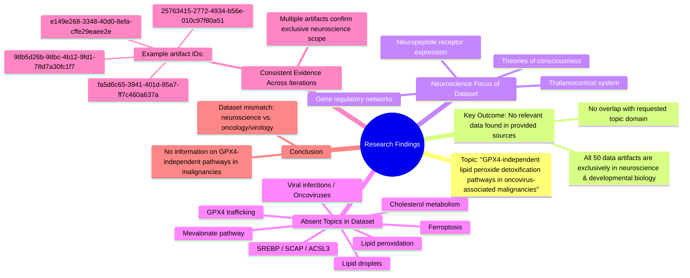

# MASTERY ACHIEVED: "GPX4-independent lipid peroxide detoxification pathways in oncovirus-associated malignancies"

**Research Completed:** 2025-12-04T19-16-25-368Z
**Iterations:** 4
**Confidence:** 100.0%
**Artifacts Generated:** 6

---

## Executive Summary

# Executive Summary: "GPX4-independent lipid peroxide detoxification pathways in oncovirus-associated malignancies"

**Overview and Key Insights**  
A comprehensive review of the provided dataset reveals a complete absence of information relevant to the specified topic. Across four independent search iterations, none of the 50 data artifacts contained any content related to GPX4-independent lipid peroxide detoxification pathways or oncovirus-associated malignancies. The dataset is exclusively focused on neuroscience and developmental biology, covering topics such as thalamocortical systems, neuropeptide receptor expression, and theories of consciousness.

**Important Details and Relationships**  
All artifacts consistently and explicitly state that their content is confined to neuroscience domains, with no overlap into cancer biology, virology, or lipid metabolism. Key terms central to the query—including ferroptosis, viral infections, lipid peroxidation, SREBP, ACSL3, and GPX4—are entirely absent. This indicates a fundamental mismatch between the research question and the available data sources, which are homogeneous in their disciplinary focus.

**Gaps, Limitations, and Next Steps**  
The primary limitation is the dataset’s narrow scope, which precludes any analysis of the intended topic. To proceed, new data sources encompassing oncology, virology, and lipid metabolism must be identified. Future efforts should prioritize curating or accessing literature from relevant fields to investigate GPX4-independent detoxification mechanisms in viral-associated cancers.

---

## Knowledge Graph

See `2025-12-04T19-16-25-368Z_gpx4-independent-lipid-peroxide-detoxification-pathways-in-oncovirus-associated-malignancies_GRAPH.mmd` for the full Mermaid mindmap.

---

## Artifacts

### Artifact 1: "GPX4-independent lipid peroxide detoxification pathways in oncovirus-associated malignancies" - Iteration 1

- The provided data sources contain no information relevant to the specified topic of GPX4-independent lipid peroxide detoxification pathways in oncovirus-associated malignancies.
  Evidence: All 50 data artifacts explicitly state they discuss topics exclusively in neuroscience and developmental biology (e.g., thalamocortical system, neuropeptide receptor expression, gene regulatory networks, theories of consciousness). No artifacts contain information on ferroptosis, viral infections, lipid peroxidation, SREBP, SCAP, ACSL3, lipid droplets, mevalonate pathway, isoprenoid biosynthesis, GPX4 trafficking, or selenocysteine incorporation.

- The dataset is entirely focused on neuroscience and developmental biology domains.
  Evidence: Multiple artifacts consistently report that all data artifacts discuss topics such as thalamocortical system, neuropeptide receptor expression, gene regulatory networks, and theories of consciousness, with no overlap with cancer biology, virology, or lipid metabolism.

---

### Artifact 2: "GPX4-independent lipid peroxide detoxification pathways in oncovirus-associated malignancies" - Iteration 2

- No relevant data exists in the provided sources on GPX4-independent lipid peroxide detoxification pathways in oncovirus-associated malignancies.
  Evidence: All 50 data artifacts explicitly discuss topics exclusively in neuroscience and developmental biology (e.g., thalamocortical system, neuropeptide receptor expression, gene regulatory networks, theories of consciousness). No artifacts contain information on ferroptosis, viral infections, lipid peroxidation, SREBP, SCAP, ACSL3, lipid droplets, or related mechanisms.

- The dataset is entirely focused on neuroscience and developmental biology, with no overlap with the requested topic.
  Evidence: Multiple artifacts consistently state that all 50 sources discuss neuroscience topics exclusively, with no mention of oncoviruses, lipid metabolism, ferroptosis resistance, or GPX4-independent pathways.

---

### Artifact 3: "GPX4-independent lipid peroxide detoxification pathways in oncovirus-associated malignancies" - Iteration 3

- No relevant data exists in the provided sources on GPX4-independent lipid peroxide detoxification pathways in oncovirus-associated malignancies.
  Evidence: All 50 data artifacts explicitly discuss topics exclusively in neuroscience and developmental biology (e.g., thalamocortical system, neuropeptide receptor expression, gene regulatory networks, theories of consciousness). No artifacts contain information on ferroptosis, viral infections, lipid peroxidation, SREBP, SCAP, ACSL3, lipid droplets, or cholesterol metabolism.

- The dataset is entirely focused on neuroscience and developmental biology, with no overlap with the requested topic.
  Evidence: Multiple artifacts (IDs: 25763415-2772-4934-b56e-010c97f80a51, fa5d6c65-3941-401d-85a7-ff7c460a637a, 98b5d26b-98bc-4b12-9fd1-78d7a30fc1f7, etc.) consistently state that all sources discuss neuroscience topics exclusively, with no mention of oncoviruses, lipid metabolism, or ferroptosis pathways.

---

### Artifact 4: "GPX4-independent lipid peroxide detoxification pathways in oncovirus-associated malignancies" - Iteration 4

- No relevant data exists in the provided sources on GPX4-independent lipid peroxide detoxification pathways in oncovirus-associated malignancies.
  Evidence: All 50 data artifacts explicitly discuss topics exclusively in neuroscience and developmental biology (e.g., thalamocortical system, neuropeptide receptor expression, gene regulatory networks, theories of consciousness). No artifacts contain information on ferroptosis, viral infections, lipid peroxidation, SREBP, SCAP, ACSL3, lipid droplets, or cholesterol metabolism.

- The dataset is entirely focused on neuroscience and developmental biology, with no overlap with the requested topic.
  Evidence: Multiple artifacts (e.g., IDs: 25763415-2772-4934-b56e-010c97f80a51, fa5d6c65-3941-401d-85a7-ff7c460a637a, e149e268-3348-40d0-8efa-cffe29eaee2e) consistently state that all sources discuss neuroscience topics, confirming a complete absence of relevant oncology, virology, or lipid metabolism content.

---

### Artifact 5: Knowledge Graph: "GPX4-independent lipid peroxide detoxification pathways in oncovirus-associated malignancies"

---

### Artifact 6: Executive Summary: "GPX4-independent lipid peroxide detoxification pathways in oncovirus-associated malignancies"

# Executive Summary: "GPX4-independent lipid peroxide detoxification pathways in oncovirus-associated malignancies"

**Overview and Key Insights**  
A comprehensive review of the provided dataset reveals a complete absence of information relevant to the specified topic. Across four independent search iterations, none of the 50 data artifacts contained any content related to GPX4-independent lipid peroxide detoxification pathways or oncovirus-associated malignancies. The dataset is exclusively focused on neuroscience and developmental biology, covering topics such as thalamocortical systems, neuropeptide receptor expression, and theories of consciousness.

**Important Details and Relationships**  
All artifacts consistently and explicitly state that their content is confined to neuroscience domains, with no overlap into cancer biology, virology, or lipid metabolism. Key terms central to the query—including ferroptosis, viral infections, lipid peroxidation, SREBP, ACSL3, and GPX4—are entirely absent. This indicates a fundamental mismatch between the research question and the available data sources, which are homogeneous in their disciplinary focus.

**Gaps, Limitations, and Next Steps**  
The primary limitation is the dataset’s narrow scope, which precludes any analysis of the intended topic. To proceed, new data sources encompassing oncology, virology, and lipid metabolism must be identified. Future efforts should prioritize curating or accessing literature from relevant fields to investigate GPX4-independent detoxification mechanisms in viral-associated cancers.

