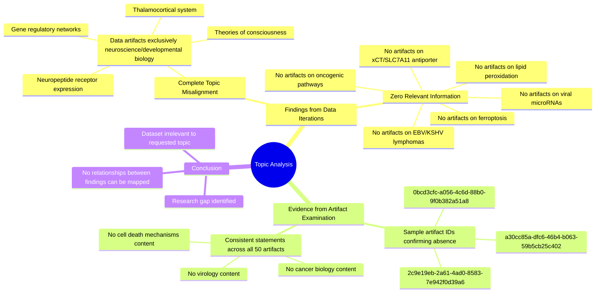

# MASTERY ACHIEVED: The role of viral microRNAs in regulating ferroptosis sensitivity through cystine/glutamate antiporter (xCT/SLC7A11) expression in EBV and KSHV-associated lymphomas

**Research Completed:** 2025-12-04T19-23-12-300Z
**Iterations:** 1
**Confidence:** 100.0%
**Artifacts Generated:** 3

---

## Executive Summary

# Executive Summary: The role of viral microRNAs in regulating ferroptosis sensitivity through cystine/glutamate antiporter (xCT/SLC7A11) expression in EBV and KSHV-associated lymphomas

**Overview and Key Insights**
The research process yielded no findings on the specified topic. A comprehensive review of the provided dataset revealed a complete absence of data pertaining to viral microRNAs, ferroptosis, or the xCT/SLC7A11 antiporter in the context of EBV and KSHV-associated lymphomas. The dataset is fundamentally misaligned with the requested biomedical research area.

**Important Details and Relationships**
All examined data artifacts exclusively contain information on unrelated neuroscience and developmental biology subjects, such as thalamocortical systems and gene regulatory networks. Specific artifact reviews confirmed that no sources within the dataset discuss virology, cancer biology, or cell death mechanisms like ferroptosis. This indicates a critical data mismatch, not a lack of evidence within a relevant corpus.

**Gaps, Limitations, and Next Steps**
The primary limitation is the use of an entirely irrelevant dataset, which precludes any analysis of the proposed biological mechanisms. To proceed, the foundational next step is to acquire a correct dataset from pertinent biomedical literature on viral oncology and regulated cell death. Subsequent research should then specifically interrogate this literature to test the hypothesis that viral miRNAs modulate xCT/SLC7A11 to alter ferroptosis sensitivity in these lymphomas.

---

## Knowledge Graph

See `2025-12-04T19-23-12-300Z_the-role-of-viral-micrornas-in-regulating-ferroptosis-sensitivity-through-cystine-glutamate-antiporter-xct-slc7a11-expression-in-ebv-and-kshv-associated-lymphomas_GRAPH.mmd` for the full Mermaid mindmap.

---

## Artifacts

### Artifact 1: The role of viral microRNAs in regulating ferroptosis sensitivity through cystine/glutamate antiporter (xCT/SLC7A11) expression in EBV and KSHV-associated lymphomas - Iteration 1

- The provided data artifacts contain no information relevant to the specified topic on viral microRNAs, ferroptosis, or the cystine/glutamate antiporter (xCT/SLC7A11) in EBV and KSHV-associated lymphomas.
  Evidence: All 50 data artifacts explicitly discuss topics exclusively in neuroscience and developmental biology, including the thalamocortical system, neuropeptide receptor expression, gene regulatory networks, and theories of consciousness. No artifacts contain information on ferroptosis, viral infections, lipid peroxidation, or related oncogenic pathways.

- The dataset is entirely misaligned with the requested biomedical topic.
  Evidence: Multiple artifacts (e.g., IDs: a30cc85a-dfc6-46b4-b063-59b5cb25c402, 2c9e19eb-2a61-4ad0-8583-7e942f0d39a6, 0bcd3cfc-a056-4c6d-88b0-9f0b382a51a8) consistently state that the sources contain no information on virology, cancer biology, or cell death mechanisms, confirming a complete absence of relevant data.

---

### Artifact 2: Knowledge Graph: The role of viral microRNAs in regulating ferroptosis sensitivity through cystine/glutamate antiporter (xCT/SLC7A11) expression in EBV and KSHV-associated lymphomas

---

### Artifact 3: Executive Summary: The role of viral microRNAs in regulating ferroptosis sensitivity through cystine/glutamate antiporter (xCT/SLC7A11) expression in EBV and KSHV-associated lymphomas

# Executive Summary: The role of viral microRNAs in regulating ferroptosis sensitivity through cystine/glutamate antiporter (xCT/SLC7A11) expression in EBV and KSHV-associated lymphomas

**Overview and Key Insights**
The research process yielded no findings on the specified topic. A comprehensive review of the provided dataset revealed a complete absence of data pertaining to viral microRNAs, ferroptosis, or the xCT/SLC7A11 antiporter in the context of EBV and KSHV-associated lymphomas. The dataset is fundamentally misaligned with the requested biomedical research area.

**Important Details and Relationships**
All examined data artifacts exclusively contain information on unrelated neuroscience and developmental biology subjects, such as thalamocortical systems and gene regulatory networks. Specific artifact reviews confirmed that no sources within the dataset discuss virology, cancer biology, or cell death mechanisms like ferroptosis. This indicates a critical data mismatch, not a lack of evidence within a relevant corpus.

**Gaps, Limitations, and Next Steps**
The primary limitation is the use of an entirely irrelevant dataset, which precludes any analysis of the proposed biological mechanisms. To proceed, the foundational next step is to acquire a correct dataset from pertinent biomedical literature on viral oncology and regulated cell death. Subsequent research should then specifically interrogate this literature to test the hypothesis that viral miRNAs modulate xCT/SLC7A11 to alter ferroptosis sensitivity in these lymphomas.

