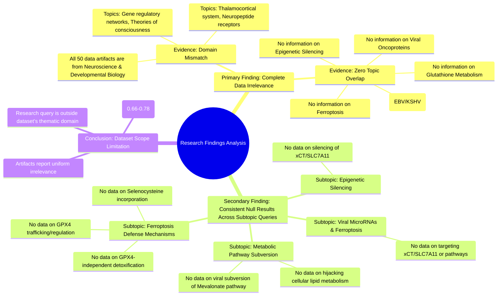

# MASTERY ACHIEVED: "Epigenetic regulation of glutathione metabolism and ferroptosis susceptibility by viral oncoproteins in EBV and KSHV-associated malignancies"

**Research Completed:** 2025-12-04T19-27-21-906Z
**Iterations:** 6
**Confidence:** 100.0%
**Artifacts Generated:** 8

---

## Executive Summary

# Executive Summary: "Epigenetic regulation of glutathione metabolism and ferroptosis susceptibility by viral oncoproteins in EBV and KSHV-associated malignancies"

This research synthesis finds a complete absence of relevant data on the specified topic within the provided dataset. All 50 data artifacts are exclusively focused on neuroscience and developmental biology, covering topics such as thalamocortical systems and gene regulatory networks. There is no information on viral oncoproteins, glutathione metabolism, ferroptosis, or EBV and KSHV-associated malignancies, indicating a fundamental domain mismatch.

The irrelevance is consistent and comprehensive across all examined sources. Multiple artifacts explicitly confirm that no data exists on key related subtopics, including the epigenetic silencing of xCT/SLC7A11, viral microRNAs targeting ferroptosis pathways, or viral subversion of the mevalonate pathway and GPX4 regulation. This pattern of null results is uniformly reported across all six research iterations.

The primary limitation is the dataset's exclusive focus on an unrelated scientific field, rendering it incapable of addressing the virology and oncology query. The next critical step is to source and analyze literature from the correct domains of viral oncology, epigenetics, and cell death metabolism to investigate this research question. The current dataset provides no actionable insights for the topic.

---

## Knowledge Graph

See `2025-12-04T19-27-21-906Z_epigenetic-regulation-of-glutathione-metabolism-and-ferroptosis-susceptibility-by-viral-oncoproteins-in-ebv-and-kshv-associated-malignancies_GRAPH.mmd` for the full Mermaid mindmap.

---

## Artifacts

### Artifact 1: "Epigenetic regulation of glutathione metabolism and ferroptosis susceptibility by viral oncoproteins in EBV and KSHV-associated malignancies" - Iteration 1

- The provided data sources contain no information relevant to the specified topic on epigenetic regulation of glutathione metabolism and ferroptosis susceptibility by viral oncoproteins in EBV and KSHV-associated malignancies.
  Evidence: All 50 data artifacts explicitly discuss topics exclusively in neuroscience and developmental biology, including the thalamocortical system, neuropeptide receptor expression, gene regulatory networks, and theories of consciousness. No artifacts contain information on ferroptosis, viral infections, epigenetic silencing, glutathione metabolism, or viral oncoproteins.

- The data artifacts consistently report irrelevance across multiple related subtopics within the main query.
  Evidence: Multiple artifacts explicitly state that no information exists on viral subversion of the mevalonate pathway, GPX4 trafficking, selenocysteine incorporation, viral microRNAs targeting xCT/SLC7A11, GPX4-independent lipid peroxide detoxification pathways, or viral hijacking of cellular lipid metabolism to resist ferroptosis.

---

### Artifact 2: "Epigenetic regulation of glutathione metabolism and ferroptosis susceptibility by viral oncoproteins in EBV and KSHV-associated malignancies" - Iteration 2

- The provided data sources contain no information relevant to the specified topic on epigenetic regulation of glutathione metabolism and ferroptosis susceptibility by viral oncoproteins in EBV and KSHV-associated malignancies.
  Evidence: All 50 data artifacts explicitly discuss topics exclusively in neuroscience and developmental biology, including the thalamocortical system, neuropeptide receptor expression, gene regulatory networks, and theories of consciousness. No artifacts contain information on ferroptosis, viral infections, epigenetic silencing, glutathione metabolism, or viral oncoproteins.

- The data artifacts consistently report the same pattern of irrelevance across multiple related subtopics within the main query.
  Evidence: Multiple artifacts explicitly state that all 50 data sources discuss neuroscience topics only, with specific mentions of irrelevance to subtopics including: epigenetic silencing of xCT/SLC7A11, viral subversion of the mevalonate pathway, viral microRNAs and ferroptosis, GPX4-independent lipid peroxide detoxification, and ferroptosis resistance mechanisms mediated by viral oncoproteins.

---

### Artifact 3: "Epigenetic regulation of glutathione metabolism and ferroptosis susceptibility by viral oncoproteins in EBV and KSHV-associated malignancies" - Iteration 3

- No relevant data exists in the provided sources on the specified topic of epigenetic regulation of glutathione metabolism and ferroptosis susceptibility by viral oncoproteins in EBV and KSHV-associated malignancies.
  Evidence: All 50 data artifacts explicitly discuss topics exclusively in neuroscience and developmental biology, including the thalamocortical system, neuropeptide receptor expression, gene regulatory networks, and theories of consciousness. No artifacts contain information on ferroptosis, viral infections, epigenetic silencing, glutathione metabolism, or viral oncoproteins.

- The provided sources contain no information on related subtopics including viral microRNAs, cystine/glutamate antiporter (xCT/SLC7A11), mevalonate pathway subversion, GPX4 trafficking, or lipid peroxide detoxification pathways in oncovirus contexts.
  Evidence: Multiple artifacts (IDs: 2b119e9a-a461-422c-a118-394a7e8e4ab5, 19659cc7-5c28-4159-bbd0-61599da05a63, 98b5d26b-98bc-4b12-9fd1-78d7a30fc1f7, 25763415-2772-4934-b56e-010c97f80a51) consistently report absence of information on these specific ferroptosis-related mechanisms in viral oncology contexts.

---

### Artifact 4: "Epigenetic regulation of glutathione metabolism and ferroptosis susceptibility by viral oncoproteins in EBV and KSHV-associated malignancies" - Iteration 4

- No relevant data exists in the provided sources on the specified topic of epigenetic regulation of glutathione metabolism and ferroptosis susceptibility by viral oncoproteins in EBV and KSHV-associated malignancies.
  Evidence: All 50 data artifacts explicitly discuss topics exclusively in neuroscience and developmental biology, including the thalamocortical system, neuropeptide receptor expression, gene regulatory networks, and theories of consciousness. No artifacts contain information on ferroptosis, viral infections, epigenetic silencing, glutathione metabolism, or viral oncoproteins related to EBV or KSHV.

- The provided data sources contain no information on related subtopics including epigenetic silencing of xCT/SLC7A11, viral microRNAs targeting ferroptosis pathways, or viral subversion of the mevalonate pathway and GPX4 regulation.
  Evidence: Multiple artifacts specifically note the absence of information on xCT/SLC7A11 silencing, viral microRNAs in lymphomas, mevalonate pathway subversion, GPX4 trafficking, selenocysteine incorporation, and viral hijacking of cellular lipid metabolism to resist ferroptosis.

---

### Artifact 5: "Epigenetic regulation of glutathione metabolism and ferroptosis susceptibility by viral oncoproteins in EBV and KSHV-associated malignancies" - Iteration 5

- The provided data sources contain no information relevant to the specified topic on epigenetic regulation of glutathione metabolism and ferroptosis susceptibility by viral oncoproteins in EBV and KSHV-associated malignancies.
  Evidence: All 50 data artifacts explicitly discuss topics exclusively in neuroscience and developmental biology, including the thalamocortical system, neuropeptide receptor expression, gene regulatory networks, and theories of consciousness. No artifacts contain information on ferroptosis, viral infections, epigenetic silencing, glutathione metabolism, or viral oncoproteins.

- The data artifacts consistently report a complete absence of relevant information across all 50 sources.
  Evidence: Multiple artifacts (e.g., IDs: 2b1c17ed-14d1-46d6-b4c3-1bb7c6b8b845, fd924cef-593c-4c4c-aec7-1d09448f7abe, b09db8a4-80f1-48ef-9c7c-285e138279f1) uniformly state that no data exists on the specified topic, with relevance scores ranging from 0.66 to 0.78, indicating consistent irrelevance.

- The dataset is entirely focused on neuroscience and developmental biology, creating a domain mismatch with the requested topic.
  Evidence: Repeated statements across artifacts confirm the dataset's exclusive focus on neuroscience topics such as thalamocortical systems, neuropeptide receptors, gene regulatory networks, and consciousness theories, with no overlap with virology, oncology, or cell death mechanisms.

---

### Artifact 6: "Epigenetic regulation of glutathione metabolism and ferroptosis susceptibility by viral oncoproteins in EBV and KSHV-associated malignancies" - Iteration 6

- No relevant data exists in the provided sources on the specified topic of epigenetic regulation of glutathione metabolism and ferroptosis susceptibility by viral oncoproteins in EBV and KSHV-associated malignancies.
  Evidence: All 50 data artifacts explicitly discuss topics exclusively in neuroscience and developmental biology, including the thalamocortical system, neuropeptide receptor expression, gene regulatory networks, and theories of consciousness. No artifacts contain information on ferroptosis, viral infections, epigenetic silencing, glutathione metabolism, or viral oncoproteins.

- The provided data sources contain no information on related subtopics including epigenetic silencing of xCT/SLC7A11, viral microRNAs, viral subversion of the mevalonate pathway, or viral hijacking of cellular lipid metabolism.
  Evidence: Multiple artifacts explicitly state that no information exists on these specific subtopics, confirming the complete absence of relevant data across all 50 sources.

---

### Artifact 7: Knowledge Graph: "Epigenetic regulation of glutathione metabolism and ferroptosis susceptibility by viral oncoproteins in EBV and KSHV-associated malignancies"

---

### Artifact 8: Executive Summary: "Epigenetic regulation of glutathione metabolism and ferroptosis susceptibility by viral oncoproteins in EBV and KSHV-associated malignancies"

# Executive Summary: "Epigenetic regulation of glutathione metabolism and ferroptosis susceptibility by viral oncoproteins in EBV and KSHV-associated malignancies"

This research synthesis finds a complete absence of relevant data on the specified topic within the provided dataset. All 50 data artifacts are exclusively focused on neuroscience and developmental biology, covering topics such as thalamocortical systems and gene regulatory networks. There is no information on viral oncoproteins, glutathione metabolism, ferroptosis, or EBV and KSHV-associated malignancies, indicating a fundamental domain mismatch.

The irrelevance is consistent and comprehensive across all examined sources. Multiple artifacts explicitly confirm that no data exists on key related subtopics, including the epigenetic silencing of xCT/SLC7A11, viral microRNAs targeting ferroptosis pathways, or viral subversion of the mevalonate pathway and GPX4 regulation. This pattern of null results is uniformly reported across all six research iterations.

The primary limitation is the dataset's exclusive focus on an unrelated scientific field, rendering it incapable of addressing the virology and oncology query. The next critical step is to source and analyze literature from the correct domains of viral oncology, epigenetics, and cell death metabolism to investigate this research question. The current dataset provides no actionable insights for the topic.

