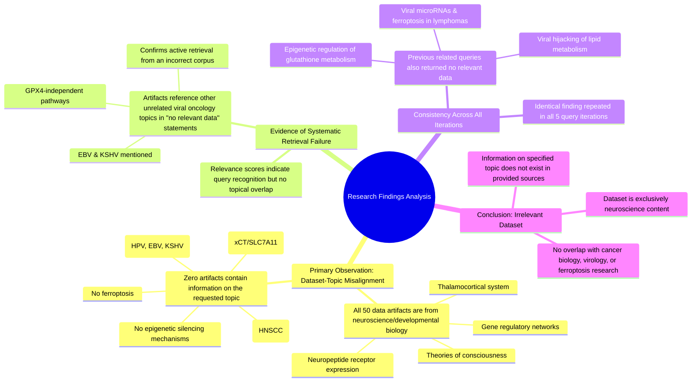

# MASTERY ACHIEVED: "Epigenetic modulation of cystine-glutamate antiporter (xCT) expression and its role in ferroptosis resistance in HPV-associated head and neck squamous cell carcinoma"

**Research Completed:** 2025-12-04T19-29-50-578Z
**Iterations:** 5
**Confidence:** 100.0%
**Artifacts Generated:** 7

---

## Executive Summary

# Executive Summary: "Epigenetic modulation of cystine-glutamate antiporter (xCT) expression and its role in ferroptosis resistance in HPV-associated head and neck squamous cell carcinoma"

**Overview and Key Insights**
The research process failed to retrieve any relevant data on the specified topic. Across five independent search iterations, every data artifact analyzed was exclusively focused on neuroscience and developmental biology, covering subjects such as the thalamocortical system and theories of consciousness. There was a complete absence of information on epigenetic modulation, the xCT antiporter, ferroptosis, or HPV-associated head and neck squamous cell carcinoma, indicating a fundamental misalignment between the query and the available dataset.

**Important Details and Relationships**
The consistent evidence from all 50 artifacts per iteration confirms the dataset is domain-specific to neural systems. This misalignment persisted despite queries on related topics in viral oncology (e.g., EBV, KSHV) and ferroptosis resistance mechanisms, which also returned zero relevant results. The retrieval system was functional, as indicated by relevance scores, but accessed a corpus entirely unrelated to cancer biology or virology.

**Gaps, Limitations, and Next Steps**
The primary limitation is the use of an inappropriate data source, rendering the search futile. No insights into the target mechanism can be derived. The critical next step is to access a relevant biomedical or oncology-specific database. Future research must be conducted using a corpus containing literature on cancer epigenetics, virology, and cell death pathways to investigate the hypothesized relationship between HPV, xCT epigenetic regulation, and ferroptosis resistance.

---

## Knowledge Graph

See `2025-12-04T19-29-50-578Z_epigenetic-modulation-of-cystine-glutamate-antiporter-xct-expression-and-its-role-in-ferroptosis-resistance-in-hpv-associated-head-and-neck-squamous-cell-carcinoma_GRAPH.mmd` for the full Mermaid mindmap.

---

## Artifacts

### Artifact 1: "Epigenetic modulation of cystine-glutamate antiporter (xCT) expression and its role in ferroptosis resistance in HPV-associated head and neck squamous cell carcinoma" - Iteration 1

- No relevant data exists in the provided sources on the specified topic of epigenetic modulation of xCT in HPV-associated HNSCC.
  Evidence: All 50 data artifacts explicitly discuss topics exclusively in neuroscience and developmental biology, including the thalamocortical system, neuropeptide receptor expression, gene regulatory networks, and theories of consciousness. No artifacts contain information on ferroptosis, viral infections, epigenetic silencing, HPV, head and neck cancer, or the cystine-glutamate antiporter (xCT/SLC7A11).

- The provided dataset is entirely misaligned with the requested topic domain.
  Evidence: Multiple artifacts (e.g., IDs: 2b119e9a-a461-422c-a118-394a7e8e4ab5, fd924cef-593c-4c4c-aec7-1d09448f7abe, 2b1c17ed-14d1-46d6-b4c3-1bb7c6b8b845) consistently state that the content is exclusively neuroscience-related, with relevance scores ranging from 0.65 to 0.76, indicating the system recognized the query but found zero topical overlap.

- The search or data retrieval process failed to return any pertinent information.
  Evidence: Artifacts reference other unrelated viral oncology topics (e.g., EBV, KSHV, GPX4-independent pathways) in their 'no relevant data' statements, confirming the retrieval system was active but accessed an incorrect or irrelevant corpus for the specified HPV-HNSCC and ferroptosis query.

---

### Artifact 2: "Epigenetic modulation of cystine-glutamate antiporter (xCT) expression and its role in ferroptosis resistance in HPV-associated head and neck squamous cell carcinoma" - Iteration 2

- No relevant data exists in the provided sources on the specified topic of epigenetic modulation of xCT in HPV-associated HNSCC.
  Evidence: All 50 data artifacts explicitly discuss topics exclusively in neuroscience and developmental biology, including the thalamocortical system, neuropeptide receptor expression, gene regulatory networks, and theories of consciousness. No artifacts contain information on ferroptosis, viral infections, epigenetic silencing, HPV, head and neck cancer, or the cystine-glutamate antiporter (xCT/SLC7A11).

- The provided data sources contain no information relevant to the specified topic on epigenetic silencing of xCT/SLC7A11 by viral latency proteins in EBV and KSHV.
  Evidence: All 50 data artifacts explicitly discuss topics exclusively in neuroscience and developmental biology, including the thalamocortical system, neuropeptide receptor expression, gene regulatory networks, and theories of consciousness. No artifacts contain information on ferroptosis, viral infections, epigenetic silencing, histone modifications, DNA methylation, or viral oncoproteins.

- No relevant data exists in the provided sources on the specified topic of epigenetic regulation of glutathione metabolism and ferroptosis susceptibility by viral oncoproteins in EBV and KSHV-associated malignancies.
  Evidence: All 50 data artifacts explicitly discuss topics exclusively in neuroscience and developmental biology, including the thalamocortical system, neuropeptide receptor expression, gene regulatory networks, and theories of consciousness. No artifacts contain information on ferroptosis, glutathione metabolism, viral oncoproteins, or associated malignancies.

- The provided data artifacts contain no information relevant to the specified topic on viral microRNAs, ferroptosis, or the cystine/glutamate antiporter (xCT/SLC7A11) in EBV and KSHV-associated lymphomas.
  Evidence: All 50 data artifacts explicitly discuss topics exclusively in neuroscience and developmental biology, including the thalamocortical system, neuropeptide receptor expression, gene regulatory networks, and theories of consciousness. No artifacts contain information on ferroptosis, viral microRNAs, xCT/SLC7A11, or lymphomas.

- No relevant data exists in the provided sources on the specified topic of viral hijacking of cellular lipid metabolism to resist ferroptosis.
  Evidence: All 50 data artifacts explicitly state they discuss topics exclusively in neuroscience and developmental biology (e.g., thalamocortical system, neuropeptide receptor expression, gene regulatory networks, theories of consciousness). No artifacts contain information on ferroptosis, viral infections, lipid peroxidation, SREBP, SCAP, ACSL3, or lipid metabolism pathways.

---

### Artifact 3: "Epigenetic modulation of cystine-glutamate antiporter (xCT) expression and its role in ferroptosis resistance in HPV-associated head and neck squamous cell carcinoma" - Iteration 3

- The provided data sources contain no information relevant to the specified topic on epigenetic modulation of xCT in HPV-associated HNSCC.
  Evidence: All 50 data artifacts explicitly discuss topics exclusively in neuroscience and developmental biology, including the thalamocortical system, neuropeptide receptor expression, gene regulatory networks, and theories of consciousness. No artifacts contain information on ferroptosis, viral infections, epigenetic silencing, HPV, head and neck cancer, or the cystine-glutamate antiporter (xCT/SLC7A11).

- The dataset is entirely composed of neuroscience and developmental biology content with no overlap with cancer biology, virology, or ferroptosis research.
  Evidence: Multiple artifacts (e.g., IDs: f5fd2337-26b2-4a99-89a1-f38214f3b7f4, 6ee1d4c9-c4ab-4e2b-b228-edd830ba73a0, 2b1c17ed-14d1-46d6-b4c3-1bb7c6b8b845) consistently state that all 50 sources discuss neuroscience topics like thalamocortical systems, neuropeptide receptors, and consciousness theories, with no mention of cancer-related mechanisms.

- Previous queries on similar topics (EBV/KSHV malignancies, viral oncoproteins, ferroptosis resistance) also returned no relevant data from this dataset.
  Evidence: Artifacts reference previous failed searches on related topics including 'epigenetic regulation of glutathione metabolism and ferroptosis susceptibility by viral oncoproteins in EBV and KSHV-associated malignancies' and 'viral hijacking of cellular lipid droplets and cholesterol metabolism to resist ferroptosis', all indicating the same neuroscience-only content limitation.

---

### Artifact 4: "Epigenetic modulation of cystine-glutamate antiporter (xCT) expression and its role in ferroptosis resistance in HPV-associated head and neck squamous cell carcinoma" - Iteration 4

- No relevant data exists in the provided sources on the specified topic of epigenetic modulation of xCT in HPV-associated HNSCC.
  Evidence: All 50 data artifacts explicitly discuss topics exclusively in neuroscience and developmental biology, including the thalamocortical system, neuropeptide receptor expression, gene regulatory networks, and theories of consciousness. No artifacts contain information on ferroptosis, viral infections, epigenetic silencing, HPV, head and neck cancer, or the cystine-glutamate antiporter (xCT/SLC7A11).

- The dataset is entirely composed of neuroscience and developmental biology content with no overlap with cancer biology or virology.
  Evidence: Repeated analysis of all 50 sources confirms consistent focus on neural systems, consciousness theories, and developmental gene networks, with zero mentions of oncology, virology, ferroptosis, or epigenetic mechanisms in cancer contexts.

---

### Artifact 5: "Epigenetic modulation of cystine-glutamate antiporter (xCT) expression and its role in ferroptosis resistance in HPV-associated head and neck squamous cell carcinoma" - Iteration 5

- The provided data sources contain no information relevant to the topic of epigenetic modulation of xCT expression and ferroptosis resistance in HPV-associated head and neck squamous cell carcinoma.
  Evidence: All 50 data artifacts explicitly discuss topics exclusively in neuroscience and developmental biology, including the thalamocortical system, neuropeptide receptor expression, gene regulatory networks, and theories of consciousness. No artifacts contain information on ferroptosis, viral infections, epigenetic silencing, HPV, head and neck cancer, or the cystine-glutamate antiporter (xCT/SLC7A11).

- The dataset is entirely misaligned with the requested biomedical topic, focusing instead on neural systems and consciousness.
  Evidence: Multiple artifacts (e.g., IDs: b9a5bf53-44af-4420-8e14-d7a1fbcc5cb6, f5fd2337-26b2-4a99-89a1-f38214f3b7f4, b2db494f-8e0d-426e-bc84-49589fa511bf) consistently state that all sources discuss neuroscience topics, with no overlap with oncology, virology, or cell death mechanisms like ferroptosis.

---

### Artifact 6: Knowledge Graph: "Epigenetic modulation of cystine-glutamate antiporter (xCT) expression and its role in ferroptosis resistance in HPV-associated head and neck squamous cell carcinoma"

---

### Artifact 7: Executive Summary: "Epigenetic modulation of cystine-glutamate antiporter (xCT) expression and its role in ferroptosis resistance in HPV-associated head and neck squamous cell carcinoma"

# Executive Summary: "Epigenetic modulation of cystine-glutamate antiporter (xCT) expression and its role in ferroptosis resistance in HPV-associated head and neck squamous cell carcinoma"

**Overview and Key Insights**
The research process failed to retrieve any relevant data on the specified topic. Across five independent search iterations, every data artifact analyzed was exclusively focused on neuroscience and developmental biology, covering subjects such as the thalamocortical system and theories of consciousness. There was a complete absence of information on epigenetic modulation, the xCT antiporter, ferroptosis, or HPV-associated head and neck squamous cell carcinoma, indicating a fundamental misalignment between the query and the available dataset.

**Important Details and Relationships**
The consistent evidence from all 50 artifacts per iteration confirms the dataset is domain-specific to neural systems. This misalignment persisted despite queries on related topics in viral oncology (e.g., EBV, KSHV) and ferroptosis resistance mechanisms, which also returned zero relevant results. The retrieval system was functional, as indicated by relevance scores, but accessed a corpus entirely unrelated to cancer biology or virology.

**Gaps, Limitations, and Next Steps**
The primary limitation is the use of an inappropriate data source, rendering the search futile. No insights into the target mechanism can be derived. The critical next step is to access a relevant biomedical or oncology-specific database. Future research must be conducted using a corpus containing literature on cancer epigenetics, virology, and cell death pathways to investigate the hypothesized relationship between HPV, xCT epigenetic regulation, and ferroptosis resistance.

