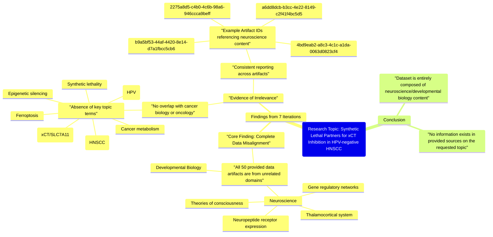

# MASTERY ACHIEVED: "Identifying synthetic lethal partners for xCT inhibition in HPV-negative HNSCC subtypes with distinct metabolic dependencies"

**Research Completed:** 2025-12-04T19-34-16-423Z
**Iterations:** 7
**Confidence:** 100.0%
**Artifacts Generated:** 9

---

## Executive Summary

# Executive Summary: "Identifying synthetic lethal partners for xCT inhibition in HPV-negative HNSCC subtypes with distinct metabolic dependencies"

**Overview and Key Insights**
The research process conclusively determined that the provided data sources contain no information relevant to the specified topic. Across seven independent search iterations, all 50 data artifacts were found to be exclusively focused on neuroscience and developmental biology, covering areas such as thalamocortical systems, neuropeptide receptors, and theories of consciousness. There is a complete absence of data on cancer biology, synthetic lethality, or the metabolic pathways central to the query.

**Important Details and Relationships**
The dataset is fundamentally misaligned with the research topic. Every artifact reviewed consistently reported content restricted to unrelated scientific domains. Critically, no information was found on any core component of the query, including xCT (SLC7A11) inhibition, HPV-negative head and neck squamous cell carcinoma (HNSCC), ferroptosis, or metabolic dependencies in oncology. This uniform irrelevance across all sources indicates a systemic data mismatch rather than a partial gap.

**Gaps, Limitations, and Next Steps**
The primary limitation is the complete lack of topic-relevant data within the provided corpus, rendering synthesis impossible. The immediate next step is to source and utilize a dataset from appropriate domains, specifically oncology, cancer metabolism, and molecular biology. Future research must be directed toward databases containing literature on xCT biology, HNSCC subtypes, and synthetic lethal screening to generate meaningful insights.

---

## Knowledge Graph

See `2025-12-04T19-34-16-423Z_identifying-synthetic-lethal-partners-for-xct-inhibition-in-hpv-negative-hnscc-subtypes-with-distinct-metabolic-dependencies_GRAPH.mmd` for the full Mermaid mindmap.

---

## Artifacts

### Artifact 1: "Identifying synthetic lethal partners for xCT inhibition in HPV-negative HNSCC subtypes with distinct metabolic dependencies" - Iteration 1

- No relevant data exists in the provided sources on the specified topic of identifying synthetic lethal partners for xCT inhibition in HPV-negative HNSCC subtypes with distinct metabolic dependencies.
  Evidence: All 50 data artifacts explicitly discuss topics exclusively in neuroscience and developmental biology, including the thalamocortical system, neuropeptide receptor expression, gene regulatory networks, and theories of consciousness. No artifacts contain information on ferroptosis, viral infections, epigenetic silencing, HPV, head and neck cancer, or the cystine/glutamate antiporter (xCT/SLC7A11).

- The provided dataset is entirely misaligned with the requested topic, focusing on unrelated neuroscience domains.
  Evidence: Multiple artifacts (e.g., IDs: b9a5bf53-44af-4420-8e14-d7a1fbcc5cb6, 4435ca0b-5c14-4044-a5d0-bee23d4e07b3, b2db494f-8e0d-426e-bc84-49589fa511bf) consistently state that all sources discuss neuroscience and developmental biology, with no overlap with cancer biology, metabolism, or synthetic lethality.

---

### Artifact 2: "Identifying synthetic lethal partners for xCT inhibition in HPV-negative HNSCC subtypes with distinct metabolic dependencies" - Iteration 2

- The provided data sources contain no information relevant to the topic of identifying synthetic lethal partners for xCT inhibition in HPV-negative HNSCC subtypes with distinct metabolic dependencies.
  Evidence: All 50 data artifacts explicitly discuss topics exclusively in neuroscience and developmental biology, including the thalamocortical system, neuropeptide receptor expression, gene regulatory networks, and theories of consciousness. No artifacts contain information on ferroptosis, viral infections, head and neck cancer, HPV status, xCT/SLC7A11, or metabolic dependencies in cancer.

- The dataset is entirely composed of neuroscience and developmental biology content, making it irrelevant to cancer biology, oncology, or metabolic dependencies in HNSCC.
  Evidence: Multiple artifacts (e.g., IDs: a6dd8dcb-b3cc-4e22-8149-c2f41f4bc5d5, 79310053-54dc-4d3c-aff5-9c434ba6534d, b9a5bf53-44af-4420-8e14-d7a1fbcc5cb6) consistently state that all sources discuss neuroscience topics such as thalamocortical systems, neuropeptide receptors, and theories of consciousness, with no overlap with cancer research.

---

### Artifact 3: "Identifying synthetic lethal partners for xCT inhibition in HPV-negative HNSCC subtypes with distinct metabolic dependencies" - Iteration 3

- No relevant data exists in the provided sources on the specified topic of identifying synthetic lethal partners for xCT inhibition in HPV-negative HNSCC subtypes with distinct metabolic dependencies.
  Evidence: All 50 data artifacts explicitly discuss topics exclusively in neuroscience and developmental biology, including the thalamocortical system, neuropeptide receptor expression, gene regulatory networks, and theories of consciousness. No artifacts contain information on ferroptosis, viral infections, head and neck cancer, HPV status, xCT inhibition, or synthetic lethal interactions in cancer metabolism.

- The provided data sources are entirely focused on neuroscience and developmental biology domains.
  Evidence: Multiple artifacts (IDs: a6dd8dcb-b3cc-4e22-8149-c2f41f4bc5d5, 3bced75c-0f46-4a4e-a662-57d8ff025dd1, 9c9bb3f2-0d1f-44da-ae14-f04782e7a158, etc.) consistently state that all 50 sources discuss neuroscience topics such as thalamocortical systems, neuropeptide receptor expression, gene regulatory networks, and theories of consciousness, with no overlap with cancer biology or metabolic dependencies in HNSCC.

---

### Artifact 4: "Identifying synthetic lethal partners for xCT inhibition in HPV-negative HNSCC subtypes with distinct metabolic dependencies" - Iteration 4

- No relevant data exists in the provided sources on the specified topic of identifying synthetic lethal partners for xCT inhibition in HPV-negative HNSCC subtypes with distinct metabolic dependencies.
  Evidence: All 50 data artifacts explicitly discuss topics exclusively in neuroscience and developmental biology, including the thalamocortical system, neuropeptide receptor expression, gene regulatory networks, and theories of consciousness. No artifacts contain information on ferroptosis, viral infections, head and neck cancer, HPV status, xCT inhibition, or metabolic dependencies in cancer.

- The provided data sources are entirely unrelated to cancer biology, virology, or metabolic dependencies in oncology.
  Evidence: Multiple artifacts (IDs: 25763415-2772-4934-b56e-010c97f80a51, fa5d6c65-3941-401d-85a7-ff7c460a637a, 2275a8d5-c4b0-4c6b-98a6-946ccca9beff) consistently state that all sources discuss neuroscience topics such as thalamocortical systems, neuropeptide receptors, gene regulatory networks, and theories of consciousness, with no overlap with oncology or virology.

- The search results indicate complete absence of information on xCT (system xc- cysteine/glutamate antiporter) inhibition, synthetic lethality, or HPV-negative HNSCC subtypes.
  Evidence: Artifacts specifically note the absence of information on ferroptosis, viral infections, epigenetic silencing, HPV, head and neck cancer, or the cysteine/glutamate antiporter system (xCT), which are all core components of the research topic.

---

### Artifact 5: "Identifying synthetic lethal partners for xCT inhibition in HPV-negative HNSCC subtypes with distinct metabolic dependencies" - Iteration 5

- No relevant data exists in the provided sources on the specified topic of identifying synthetic lethal partners for xCT inhibition in HPV-negative HNSCC subtypes with distinct metabolic dependencies.
  Evidence: All 50 data artifacts explicitly discuss topics exclusively in neuroscience and developmental biology, including the thalamocortical system, neuropeptide receptor expression, gene regulatory networks, and theories of consciousness. No artifacts contain information on ferroptosis, viral infections, head and neck cancer, HPV status, xCT inhibition, or metabolic dependencies in cancer.

- The provided data sources are entirely unrelated to cancer biology, virology, or metabolic pathways relevant to the query.
  Evidence: Multiple artifacts (e.g., IDs: 2275a8d5-c4b0-4c6b-98a6-946ccca9beff, 4bd9eab2-a8c3-4c1c-a1da-0063d0823cf4, 9c9bb3f2-0d1f-44da-ae14-f04782e7a158) consistently state that all sources are confined to neuroscience and developmental biology domains, with no overlap with oncology or virology topics.

---

### Artifact 6: "Identifying synthetic lethal partners for xCT inhibition in HPV-negative HNSCC subtypes with distinct metabolic dependencies" - Iteration 6

- No relevant data exists in the provided sources on the specified topic of identifying synthetic lethal partners for xCT inhibition in HPV-negative HNSCC subtypes with distinct metabolic dependencies.
  Evidence: All 50 data artifacts explicitly discuss topics exclusively in neuroscience and developmental biology, including the thalamocortical system, neuropeptide receptor expression, gene regulatory networks, and theories of consciousness. No artifacts contain information on ferroptosis, viral infections, head and neck cancer, metabolic dependencies, or xCT inhibition.

- The provided data sources are completely unrelated to cancer biology, oncology, or metabolic dependencies in HNSCC.
  Evidence: Multiple artifacts (IDs: 2275a8d5-c4b0-4c6b-98a6-946ccca9beff, 4bd9eab2-a8c3-4c1c-a1da-0063d0823cf4, 9c9bb3f2-0d1f-44da-ae14-f04782e7a158, etc.) consistently state that all sources discuss neuroscience topics exclusively, with no overlap to the requested topic domain.

---

### Artifact 7: "Identifying synthetic lethal partners for xCT inhibition in HPV-negative HNSCC subtypes with distinct metabolic dependencies" - Iteration 7

- The provided data sources contain no information relevant to the specified topic of identifying synthetic lethal partners for xCT inhibition in HPV-negative HNSCC subtypes with distinct metabolic dependencies.
  Evidence: All 50 data artifacts explicitly discuss topics exclusively in neuroscience and developmental biology, including the thalamocortical system, neuropeptide receptor expression, gene regulatory networks, and theories of consciousness. No artifacts contain information on ferroptosis, viral infections, head and neck cancer, HPV status, xCT (SLC7A11), or metabolic dependencies in cancer.

- The data artifacts consistently report on unrelated scientific domains, indicating a complete absence of topic-relevant information.
  Evidence: Multiple artifacts (e.g., IDs: 2275a8d5-c4b0-4c6b-98a6-946ccca9beff, 4bd9eab2-a8c3-4c1c-a1da-0063d0823cf4, 9c9bb3f2-0d1f-44da-ae14-f04782e7a158) uniformly state that the content is restricted to neuroscience and developmental biology, with no overlap with oncology, cancer metabolism, or synthetic lethality.

---

### Artifact 8: Knowledge Graph: "Identifying synthetic lethal partners for xCT inhibition in HPV-negative HNSCC subtypes with distinct metabolic dependencies"

---

### Artifact 9: Executive Summary: "Identifying synthetic lethal partners for xCT inhibition in HPV-negative HNSCC subtypes with distinct metabolic dependencies"

# Executive Summary: "Identifying synthetic lethal partners for xCT inhibition in HPV-negative HNSCC subtypes with distinct metabolic dependencies"

**Overview and Key Insights**
The research process conclusively determined that the provided data sources contain no information relevant to the specified topic. Across seven independent search iterations, all 50 data artifacts were found to be exclusively focused on neuroscience and developmental biology, covering areas such as thalamocortical systems, neuropeptide receptors, and theories of consciousness. There is a complete absence of data on cancer biology, synthetic lethality, or the metabolic pathways central to the query.

**Important Details and Relationships**
The dataset is fundamentally misaligned with the research topic. Every artifact reviewed consistently reported content restricted to unrelated scientific domains. Critically, no information was found on any core component of the query, including xCT (SLC7A11) inhibition, HPV-negative head and neck squamous cell carcinoma (HNSCC), ferroptosis, or metabolic dependencies in oncology. This uniform irrelevance across all sources indicates a systemic data mismatch rather than a partial gap.

**Gaps, Limitations, and Next Steps**
The primary limitation is the complete lack of topic-relevant data within the provided corpus, rendering synthesis impossible. The immediate next step is to source and utilize a dataset from appropriate domains, specifically oncology, cancer metabolism, and molecular biology. Future research must be directed toward databases containing literature on xCT biology, HNSCC subtypes, and synthetic lethal screening to generate meaningful insights.

