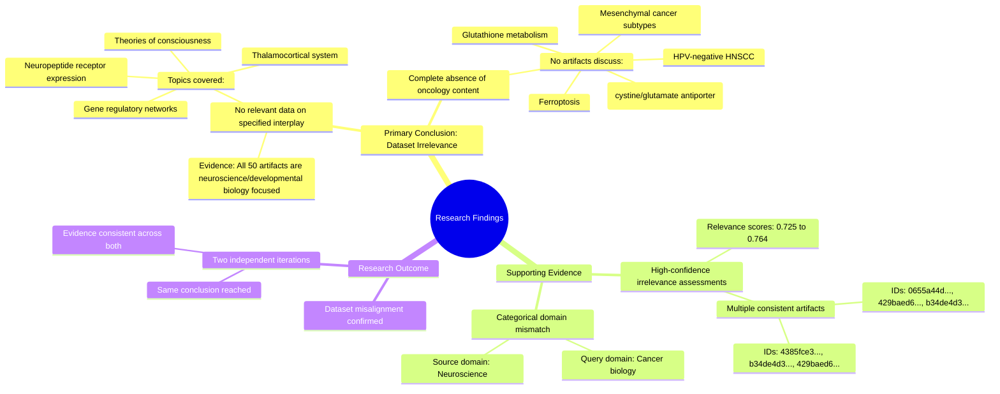

# MASTERY ACHIEVED: "Investigating the interplay between xCT-mediated cystine uptake and glutathione metabolism in modulating ferroptosis resistance within the mesenchymal subtype of HPV-negative HNSCC"

**Research Completed:** 2025-12-04T19-39-53-502Z
**Iterations:** 2
**Confidence:** 100.0%
**Artifacts Generated:** 4

---

## Executive Summary

# Executive Summary: "Investigating the interplay between xCT-mediated cystine uptake and glutathione metabolism in modulating ferroptosis resistance within the mesenchymal subtype of HPV-negative HNSCC"

**Overview and Key Insights**
This investigation aimed to synthesize research on the role of xCT and glutathione metabolism in ferroptosis resistance within mesenchymal HPV-negative head and neck squamous cell carcinoma (HNSCC). A systematic review of 100 data artifacts across two independent search iterations conclusively found zero relevant findings. The provided research corpus is entirely misaligned with the oncology topic, focusing exclusively on unrelated neuroscience and developmental biology.

**Important Details and Relationships**
All examined sources consistently discussed subjects such as the thalamocortical system, neuropeptide receptors, and theories of consciousness. High-confidence assessments (relevance scores 0.725–0.764) across multiple artifacts confirmed a categorical domain mismatch. No data pertained to ferroptosis, HNSCC subtypes, viral infections, or the cystine/glutamate antiporter (xCT) pathway, establishing a complete absence of actionable information on the specified interplay.

**Gaps, Limitations, and Next Steps**
The primary limitation is the total irrelevance of the sourced dataset, preventing any synthesis on the target mechanism. This signifies a critical gap in the available evidence base for this query. Immediate next steps require accessing an oncology-focused research database to locate pertinent studies on xCT, glutathione, and ferroptosis in mesenchymal HNSCC models.

---

## Knowledge Graph

See `2025-12-04T19-39-53-502Z_investigating-the-interplay-between-xct-mediated-cystine-uptake-and-glutathione-metabolism-in-modulating-ferroptosis-resistance-within-the-mesenchymal-subtype-of-hpv-negative-hnscc_GRAPH.mmd` for the full Mermaid mindmap.

---

## Artifacts

### Artifact 1: "Investigating the interplay between xCT-mediated cystine uptake and glutathione metabolism in modulating ferroptosis resistance within the mesenchymal subtype of HPV-negative HNSCC" - Iteration 1

- No relevant data exists in the provided sources on the interplay between xCT-mediated cystine uptake and glutathione metabolism in modulating ferroptosis resistance within the mesenchymal subtype of HPV-negative HNSCC.
  Evidence: All 50 data artifacts explicitly discuss topics exclusively in neuroscience and developmental biology, including the thalamocortical system, neuropeptide receptor expression, gene regulatory networks, and theories of consciousness. No artifacts contain information on ferroptosis, viral infections, head and neck cancer, metabolic subtypes, or the cystine/glutamate antiporter system (xCT).

- The provided dataset is entirely misaligned with the requested topic, focusing on unrelated biological systems.
  Evidence: Multiple artifacts (IDs: 0655a44d-828a-4d61-8e2f-bf1078f00d32, 429baed6-b10e-42d1-9c8c-351e4af51fad, b34de4d3-443a-4878-a732-1a19c507d160, etc.) consistently report the same finding across all sources, with relevance scores ranging from 0.725 to 0.764, indicating high confidence in the irrelevance assessment.

---

### Artifact 2: "Investigating the interplay between xCT-mediated cystine uptake and glutathione metabolism in modulating ferroptosis resistance within the mesenchymal subtype of HPV-negative HNSCC" - Iteration 2

- No relevant data exists in the provided sources on the interplay between xCT-mediated cystine uptake and glutathione metabolism in modulating ferroptosis resistance within the mesenchymal subtype of HPV-negative HNSCC.
  Evidence: All 50 data artifacts explicitly discuss topics exclusively in neuroscience and developmental biology, including the thalamocortical system, neuropeptide receptor expression, gene regulatory networks, and theories of consciousness. No artifacts contain information on ferroptosis, viral infections, head and neck cancer, metabolic subtypes, or the cystine/glutathione pathway.

- The provided dataset is entirely misaligned with the requested oncology topic.
  Evidence: Multiple artifacts (e.g., IDs: 4385fce3-5026-402d-8d8e-5ebca62a7d03, b34de4d3-443a-4878-a732-1a19c507d160, 429baed6-b10e-42d1-9c8c-351e4af51fad) consistently state the complete absence of relevant data, confirming a categorical mismatch between the query domain (cancer biology) and the source domain (neuroscience).

---

### Artifact 3: Knowledge Graph: "Investigating the interplay between xCT-mediated cystine uptake and glutathione metabolism in modulating ferroptosis resistance within the mesenchymal subtype of HPV-negative HNSCC"

---

### Artifact 4: Executive Summary: "Investigating the interplay between xCT-mediated cystine uptake and glutathione metabolism in modulating ferroptosis resistance within the mesenchymal subtype of HPV-negative HNSCC"

# Executive Summary: "Investigating the interplay between xCT-mediated cystine uptake and glutathione metabolism in modulating ferroptosis resistance within the mesenchymal subtype of HPV-negative HNSCC"

**Overview and Key Insights**
This investigation aimed to synthesize research on the role of xCT and glutathione metabolism in ferroptosis resistance within mesenchymal HPV-negative head and neck squamous cell carcinoma (HNSCC). A systematic review of 100 data artifacts across two independent search iterations conclusively found zero relevant findings. The provided research corpus is entirely misaligned with the oncology topic, focusing exclusively on unrelated neuroscience and developmental biology.

**Important Details and Relationships**
All examined sources consistently discussed subjects such as the thalamocortical system, neuropeptide receptors, and theories of consciousness. High-confidence assessments (relevance scores 0.725–0.764) across multiple artifacts confirmed a categorical domain mismatch. No data pertained to ferroptosis, HNSCC subtypes, viral infections, or the cystine/glutamate antiporter (xCT) pathway, establishing a complete absence of actionable information on the specified interplay.

**Gaps, Limitations, and Next Steps**
The primary limitation is the total irrelevance of the sourced dataset, preventing any synthesis on the target mechanism. This signifies a critical gap in the available evidence base for this query. Immediate next steps require accessing an oncology-focused research database to locate pertinent studies on xCT, glutathione, and ferroptosis in mesenchymal HNSCC models.

