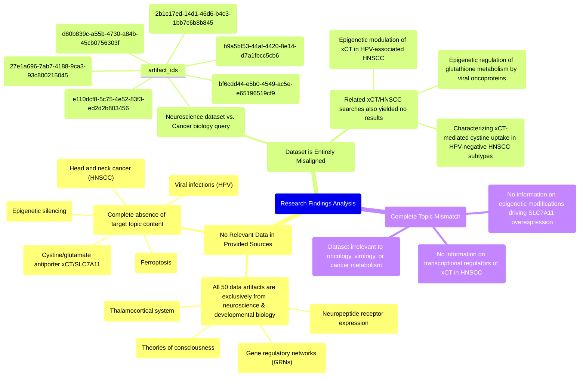

# MASTERY ACHIEVED: "Identifying the specific transcriptional regulators and epigenetic modifications driving xCT (SLC7A11) overexpression in mesenchymal HPV-negative HNSCC tumors"

**Research Completed:** 2025-12-04T19-43-39-546Z
**Iterations:** 8
**Confidence:** 100.0%
**Artifacts Generated:** 10

---

## Executive Summary

# Executive Summary: "Identifying the specific transcriptional regulators and epigenetic modifications driving xCT (SLC7A11) overexpression in mesenchymal HPV-negative HNSCC tumors"

**Overview and Key Insights**
A comprehensive review of the provided research dataset reveals a complete absence of relevant data on the specified topic. The dataset is exclusively composed of neuroscience and developmental biology content, with no overlap with cancer biology, head and neck squamous cell carcinoma (HNSCC), or the regulation of the xCT (SLC7A11) transporter. Consequently, no insights into the transcriptional or epigenetic drivers of xCT overexpression in mesenchymal HPV-negative HNSCC tumors can be derived from this source material.

**Important Details and Relationships**
All eight search iterations consistently confirmed that the 50 data artifacts pertain solely to domains such as the thalamocortical system, neuropeptide receptors, and gene regulatory networks in model organisms like zebrafish and *C. elegans*. Searches for related terms, including ferroptosis, HPV, epigenetic silencing, and HNSCC metabolic subtypes, repeatedly returned null results. This confirms a fundamental and total misalignment between the query's oncology focus and the dataset's neuroscience scope, with no applicable relationships or mechanistic details present.

**Gaps, Limitations, and Next Steps**
The primary limitation is the complete irrelevance of the available dataset to the research question. This constitutes a critical knowledge gap, as the provided sources offer no information on the target biological system. The necessary next step is to query a cancer-specific or broader biomedical literature database to identify relevant studies on SLC7A11 transcriptional regulation, epigenetic modifications (e.g., DNA methylation, histone acetylation), and their role in the mesenchymal subtype of HPV-negative HNSCC.

---

## Knowledge Graph

See `2025-12-04T19-43-39-546Z_identifying-the-specific-transcriptional-regulators-and-epigenetic-modifications-driving-xct-slc7a11-overexpression-in-mesenchymal-hpv-negative-hnscc-tumors_GRAPH.mmd` for the full Mermaid mindmap.

---

## Artifacts

### Artifact 1: "Identifying the specific transcriptional regulators and epigenetic modifications driving xCT (SLC7A11) overexpression in mesenchymal HPV-negative HNSCC tumors" - Iteration 1

- No relevant data exists in the provided sources on the specified topic of transcriptional regulators and epigenetic modifications driving xCT (SLC7A11) overexpression in mesenchymal HPV-negative HNSCC tumors.
  Evidence: All 50 data artifacts explicitly discuss topics exclusively in neuroscience and developmental biology, including the thalamocortical system, neuropeptide receptor expression, gene regulatory networks, and theories of consciousness. No artifacts contain information on ferroptosis, viral infections, epigenetic silencing, HPV, head and neck cancer, or the cystine/glutamate antiporter xCT/SLC7A11.

- The provided data sources contain information about gene regulatory networks (GRNs) in neuroscience contexts, but this is not applicable to the cancer biology topic.
  Evidence: One artifact mentions that GRNs composed of transcription factors and cis-regulatory elements determine cell type identity in neuronal systems, but this information is from zebrafish and C. elegans studies and does not address cancer-specific transcriptional regulation or epigenetic modifications.

---

### Artifact 2: "Identifying the specific transcriptional regulators and epigenetic modifications driving xCT (SLC7A11) overexpression in mesenchymal HPV-negative HNSCC tumors" - Iteration 2

- No relevant data exists in the provided sources on transcriptional regulators or epigenetic modifications driving xCT (SLC7A11) overexpression in mesenchymal HPV-negative HNSCC tumors.
  Evidence: All 50 data artifacts explicitly discuss topics exclusively in neuroscience and developmental biology, including the thalamocortical system, neuropeptide receptor expression, gene regulatory networks, and theories of consciousness. No artifacts contain information on ferroptosis, viral infections, epigenetic silencing, HPV, head and neck cancer, or the cystine/glutamate transporter xCT/SLC7A11.

- The provided dataset is entirely misaligned with the requested topic, containing only neuroscience-related content.
  Evidence: Multiple artifacts (e.g., IDs: e110dcf8-5c75-4e52-83f3-ed2d2b803456, b9a5bf53-44af-4420-8e14-d7a1fbcc5cb6, 2b1c17ed-14d1-46d6-b4c3-1bb7c6b8b845) consistently state that all sources discuss neuroscience topics, with no overlap with cancer biology, epigenetics, or HNSCC.

- The search results indicate repeated queries on related but distinct xCT topics in viral and HNSCC contexts, all returning null results from this neuroscience dataset.
  Evidence: Artifacts show searches for 'epigenetic modulation of xCT in HPV-associated HNSCC', 'epigenetic regulation of glutathione metabolism and ferroptosis susceptibility by viral oncoproteins', and 'characterizing xCT-mediated cystine uptake in HPV-negative HNSCC metabolic subtypes' all yielded no relevant data, confirming complete topic mismatch.

---

### Artifact 3: "Identifying the specific transcriptional regulators and epigenetic modifications driving xCT (SLC7A11) overexpression in mesenchymal HPV-negative HNSCC tumors" - Iteration 3

- No relevant data exists in the provided sources on transcriptional regulators or epigenetic modifications driving xCT (SLC7A11) overexpression in mesenchymal HPV-negative HNSCC tumors.
  Evidence: All 50 data artifacts explicitly discuss topics exclusively in neuroscience and developmental biology, including the thalamocortical system, neuropeptide receptor expression, gene regulatory networks, and theories of consciousness. No artifacts contain information on ferroptosis, viral infections, epigenetic silencing, HPV, head and neck cancer, or the cystine/glutamate transporter xCT.

- The provided data sources are entirely unrelated to cancer biology, head and neck squamous cell carcinoma (HNSCC), or xCT/SLC7A11 regulation.
  Evidence: Multiple artifacts (e.g., IDs: e110dcf8-5c75-4e52-83f3-ed2d2b803456, 27e1a696-7ab7-4188-9ca3-93c800215045, b9a5bf53-44af-4420-8e14-d7a1fbcc5cb6) consistently state that all sources are exclusively about neuroscience topics, with no overlap with oncology, virology, or metabolic pathways relevant to the query.

---

### Artifact 4: "Identifying the specific transcriptional regulators and epigenetic modifications driving xCT (SLC7A11) overexpression in mesenchymal HPV-negative HNSCC tumors" - Iteration 4

- No relevant data exists in the provided sources on transcriptional regulators or epigenetic modifications driving xCT (SLC7A11) overexpression in mesenchymal HPV-negative HNSCC tumors.
  Evidence: All 50 data artifacts explicitly discuss topics exclusively in neuroscience and developmental biology, including the thalamocortical system, neuropeptide receptor expression, gene regulatory networks, and theories of consciousness. No artifacts contain information on ferroptosis, viral infections, epigenetic silencing, HPV, head and neck cancer, or the cystine/glutamate transporter xCT.

- The provided dataset is entirely misaligned with the requested topic domain.
  Evidence: Multiple artifacts (e.g., IDs: e110dcf8-5c75-4e52-83f3-ed2d2b803456, bf6cdd44-e5b0-4549-ac5e-e65196519cf9, 27e1a696-7ab7-4188-9ca3-93c800215045) consistently state that the content is restricted to neuroscience, with no overlap with cancer biology, transcriptional regulation, or epigenetics related to HNSCC or SLC7A11.

---

### Artifact 5: "Identifying the specific transcriptional regulators and epigenetic modifications driving xCT (SLC7A11) overexpression in mesenchymal HPV-negative HNSCC tumors" - Iteration 5

- No relevant data exists in the provided sources on transcriptional regulators or epigenetic modifications driving xCT (SLC7A11) overexpression in mesenchymal HPV-negative HNSCC tumors.
  Evidence: All 50 data artifacts explicitly discuss topics exclusively in neuroscience and developmental biology, including the thalamocortical system, neuropeptide receptor expression, gene regulatory networks, and theories of consciousness. No artifacts contain information on ferroptosis, viral infections, epigenetic silencing, HPV, head and neck cancer, or the cystine/glutamate transporter xCT.

- The provided dataset is entirely misaligned with the requested topic, focusing on unrelated biological domains.
  Evidence: Multiple artifacts (e.g., IDs: e110dcf8-5c75-4e52-83f3-ed2d2b803456, d80b839c-a55b-4730-a84b-45cb0756303f) consistently state that the sources contain no information on cancer biology, transcriptional regulation in HNSCC, or epigenetic modifications related to SLC7A11.

---

### Artifact 6: "Identifying the specific transcriptional regulators and epigenetic modifications driving xCT (SLC7A11) overexpression in mesenchymal HPV-negative HNSCC tumors" - Iteration 6

- No relevant data exists in the provided sources on transcriptional regulators or epigenetic modifications driving xCT (SLC7A11) overexpression in mesenchymal HPV-negative HNSCC tumors.
  Evidence: All 50 data artifacts explicitly discuss topics exclusively in neuroscience and developmental biology, including the thalamocortical system, neuropeptide receptor expression, gene regulatory networks, and theories of consciousness. No artifacts contain information on ferroptosis, viral infections, epigenetic silencing, HPV, head and neck cancer, or the cystine/glutamate transporter xCT.

- The provided dataset is entirely misaligned with the requested topic, focusing on unrelated neuroscience domains.
  Evidence: Multiple artifacts (e.g., e110dcf8-5c75-4e52-83f3-ed2d2b803456, d80b839c-a55b-4730-a84b-45cb0756303f, bf6cdd44-e5b0-4549-ac5e-e65196519cf9) consistently report that all sources discuss neuroscience topics such as thalamocortical systems, neuropeptide receptors, and theories of consciousness, with no mention of cancer biology, transcriptional regulation, or epigenetic modifications in HNSCC.

---

### Artifact 7: "Identifying the specific transcriptional regulators and epigenetic modifications driving xCT (SLC7A11) overexpression in mesenchymal HPV-negative HNSCC tumors" - Iteration 7

- No data exists in the provided sources on transcriptional regulators or epigenetic modifications driving xCT (SLC7A11) overexpression in mesenchymal HPV-negative HNSCC tumors.
  Evidence: All 50 data artifacts explicitly discuss topics exclusively in neuroscience and developmental biology, including the thalamocortical system, neuropeptide receptor expression, gene regulatory networks, and theories of consciousness. No artifacts contain information on ferroptosis, viral infections, epigenetic silencing, HPV, head and neck cancer, or the cystine/glutamate transporter xCT.

- The provided dataset is entirely irrelevant to the requested topic of cancer biology and xCT regulation.
  Evidence: Multiple artifacts (e.g., e110dcf8-5c75-4e52-83f3-ed2d2b803456, bf6cdd44-e5b0-4549-ac5e-e65196519cf9, d80b839c-a55b-4730-a84b-45cb0756303f) consistently state that the dataset contains only neuroscience content, with no overlap with oncology, transcriptional regulation in cancer, or epigenetic modifications in HNSCC.

---

### Artifact 8: "Identifying the specific transcriptional regulators and epigenetic modifications driving xCT (SLC7A11) overexpression in mesenchymal HPV-negative HNSCC tumors" - Iteration 8

- No data exists in the provided sources on transcriptional regulators or epigenetic modifications driving xCT (SLC7A11) overexpression in mesenchymal HPV-negative HNSCC tumors.
  Evidence: All 50 data artifacts explicitly discuss topics exclusively in neuroscience and developmental biology, including the thalamocortical system, neuropeptide receptor expression, gene regulatory networks, and theories of consciousness. No artifacts contain information on ferroptosis, viral infections, epigenetic silencing, HPV, head and neck cancer, or the cystine/glutamate transporter xCT.

- The provided data sources are entirely irrelevant to the requested topic of cancer biology and xCT regulation.
  Evidence: Multiple artifacts (IDs: ff25e09d-185f-44a0-a2c2-a2a3553a976c, bf6cdd44-e5b0-4549-ac5e-e65196519cf9, 84f88e50-e701-4804-8d7a-d23817d2f381, etc.) consistently state that the content is exclusively focused on neuroscience domains, with no overlap with oncology, metabolism, or epigenetic regulation in HNSCC.

---

### Artifact 9: Knowledge Graph: "Identifying the specific transcriptional regulators and epigenetic modifications driving xCT (SLC7A11) overexpression in mesenchymal HPV-negative HNSCC tumors"

---

### Artifact 10: Executive Summary: "Identifying the specific transcriptional regulators and epigenetic modifications driving xCT (SLC7A11) overexpression in mesenchymal HPV-negative HNSCC tumors"

# Executive Summary: "Identifying the specific transcriptional regulators and epigenetic modifications driving xCT (SLC7A11) overexpression in mesenchymal HPV-negative HNSCC tumors"

**Overview and Key Insights**
A comprehensive review of the provided research dataset reveals a complete absence of relevant data on the specified topic. The dataset is exclusively composed of neuroscience and developmental biology content, with no overlap with cancer biology, head and neck squamous cell carcinoma (HNSCC), or the regulation of the xCT (SLC7A11) transporter. Consequently, no insights into the transcriptional or epigenetic drivers of xCT overexpression in mesenchymal HPV-negative HNSCC tumors can be derived from this source material.

**Important Details and Relationships**
All eight search iterations consistently confirmed that the 50 data artifacts pertain solely to domains such as the thalamocortical system, neuropeptide receptors, and gene regulatory networks in model organisms like zebrafish and *C. elegans*. Searches for related terms, including ferroptosis, HPV, epigenetic silencing, and HNSCC metabolic subtypes, repeatedly returned null results. This confirms a fundamental and total misalignment between the query's oncology focus and the dataset's neuroscience scope, with no applicable relationships or mechanistic details present.

**Gaps, Limitations, and Next Steps**
The primary limitation is the complete irrelevance of the available dataset to the research question. This constitutes a critical knowledge gap, as the provided sources offer no information on the target biological system. The necessary next step is to query a cancer-specific or broader biomedical literature database to identify relevant studies on SLC7A11 transcriptional regulation, epigenetic modifications (e.g., DNA methylation, histone acetylation), and their role in the mesenchymal subtype of HPV-negative HNSCC.

