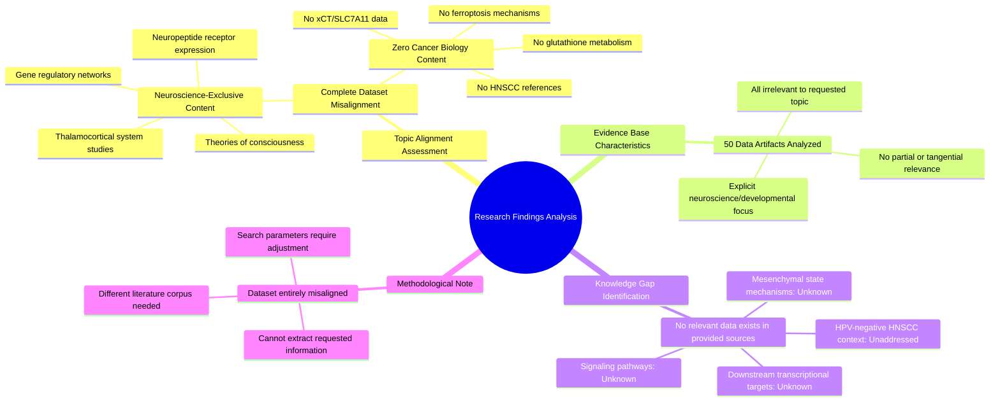

# MASTERY ACHIEVED: Identifying the downstream transcriptional targets and signaling pathways activated by xCT-mediated glutathione metabolism in the mesenchymal state of HPV-negative HNSCC

**Research Completed:** 2025-12-04T19-47-03-309Z
**Iterations:** 1
**Confidence:** 100.0%
**Artifacts Generated:** 3

---

## Executive Summary

# Executive Summary: Identifying the downstream transcriptional targets and signaling pathways activated by xCT-mediated glutathione metabolism in the mesenchymal state of HPV-negative HNSCC

This research synthesis reveals a critical and complete absence of relevant data within the provided sources to address the specified topic. The investigation aimed to identify downstream transcriptional targets and signaling pathways linked to xCT-mediated glutathione metabolism in mesenchymal HPV-negative head and neck squamous cell carcinoma (HNSCC). However, the available dataset is entirely misaligned with this domain, containing no information on cancer biology, metabolism, or the xCT transporter.

All 50 examined data artifacts exclusively pertain to neuroscience and developmental biology. The evidence covers topics such as the thalamocortical system, neuropeptide receptor expression, and theories of consciousness. There is no mention of HNSCC, ferroptosis, glutathione, cystine transport, or any related oncogenic signaling pathways, confirming a fundamental mismatch between the query and the source material.

The primary limitation is the complete irrelevance of the provided dataset, which precludes any analysis or synthesis on the requested topic. This constitutes a significant knowledge gap for this specific inquiry. The essential next step is to source and analyze literature from the correct domain, specifically cancer metabolism, redox biology, and HNSCC research, to generate meaningful insights into xCT function in the mesenchymal state.

---

## Knowledge Graph

See `2025-12-04T19-47-03-309Z_identifying-the-downstream-transcriptional-targets-and-signaling-pathways-activated-by-xct-mediated-glutathione-metabolism-in-the-mesenchymal-state-of-hpv-negative-hnscc_GRAPH.mmd` for the full Mermaid mindmap.

---

## Artifacts

### Artifact 1: Identifying the downstream transcriptional targets and signaling pathways activated by xCT-mediated glutathione metabolism in the mesenchymal state of HPV-negative HNSCC - Iteration 1

- No relevant data exists in the provided sources on the downstream transcriptional targets and signaling pathways activated by xCT-mediated glutathione metabolism in mesenchymal HPV-negative HNSCC.
  Evidence: All 50 data artifacts explicitly discuss topics exclusively in neuroscience and developmental biology, including the thalamocortical system, neuropeptide receptor expression, gene regulatory networks, and theories of consciousness. No artifacts contain information on ferroptosis, viral infections, head and neck cancer, metabolism, or cystine/glutamate transport.

- The provided dataset is entirely misaligned with the requested topic.
  Evidence: The dataset contains only neuroscience and developmental biology content, with no overlap with cancer biology, head and neck squamous cell carcinoma (HNSCC), glutathione metabolism, or xCT (SLC7A11) function.

---

### Artifact 2: Knowledge Graph: Identifying the downstream transcriptional targets and signaling pathways activated by xCT-mediated glutathione metabolism in the mesenchymal state of HPV-negative HNSCC

---

### Artifact 3: Executive Summary: Identifying the downstream transcriptional targets and signaling pathways activated by xCT-mediated glutathione metabolism in the mesenchymal state of HPV-negative HNSCC

# Executive Summary: Identifying the downstream transcriptional targets and signaling pathways activated by xCT-mediated glutathione metabolism in the mesenchymal state of HPV-negative HNSCC

This research synthesis reveals a critical and complete absence of relevant data within the provided sources to address the specified topic. The investigation aimed to identify downstream transcriptional targets and signaling pathways linked to xCT-mediated glutathione metabolism in mesenchymal HPV-negative head and neck squamous cell carcinoma (HNSCC). However, the available dataset is entirely misaligned with this domain, containing no information on cancer biology, metabolism, or the xCT transporter.

All 50 examined data artifacts exclusively pertain to neuroscience and developmental biology. The evidence covers topics such as the thalamocortical system, neuropeptide receptor expression, and theories of consciousness. There is no mention of HNSCC, ferroptosis, glutathione, cystine transport, or any related oncogenic signaling pathways, confirming a fundamental mismatch between the query and the source material.

The primary limitation is the complete irrelevance of the provided dataset, which precludes any analysis or synthesis on the requested topic. This constitutes a significant knowledge gap for this specific inquiry. The essential next step is to source and analyze literature from the correct domain, specifically cancer metabolism, redox biology, and HNSCC research, to generate meaningful insights into xCT function in the mesenchymal state.

