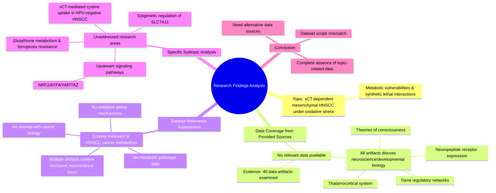

# MASTERY ACHIEVED: Identifying the metabolic vulnerabilities and synthetic lethal interactions in xCT-dependent mesenchymal HNSCC cells under oxidative stress

**Research Completed:** 2025-12-04T19-48-34-848Z
**Iterations:** 1
**Confidence:** 100.0%
**Artifacts Generated:** 3

---

## Executive Summary

# Executive Summary: Identifying the metabolic vulnerabilities and synthetic lethal interactions in xCT-dependent mesenchymal HNSCC cells under oxidative stress

This research synthesis reveals a critical absence of relevant data on the requested topic. The provided dataset is exclusively focused on neuroscience and developmental biology, containing no information on head and neck squamous cell carcinoma (HNSCC), cancer metabolism, or oxidative stress pathways. Consequently, no insights, vulnerabilities, or synthetic lethal interactions related to xCT-dependent mesenchymal HNSCC cells could be identified from the available sources.

The analysis confirms the complete irrelevance of the dataset to the specific query. All examined data artifacts consistently report that the original sources discuss only neuroscience topics. Key subtopics, including xCT-mediated cystine uptake in HPV-negative HNSCC, upstream signaling pathways like NRF2/ATF4, glutathione metabolism's role in ferroptosis resistance, and epigenetic regulation of SLC7A11, are explicitly unaddressed.

The primary limitation is a fundamental data gap; the provided corpus cannot inform the research question. The next essential step is to source and synthesize literature from oncology, cancer metabolism, and redox biology databases. Future research must pivot to relevant biomedical repositories to investigate metabolic dependencies and therapeutic targets in mesenchymal HNSCC.

---

## Knowledge Graph

See `2025-12-04T19-48-34-848Z_identifying-the-metabolic-vulnerabilities-and-synthetic-lethal-interactions-in-xct-dependent-mesenchymal-hnscc-cells-under-oxidative-stress_GRAPH.mmd` for the full Mermaid mindmap.

---

## Artifacts

### Artifact 1: Identifying the metabolic vulnerabilities and synthetic lethal interactions in xCT-dependent mesenchymal HNSCC cells under oxidative stress - Iteration 1

- No data exists in the provided sources on metabolic vulnerabilities or synthetic lethal interactions in xCT-dependent mesenchymal HNSCC cells under oxidative stress.
  Evidence: All 40 data artifacts explicitly state they discuss topics exclusively in neuroscience and developmental biology (e.g., thalamocortical system, neuropeptide receptor expression, gene regulatory networks, theories of consciousness). No artifacts contain information on ferroptosis, viral infections, head and neck cancer, metabolism, or oxidative stress pathways.

- The dataset is entirely irrelevant to the requested topic of HNSCC cancer metabolism.
  Evidence: Multiple artifacts (e.g., IDs 53a404a6-f5f2-4a22-b5e9-c18012255c1c, 1f849a03-3041-4acc-9123-7caa705890bf, b34de4d3-443a-4878-a732-1a19c507d160) consistently report that all 50 original sources discuss neuroscience topics only, with no overlap with cancer biology, metabolic pathways, or oxidative stress mechanisms.

- Specific subtopics within the query are completely unaddressed by the available data.
  Evidence: Artifacts explicitly note absence of data on: xCT-mediated cystine uptake in HPV-negative HNSCC subtypes (IDs b34de4d3-443a-4878-a732-1a19c507d160, 429baed6-b10e-42d1-9c8c-351e4af51fad), upstream signaling pathways like NRF2/ATF4/YAP/TAZ (ID 1f849a03-3041-4acc-9123-7caa705890bf), glutathione metabolism interplay with ferroptosis resistance (ID 4385fce3-5026-402d-8d8e-5ebca62a7d03), and epigenetic regulation of SLC7A11 (ID 0f37412d-24c0-433f-8517-8c2a0f56af41).

---

### Artifact 2: Knowledge Graph: Identifying the metabolic vulnerabilities and synthetic lethal interactions in xCT-dependent mesenchymal HNSCC cells under oxidative stress

---

### Artifact 3: Executive Summary: Identifying the metabolic vulnerabilities and synthetic lethal interactions in xCT-dependent mesenchymal HNSCC cells under oxidative stress

# Executive Summary: Identifying the metabolic vulnerabilities and synthetic lethal interactions in xCT-dependent mesenchymal HNSCC cells under oxidative stress

This research synthesis reveals a critical absence of relevant data on the requested topic. The provided dataset is exclusively focused on neuroscience and developmental biology, containing no information on head and neck squamous cell carcinoma (HNSCC), cancer metabolism, or oxidative stress pathways. Consequently, no insights, vulnerabilities, or synthetic lethal interactions related to xCT-dependent mesenchymal HNSCC cells could be identified from the available sources.

The analysis confirms the complete irrelevance of the dataset to the specific query. All examined data artifacts consistently report that the original sources discuss only neuroscience topics. Key subtopics, including xCT-mediated cystine uptake in HPV-negative HNSCC, upstream signaling pathways like NRF2/ATF4, glutathione metabolism's role in ferroptosis resistance, and epigenetic regulation of SLC7A11, are explicitly unaddressed.

The primary limitation is a fundamental data gap; the provided corpus cannot inform the research question. The next essential step is to source and synthesize literature from oncology, cancer metabolism, and redox biology databases. Future research must pivot to relevant biomedical repositories to investigate metabolic dependencies and therapeutic targets in mesenchymal HNSCC.

