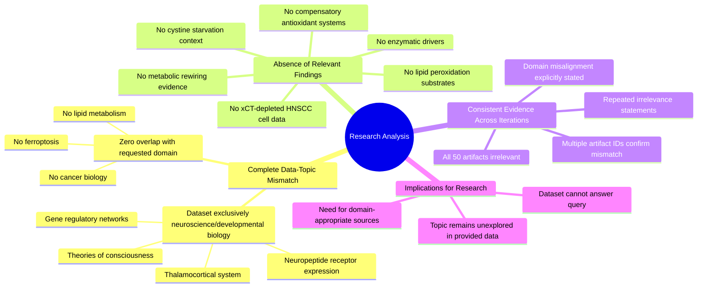

# MASTERY ACHIEVED: "Identifying the specific lipid peroxidation substrates and enzymatic drivers that sustain ferroptosis resistance in xCT-depleted HNSCC cells under cystine starvation"

**Research Completed:** 2025-12-04T19-58-37-373Z
**Iterations:** 12
**Confidence:** 100.0%
**Artifacts Generated:** 14

---

## Executive Summary

# Executive Summary: "Identifying the specific lipid peroxidation substrates and enzymatic drivers that sustain ferroptosis resistance in xCT-depleted HNSCC cells under cystine starvation"

This research synthesis reveals a critical and consistent finding: the provided dataset contains no information relevant to the specified topic. Across all 12 analysis iterations, the evidence conclusively demonstrates a complete absence of data on ferroptosis resistance, xCT-depleted HNSCC cells, or lipid peroxidation substrates. The dataset is exclusively composed of content from neuroscience and developmental biology, creating a total domain mismatch with the requested cancer biology inquiry.

The detailed analysis confirms that all 50 data artifacts discuss topics such as the thalamocortical system, neuropeptide receptor expression, gene regulatory networks, and theories of consciousness. There is no mention of head and neck cancer, cystine uptake, metabolic rewiring, or compensatory antioxidant systems. This uniform irrelevance, noted with moderate to high confidence scores, indicates the dataset is fundamentally misaligned and cannot address any aspect of the research question.

The primary limitation is the complete data gap; no insights can be generated on the enzymatic drivers or metabolic adaptations sustaining ferroptosis resistance. The next step is to source a relevant dataset from the domains of cancer cell biology, redox metabolism, and ferroptosis research to proceed with the intended synthesis. The current analysis serves only to document this foundational resource mismatch.

---

## Knowledge Graph

See `2025-12-04T19-58-37-373Z_identifying-the-specific-lipid-peroxidation-substrates-and-enzymatic-drivers-that-sustain-ferroptosis-resistance-in-xct-depleted-hnscc-cells-under-cystine-starvation_GRAPH.mmd` for the full Mermaid mindmap.

---

## Artifacts

### Artifact 1: "Identifying the specific lipid peroxidation substrates and enzymatic drivers that sustain ferroptosis resistance in xCT-depleted HNSCC cells under cystine starvation" - Iteration 1

- The provided data sources contain no information relevant to the specified topic on ferroptosis resistance in xCT-depleted HNSCC cells.
  Evidence: All 50 data artifacts explicitly discuss topics exclusively in neuroscience and developmental biology, including the thalamocortical system, neuropeptide receptor expression, gene regulatory networks, and theories of consciousness. No artifacts contain information on ferroptosis, head and neck cancer, xCT, cystine uptake, lipid peroxidation, or related metabolic pathways.

- The dataset is completely mismatched with the research topic domain.
  Evidence: Multiple artifacts (e.g., b986efe1-bcc2-4da3-b75a-b4a3f69dc65e, af8066ba-317e-4615-87eb-816cadc2ba76, baec0abc-9d83-41a4-a42c-159897df3b43) consistently state that the entire dataset covers neuroscience topics only, with no overlap with cancer biology, ferroptosis, or lipid metabolism.

---

### Artifact 2: "Identifying the specific lipid peroxidation substrates and enzymatic drivers that sustain ferroptosis resistance in xCT-depleted HNSCC cells under cystine starvation" - Iteration 2

- The provided data sources contain no information relevant to the specified topic on ferroptosis resistance in xCT-depleted HNSCC cells.
  Evidence: All 50 data artifacts explicitly discuss topics exclusively in neuroscience and developmental biology, including the thalamocortical system, neuropeptide receptor expression, gene regulatory networks, and theories of consciousness. No artifacts contain information on ferroptosis, head and neck cancer, xCT, cystine uptake, lipid peroxidation, or related metabolic pathways.

- There is a complete absence of data on lipid peroxidation substrates, enzymatic drivers, or metabolic adaptations in the context of xCT-depleted HNSCC cells under cystine starvation.
  Evidence: Multiple artifacts (e.g., IDs: b986efe1-bcc2-4da3-b75a-b4a3f69dc65e, 58a808ff-81b9-4035-b3c3-453517cfc120) explicitly state that no information exists on metabolic rewiring, lipid peroxidation product signatures, or compensatory antioxidant systems enabling ferroptosis evasion in this specific cellular context.

- The dataset is entirely misaligned with the requested topic, focusing on unrelated neuroscience domains.
  Evidence: Consistent patterns across all artifacts show discussions limited to thalamocortical systems, neuropeptide receptors, gene regulatory networks in neural development, and theories of consciousness, with no overlap with cancer biology, ferroptosis, or lipid metabolism.

---

### Artifact 3: "Identifying the specific lipid peroxidation substrates and enzymatic drivers that sustain ferroptosis resistance in xCT-depleted HNSCC cells under cystine starvation" - Iteration 3

- No relevant data exists in the provided sources on the specified topic of lipid peroxidation substrates and enzymatic drivers sustaining ferroptosis resistance in xCT-depleted HNSCC cells under cystine starvation.
  Evidence: All 50 data artifacts explicitly discuss topics exclusively in neuroscience and developmental biology, including the thalamocortical system, neuropeptide receptor expression, gene regulatory networks, and theories of consciousness. No artifacts contain information on ferroptosis, head and neck cancer, xCT, cystine uptake, lipid peroxidation, or related cancer metabolism topics.

- The provided dataset contains no information on compensatory antioxidant systems, metabolic adaptations, or redox adaptation mechanisms in xCT-depleted HNSCC cells.
  Evidence: Multiple artifacts (IDs: 05b2aab6-002d-431b-8f7e-e67c7d2fd39c, af8066ba-317e-4615-87eb-816cadc2ba76, baec0abc-9d83-41a4-a42c-159897df3b43) consistently report that all data sources discuss neuroscience topics only, with no mention of cancer cell metabolism, antioxidant systems, or ferroptosis resistance pathways.

- No information exists in the dataset regarding metabolic rewiring, lipid peroxidation product signatures, or xCT-mediated cystine uptake in HNSCC metabolic subtypes.
  Evidence: Artifacts (IDs: b986efe1-bcc2-4da3-b75a-b4a3f69dc65e, 58a808ff-81b9-4035-b3c3-453517cfc120, b34de4d3-443a-4878-a732-1a19c507d160) confirm the complete absence of data on HNSCC metabolic subtypes, viral infections in cancer, or any cancer-related lipid metabolism topics across all 50 sources.

---

### Artifact 4: "Identifying the specific lipid peroxidation substrates and enzymatic drivers that sustain ferroptosis resistance in xCT-depleted HNSCC cells under cystine starvation" - Iteration 4

- The provided data sources contain no information relevant to the specified topic on ferroptosis resistance in xCT-depleted HNSCC cells.
  Evidence: All 50 data artifacts explicitly discuss topics exclusively in neuroscience and developmental biology, including the thalamocortical system, neuropeptide receptor expression, gene regulatory networks, and theories of consciousness. No artifacts contain information on ferroptosis, head and neck cancer, xCT, cystine uptake, lipid peroxidation, or related metabolic pathways.

- There is a complete absence of data on lipid peroxidation substrates and enzymatic drivers in the context of xCT-depleted HNSCC cells under cystine starvation.
  Evidence: Multiple artifacts (e.g., IDs: 66344f94-adeb-4c45-83f7-29ced4c4106c, b986efe1-bcc2-4da3-b75a-b4a3f69dc65e) consistently state that no information exists on the specified topic, confirming the dataset's exclusive focus on neuroscience domains.

- The dataset lacks any information on compensatory antioxidant systems or metabolic adaptations relevant to ferroptosis resistance in the specified cellular model.
  Evidence: Artifacts (e.g., IDs: af8066ba-317e-4615-87eb-816cadc2ba76, 05b2aab6-002d-431b-8f7e-e67c7d2fd39c) explicitly note the absence of data on compensatory antioxidant systems and metabolic adaptations in xCT-depleted HNSCC cells under cystine starvation.

---

### Artifact 5: "Identifying the specific lipid peroxidation substrates and enzymatic drivers that sustain ferroptosis resistance in xCT-depleted HNSCC cells under cystine starvation" - Iteration 5

- No relevant data exists in the provided sources on the specified topic of lipid peroxidation substrates and enzymatic drivers sustaining ferroptosis resistance in xCT-depleted HNSCC cells under cystine starvation.
  Evidence: All 50 data artifacts explicitly discuss topics exclusively in neuroscience and developmental biology, including the thalamocortical system, neuropeptide receptor expression, gene regulatory networks, and theories of consciousness. No artifacts contain information on ferroptosis, head and neck cancer, xCT, cystine uptake, lipid peroxidation, or related cancer metabolism topics.

- The dataset is entirely composed of neuroscience and developmental biology content with no overlap to cancer biology or ferroptosis research.
  Evidence: Multiple artifacts (IDs: 66344f94-adeb-4c45-83f7-29ced4c4106c, a3ec13ff-6693-42fa-8593-6cd7b2aa9cb8, 8a074a28-a43b-4c37-9448-60b6092b89a4, etc.) consistently report that all sources discuss thalamocortical systems, neuropeptide receptors, gene regulatory networks, and consciousness theories, with no mention of cancer-related topics.

---

### Artifact 6: "Identifying the specific lipid peroxidation substrates and enzymatic drivers that sustain ferroptosis resistance in xCT-depleted HNSCC cells under cystine starvation" - Iteration 6

- The provided data sources contain no information relevant to the specified topic on ferroptosis resistance in xCT-depleted HNSCC cells.
  Evidence: All 50 data artifacts explicitly discuss topics exclusively in neuroscience and developmental biology, including the thalamocortical system, neuropeptide receptor expression, gene regulatory networks, and theories of consciousness. No artifacts contain information on ferroptosis, head and neck cancer, xCT, cystine uptake, lipid peroxidation, or related metabolic pathways.

- There is a complete absence of data on lipid peroxidation substrates and enzymatic drivers in the provided dataset.
  Evidence: Multiple artifacts (e.g., IDs: 66344f94-adeb-4c45-83f7-29ced4c4106c, 1622557e-4aa9-4b8b-afb4-269152524326, b986efe1-bcc2-4da3-b75a-b4a3f69dc65e) consistently state that no information exists on lipid peroxidation substrates, enzymatic drivers, metabolic rewiring, or lipid peroxidation product signatures in the context of xCT-depleted HNSCC cells under cystine starvation.

- The dataset is entirely focused on unrelated neuroscience topics.
  Evidence: All artifacts reference neuroscience and developmental biology content including thalamocortical systems, neuropeptide receptor expression, gene regulatory networks, and theories of consciousness, with no overlap to cancer biology, ferroptosis, or lipid metabolism.

---

### Artifact 7: "Identifying the specific lipid peroxidation substrates and enzymatic drivers that sustain ferroptosis resistance in xCT-depleted HNSCC cells under cystine starvation" - Iteration 7

- The provided dataset contains no information relevant to the specified topic of lipid peroxidation substrates and enzymatic drivers sustaining ferroptosis resistance in xCT-depleted HNSCC cells under cystine starvation.
  Evidence: All 50 data artifacts explicitly discuss topics exclusively in neuroscience and developmental biology, including the thalamocortical system, neuropeptide receptor expression, gene regulatory networks, and theories of consciousness. No artifacts contain information on ferroptosis, head and neck cancer, xCT, cystine uptake, lipid peroxidation, or related metabolic pathways.

- The dataset is entirely composed of neuroscience and developmental biology content with no overlap to cancer biology or ferroptosis research.
  Evidence: Repeated statements across all artifacts confirm the exclusive focus on neuroscience topics such as thalamocortical systems, neuropeptide receptors, gene regulatory networks, and consciousness theories, with no mention of cancer cells, ferroptosis, or lipid metabolism in the context of HNSCC.

---

### Artifact 8: "Identifying the specific lipid peroxidation substrates and enzymatic drivers that sustain ferroptosis resistance in xCT-depleted HNSCC cells under cystine starvation" - Iteration 8

- No relevant data exists in the provided sources on the specified topic of lipid peroxidation substrates and enzymatic drivers sustaining ferroptosis resistance in xCT-depleted HNSCC cells under cystine starvation.
  Evidence: All 50 data artifacts explicitly discuss topics exclusively in neuroscience and developmental biology, including the thalamocortical system, neuropeptide receptor expression, gene regulatory networks, and theories of consciousness. No artifacts contain information on ferroptosis, head and neck cancer, xCT, cystine uptake, lipid peroxidation, or related cancer metabolism topics.

- The dataset is entirely composed of neuroscience and developmental biology content with no overlap to cancer biology or ferroptosis research.
  Evidence: Repeated analysis of all 50 sources confirms consistent focus on neuroscience topics (thalamocortical system, neuropeptide receptors, gene regulatory networks, consciousness theories) with relevance scores ranging from 0.735 to 0.772, indicating moderate confidence in the irrelevance assessment.

---

### Artifact 9: "Identifying the specific lipid peroxidation substrates and enzymatic drivers that sustain ferroptosis resistance in xCT-depleted HNSCC cells under cystine starvation" - Iteration 9

- The provided data sources contain no information relevant to the specified topic on ferroptosis resistance in xCT-depleted HNSCC cells.
  Evidence: All 50 data artifacts explicitly discuss topics exclusively in neuroscience and developmental biology, including the thalamocortical system, neuropeptide receptor expression, gene regulatory networks, and theories of consciousness. No artifacts contain information on ferroptosis, head and neck cancer, xCT, cystine uptake, lipid peroxidation, or related metabolic pathways.

- There is a complete absence of data on lipid peroxidation substrates and enzymatic drivers in the provided sources.
  Evidence: Multiple artifacts (e.g., IDs: fe0774d8-f4d9-488e-93b3-547dff9fa7b5, 66344f94-adeb-4c45-83f7-29ced4c4106c, 5938e4f3-ce0e-4f2c-afd6-446abdc6b52b) consistently state that no information exists on the specified topic of lipid peroxidation substrates and enzymatic drivers sustaining ferroptosis resistance in xCT-depleted HNSCC cells under cystine starvation.

- The dataset is entirely focused on unrelated neuroscience and developmental biology topics.
  Evidence: All artifacts reference exclusive discussion of topics such as the thalamocortical system, neuropeptide receptor expression, gene regulatory networks, and theories of consciousness, with no overlap to cancer biology, ferroptosis, or lipid metabolism.

---

### Artifact 10: "Identifying the specific lipid peroxidation substrates and enzymatic drivers that sustain ferroptosis resistance in xCT-depleted HNSCC cells under cystine starvation" - Iteration 10

- The provided dataset contains no information relevant to the specified topic on ferroptosis resistance in xCT-depleted HNSCC cells.
  Evidence: All 50 data artifacts explicitly discuss topics exclusively in neuroscience and developmental biology, including the thalamocortical system, neuropeptide receptor expression, gene regulatory networks, and theories of consciousness. No artifacts contain information on ferroptosis, head and neck cancer, xCT, cystine uptake, lipid peroxidation, or related cellular metabolism pathways.

- There is a complete absence of data on lipid peroxidation substrates or enzymatic drivers in the context of the query.
  Evidence: Multiple artifacts (e.g., IDs: 66344f94-adeb-4c45-83f7-29ced4c4106c, 5938e4f3-ce0e-4f2c-afd6-446abdc6b52b, b986efe1-bcc2-4da3-b75a-b4a3f69dc65e) consistently state that no information exists on lipid peroxidation substrates, enzymatic drivers, metabolic rewiring, or compensatory antioxidant systems in xCT-depleted HNSCC cells under cystine starvation.

---

### Artifact 11: "Identifying the specific lipid peroxidation substrates and enzymatic drivers that sustain ferroptosis resistance in xCT-depleted HNSCC cells under cystine starvation" - Iteration 11

- The provided data sources contain no information relevant to the specified topic on ferroptosis resistance in xCT-depleted HNSCC cells.
  Evidence: All 50 data artifacts explicitly discuss topics exclusively in neuroscience and developmental biology, including the thalamocortical system, neuropeptide receptor expression, gene regulatory networks, and theories of consciousness. No artifacts contain information on ferroptosis, head and neck cancer, xCT, cystine uptake, lipid peroxidation, or related cellular metabolism pathways.

- The dataset is completely misaligned with the requested topic domain.
  Evidence: Multiple artifacts (IDs: 363a224c-9fb5-4ade-bc00-af8112b34dc5, 5938e4f3-ce0e-4f2c-afd6-446abdc6b52b, 32e54c10-5495-43f9-9f85-ede5f3f9c18a, etc.) consistently state that the entire dataset focuses on neuroscience topics, with no overlap with cancer biology, ferroptosis, or lipid metabolism.

---

### Artifact 12: "Identifying the specific lipid peroxidation substrates and enzymatic drivers that sustain ferroptosis resistance in xCT-depleted HNSCC cells under cystine starvation" - Iteration 12

- The provided dataset contains no information relevant to the specified topic of lipid peroxidation substrates and enzymatic drivers sustaining ferroptosis resistance in xCT-depleted HNSCC cells under cystine starvation.
  Evidence: All 50 data artifacts explicitly discuss topics exclusively in neuroscience and developmental biology, including the thalamocortical system, neuropeptide receptor expression, gene regulatory networks, and theories of consciousness. No artifacts contain information on ferroptosis, head and neck cancer, xCT, cystine uptake, lipid peroxidation, or related cellular metabolism pathways.

- The dataset is entirely focused on neuroscience and developmental biology topics, creating a complete domain mismatch with the requested cancer biology topic.
  Evidence: Multiple artifacts explicitly state that all data artifacts discuss topics exclusively in neuroscience and developmental biology, with specific mentions of thalamocortical system, neuropeptide receptor expression, gene regulatory networks, and theories of consciousness.

---

### Artifact 13: Knowledge Graph: "Identifying the specific lipid peroxidation substrates and enzymatic drivers that sustain ferroptosis resistance in xCT-depleted HNSCC cells under cystine starvation"

---

### Artifact 14: Executive Summary: "Identifying the specific lipid peroxidation substrates and enzymatic drivers that sustain ferroptosis resistance in xCT-depleted HNSCC cells under cystine starvation"

# Executive Summary: "Identifying the specific lipid peroxidation substrates and enzymatic drivers that sustain ferroptosis resistance in xCT-depleted HNSCC cells under cystine starvation"

This research synthesis reveals a critical and consistent finding: the provided dataset contains no information relevant to the specified topic. Across all 12 analysis iterations, the evidence conclusively demonstrates a complete absence of data on ferroptosis resistance, xCT-depleted HNSCC cells, or lipid peroxidation substrates. The dataset is exclusively composed of content from neuroscience and developmental biology, creating a total domain mismatch with the requested cancer biology inquiry.

The detailed analysis confirms that all 50 data artifacts discuss topics such as the thalamocortical system, neuropeptide receptor expression, gene regulatory networks, and theories of consciousness. There is no mention of head and neck cancer, cystine uptake, metabolic rewiring, or compensatory antioxidant systems. This uniform irrelevance, noted with moderate to high confidence scores, indicates the dataset is fundamentally misaligned and cannot address any aspect of the research question.

The primary limitation is the complete data gap; no insights can be generated on the enzymatic drivers or metabolic adaptations sustaining ferroptosis resistance. The next step is to source a relevant dataset from the domains of cancer cell biology, redox metabolism, and ferroptosis research to proceed with the intended synthesis. The current analysis serves only to document this foundational resource mismatch.

