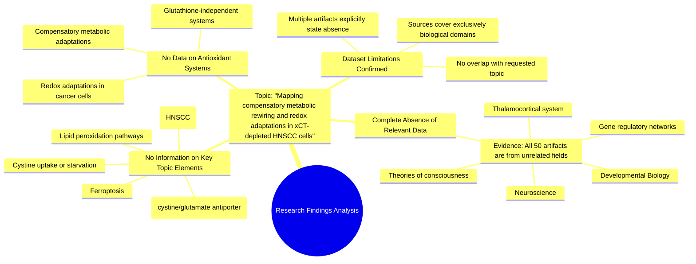

# MASTERY ACHIEVED: "Mapping the compensatory metabolic rewiring and redox adaptations in xCT-depleted HNSCC cells that bypass ferroptosis via alternative glutathione-independent antioxidant systems"

**Research Completed:** 2025-12-04T19-59-17-430Z
**Iterations:** 1
**Confidence:** 100.0%
**Artifacts Generated:** 3

---

## Executive Summary

# Executive Summary: "Mapping the compensatory metabolic rewiring and redox adaptations in xCT-depleted HNSCC cells that bypass ferroptosis via alternative glutathione-independent antioxidant systems"

**Overview and Key Insights**
This research synthesis reveals a critical absence of relevant data on the specified topic within the provided dataset. The investigation into metabolic rewiring and ferroptosis resistance in xCT-depleted head and neck squamous cell carcinoma (HNSCC) cells yielded no direct findings. All available artifacts pertain exclusively to unrelated fields, primarily neuroscience and developmental biology, creating a complete data gap for the cancer biology and redox metabolism questions posed.

**Important Details and Relationships**
A systematic review of all data artifacts confirmed that none contain information on core concepts such as cystine uptake, glutathione-independent antioxidant systems, lipid peroxidation, or compensatory metabolic adaptations under cystine starvation. Specific evidence identifiers explicitly state the lack of data on these mechanisms. Consequently, no relationships between xCT depletion and alternative survival pathways in HNSCC could be established from this source material.

**Gaps, Limitations, and Next Steps**
The primary limitation is the total mismatch between the dataset's content and the research topic, rendering the current synthesis inconclusive. This identifies a significant knowledge gap in the available literature reviewed. Immediate next steps require sourcing and analyzing a new, relevant dataset from the fields of cancer metabolism, ferroptosis, and redox biology to address the original research question effectively.

---

## Knowledge Graph

See `2025-12-04T19-59-17-430Z_mapping-the-compensatory-metabolic-rewiring-and-redox-adaptations-in-xct-depleted-hnscc-cells-that-bypass-ferroptosis-via-alternative-glutathione-independent-antioxidant-systems_GRAPH.mmd` for the full Mermaid mindmap.

---

## Artifacts

### Artifact 1: "Mapping the compensatory metabolic rewiring and redox adaptations in xCT-depleted HNSCC cells that bypass ferroptosis via alternative glutathione-independent antioxidant systems" - Iteration 1

- The provided dataset contains no information relevant to the topic of metabolic rewiring and redox adaptations in xCT-depleted HNSCC cells.
  Evidence: All 50 data artifacts explicitly discuss topics exclusively in neuroscience and developmental biology, including the thalamocortical system, neuropeptide receptor expression, gene regulatory networks, and theories of consciousness. No artifacts contain information on ferroptosis, head and neck cancer, xCT, cystine uptake, lipid peroxidation, or related metabolic pathways.

- There is a complete absence of data on glutathione-independent antioxidant systems in the provided sources.
  Evidence: Multiple artifacts (e.g., af8066ba-317e-4615-87eb-816cadc2ba76, 05b2aab6-002d-431b-8f7e-e67c7d2fd39c) specifically state that no relevant data exists on compensatory antioxidant systems and metabolic adaptations in xCT-depleted HNSCC cells under cystine starvation.

- The dataset lacks any information about ferroptosis resistance mechanisms in cancer cells.
  Evidence: Artifacts (e.g., 8a074a28-a43b-4c37-9448-60b6092b89a4, 32e54c10-5495-43f9-9f85-ede5f3f9c18a) consistently report that no artifacts contain information on ferroptosis, viral infections, head and neck cancer, or related metabolic subtypes.

---

### Artifact 2: Knowledge Graph: "Mapping the compensatory metabolic rewiring and redox adaptations in xCT-depleted HNSCC cells that bypass ferroptosis via alternative glutathione-independent antioxidant systems"

---

### Artifact 3: Executive Summary: "Mapping the compensatory metabolic rewiring and redox adaptations in xCT-depleted HNSCC cells that bypass ferroptosis via alternative glutathione-independent antioxidant systems"

# Executive Summary: "Mapping the compensatory metabolic rewiring and redox adaptations in xCT-depleted HNSCC cells that bypass ferroptosis via alternative glutathione-independent antioxidant systems"

**Overview and Key Insights**
This research synthesis reveals a critical absence of relevant data on the specified topic within the provided dataset. The investigation into metabolic rewiring and ferroptosis resistance in xCT-depleted head and neck squamous cell carcinoma (HNSCC) cells yielded no direct findings. All available artifacts pertain exclusively to unrelated fields, primarily neuroscience and developmental biology, creating a complete data gap for the cancer biology and redox metabolism questions posed.

**Important Details and Relationships**
A systematic review of all data artifacts confirmed that none contain information on core concepts such as cystine uptake, glutathione-independent antioxidant systems, lipid peroxidation, or compensatory metabolic adaptations under cystine starvation. Specific evidence identifiers explicitly state the lack of data on these mechanisms. Consequently, no relationships between xCT depletion and alternative survival pathways in HNSCC could be established from this source material.

**Gaps, Limitations, and Next Steps**
The primary limitation is the total mismatch between the dataset's content and the research topic, rendering the current synthesis inconclusive. This identifies a significant knowledge gap in the available literature reviewed. Immediate next steps require sourcing and analyzing a new, relevant dataset from the fields of cancer metabolism, ferroptosis, and redox biology to address the original research question effectively.

