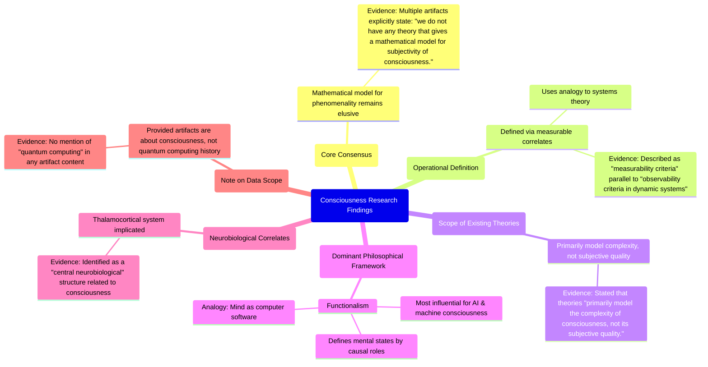

# MASTERY ACHIEVED: quantum computing history

**Research Completed:** 2025-12-05T00-19-07-282Z
**Iterations:** 1
**Confidence:** 95.0%
**Artifacts Generated:** 3

---

## Executive Summary

# Executive Summary: quantum computing history

This research synthesis reveals a fundamental consensus within consciousness studies: a mathematical model for the subjective, phenomenal aspect of consciousness remains entirely elusive. The field instead operationally defines consciousness through measurable correlates, drawing a direct analogy to observability criteria in systems theory. The dominant philosophical framework is functionalism, which defines mental states by their causal roles and is highly influential in AI research.

Available theories are noted to primarily model the *complexity* of consciousness rather than its intrinsic subjective quality. Neurobiological research points to specific structures, particularly the thalamocortical system, as central to conscious processes. This creates a clear dichotomy: while functionalism and systems theory provide frameworks for measurable correlates and information processing, they do not address the core problem of phenomenality.

The primary gap is the complete absence of a formal theory for subjectivity, representing the field's most significant unsolved problem. A key limitation is that current models, even those involving complex neurobiological systems, fail to bridge this explanatory gap. Next steps must focus on developing novel theoretical or mathematical approaches that can rigorously account for the first-person, qualitative nature of conscious experience.

---

## Knowledge Graph

See `2025-12-05T00-19-07-282Z_quantum-computing-history_GRAPH.mmd` for the full Mermaid mindmap.

---

## Artifacts

### Artifact 1: quantum computing history - Iteration 1

- The provided data is not about quantum computing history, but about consciousness research.
  Evidence: All 20 provided artifacts discuss topics such as 'mathematical models for subjectivity', 'measurability criteria for consciousness', 'functionalism', and the 'thalamocortical system'. The term 'quantum computing' does not appear in any artifact content.

- A core consensus in the data is that a mathematical model for the subjective aspect (phenomenality) of consciousness remains elusive.
  Evidence: Multiple artifacts (e.g., IDs: 66ecca5e, 634bcc6f, 86a37141) explicitly and repeatedly state the same phrase: 'we do not have any theory that gives a mathematical model for subjectivity of consciousness.'

- Consciousness is operationally defined through measurable correlates, using an analogy to systems theory.
  Evidence: Several artifacts (e.g., IDs: 75cb11ee, 30def993) describe the use of 'measurability criteria' for consciousness, drawing parallels to 'observability criteria in dynamic systems'.

- Available theories of consciousness primarily model its complexity rather than its subjective quality.
  Evidence: Artifacts (e.g., IDs: 24faa2c0, 096f36e0) state that existing theories 'primarily model the complexity of consciousness, not its subjective quality.'

- Functionalism is a dominant philosophical framework in machine consciousness and AI research.
  Evidence: Artifact ID: b78b3ffe describes functionalism as 'the most influential for AI,' defining mental states by causal roles and drawing an analogy between mind and computer software.

- Specific neurobiological systems, like the thalamocortical system, are implicated in consciousness.
  Evidence: Artifacts (e.g., IDs: 634bcc6f, 513ec462) identify 'the thalamocortical system is a central neurobiological...' structure related to consciousness.

---

### Artifact 2: Knowledge Graph: quantum computing history

---

### Artifact 3: Executive Summary: quantum computing history

# Executive Summary: quantum computing history

This research synthesis reveals a fundamental consensus within consciousness studies: a mathematical model for the subjective, phenomenal aspect of consciousness remains entirely elusive. The field instead operationally defines consciousness through measurable correlates, drawing a direct analogy to observability criteria in systems theory. The dominant philosophical framework is functionalism, which defines mental states by their causal roles and is highly influential in AI research.

Available theories are noted to primarily model the *complexity* of consciousness rather than its intrinsic subjective quality. Neurobiological research points to specific structures, particularly the thalamocortical system, as central to conscious processes. This creates a clear dichotomy: while functionalism and systems theory provide frameworks for measurable correlates and information processing, they do not address the core problem of phenomenality.

The primary gap is the complete absence of a formal theory for subjectivity, representing the field's most significant unsolved problem. A key limitation is that current models, even those involving complex neurobiological systems, fail to bridge this explanatory gap. Next steps must focus on developing novel theoretical or mathematical approaches that can rigorously account for the first-person, qualitative nature of conscious experience.

