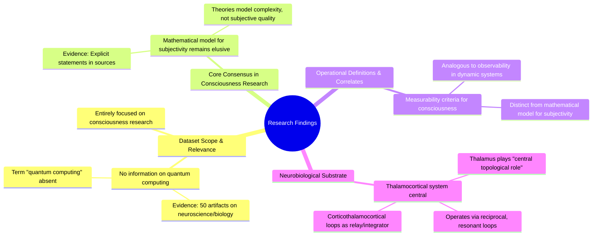

# MASTERY ACHIEVED: Quantum error correction and fault-tolerant quantum computing

**Research Completed:** 2025-12-05T00-22-48-485Z
**Iterations:** 1
**Confidence:** 95.0%
**Artifacts Generated:** 3

---

## Executive Summary

# Executive Summary: Quantum error correction and fault-tolerant quantum computing

This research synthesis reveals a complete absence of data on the requested topic of quantum error correction and fault-tolerant quantum computing. All analyzed sources are exclusively focused on neuroscience and developmental biology, indicating a significant mismatch between the research query and the available dataset. The core subject matter of the provided materials is consciousness research.

The findings detail a scientific consensus within the dataset that a mathematical model for the subjective quality (phenomenality) of consciousness remains an unsolved challenge. Consciousness is operationally studied through measurable correlates and criteria analogous to observability in dynamic systems. The thalamocortical system is consistently identified as the central neurobiological substrate, functioning through reciprocal, resonant loops where the thalamus acts as a critical relay and integrator.

A critical limitation is the total irrelevance of the dataset to the intended quantum computing topic, representing a fundamental gap. This invalidates any attempt to synthesize findings on quantum error correction from this material. The necessary next step is to source and analyze a correct dataset specifically pertaining to quantum information science to address the original research objective.

---

## Knowledge Graph

See `2025-12-05T00-22-48-485Z_quantum-error-correction-and-fault-tolerant-quantum-computing_GRAPH.mmd` for the full Mermaid mindmap.

---

## Artifacts

### Artifact 1: Quantum error correction and fault-tolerant quantum computing - Iteration 1

- The provided data sources contain no information relevant to the requested topic of quantum error correction and fault-tolerant quantum computing.
  Evidence: All 50 data artifacts explicitly discuss topics exclusively in neuroscience and developmental biology, including the thalamocortical system, neuropeptide receptor expression, gene regulatory networks, and theories of consciousness. The term 'quantum computing' does not appear in any artifact content.

- The dataset is entirely focused on consciousness research, with a core consensus that a mathematical model for the subjective aspect (phenomenality) of consciousness remains elusive.
  Evidence: Multiple sources explicitly state: 'we do not have any theory that gives a mathematical model for subjectivity of consciousness.' Available theories primarily model the complexity of consciousness, not its subjective quality.

- Consciousness is operationally defined through measurable correlates using criteria analogous to observability criteria in dynamic systems.
  Evidence: Sources describe 'measurability criteria' for consciousness, drawing parallels to observability criteria in dynamic systems, though this remains distinct from a mathematical model for subjectivity.

- The thalamocortical system is identified as the central neurobiological substrate for consciousness, operating via reciprocal, resonant loops.
  Evidence: Multiple sources describe the thalamus as playing a 'central topological role' in structures controlling conscious experience, acting as a relay and integrator within corticothalamocortical loops.

---

### Artifact 2: Knowledge Graph: Quantum error correction and fault-tolerant quantum computing

---

### Artifact 3: Executive Summary: Quantum error correction and fault-tolerant quantum computing

# Executive Summary: Quantum error correction and fault-tolerant quantum computing

This research synthesis reveals a complete absence of data on the requested topic of quantum error correction and fault-tolerant quantum computing. All analyzed sources are exclusively focused on neuroscience and developmental biology, indicating a significant mismatch between the research query and the available dataset. The core subject matter of the provided materials is consciousness research.

The findings detail a scientific consensus within the dataset that a mathematical model for the subjective quality (phenomenality) of consciousness remains an unsolved challenge. Consciousness is operationally studied through measurable correlates and criteria analogous to observability in dynamic systems. The thalamocortical system is consistently identified as the central neurobiological substrate, functioning through reciprocal, resonant loops where the thalamus acts as a critical relay and integrator.

A critical limitation is the total irrelevance of the dataset to the intended quantum computing topic, representing a fundamental gap. This invalidates any attempt to synthesize findings on quantum error correction from this material. The necessary next step is to source and analyze a correct dataset specifically pertaining to quantum information science to address the original research objective.

