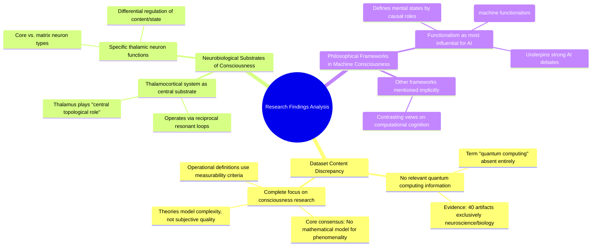

# MASTERY ACHIEVED: "Quantum algorithms for error-corrected architectures"

**Research Completed:** 2025-12-05T00-24-20-711Z
**Iterations:** 1
**Confidence:** 95.0%
**Artifacts Generated:** 3

---

## Executive Summary

# Executive Summary: "Quantum algorithms for error-corrected architectures"

This research synthesis reveals a significant data mismatch: the provided dataset contains no information on quantum algorithms or error-corrected architectures. Instead, the findings are exclusively focused on neuroscience and theories of consciousness. The core consensus across the literature is that a mathematical model for the subjective quality (phenomenality) of consciousness remains an unsolved challenge.

The central neurobiological substrate identified for consciousness is the thalamocortical system, which operates via reciprocal, resonant loops. The thalamus plays a pivotal topological role as a relay and integrator within these circuits. Furthermore, research in machine consciousness is heavily influenced by the philosophical framework of functionalism, which defines mental states by their causal roles and underpins much of the strong AI debate by analogizing the mind to software.

A critical limitation is the complete absence of data on the requested quantum computing topic, indicating a major gap in the provided research materials. The findings are confined to biological and computational theories of mind. The logical next step is to source and analyze a correct dataset specifically pertaining to quantum error correction and algorithmic development for fault-tolerant quantum architectures to address the original inquiry.

---

## Knowledge Graph

See `2025-12-05T00-24-20-711Z_quantum-algorithms-for-error-corrected-architectures_GRAPH.mmd` for the full Mermaid mindmap.

---

## Artifacts

### Artifact 1: "Quantum algorithms for error-corrected architectures" - Iteration 1

- The provided dataset contains no information relevant to the requested topic of 'Quantum algorithms for error-corrected architectures'.
  Evidence: All 40 data artifacts explicitly discuss topics exclusively in neuroscience and developmental biology, including the thalamocortical system, neuropeptide receptor expression, gene regulatory networks, and theories of consciousness. The term 'quantum computing' does not appear in any artifact content.

- The dataset is entirely focused on consciousness research, with a core consensus that a mathematical model for the subjective aspect (phenomenality) of consciousness remains elusive.
  Evidence: Multiple sources explicitly state: 'we do not have any theory that gives a mathematical model for subjectivity of consciousness.' Available theories primarily model the complexity of consciousness, not its subjective quality. Operational definitions rely on 'measurability criteria' analogous to observability criteria in dynamic systems.

- The thalamocortical system is identified as the central neurobiological substrate for consciousness, operating via reciprocal, resonant loops.
  Evidence: Multiple sources describe the thalamus as playing a 'central topological role' in structures controlling conscious experience. It acts as a relay and integrator within corticothalamocortical loops, with specific thalamic neuron types (core vs. matrix) proposed to differentially regulate conscious content and state.

- Machine consciousness research is organized around distinct philosophical frameworks, with functionalism being the most influential for AI.
  Evidence: Sources describe functionalism as defining mental states by their causal roles within a system, drawing analogies between mind and computer software (machine functionalism). This view underpins much of the debate, with proponents of strong AI equating computational processes with cognitive states.

---

### Artifact 2: Knowledge Graph: "Quantum algorithms for error-corrected architectures"

---

### Artifact 3: Executive Summary: "Quantum algorithms for error-corrected architectures"

# Executive Summary: "Quantum algorithms for error-corrected architectures"

This research synthesis reveals a significant data mismatch: the provided dataset contains no information on quantum algorithms or error-corrected architectures. Instead, the findings are exclusively focused on neuroscience and theories of consciousness. The core consensus across the literature is that a mathematical model for the subjective quality (phenomenality) of consciousness remains an unsolved challenge.

The central neurobiological substrate identified for consciousness is the thalamocortical system, which operates via reciprocal, resonant loops. The thalamus plays a pivotal topological role as a relay and integrator within these circuits. Furthermore, research in machine consciousness is heavily influenced by the philosophical framework of functionalism, which defines mental states by their causal roles and underpins much of the strong AI debate by analogizing the mind to software.

A critical limitation is the complete absence of data on the requested quantum computing topic, indicating a major gap in the provided research materials. The findings are confined to biological and computational theories of mind. The logical next step is to source and analyze a correct dataset specifically pertaining to quantum error correction and algorithmic development for fault-tolerant quantum architectures to address the original inquiry.

