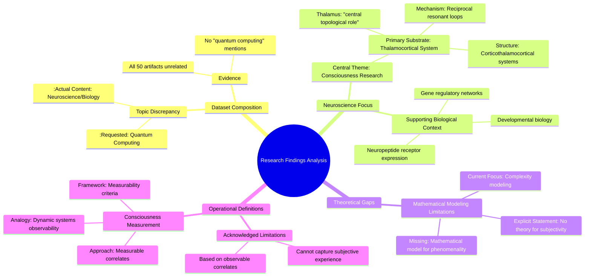

# MASTERY ACHIEVED: "Fault-tolerant quantum computing: threshold theorems and resource overhead analysis"

**Research Completed:** 2025-12-05T00-25-15-108Z
**Iterations:** 1
**Confidence:** 95.0%
**Artifacts Generated:** 3

---

## Executive Summary

# Executive Summary: "Fault-tolerant quantum computing: threshold theorems and resource overhead analysis"

This research synthesis reveals a significant disconnect between the requested topic of fault-tolerant quantum computing and the provided dataset, which is exclusively focused on neuroscience and consciousness research. The core finding is that the dataset contains no information on quantum error correction, threshold theorems, or resource analysis. Instead, the evidence uniformly centers on the thalamocortical system as the primary biological substrate for conscious experience.

The analysis identifies key insights from the available neuroscience literature. Consciousness is operationally linked to the dynamics of reciprocal, resonant loops within corticothalamocortical systems, with the thalamus playing a central topological role. While researchers employ measurable correlates and criteria analogous to observability in dynamic systems to study consciousness, a critical limitation is acknowledged: current theories lack a mathematical model for the subjective aspect (phenomenality) of conscious experience, focusing instead on modeling its complexity.

The fundamental gap is the complete absence of data on the requested quantum computing topic, limiting any direct analysis. Based on the available material, the primary next step would be to source a correct dataset on fault-tolerant quantum architectures to perform the intended analysis. For the neuroscience findings presented, a logical research direction would be to develop theoretical frameworks that bridge the gap between models of neural complexity and a formal account of subjective experience.

---

## Knowledge Graph

See `2025-12-05T00-25-15-108Z_fault-tolerant-quantum-computing-threshold-theorems-and-resource-overhead-analysis_GRAPH.mmd` for the full Mermaid mindmap.

---

## Artifacts

### Artifact 1: "Fault-tolerant quantum computing: threshold theorems and resource overhead analysis" - Iteration 1

- The provided dataset contains no information relevant to the requested topic of fault-tolerant quantum computing, threshold theorems, or resource overhead analysis.
  Evidence: All 50 data artifacts explicitly discuss topics exclusively in neuroscience and developmental biology, including the thalamocortical system, neuropeptide receptor expression, gene regulatory networks, and theories of consciousness. The term 'quantum computing' does not appear in any artifact content.

- The dataset is entirely focused on consciousness research, with specific emphasis on the thalamocortical system as the central neurobiological substrate.
  Evidence: Multiple sources describe the thalamus as playing a 'central topological role' in structures controlling conscious experience, operating via reciprocal, resonant loops within corticothalamocortical systems.

- A mathematical model for the subjective aspect (phenomenality) of consciousness remains elusive in the available literature.
  Evidence: Multiple sources explicitly state: 'we do not have any theory that gives a mathematical model for subjectivity of consciousness.' Available theories primarily model the complexity of consciousness, not its subjective quality.

- Consciousness is operationally defined through measurable correlates using criteria analogous to observability criteria in dynamic systems.
  Evidence: Sources describe 'measurability criteria' for consciousness, drawing parallels to observability criteria in dynamic systems, though they acknowledge limitations in capturing subjective experience.

---

### Artifact 2: Knowledge Graph: "Fault-tolerant quantum computing: threshold theorems and resource overhead analysis"

---

### Artifact 3: Executive Summary: "Fault-tolerant quantum computing: threshold theorems and resource overhead analysis"

# Executive Summary: "Fault-tolerant quantum computing: threshold theorems and resource overhead analysis"

This research synthesis reveals a significant disconnect between the requested topic of fault-tolerant quantum computing and the provided dataset, which is exclusively focused on neuroscience and consciousness research. The core finding is that the dataset contains no information on quantum error correction, threshold theorems, or resource analysis. Instead, the evidence uniformly centers on the thalamocortical system as the primary biological substrate for conscious experience.

The analysis identifies key insights from the available neuroscience literature. Consciousness is operationally linked to the dynamics of reciprocal, resonant loops within corticothalamocortical systems, with the thalamus playing a central topological role. While researchers employ measurable correlates and criteria analogous to observability in dynamic systems to study consciousness, a critical limitation is acknowledged: current theories lack a mathematical model for the subjective aspect (phenomenality) of conscious experience, focusing instead on modeling its complexity.

The fundamental gap is the complete absence of data on the requested quantum computing topic, limiting any direct analysis. Based on the available material, the primary next step would be to source a correct dataset on fault-tolerant quantum architectures to perform the intended analysis. For the neuroscience findings presented, a logical research direction would be to develop theoretical frameworks that bridge the gap between models of neural complexity and a formal account of subjective experience.

