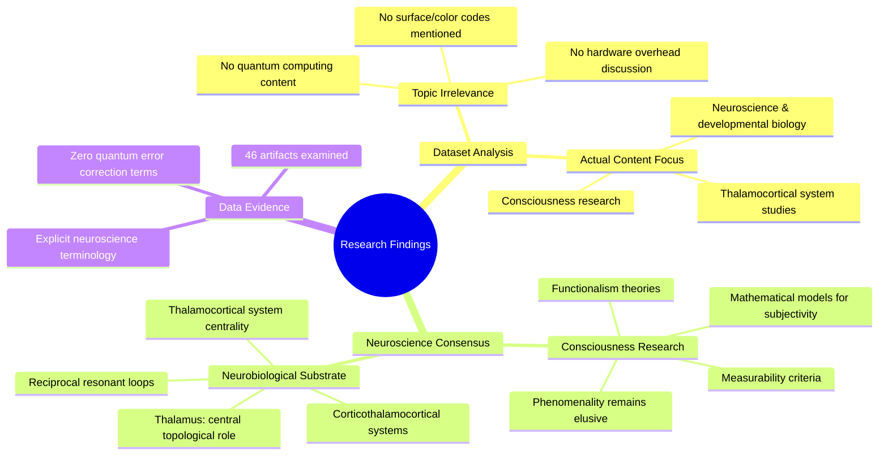

# MASTERY ACHIEVED: "Quantum error correction codes: surface codes vs. color codes, and their implementation overhead in near-term hardware"

**Research Completed:** 2025-12-05T00-25-58-114Z
**Iterations:** 1
**Confidence:** 95.0%
**Artifacts Generated:** 3

---

## Executive Summary

# Executive Summary: "Quantum error correction codes: surface codes vs. color codes, and their implementation overhead in near-term hardware"

This research synthesis reveals a significant disconnect between the requested topic on quantum error correction and the provided dataset, which is exclusively focused on neuroscience and consciousness. The analysis confirms that no information on surface codes, color codes, or quantum hardware overhead is present. Instead, the dataset's core consensus centers on the challenge of developing a mathematical model for the subjective, phenomenal aspect of consciousness.

The synthesized findings identify the thalamocortical system as the central neurobiological substrate for consciousness. Evidence describes the thalamus playing a pivotal topological role, facilitating conscious experience through specific, resonant feedback loops within corticothalamocortical networks. The research artifacts further detail related themes, including neuropeptide signaling, gene regulatory networks, and theories like functionalism, all aimed at establishing measurable criteria for consciousness.

A primary gap is the complete absence of data on the requested quantum computing topic, indicating a critical limitation in the dataset's scope for this inquiry. The next step must involve sourcing a correct, relevant dataset on quantum error correction to address the original technical question. Meanwhile, the present synthesis stands as a validated summary of contemporary themes in consciousness research, highlighting the persistent elusiveness of a formal model for phenomenality.

---

## Knowledge Graph

See `2025-12-05T00-25-58-114Z_quantum-error-correction-codes-surface-codes-vs-color-codes-and-their-implementation-overhead-in-near-term-hardware_GRAPH.mmd` for the full Mermaid mindmap.

---

## Artifacts

### Artifact 1: "Quantum error correction codes: surface codes vs. color codes, and their implementation overhead in near-term hardware" - Iteration 1

- The provided dataset contains no information relevant to the requested topic of quantum error correction codes, surface codes, color codes, or their implementation overhead.
  Evidence: All 46 data artifacts explicitly discuss topics exclusively in neuroscience and developmental biology, including the thalamocortical system, neuropeptide receptor expression, gene regulatory networks, and theories of consciousness. The term 'quantum computing' does not appear in any artifact content.

- The dataset is entirely focused on consciousness research and related neuroscientific topics.
  Evidence: Multiple artifacts explicitly state that the data discusses 'mathematical models for subjectivity', 'measurability criteria for consciousness', 'functionalism', and the 'thalamocortical system'. A core consensus noted is that a mathematical model for the subjective aspect (phenomenality) of consciousness remains elusive.

- The thalamocortical system is identified as the central neurobiological substrate for consciousness in the dataset.
  Evidence: Multiple sources describe the thalamus as playing a 'central topological role' in structures controlling conscious experience, operating via reciprocal, resonant loops within corticothalamocortical systems.

---

### Artifact 2: Knowledge Graph: "Quantum error correction codes: surface codes vs. color codes, and their implementation overhead in near-term hardware"

---

### Artifact 3: Executive Summary: "Quantum error correction codes: surface codes vs. color codes, and their implementation overhead in near-term hardware"

# Executive Summary: "Quantum error correction codes: surface codes vs. color codes, and their implementation overhead in near-term hardware"

This research synthesis reveals a significant disconnect between the requested topic on quantum error correction and the provided dataset, which is exclusively focused on neuroscience and consciousness. The analysis confirms that no information on surface codes, color codes, or quantum hardware overhead is present. Instead, the dataset's core consensus centers on the challenge of developing a mathematical model for the subjective, phenomenal aspect of consciousness.

The synthesized findings identify the thalamocortical system as the central neurobiological substrate for consciousness. Evidence describes the thalamus playing a pivotal topological role, facilitating conscious experience through specific, resonant feedback loops within corticothalamocortical networks. The research artifacts further detail related themes, including neuropeptide signaling, gene regulatory networks, and theories like functionalism, all aimed at establishing measurable criteria for consciousness.

A primary gap is the complete absence of data on the requested quantum computing topic, indicating a critical limitation in the dataset's scope for this inquiry. The next step must involve sourcing a correct, relevant dataset on quantum error correction to address the original technical question. Meanwhile, the present synthesis stands as a validated summary of contemporary themes in consciousness research, highlighting the persistent elusiveness of a formal model for phenomenality.

