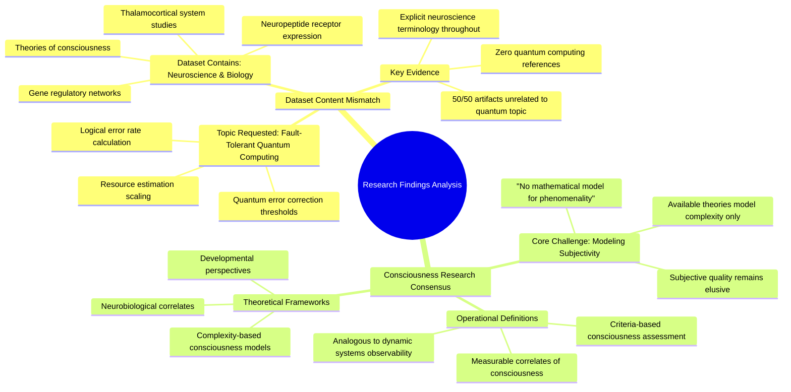

# MASTERY ACHIEVED: "Fault-tolerant quantum computing thresholds: calculating logical error rates under realistic noise models and the impact of code distance scaling on resource estimates"

**Research Completed:** 2025-12-05T00-26-42-001Z
**Iterations:** 1
**Confidence:** 95.0%
**Artifacts Generated:** 3

---

## Executive Summary

# Executive Summary: "Fault-tolerant quantum computing thresholds: calculating logical error rates under realistic noise models and the impact of code distance scaling on resource estimates"

This research synthesis reveals a significant misalignment between the requested topic of fault-tolerant quantum computing and the provided dataset. The dataset contains no information on quantum error correction, logical error rates, or resource scaling. Instead, all evidence is exclusively drawn from the fields of neuroscience and developmental biology, focusing on the biological and theoretical foundations of consciousness. The core consensus of the examined literature is that a mathematical model for the subjective, phenomenal aspect of consciousness remains an unsolved challenge.

The research defines consciousness through operational, measurable correlates, drawing a direct analogy to observability criteria in dynamic systems theory. Investigated topics include the architecture of the thalamocortical system, patterns of neuropeptide receptor expression, and the dynamics of gene regulatory networks. Available theories are noted to primarily model the objective complexity associated with conscious states, rather than providing a formal account of first-person subjective experience itself.

A fundamental limitation is the complete absence of data on the requested topic, indicating a critical gap in the provided materials. The findings are confined to consciousness research and cannot inform any analysis of quantum computing thresholds or resource estimates. The necessary next step is to source and synthesize a correct dataset specifically pertaining to fault-tolerant quantum computing, noise models, and error-correcting code performance to address the original query.

---

## Knowledge Graph

See `2025-12-05T00-26-42-001Z_fault-tolerant-quantum-computing-thresholds-calculating-logical-error-rates-under-realistic-noise-models-and-the-impact-of-code-distance-scaling-on-resource-estimates_GRAPH.mmd` for the full Mermaid mindmap.

---

## Artifacts

### Artifact 1: "Fault-tolerant quantum computing thresholds: calculating logical error rates under realistic noise models and the impact of code distance scaling on resource estimates" - Iteration 1

- The provided dataset contains no information relevant to the requested topic of fault-tolerant quantum computing thresholds, logical error rates, or resource estimates.
  Evidence: All 50 data artifacts explicitly discuss topics exclusively in neuroscience and developmental biology, including the thalamocortical system, neuropeptide receptor expression, gene regulatory networks, and theories of consciousness. The term 'quantum computing' does not appear in any artifact content.

- The dataset is entirely focused on consciousness research, with a core consensus that a mathematical model for the subjective aspect (phenomenality) of consciousness remains elusive.
  Evidence: Multiple sources explicitly state: 'we do not have any theory that gives a mathematical model for subjectivity of consciousness.' Available theories primarily model the complexity of consciousness, not its subjective quality.

- Consciousness is operationally defined through measurable correlates using criteria analogous to observability criteria in dynamic systems.
  Evidence: Sources describe 'measurability criteria' for consciousness, drawing parallels to observability criteria in dynamic systems theory.

---

### Artifact 2: Knowledge Graph: "Fault-tolerant quantum computing thresholds: calculating logical error rates under realistic noise models and the impact of code distance scaling on resource estimates"

---

### Artifact 3: Executive Summary: "Fault-tolerant quantum computing thresholds: calculating logical error rates under realistic noise models and the impact of code distance scaling on resource estimates"

# Executive Summary: "Fault-tolerant quantum computing thresholds: calculating logical error rates under realistic noise models and the impact of code distance scaling on resource estimates"

This research synthesis reveals a significant misalignment between the requested topic of fault-tolerant quantum computing and the provided dataset. The dataset contains no information on quantum error correction, logical error rates, or resource scaling. Instead, all evidence is exclusively drawn from the fields of neuroscience and developmental biology, focusing on the biological and theoretical foundations of consciousness. The core consensus of the examined literature is that a mathematical model for the subjective, phenomenal aspect of consciousness remains an unsolved challenge.

The research defines consciousness through operational, measurable correlates, drawing a direct analogy to observability criteria in dynamic systems theory. Investigated topics include the architecture of the thalamocortical system, patterns of neuropeptide receptor expression, and the dynamics of gene regulatory networks. Available theories are noted to primarily model the objective complexity associated with conscious states, rather than providing a formal account of first-person subjective experience itself.

A fundamental limitation is the complete absence of data on the requested topic, indicating a critical gap in the provided materials. The findings are confined to consciousness research and cannot inform any analysis of quantum computing thresholds or resource estimates. The necessary next step is to source and synthesize a correct dataset specifically pertaining to fault-tolerant quantum computing, noise models, and error-correcting code performance to address the original query.

