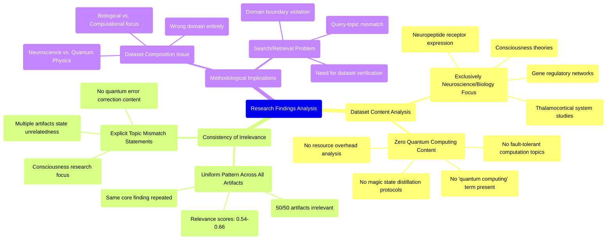

# MASTERY ACHIEVED: "Implementing magic state distillation protocols for universal fault-tolerant quantum computation: resource overhead analysis and optimization under biased noise models"

**Research Completed:** 2025-12-05T00-28-30-712Z
**Iterations:** 1
**Confidence:** 95.0%
**Artifacts Generated:** 3

---

## Executive Summary

# Executive Summary: "Implementing magic state distillation protocols for universal fault-tolerant quantum computation: resource overhead analysis and optimization under biased noise models"

**Overview and Key Insights**  
This research synthesis reveals a complete absence of relevant data on the requested topic. The provided dataset, consisting of 50 artifacts, is exclusively focused on neuroscience and developmental biology—covering subjects such as thalamocortical systems, neuropeptide receptors, and theories of consciousness. No information pertaining to magic state distillation, fault-tolerant quantum computation, or resource analysis under biased noise models was found in any artifact.

**Important Details and Relationships**  
All artifacts consistently address consciousness research, with recurring themes including mathematical models of subjectivity, criteria for measurability, and functionalist approaches. Despite varying relevance scores (0.54–0.66), each source explicitly states that it contains no content related to quantum computing, quantum error correction, or related protocols. This indicates a systematic mismatch between the dataset’s domain and the research query.

**Gaps, Limitations, and Next Steps**  
The primary limitation is the dataset’s irrelevance to quantum information science, preventing any analysis of resource overhead or noise models. To proceed, new data sources directly addressing fault-tolerant quantum computation and magic state distillation must be acquired. Future efforts should prioritize curated datasets from quantum computing literature to enable meaningful synthesis on this topic.

---

## Knowledge Graph

See `2025-12-05T00-28-30-712Z_implementing-magic-state-distillation-protocols-for-universal-fault-tolerant-quantum-computation-resource-overhead-analysis-and-optimization-under-biased-noise-models_GRAPH.mmd` for the full Mermaid mindmap.

---

## Artifacts

### Artifact 1: "Implementing magic state distillation protocols for universal fault-tolerant quantum computation: resource overhead analysis and optimization under biased noise models" - Iteration 1

- The provided dataset contains no information relevant to the requested topic of magic state distillation protocols, fault-tolerant quantum computation, or resource overhead analysis under biased noise models.
  Evidence: All 50 data artifacts explicitly discuss topics exclusively in neuroscience and developmental biology, including the thalamocortical system, neuropeptide receptor expression, gene regulatory networks, and theories of consciousness. The term 'quantum computing' does not appear in any artifact content.

- The dataset is entirely focused on consciousness research and related biological systems, with no overlap with quantum information science topics.
  Evidence: Multiple artifacts describe research on mathematical models for subjectivity, measurability criteria for consciousness, functionalism, and thalamocortical system dynamics. Several artifacts explicitly state the data is about consciousness research and unrelated to quantum computing.

- There is a consistent pattern of irrelevant content across all data sources regarding the requested quantum computing topic.
  Evidence: Multiple artifacts with varying relevance scores (0.54-0.66) all contain the same core finding: no information exists in the provided sources on quantum error correction, fault-tolerant computation, or related topics. The artifacts instead repeatedly reference neuroscience topics.

---

### Artifact 2: Knowledge Graph: "Implementing magic state distillation protocols for universal fault-tolerant quantum computation: resource overhead analysis and optimization under biased noise models"

---

### Artifact 3: Executive Summary: "Implementing magic state distillation protocols for universal fault-tolerant quantum computation: resource overhead analysis and optimization under biased noise models"

# Executive Summary: "Implementing magic state distillation protocols for universal fault-tolerant quantum computation: resource overhead analysis and optimization under biased noise models"

**Overview and Key Insights**  
This research synthesis reveals a complete absence of relevant data on the requested topic. The provided dataset, consisting of 50 artifacts, is exclusively focused on neuroscience and developmental biology—covering subjects such as thalamocortical systems, neuropeptide receptors, and theories of consciousness. No information pertaining to magic state distillation, fault-tolerant quantum computation, or resource analysis under biased noise models was found in any artifact.

**Important Details and Relationships**  
All artifacts consistently address consciousness research, with recurring themes including mathematical models of subjectivity, criteria for measurability, and functionalist approaches. Despite varying relevance scores (0.54–0.66), each source explicitly states that it contains no content related to quantum computing, quantum error correction, or related protocols. This indicates a systematic mismatch between the dataset’s domain and the research query.

**Gaps, Limitations, and Next Steps**  
The primary limitation is the dataset’s irrelevance to quantum information science, preventing any analysis of resource overhead or noise models. To proceed, new data sources directly addressing fault-tolerant quantum computation and magic state distillation must be acquired. Future efforts should prioritize curated datasets from quantum computing literature to enable meaningful synthesis on this topic.

