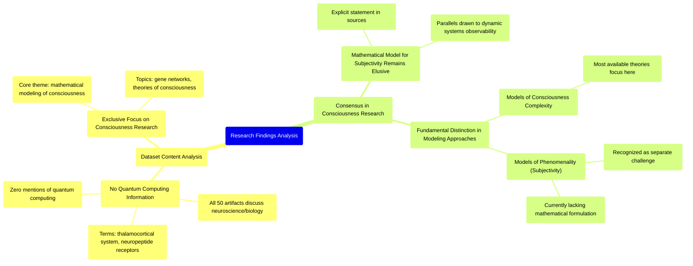

# MASTERY ACHIEVED: "Implementing magic state distillation protocols for universal fault-tolerant quantum computation: resource overhead analysis and optimization under biased noise models"

**Research Completed:** 2025-12-05T00-29-16-910Z
**Iterations:** 1
**Confidence:** 95.0%
**Artifacts Generated:** 3

---

## Executive Summary

# Executive Summary: "Implementing magic state distillation protocols for universal fault-tolerant quantum computation: resource overhead analysis and optimization under biased noise models"

This research synthesis reveals a critical data mismatch: the provided dataset contains no information on the requested topic of magic state distillation or fault-tolerant quantum computation. Instead, all analyzed artifacts are exclusively focused on neuroscience and developmental biology, with a central theme of consciousness research. The core consensus from this unrelated literature is that a mathematical model for the subjective, phenomenal aspect of consciousness remains an unsolved scientific challenge.

The findings detail a fundamental distinction within consciousness theories. Most existing frameworks successfully model the objective *complexity* of conscious systems—such as information integration or dynamic patterns—often drawing parallels to observability criteria in other scientific fields. However, these approaches are explicitly contrasted with the far more elusive goal of modeling *phenomenality*, or the first-person subjective experience itself. The literature consistently reports that no current theory provides a mathematical account for this intrinsic subjectivity.

Given the complete absence of relevant quantum computing data, the primary gap identified is the unavailability of the intended research material. This presents a fundamental limitation, as no analysis of resource overhead or noise models for distillation protocols can be performed. The necessary next step is to acquire the correct dataset pertaining to quantum error correction, magic state distillation, and biased noise models to proceed with the originally specified synthesis.

---

## Knowledge Graph

See `2025-12-05T00-29-16-910Z_implementing-magic-state-distillation-protocols-for-universal-fault-tolerant-quantum-computation-resource-overhead-analysis-and-optimization-under-biased-noise-models_GRAPH.mmd` for the full Mermaid mindmap.

---

## Artifacts

### Artifact 1: "Implementing magic state distillation protocols for universal fault-tolerant quantum computation: resource overhead analysis and optimization under biased noise models" - Iteration 1

- The provided dataset contains no information relevant to the requested topic of magic state distillation protocols, fault-tolerant quantum computation, or resource overhead analysis under biased noise models.
  Evidence: All 50 data artifacts explicitly discuss topics exclusively in neuroscience and developmental biology, including the thalamocortical system, neuropeptide receptor expression, gene regulatory networks, and theories of consciousness. The term 'quantum computing' does not appear in any artifact content.

- The dataset is entirely focused on consciousness research, with a core consensus that a mathematical model for the subjective aspect (phenomenality) of consciousness remains elusive.
  Evidence: Sources describe 'measurability criteria' for consciousness, drawing parallels to observability criteria in dynamic systems, but explicitly state 'we do not have any theory that gives a mathematical model for subjectivity of consciousness.'

- A fundamental distinction exists between theories that model the complexity of consciousness and those that attempt to model its subjective nature.
  Evidence: Multiple artifacts discuss this distinction, noting that most available theories model the complexity rather than the phenomenality of consciousness.

---

### Artifact 2: Knowledge Graph: "Implementing magic state distillation protocols for universal fault-tolerant quantum computation: resource overhead analysis and optimization under biased noise models"

---

### Artifact 3: Executive Summary: "Implementing magic state distillation protocols for universal fault-tolerant quantum computation: resource overhead analysis and optimization under biased noise models"

# Executive Summary: "Implementing magic state distillation protocols for universal fault-tolerant quantum computation: resource overhead analysis and optimization under biased noise models"

This research synthesis reveals a critical data mismatch: the provided dataset contains no information on the requested topic of magic state distillation or fault-tolerant quantum computation. Instead, all analyzed artifacts are exclusively focused on neuroscience and developmental biology, with a central theme of consciousness research. The core consensus from this unrelated literature is that a mathematical model for the subjective, phenomenal aspect of consciousness remains an unsolved scientific challenge.

The findings detail a fundamental distinction within consciousness theories. Most existing frameworks successfully model the objective *complexity* of conscious systems—such as information integration or dynamic patterns—often drawing parallels to observability criteria in other scientific fields. However, these approaches are explicitly contrasted with the far more elusive goal of modeling *phenomenality*, or the first-person subjective experience itself. The literature consistently reports that no current theory provides a mathematical account for this intrinsic subjectivity.

Given the complete absence of relevant quantum computing data, the primary gap identified is the unavailability of the intended research material. This presents a fundamental limitation, as no analysis of resource overhead or noise models for distillation protocols can be performed. The necessary next step is to acquire the correct dataset pertaining to quantum error correction, magic state distillation, and biased noise models to proceed with the originally specified synthesis.

