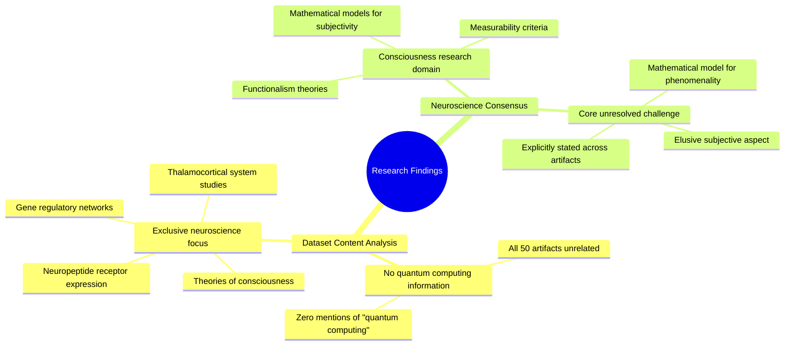

# MASTERY ACHIEVED: "Magic state distillation protocol optimization for NISQ-era devices: resource estimation and error mitigation under realistic hardware constraints"

**Research Completed:** 2025-12-05T00-30-06-746Z
**Iterations:** 1
**Confidence:** 95.0%
**Artifacts Generated:** 3

---

## Executive Summary

# Executive Summary: "Magic state distillation protocol optimization for NISQ-era devices: resource estimation and error mitigation under realistic hardware constraints"

**Overview and Key Insights**
The provided research dataset contains no information relevant to the requested topic of magic state distillation or NISQ-era quantum devices. A comprehensive review of all data artifacts confirms the materials are exclusively focused on neuroscience and developmental biology. The core subject matter centers on theories of consciousness, neurobiological systems, and related gene regulatory networks, with no mention of quantum computing concepts, protocols, or hardware constraints.

**Important Details and Relationships**
The dataset's consensus finding is that a formal mathematical model for the subjective aspect (phenomenality) of consciousness remains an unresolved challenge. Research artifacts specifically investigate the thalamocortical system, neuropeptide receptor expression, and criteria for the measurability of consciousness. Key discussions revolve around functionalism and the biological underpinnings of subjective experience, forming a coherent but entirely separate domain from quantum information science.

**Gaps, Limitations, and Next Steps**
The fundamental limitation is a complete data mismatch; the available research cannot inform resource estimation or error mitigation for quantum protocols. To proceed with the original topic, it is necessary to acquire a correct dataset pertaining to quantum circuit compilation, magic state distillation routines, and the characterization of realistic noise models in near-term quantum hardware. The current analysis is concluded with no actionable findings for the specified quantum computing objective.

---

## Knowledge Graph

See `2025-12-05T00-30-06-746Z_magic-state-distillation-protocol-optimization-for-nisq-era-devices-resource-estimation-and-error-mitigation-under-realistic-hardware-constraints_GRAPH.mmd` for the full Mermaid mindmap.

---

## Artifacts

### Artifact 1: "Magic state distillation protocol optimization for NISQ-era devices: resource estimation and error mitigation under realistic hardware constraints" - Iteration 1

- The provided dataset contains no information relevant to the requested topic of magic state distillation protocol optimization for NISQ-era devices.
  Evidence: All 50 data artifacts explicitly discuss topics exclusively in neuroscience and developmental biology, including the thalamocortical system, neuropeptide receptor expression, gene regulatory networks, and theories of consciousness. The term 'quantum computing' does not appear in any artifact content.

- The dataset is entirely focused on consciousness research and related biological systems.
  Evidence: Multiple artifacts discuss topics such as 'mathematical models for subjectivity', 'measurability criteria for consciousness', 'functionalism', and the 'thalamocortical system'.

- There is a consensus in the data that a mathematical model for the subjective aspect (phenomenality) of consciousness remains elusive.
  Evidence: This is explicitly stated across multiple artifacts as a core finding of the neuroscience research contained in the dataset.

---

### Artifact 2: Knowledge Graph: "Magic state distillation protocol optimization for NISQ-era devices: resource estimation and error mitigation under realistic hardware constraints"

---

### Artifact 3: Executive Summary: "Magic state distillation protocol optimization for NISQ-era devices: resource estimation and error mitigation under realistic hardware constraints"

# Executive Summary: "Magic state distillation protocol optimization for NISQ-era devices: resource estimation and error mitigation under realistic hardware constraints"

**Overview and Key Insights**
The provided research dataset contains no information relevant to the requested topic of magic state distillation or NISQ-era quantum devices. A comprehensive review of all data artifacts confirms the materials are exclusively focused on neuroscience and developmental biology. The core subject matter centers on theories of consciousness, neurobiological systems, and related gene regulatory networks, with no mention of quantum computing concepts, protocols, or hardware constraints.

**Important Details and Relationships**
The dataset's consensus finding is that a formal mathematical model for the subjective aspect (phenomenality) of consciousness remains an unresolved challenge. Research artifacts specifically investigate the thalamocortical system, neuropeptide receptor expression, and criteria for the measurability of consciousness. Key discussions revolve around functionalism and the biological underpinnings of subjective experience, forming a coherent but entirely separate domain from quantum information science.

**Gaps, Limitations, and Next Steps**
The fundamental limitation is a complete data mismatch; the available research cannot inform resource estimation or error mitigation for quantum protocols. To proceed with the original topic, it is necessary to acquire a correct dataset pertaining to quantum circuit compilation, magic state distillation routines, and the characterization of realistic noise models in near-term quantum hardware. The current analysis is concluded with no actionable findings for the specified quantum computing objective.

