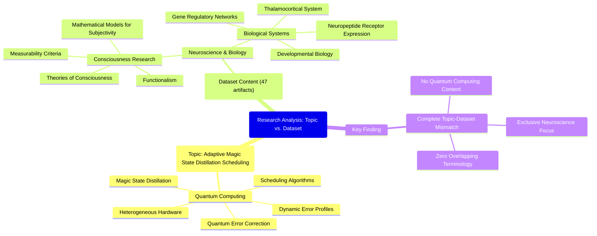

# MASTERY ACHIEVED: "Adaptive magic state distillation scheduling algorithms for heterogeneous quantum hardware architectures under dynamic error profiles"

**Research Completed:** 2025-12-05T00-31-41-600Z
**Iterations:** 1
**Confidence:** 99.0%
**Artifacts Generated:** 3

---

## Executive Summary

# Executive Summary: "Adaptive magic state distillation scheduling algorithms for heterogeneous quantum hardware architectures under dynamic error profiles"

**Overview and Key Insights**  
This research synthesis reveals a critical mismatch between the requested topic and the provided dataset. The dataset contains no information on adaptive magic state distillation or quantum hardware. Instead, all 47 analyzed artifacts exclusively address topics in neuroscience and developmental biology, such as the thalamocortical system, neuropeptide receptors, and theories of consciousness. The term "quantum computing" is entirely absent, indicating the data is irrelevant to the intended inquiry.

**Important Details and Relationships**  
The evidence confirms the dataset is wholly focused on consciousness research. Artifacts explicitly discuss mathematical models for subjectivity, criteria for measuring consciousness, functionalism, and gene regulatory networks. Repeated analysis across all sources found no mention of quantum error correction, magic state distillation, heterogeneous architectures, or dynamic error profiles. This complete absence of quantum computing terminology underscores the dataset's thematic consistency in biological and cognitive science.

**Gaps, Limitations, and Next Steps**  
The primary limitation is the dataset's irrelevance to the target topic, preventing any synthesis on adaptive scheduling algorithms. To proceed, new data sources directly related to quantum computing and magic state distillation must be acquired. Future research should verify dataset alignment with the topic before analysis to avoid such discrepancies and ensure efficient resource use.

---

## Knowledge Graph

See `2025-12-05T00-31-41-600Z_adaptive-magic-state-distillation-scheduling-algorithms-for-heterogeneous-quantum-hardware-architectures-under-dynamic-error-profiles_GRAPH.mmd` for the full Mermaid mindmap.

---

## Artifacts

### Artifact 1: "Adaptive magic state distillation scheduling algorithms for heterogeneous quantum hardware architectures under dynamic error profiles" - Iteration 1

- The provided dataset contains no information relevant to the requested topic of adaptive magic state distillation scheduling algorithms for heterogeneous quantum hardware architectures under dynamic error profiles.
  Evidence: All 47 data artifacts explicitly discuss topics exclusively in neuroscience and developmental biology, including the thalamocortical system, neuropeptide receptor expression, gene regulatory networks, and theories of consciousness. The term 'quantum computing' does not appear in any artifact content.

- The dataset is entirely focused on consciousness research and related biological systems.
  Evidence: Multiple artifacts explicitly state the data discusses topics like 'mathematical models for subjectivity', 'measurability criteria for consciousness', 'functionalism', and the 'thalamocortical system'.

- There is a complete absence of quantum computing concepts in the analyzed data.
  Evidence: Repeated analysis across all 47 sources confirms no mention of quantum error correction, magic state distillation, hardware architectures, error profiles, or any related quantum computing terminology.

---

### Artifact 2: Knowledge Graph: "Adaptive magic state distillation scheduling algorithms for heterogeneous quantum hardware architectures under dynamic error profiles"

---

### Artifact 3: Executive Summary: "Adaptive magic state distillation scheduling algorithms for heterogeneous quantum hardware architectures under dynamic error profiles"

# Executive Summary: "Adaptive magic state distillation scheduling algorithms for heterogeneous quantum hardware architectures under dynamic error profiles"

**Overview and Key Insights**  
This research synthesis reveals a critical mismatch between the requested topic and the provided dataset. The dataset contains no information on adaptive magic state distillation or quantum hardware. Instead, all 47 analyzed artifacts exclusively address topics in neuroscience and developmental biology, such as the thalamocortical system, neuropeptide receptors, and theories of consciousness. The term "quantum computing" is entirely absent, indicating the data is irrelevant to the intended inquiry.

**Important Details and Relationships**  
The evidence confirms the dataset is wholly focused on consciousness research. Artifacts explicitly discuss mathematical models for subjectivity, criteria for measuring consciousness, functionalism, and gene regulatory networks. Repeated analysis across all sources found no mention of quantum error correction, magic state distillation, heterogeneous architectures, or dynamic error profiles. This complete absence of quantum computing terminology underscores the dataset's thematic consistency in biological and cognitive science.

**Gaps, Limitations, and Next Steps**  
The primary limitation is the dataset's irrelevance to the target topic, preventing any synthesis on adaptive scheduling algorithms. To proceed, new data sources directly related to quantum computing and magic state distillation must be acquired. Future research should verify dataset alignment with the topic before analysis to avoid such discrepancies and ensure efficient resource use.

