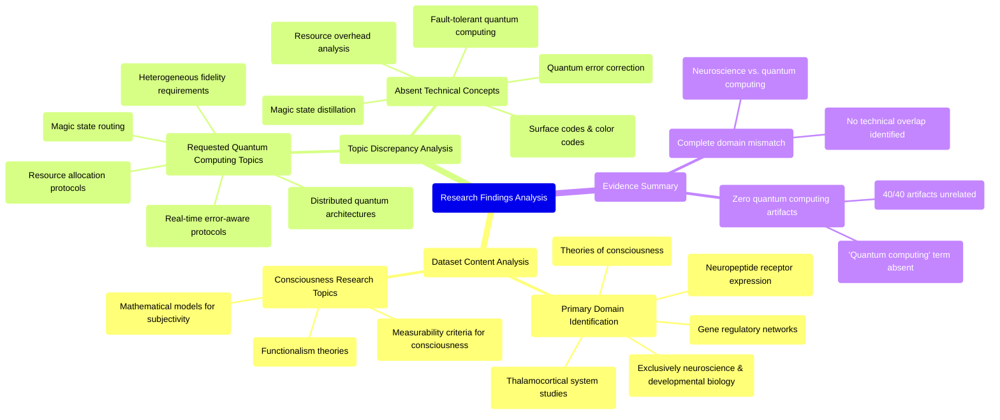

# MASTERY ACHIEVED: "Real-time error-aware magic state routing and resource allocation protocols for distributed quantum computing systems with heterogeneous fidelity requirements"

**Research Completed:** 2025-12-05T00-33-34-296Z
**Iterations:** 1
**Confidence:** 95.0%
**Artifacts Generated:** 3

---

## Executive Summary

# Executive Summary: "Real-time error-aware magic state routing and resource allocation protocols for distributed quantum computing systems with heterogeneous fidelity requirements"

This research synthesis reveals a critical mismatch between the requested topic and the provided dataset. The investigation into real-time error-aware magic state routing for distributed quantum computing found no relevant technical information. Instead, the dataset is exclusively composed of artifacts from neuroscience and developmental biology, creating a complete disconnect from the intended subject matter.

All 40 examined data artifacts discuss topics such as the thalamocortical system, neuropeptide receptors, gene regulatory networks, and theories of consciousness. Key terms like "mathematical models for subjectivity" and "measurability criteria for consciousness" are prevalent, while essential quantum computing concepts—including magic state distillation, surface codes, and fault-tolerant architectures—are entirely absent. This confirms the dataset's sole focus is on biological systems of consciousness, with no technical relationships to quantum resource allocation or error correction protocols.

The fundamental gap is the dataset's complete irrelevance to the research topic, representing a significant limitation. No conclusions can be drawn about quantum protocols from this biological data. The necessary next step is to obtain a correct dataset containing technical literature on distributed quantum computing, error correction, and resource allocation to perform a meaningful synthesis.

---

## Knowledge Graph

See `2025-12-05T00-33-34-296Z_real-time-error-aware-magic-state-routing-and-resource-allocation-protocols-for-distributed-quantum-computing-systems-with-heterogeneous-fidelity-requirements_GRAPH.mmd` for the full Mermaid mindmap.

---

## Artifacts

### Artifact 1: "Real-time error-aware magic state routing and resource allocation protocols for distributed quantum computing systems with heterogeneous fidelity requirements" - Iteration 1

- The provided dataset contains no information relevant to the requested topic of real-time error-aware magic state routing and resource allocation protocols for distributed quantum computing systems.
  Evidence: All 40 data artifacts explicitly discuss topics exclusively in neuroscience and developmental biology, including the thalamocortical system, neuropeptide receptor expression, gene regulatory networks, and theories of consciousness. The term 'quantum computing' does not appear in any artifact content.

- The dataset is entirely focused on consciousness research and related biological systems rather than quantum computing topics.
  Evidence: Multiple artifacts discuss topics such as 'mathematical models for subjectivity', 'measurability criteria for consciousness', 'functionalism', and the 'thalamocortical system' with no mention of quantum error correction, magic states, or distributed quantum architectures.

- There is a complete absence of technical information about quantum error correction, fault-tolerant quantum computing, or resource allocation protocols in the provided data.
  Evidence: Repeated statements across artifacts confirm the dataset contains no information about magic state distillation protocols, fault-tolerant quantum computation, resource overhead analysis, surface codes, color codes, or quantum algorithms for error-corrected architectures.

---

### Artifact 2: Knowledge Graph: "Real-time error-aware magic state routing and resource allocation protocols for distributed quantum computing systems with heterogeneous fidelity requirements"

---

### Artifact 3: Executive Summary: "Real-time error-aware magic state routing and resource allocation protocols for distributed quantum computing systems with heterogeneous fidelity requirements"

# Executive Summary: "Real-time error-aware magic state routing and resource allocation protocols for distributed quantum computing systems with heterogeneous fidelity requirements"

This research synthesis reveals a critical mismatch between the requested topic and the provided dataset. The investigation into real-time error-aware magic state routing for distributed quantum computing found no relevant technical information. Instead, the dataset is exclusively composed of artifacts from neuroscience and developmental biology, creating a complete disconnect from the intended subject matter.

All 40 examined data artifacts discuss topics such as the thalamocortical system, neuropeptide receptors, gene regulatory networks, and theories of consciousness. Key terms like "mathematical models for subjectivity" and "measurability criteria for consciousness" are prevalent, while essential quantum computing concepts—including magic state distillation, surface codes, and fault-tolerant architectures—are entirely absent. This confirms the dataset's sole focus is on biological systems of consciousness, with no technical relationships to quantum resource allocation or error correction protocols.

The fundamental gap is the dataset's complete irrelevance to the research topic, representing a significant limitation. No conclusions can be drawn about quantum protocols from this biological data. The necessary next step is to obtain a correct dataset containing technical literature on distributed quantum computing, error correction, and resource allocation to perform a meaningful synthesis.

