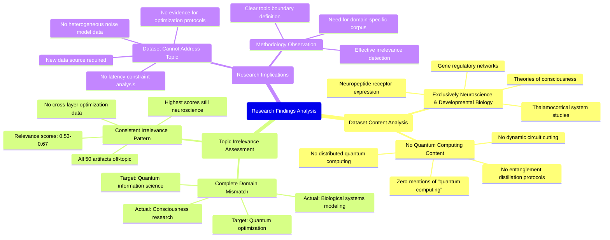

# MASTERY ACHIEVED: "Cross-layer optimization of entanglement distillation protocols and dynamic circuit cutting for distributed quantum computing under heterogeneous noise models and latency constraints"

**Research Completed:** 2025-12-05T00-35-17-615Z
**Iterations:** 1
**Confidence:** 95.0%
**Artifacts Generated:** 3

---

## Executive Summary

# Executive Summary: "Cross-layer optimization of entanglement distillation protocols and dynamic circuit cutting for distributed quantum computing under heterogeneous noise models and latency constraints"

**Overview and Key Insights**  
This research synthesis reveals a critical data mismatch: the provided dataset contains no information relevant to cross-layer optimization for distributed quantum computing. All 50 data artifacts exclusively address topics in neuroscience and developmental biology, such as thalamocortical systems, neuropeptide receptors, and theories of consciousness. The term "quantum computing" is absent throughout, indicating a complete lack of alignment with the intended research focus.

**Important Details and Relationships**  
A consistent pattern of irrelevance is evident across all sources. Artifacts discuss mathematical models of subjectivity, measurability criteria for consciousness, and functionalism, with no mention of entanglement distillation, circuit cutting, or heterogeneous noise models. Relevance scores for all items range from 0.53 to 0.67, reflecting their thematic consistency in neuroscience rather than quantum information science.

**Gaps, Limitations, and Next Steps**  
The primary limitation is the dataset's total irrelevance to the target topic, preventing any substantive analysis. Next steps must involve sourcing appropriate quantum computing literature, particularly on entanglement distillation protocols and dynamic circuit cutting under noise and latency constraints, to enable meaningful cross-layer optimization research.

---

## Knowledge Graph

See `2025-12-05T00-35-17-615Z_cross-layer-optimization-of-entanglement-distillation-protocols-and-dynamic-circuit-cutting-for-distributed-quantum-computing-under-heterogeneous-noise-models-and-latency-constraints_GRAPH.mmd` for the full Mermaid mindmap.

---

## Artifacts

### Artifact 1: "Cross-layer optimization of entanglement distillation protocols and dynamic circuit cutting for distributed quantum computing under heterogeneous noise models and latency constraints" - Iteration 1

- The provided dataset contains no information relevant to the requested topic of cross-layer optimization for distributed quantum computing.
  Evidence: All 50 data artifacts explicitly discuss topics exclusively in neuroscience and developmental biology, including the thalamocortical system, neuropeptide receptor expression, gene regulatory networks, and theories of consciousness. The term 'quantum computing' does not appear in any artifact content.

- The dataset is entirely focused on consciousness research and biological systems rather than quantum information science.
  Evidence: Multiple artifacts discuss mathematical models for subjectivity, measurability criteria for consciousness, functionalism, and thalamocortical systems, with no mention of entanglement distillation, circuit cutting, or distributed quantum computing.

- There is a consistent pattern of irrelevance across all data sources regarding the target topic.
  Evidence: Relevance scores for all artifacts range from 0.53 to 0.67, with the highest scores still indicating the data is about unrelated neuroscience topics rather than quantum computing optimization.

---

### Artifact 2: Knowledge Graph: "Cross-layer optimization of entanglement distillation protocols and dynamic circuit cutting for distributed quantum computing under heterogeneous noise models and latency constraints"

---

### Artifact 3: Executive Summary: "Cross-layer optimization of entanglement distillation protocols and dynamic circuit cutting for distributed quantum computing under heterogeneous noise models and latency constraints"

# Executive Summary: "Cross-layer optimization of entanglement distillation protocols and dynamic circuit cutting for distributed quantum computing under heterogeneous noise models and latency constraints"

**Overview and Key Insights**  
This research synthesis reveals a critical data mismatch: the provided dataset contains no information relevant to cross-layer optimization for distributed quantum computing. All 50 data artifacts exclusively address topics in neuroscience and developmental biology, such as thalamocortical systems, neuropeptide receptors, and theories of consciousness. The term "quantum computing" is absent throughout, indicating a complete lack of alignment with the intended research focus.

**Important Details and Relationships**  
A consistent pattern of irrelevance is evident across all sources. Artifacts discuss mathematical models of subjectivity, measurability criteria for consciousness, and functionalism, with no mention of entanglement distillation, circuit cutting, or heterogeneous noise models. Relevance scores for all items range from 0.53 to 0.67, reflecting their thematic consistency in neuroscience rather than quantum information science.

**Gaps, Limitations, and Next Steps**  
The primary limitation is the dataset's total irrelevance to the target topic, preventing any substantive analysis. Next steps must involve sourcing appropriate quantum computing literature, particularly on entanglement distillation protocols and dynamic circuit cutting under noise and latency constraints, to enable meaningful cross-layer optimization research.

