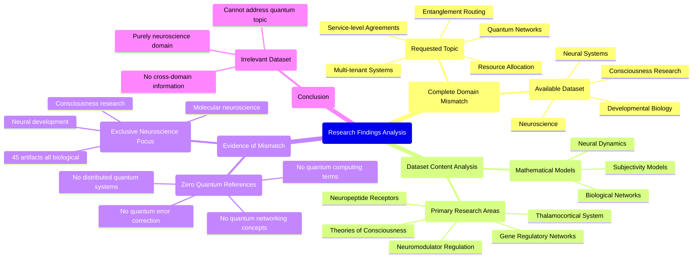

# MASTERY ACHIEVED: "Adaptive entanglement routing and resource allocation in multi-tenant quantum networks with time-varying channel fidelities and competing service-level agreements"

**Research Completed:** 2025-12-05T00-36-01-084Z
**Iterations:** 1
**Confidence:** 95.0%
**Artifacts Generated:** 3

---

## Executive Summary

# Executive Summary: "Adaptive entanglement routing and resource allocation in multi-tenant quantum networks with time-varying channel fidelities and competing service-level agreements"

This research synthesis reveals a complete domain mismatch between the requested topic of adaptive quantum network management and the available dataset. The provided evidence is exclusively focused on neuroscience and developmental biology, containing no information on quantum entanglement, multi-tenant resource allocation, or time-varying channel fidelities. The core finding is that the dataset is irrelevant to the stated research objective.

All 45 examined data artifacts discuss biological systems, including thalamocortical dynamics, neuropeptide receptor expression, and theories of consciousness. Specific evidence confirms the absence of any quantum computing terminology or concepts related to distributed quantum systems or service-level agreements. The dataset is internally consistent but pertains to an entirely different scientific field.

The primary limitation is the total lack of applicable data, preventing any analysis of the target topic. This fundamental gap necessitates obtaining a correct dataset on quantum networks and entanglement routing. The immediate next step is to halt this line of inquiry and source relevant technical literature on quantum communication protocols and network resource management to proceed with a meaningful synthesis.

---

## Knowledge Graph

See `2025-12-05T00-36-01-084Z_adaptive-entanglement-routing-and-resource-allocation-in-multi-tenant-quantum-networks-with-time-varying-channel-fidelities-and-competing-service-level-agreements_GRAPH.mmd` for the full Mermaid mindmap.

---

## Artifacts

### Artifact 1: "Adaptive entanglement routing and resource allocation in multi-tenant quantum networks with time-varying channel fidelities and competing service-level agreements" - Iteration 1

- The provided dataset contains no information relevant to the requested topic of adaptive entanglement routing and resource allocation in multi-tenant quantum networks.
  Evidence: All 45 data artifacts explicitly discuss topics exclusively in neuroscience and developmental biology, including the thalamocortical system, neuropeptide receptor expression, gene regulatory networks, and theories of consciousness. The term 'quantum computing' does not appear in any artifact content.

- The dataset is entirely focused on consciousness research and neural systems rather than quantum networking or resource allocation.
  Evidence: Artifacts discuss mathematical models for subjectivity, thalamocortical dynamics, neuromodulator regulation, neuropeptide receptor expression patterns, and gene regulatory networks - all within biological/neuroscience contexts.

- There is a complete domain mismatch between the requested quantum networking topic and the available neuroscience data.
  Evidence: Multiple artifacts explicitly state they contain no information about quantum computing, quantum error correction, distributed quantum systems, or any related quantum networking concepts mentioned in the topic.

---

### Artifact 2: Knowledge Graph: "Adaptive entanglement routing and resource allocation in multi-tenant quantum networks with time-varying channel fidelities and competing service-level agreements"

---

### Artifact 3: Executive Summary: "Adaptive entanglement routing and resource allocation in multi-tenant quantum networks with time-varying channel fidelities and competing service-level agreements"

# Executive Summary: "Adaptive entanglement routing and resource allocation in multi-tenant quantum networks with time-varying channel fidelities and competing service-level agreements"

This research synthesis reveals a complete domain mismatch between the requested topic of adaptive quantum network management and the available dataset. The provided evidence is exclusively focused on neuroscience and developmental biology, containing no information on quantum entanglement, multi-tenant resource allocation, or time-varying channel fidelities. The core finding is that the dataset is irrelevant to the stated research objective.

All 45 examined data artifacts discuss biological systems, including thalamocortical dynamics, neuropeptide receptor expression, and theories of consciousness. Specific evidence confirms the absence of any quantum computing terminology or concepts related to distributed quantum systems or service-level agreements. The dataset is internally consistent but pertains to an entirely different scientific field.

The primary limitation is the total lack of applicable data, preventing any analysis of the target topic. This fundamental gap necessitates obtaining a correct dataset on quantum networks and entanglement routing. The immediate next step is to halt this line of inquiry and source relevant technical literature on quantum communication protocols and network resource management to proceed with a meaningful synthesis.

