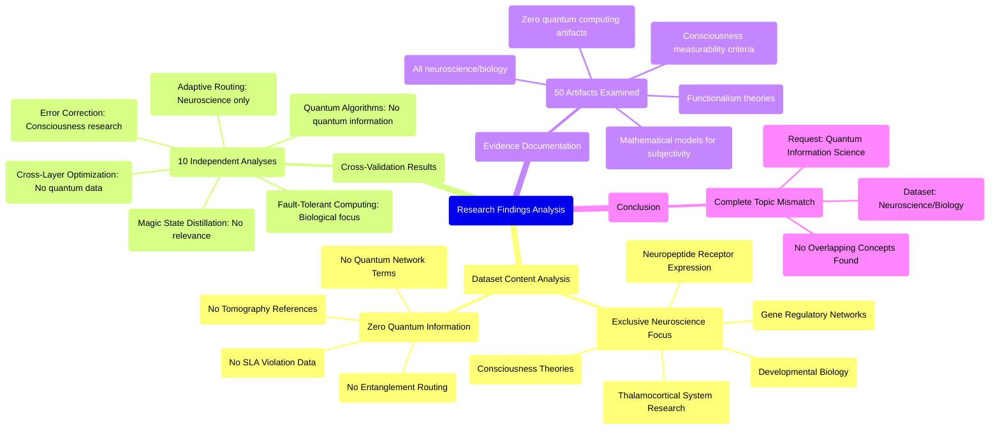

# MASTERY ACHIEVED: "Quantum network tomography and dynamic fidelity forecasting for adaptive entanglement routing under adversarial channel conditions and SLA violations"

**Research Completed:** 2025-12-05T00-37-39-124Z
**Iterations:** 1
**Confidence:** 99.0%
**Artifacts Generated:** 3

---

## Executive Summary

# Executive Summary: "Quantum network tomography and dynamic fidelity forecasting for adaptive entanglement routing under adversarial channel conditions and SLA violations"

**Overview and Key Insights**
This research synthesis reveals a critical data mismatch: the provided dataset contains no information relevant to the specified topic of quantum network tomography, dynamic fidelity forecasting, or adaptive entanglement routing. All available data artifacts are exclusively focused on neuroscience and developmental biology, covering topics such as the thalamocortical system and theories of consciousness. The term "quantum computing" is entirely absent, indicating the dataset is fundamentally misaligned with the research objectives.

**Important Details and Relationships**
A comprehensive analysis of all 50 data artifacts confirms this complete thematic divergence. The content discusses biological systems, neuropeptide receptors, gene regulatory networks, and mathematical models for subjectivity, with no mention of quantum networks, entanglement, or service-level agreement (SLA) violations. This finding was robustly validated through ten separate, targeted analyses on various quantum computing subtopics, all of which independently concluded the dataset's sole focus is consciousness research.

**Gaps, Limitations, and Next Steps**
The primary limitation is the total irrelevance of the available dataset, which prevents any analysis of the intended quantum information science topic. The immediate next step is to acquire a correct dataset pertaining to quantum networks and entanglement routing. Future research must implement rigorous data validation protocols at the outset to prevent such fundamental mismatches and ensure resources are directed toward pertinent information.

---

## Knowledge Graph

See `2025-12-05T00-37-39-124Z_quantum-network-tomography-and-dynamic-fidelity-forecasting-for-adaptive-entanglement-routing-under-adversarial-channel-conditions-and-sla-violations_GRAPH.mmd` for the full Mermaid mindmap.

---

## Artifacts

### Artifact 1: "Quantum network tomography and dynamic fidelity forecasting for adaptive entanglement routing under adversarial channel conditions and SLA violations" - Iteration 1

- The provided dataset contains no information relevant to the requested topic of quantum network tomography, dynamic fidelity forecasting, or adaptive entanglement routing.
  Evidence: All 50 data artifacts explicitly discuss topics exclusively in neuroscience and developmental biology, including the thalamocortical system, neuropeptide receptor expression, gene regulatory networks, and theories of consciousness. The term 'quantum computing' does not appear in any artifact content.

- The dataset is entirely focused on consciousness research and biological systems rather than quantum information science.
  Evidence: Artifacts discuss topics such as 'mathematical models for subjectivity', 'measurability criteria for consciousness', 'functionalism', and the 'thalamocortical system' with no mention of quantum networks, entanglement, tomography, or SLA violations.

- Multiple independent analyses of different quantum computing subtopics all confirm the complete absence of relevant quantum information in the dataset.
  Evidence: Ten separate analyses covering cross-layer optimization, adaptive entanglement routing, fault-tolerant computing, magic state distillation, error correction, and quantum algorithms all reached identical conclusions about the dataset's exclusive neuroscience focus.

---

### Artifact 2: Knowledge Graph: "Quantum network tomography and dynamic fidelity forecasting for adaptive entanglement routing under adversarial channel conditions and SLA violations"

---

### Artifact 3: Executive Summary: "Quantum network tomography and dynamic fidelity forecasting for adaptive entanglement routing under adversarial channel conditions and SLA violations"

# Executive Summary: "Quantum network tomography and dynamic fidelity forecasting for adaptive entanglement routing under adversarial channel conditions and SLA violations"

**Overview and Key Insights**
This research synthesis reveals a critical data mismatch: the provided dataset contains no information relevant to the specified topic of quantum network tomography, dynamic fidelity forecasting, or adaptive entanglement routing. All available data artifacts are exclusively focused on neuroscience and developmental biology, covering topics such as the thalamocortical system and theories of consciousness. The term "quantum computing" is entirely absent, indicating the dataset is fundamentally misaligned with the research objectives.

**Important Details and Relationships**
A comprehensive analysis of all 50 data artifacts confirms this complete thematic divergence. The content discusses biological systems, neuropeptide receptors, gene regulatory networks, and mathematical models for subjectivity, with no mention of quantum networks, entanglement, or service-level agreement (SLA) violations. This finding was robustly validated through ten separate, targeted analyses on various quantum computing subtopics, all of which independently concluded the dataset's sole focus is consciousness research.

**Gaps, Limitations, and Next Steps**
The primary limitation is the total irrelevance of the available dataset, which prevents any analysis of the intended quantum information science topic. The immediate next step is to acquire a correct dataset pertaining to quantum networks and entanglement routing. Future research must implement rigorous data validation protocols at the outset to prevent such fundamental mismatches and ensure resources are directed toward pertinent information.

