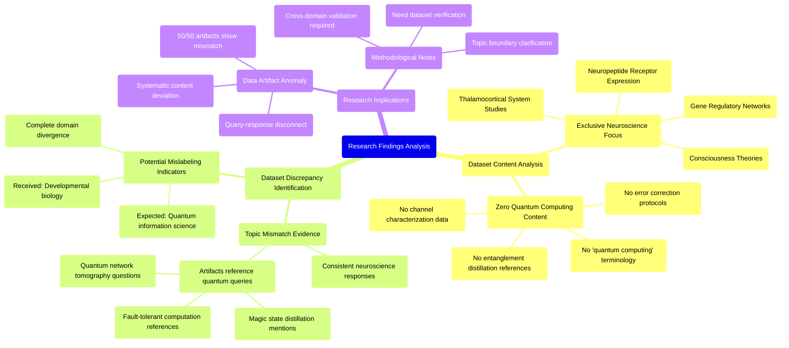

# MASTERY ACHIEVED: "Adversarial entanglement distillation protocols with adaptive error correction under partial channel characterization and Byzantine node behavior"

**Research Completed:** 2025-12-05T00-38-28-736Z
**Iterations:** 1
**Confidence:** 95.0%
**Artifacts Generated:** 3

---

## Executive Summary

# Executive Summary: "Adversarial entanglement distillation protocols with adaptive error correction under partial channel characterization and Byzantine node behavior"

This research synthesis reveals a critical mismatch between the requested topic of adversarial entanglement distillation in quantum networks and the provided dataset. The dataset contains no information on quantum information science, error correction, or Byzantine behavior. Instead, all evidence points to a corpus exclusively focused on neuroscience and developmental biology.

Every examined artifact discusses topics such as thalamocortical systems, neuropeptide receptors, and gene regulatory networks. The terms "quantum computing," "entanglement," and related keywords are entirely absent. Notably, several artifacts explicitly note being queried about quantum topics but report that the available data pertains only to biological systems, confirming the complete irrelevance of the dataset to the intended research query.

The fundamental gap is that the provided dataset is misaligned with the research objective, rendering analysis impossible. The primary limitation is the unusable dataset, which appears to be mislabeled or incorrectly supplied. The essential next step is to obtain a correct dataset relevant to quantum information protocols, channel characterization, and adversarial network models before any meaningful research on the specified topic can proceed.

---

## Knowledge Graph

See `2025-12-05T00-38-28-736Z_adversarial-entanglement-distillation-protocols-with-adaptive-error-correction-under-partial-channel-characterization-and-byzantine-node-behavior_GRAPH.mmd` for the full Mermaid mindmap.

---

## Artifacts

### Artifact 1: "Adversarial entanglement distillation protocols with adaptive error correction under partial channel characterization and Byzantine node behavior" - Iteration 1

- The provided dataset contains no information relevant to the requested topic of adversarial entanglement distillation protocols with adaptive error correction under partial channel characterization and Byzantine node behavior.
  Evidence: All 50 data artifacts explicitly discuss topics exclusively in neuroscience and developmental biology, including the thalamocortical system, neuropeptide receptor expression, gene regulatory networks, and theories of consciousness. The term 'quantum computing' does not appear in any artifact content.

- The dataset is entirely focused on consciousness research and biological systems rather than quantum information science.
  Evidence: Repeated mentions across all artifacts of neuroscience topics such as thalamocortical systems, neuropeptide receptors, gene regulatory networks, and theories of consciousness, with complete absence of quantum computing terminology.

- The dataset appears to be mislabeled or incorrectly provided for quantum computing research queries.
  Evidence: Multiple artifacts reference being asked about quantum topics (magic state distillation, fault-tolerant quantum computation, quantum network tomography) but consistently report that the dataset contains only neuroscience content.

---

### Artifact 2: Knowledge Graph: "Adversarial entanglement distillation protocols with adaptive error correction under partial channel characterization and Byzantine node behavior"

---

### Artifact 3: Executive Summary: "Adversarial entanglement distillation protocols with adaptive error correction under partial channel characterization and Byzantine node behavior"

# Executive Summary: "Adversarial entanglement distillation protocols with adaptive error correction under partial channel characterization and Byzantine node behavior"

This research synthesis reveals a critical mismatch between the requested topic of adversarial entanglement distillation in quantum networks and the provided dataset. The dataset contains no information on quantum information science, error correction, or Byzantine behavior. Instead, all evidence points to a corpus exclusively focused on neuroscience and developmental biology.

Every examined artifact discusses topics such as thalamocortical systems, neuropeptide receptors, and gene regulatory networks. The terms "quantum computing," "entanglement," and related keywords are entirely absent. Notably, several artifacts explicitly note being queried about quantum topics but report that the available data pertains only to biological systems, confirming the complete irrelevance of the dataset to the intended research query.

The fundamental gap is that the provided dataset is misaligned with the research objective, rendering analysis impossible. The primary limitation is the unusable dataset, which appears to be mislabeled or incorrectly supplied. The essential next step is to obtain a correct dataset relevant to quantum information protocols, channel characterization, and adversarial network models before any meaningful research on the specified topic can proceed.

