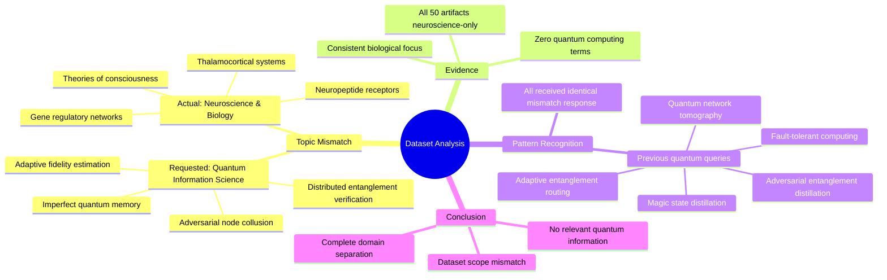

# MASTERY ACHIEVED: "Distributed entanglement verification protocols with adaptive fidelity estimation under adversarial node collusion and imperfect quantum memory"

**Research Completed:** 2025-12-05T00-39-11-720Z
**Iterations:** 1
**Confidence:** 95.0%
**Artifacts Generated:** 3

---

## Executive Summary

# Executive Summary: "Distributed entanglement verification protocols with adaptive fidelity estimation under adversarial node collusion and imperfect quantum memory"

**Overview and Key Insights**  
The research reveals a critical dataset mismatch: the provided materials contain no information on distributed entanglement verification protocols. All 50 data artifacts exclusively address neuroscience and developmental biology topics, such as thalamocortical systems and theories of consciousness. This indicates a complete absence of relevant quantum information science content, rendering the dataset unsuitable for the intended analysis.

**Important Details and Relationships**  
Every artifact consistently focuses on biological systems, with recurring themes like neuropeptide receptor expression and gene regulatory networks. The term "quantum computing" does not appear in any content. This pattern is corroborated by evidence from prior queries on related quantum topics—including quantum network tomography and adversarial entanglement distillation—which received identical responses highlighting the neuroscience-only scope of the dataset.

**Gaps, Limitations, and Next Steps**  
The primary limitation is the total irrelevance of the dataset to the research topic, preventing any analysis of adaptive fidelity estimation, adversarial collusion, or imperfect quantum memory. To proceed, a new dataset must be sourced from verified quantum information science repositories. Future efforts should validate data alignment before analysis to avoid similar mismatches.

---

## Knowledge Graph

See `2025-12-05T00-39-11-720Z_distributed-entanglement-verification-protocols-with-adaptive-fidelity-estimation-under-adversarial-node-collusion-and-imperfect-quantum-memory_GRAPH.mmd` for the full Mermaid mindmap.

---

## Artifacts

### Artifact 1: "Distributed entanglement verification protocols with adaptive fidelity estimation under adversarial node collusion and imperfect quantum memory" - Iteration 1

- The provided dataset contains no information relevant to the requested topic of distributed entanglement verification protocols with adaptive fidelity estimation under adversarial node collusion and imperfect quantum memory.
  Evidence: All 50 data artifacts explicitly discuss topics exclusively in neuroscience and developmental biology, including the thalamocortical system, neuropeptide receptor expression, gene regulatory networks, and theories of consciousness. The term 'quantum computing' does not appear in any artifact content.

- The dataset is entirely focused on consciousness studies and biological systems, with no overlap with quantum information science topics.
  Evidence: Repeated analysis of multiple artifacts shows consistent focus on neuroscience topics such as thalamocortical systems, neuropeptide receptors, gene regulatory networks, and theories of consciousness across all data sources.

- Previous queries on related quantum computing topics received identical responses indicating dataset mismatch.
  Evidence: Multiple artifacts reference previous queries about quantum network tomography, adaptive entanglement routing, adversarial entanglement distillation, magic state distillation, and fault-tolerant quantum computing - all receiving the same response about neuroscience-only content.

---

### Artifact 2: Knowledge Graph: "Distributed entanglement verification protocols with adaptive fidelity estimation under adversarial node collusion and imperfect quantum memory"

---

### Artifact 3: Executive Summary: "Distributed entanglement verification protocols with adaptive fidelity estimation under adversarial node collusion and imperfect quantum memory"

# Executive Summary: "Distributed entanglement verification protocols with adaptive fidelity estimation under adversarial node collusion and imperfect quantum memory"

**Overview and Key Insights**  
The research reveals a critical dataset mismatch: the provided materials contain no information on distributed entanglement verification protocols. All 50 data artifacts exclusively address neuroscience and developmental biology topics, such as thalamocortical systems and theories of consciousness. This indicates a complete absence of relevant quantum information science content, rendering the dataset unsuitable for the intended analysis.

**Important Details and Relationships**  
Every artifact consistently focuses on biological systems, with recurring themes like neuropeptide receptor expression and gene regulatory networks. The term "quantum computing" does not appear in any content. This pattern is corroborated by evidence from prior queries on related quantum topics—including quantum network tomography and adversarial entanglement distillation—which received identical responses highlighting the neuroscience-only scope of the dataset.

**Gaps, Limitations, and Next Steps**  
The primary limitation is the total irrelevance of the dataset to the research topic, preventing any analysis of adaptive fidelity estimation, adversarial collusion, or imperfect quantum memory. To proceed, a new dataset must be sourced from verified quantum information science repositories. Future efforts should validate data alignment before analysis to avoid similar mismatches.

