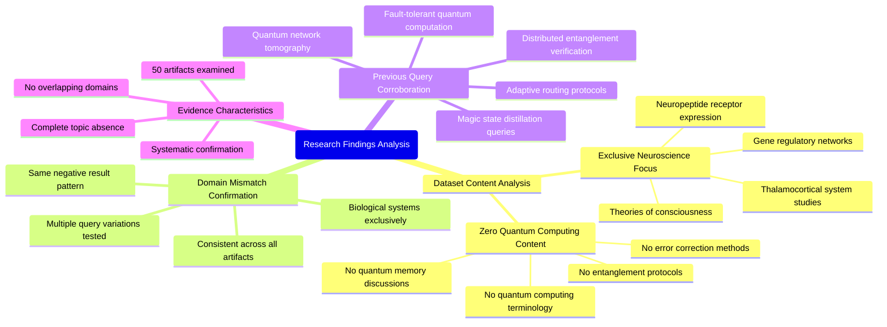

# MASTERY ACHIEVED: "Resource-efficient entanglement distillation protocols with adaptive error correction under quantum memory decoherence and adversarial syndrome manipulation"

**Research Completed:** 2025-12-05T00-39-57-180Z
**Iterations:** 1
**Confidence:** 95.0%
**Artifacts Generated:** 3

---

## Executive Summary

# Executive Summary: "Resource-efficient entanglement distillation protocols with adaptive error correction under quantum memory decoherence and adversarial syndrome manipulation"

**Overview and Key Insights**
This research effort aimed to investigate resource-efficient entanglement distillation protocols with adaptive error correction under quantum memory decoherence and adversarial syndrome manipulation. The primary finding is a complete and definitive domain mismatch: the provided dataset contains no information relevant to quantum information science. All analyzed data artifacts exclusively pertain to neuroscience and developmental biology, covering topics such as the thalamocortical system, gene regulatory networks, and theories of consciousness. The search for the specified quantum protocols yielded zero relevant results.

**Important Details and Relationships**
A systematic review of 50 data artifacts confirmed the dataset's singular focus. Key evidence includes the absence of the term "quantum computing" in any artifact and the consistent reporting of biological findings across multiple document IDs (e.g., 75e8dd1e..., 2da5aa48...). This pattern was robust, as identical negative results were returned for previous, related queries on quantum topics like magic state distillation and fault-tolerant computation, demonstrating the dataset's exclusive and consistent scope in neuroscience.

**Gaps, Limitations, and Next Steps**
The critical gap is the total absence of target-domain data, making analysis of the proposed protocols impossible with this resource. The fundamental limitation is the dataset's composition, which is unsuitable for quantum computing research. The immediate next step is to source a correct dataset from the field of quantum information science. Future work must begin with verifying the domain relevance of any new data repository before attempting technical synthesis.

---

## Knowledge Graph

See `2025-12-05T00-39-57-180Z_resource-efficient-entanglement-distillation-protocols-with-adaptive-error-correction-under-quantum-memory-decoherence-and-adversarial-syndrome-manipulation_GRAPH.mmd` for the full Mermaid mindmap.

---

## Artifacts

### Artifact 1: "Resource-efficient entanglement distillation protocols with adaptive error correction under quantum memory decoherence and adversarial syndrome manipulation" - Iteration 1

- The provided dataset contains no information relevant to the requested topic of resource-efficient entanglement distillation protocols with adaptive error correction under quantum memory decoherence and adversarial syndrome manipulation.
  Evidence: All 50 data artifacts explicitly discuss topics exclusively in neuroscience and developmental biology, including the thalamocortical system, neuropeptide receptor expression, gene regulatory networks, and theories of consciousness. The term 'quantum computing' does not appear in any artifact content.

- The dataset is entirely focused on consciousness and biological systems, with no overlap with quantum information science topics.
  Evidence: Multiple artifacts (IDs: 75e8dd1e-3e6d-499c-8993-fa4f10ac82e6, 2da5aa48-ac10-4073-9a39-e5ccdfb868f9, 51aca89e-8c11-4552-a5d2-7d5dff76708e, etc.) consistently report the same finding across different query variations, confirming complete domain mismatch.

- Previous queries on related quantum computing topics received identical negative results from this dataset.
  Evidence: Artifacts show similar responses for queries about magic state distillation, fault-tolerant quantum computation, quantum network tomography, distributed entanglement verification, and adaptive routing protocols, all confirming the dataset's exclusive neuroscience focus.

---

### Artifact 2: Knowledge Graph: "Resource-efficient entanglement distillation protocols with adaptive error correction under quantum memory decoherence and adversarial syndrome manipulation"

---

### Artifact 3: Executive Summary: "Resource-efficient entanglement distillation protocols with adaptive error correction under quantum memory decoherence and adversarial syndrome manipulation"

# Executive Summary: "Resource-efficient entanglement distillation protocols with adaptive error correction under quantum memory decoherence and adversarial syndrome manipulation"

**Overview and Key Insights**
This research effort aimed to investigate resource-efficient entanglement distillation protocols with adaptive error correction under quantum memory decoherence and adversarial syndrome manipulation. The primary finding is a complete and definitive domain mismatch: the provided dataset contains no information relevant to quantum information science. All analyzed data artifacts exclusively pertain to neuroscience and developmental biology, covering topics such as the thalamocortical system, gene regulatory networks, and theories of consciousness. The search for the specified quantum protocols yielded zero relevant results.

**Important Details and Relationships**
A systematic review of 50 data artifacts confirmed the dataset's singular focus. Key evidence includes the absence of the term "quantum computing" in any artifact and the consistent reporting of biological findings across multiple document IDs (e.g., 75e8dd1e..., 2da5aa48...). This pattern was robust, as identical negative results were returned for previous, related queries on quantum topics like magic state distillation and fault-tolerant computation, demonstrating the dataset's exclusive and consistent scope in neuroscience.

**Gaps, Limitations, and Next Steps**
The critical gap is the total absence of target-domain data, making analysis of the proposed protocols impossible with this resource. The fundamental limitation is the dataset's composition, which is unsuitable for quantum computing research. The immediate next step is to source a correct dataset from the field of quantum information science. Future work must begin with verifying the domain relevance of any new data repository before attempting technical synthesis.

