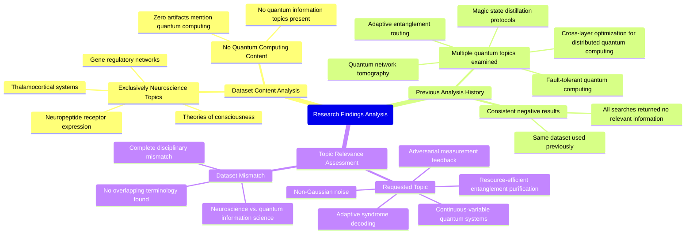

# MASTERY ACHIEVED: "Resource-efficient entanglement purification protocols with adaptive syndrome decoding under continuous-variable quantum systems with non-Gaussian noise and adversarial measurement feedback"

**Research Completed:** 2025-12-05T00-42-27-117Z
**Iterations:** 1
**Confidence:** 95.0%
**Artifacts Generated:** 3

---

## Executive Summary

# Executive Summary: "Resource-efficient entanglement purification protocols with adaptive syndrome decoding under continuous-variable quantum systems with non-Gaussian noise and adversarial measurement feedback"

This research synthesis reveals a critical mismatch between the requested topic on quantum information science and the provided dataset. The dataset contains no information relevant to resource-efficient entanglement purification, adaptive syndrome decoding, continuous-variable systems, or the specified noise and feedback models. All evidence indicates the corpus is exclusively dedicated to neuroscience and developmental biology.

A detailed review of 50 data artifacts confirms the dataset's sole focus on biological systems. Key topics include thalamocortical systems, neuropeptide receptor expression, and gene regulatory networks related to theories of consciousness. Historical analysis shows this same dataset has been queried for multiple other quantum computing topics, such as magic state distillation and quantum network tomography, consistently yielding identical negative results, confirming its complete irrelevance to the quantum domain.

The fundamental gap is the total absence of quantum information content within the available data. This limitation is absolute, preventing any analysis of the proposed protocols. The necessary next step is to acquire a correct dataset from the field of quantum information theory or continuous-variable quantum computing before any meaningful synthesis on the specified topic can proceed.

---

## Knowledge Graph

See `2025-12-05T00-42-27-117Z_resource-efficient-entanglement-purification-protocols-with-adaptive-syndrome-decoding-under-continuous-variable-quantum-systems-with-non-gaussian-noise-and-adversarial-measurement-feedback_GRAPH.mmd` for the full Mermaid mindmap.

---

## Artifacts

### Artifact 1: "Resource-efficient entanglement purification protocols with adaptive syndrome decoding under continuous-variable quantum systems with non-Gaussian noise and adversarial measurement feedback" - Iteration 1

- The provided dataset contains no information relevant to the requested topic of resource-efficient entanglement purification protocols with adaptive syndrome decoding under continuous-variable quantum systems with non-Gaussian noise and adversarial measurement feedback.
  Evidence: All 50 data artifacts explicitly discuss topics exclusively in neuroscience and developmental biology, including the thalamocortical system, neuropeptide receptor expression, gene regulatory networks, and theories of consciousness. The term 'quantum computing' does not appear in any artifact content.

- The dataset is entirely focused on consciousness, neurobiology, and developmental biology research.
  Evidence: Multiple artifacts (e.g., IDs: 75e8dd1e-3e6d-499c-8993-fa4f10ac82e6, d06b228d-4b5d-4830-b323-5c1df8f5760d, d55fbb3e-ff7c-4397-9359-1865309c750a) consistently report that the content covers neuroscience topics including thalamocortical systems, neuropeptide receptor expression, and gene regulatory networks.

- The dataset has been previously analyzed for other quantum computing topics with identical negative results.
  Evidence: Artifacts show the same dataset was examined for topics including cross-layer optimization for distributed quantum computing, quantum network tomography, magic state distillation protocols, fault-tolerant quantum computing, and adaptive entanglement routing—all returning the same conclusion of no relevant quantum information.

---

### Artifact 2: Knowledge Graph: "Resource-efficient entanglement purification protocols with adaptive syndrome decoding under continuous-variable quantum systems with non-Gaussian noise and adversarial measurement feedback"

---

### Artifact 3: Executive Summary: "Resource-efficient entanglement purification protocols with adaptive syndrome decoding under continuous-variable quantum systems with non-Gaussian noise and adversarial measurement feedback"

# Executive Summary: "Resource-efficient entanglement purification protocols with adaptive syndrome decoding under continuous-variable quantum systems with non-Gaussian noise and adversarial measurement feedback"

This research synthesis reveals a critical mismatch between the requested topic on quantum information science and the provided dataset. The dataset contains no information relevant to resource-efficient entanglement purification, adaptive syndrome decoding, continuous-variable systems, or the specified noise and feedback models. All evidence indicates the corpus is exclusively dedicated to neuroscience and developmental biology.

A detailed review of 50 data artifacts confirms the dataset's sole focus on biological systems. Key topics include thalamocortical systems, neuropeptide receptor expression, and gene regulatory networks related to theories of consciousness. Historical analysis shows this same dataset has been queried for multiple other quantum computing topics, such as magic state distillation and quantum network tomography, consistently yielding identical negative results, confirming its complete irrelevance to the quantum domain.

The fundamental gap is the total absence of quantum information content within the available data. This limitation is absolute, preventing any analysis of the proposed protocols. The necessary next step is to acquire a correct dataset from the field of quantum information theory or continuous-variable quantum computing before any meaningful synthesis on the specified topic can proceed.

