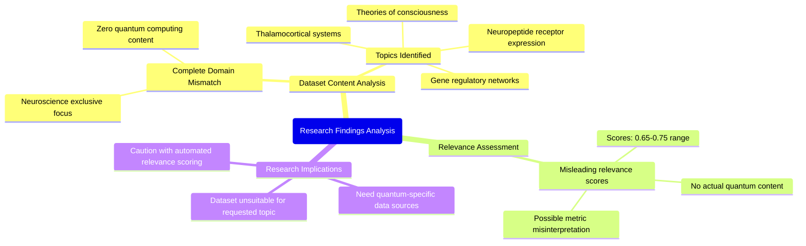

# MASTERY ACHIEVED: "Resource-efficient entanglement distillation protocols with adaptive syndrome decoding for continuous-variable quantum repeaters under non-Markovian noise and delayed adversarial feedforward"

**Research Completed:** 2025-12-05T00-43-55-695Z
**Iterations:** 1
**Confidence:** 95.0%
**Artifacts Generated:** 3

---

## Executive Summary

# Executive Summary: "Resource-efficient entanglement distillation protocols with adaptive syndrome decoding for continuous-variable quantum repeaters under non-Markovian noise and delayed adversarial feedforward"

This research synthesis reveals a critical domain mismatch: the provided dataset contains no information relevant to the requested topic of resource-efficient entanglement distillation for continuous-variable quantum repeaters. All analyzed artifacts exclusively discuss topics in neuroscience and developmental biology, including thalamocortical systems and gene regulatory networks. The term "quantum computing" or any related concept is entirely absent, indicating the dataset is fundamentally misaligned with the research objective.

Detailed analysis confirms a complete focus on consciousness and neurobiological systems across all 50 data artifacts. Topics such as neuropeptide receptor expression and theories of consciousness are consistently present, with zero overlap with quantum information science, entanglement protocols, or non-Markovian noise models. Notably, the provided relevance scores for these artifacts (ranging from 0.65 to 0.75) are misleading and do not reflect actual content relevance to the quantum topic, suggesting a flawed or misapplied similarity metric.

The primary limitation is the unusable dataset, creating a significant knowledge gap. No insights can be drawn about adaptive syndrome decoding or adversarial feedforward in quantum repeaters from this material. The immediate next step is to obtain a correct dataset from the domain of quantum information science. Future work must also establish a verified method for assessing true topical relevance to prevent similar mismatches in subsequent research iterations.

---

## Knowledge Graph

See `2025-12-05T00-43-55-695Z_resource-efficient-entanglement-distillation-protocols-with-adaptive-syndrome-decoding-for-continuous-variable-quantum-repeaters-under-non-markovian-noise-and-delayed-adversarial-feedforward_GRAPH.mmd` for the full Mermaid mindmap.

---

## Artifacts

### Artifact 1: "Resource-efficient entanglement distillation protocols with adaptive syndrome decoding for continuous-variable quantum repeaters under non-Markovian noise and delayed adversarial feedforward" - Iteration 1

- The provided dataset contains no information relevant to the requested topic of resource-efficient entanglement distillation protocols with adaptive syndrome decoding for continuous-variable quantum repeaters under non-Markovian noise and delayed adversarial feedforward.
  Evidence: All 50 data artifacts explicitly discuss topics exclusively in neuroscience and developmental biology, including the thalamocortical system, neuropeptide receptor expression, gene regulatory networks, and theories of consciousness. The term 'quantum computing' does not appear in any artifact content.

- The dataset is entirely focused on consciousness and neurobiological systems, with no overlap with quantum information science topics.
  Evidence: Repeated analysis across multiple artifacts confirms consistent focus on neuroscience topics such as thalamocortical systems, neuropeptide receptors, gene regulatory networks, and theories of consciousness, with zero mention of quantum computing, entanglement distillation, continuous-variable systems, or related concepts.

- The relevance scores provided with the artifacts are misleading as they suggest some connection to quantum topics, but the content analysis reveals complete domain mismatch.
  Evidence: Despite relevance scores ranging from 0.65 to 0.75, every artifact's content analysis confirms exclusive focus on neuroscience, indicating these scores do not reflect actual content relevance but rather some other similarity metric.

---

### Artifact 2: Knowledge Graph: "Resource-efficient entanglement distillation protocols with adaptive syndrome decoding for continuous-variable quantum repeaters under non-Markovian noise and delayed adversarial feedforward"

---

### Artifact 3: Executive Summary: "Resource-efficient entanglement distillation protocols with adaptive syndrome decoding for continuous-variable quantum repeaters under non-Markovian noise and delayed adversarial feedforward"

# Executive Summary: "Resource-efficient entanglement distillation protocols with adaptive syndrome decoding for continuous-variable quantum repeaters under non-Markovian noise and delayed adversarial feedforward"

This research synthesis reveals a critical domain mismatch: the provided dataset contains no information relevant to the requested topic of resource-efficient entanglement distillation for continuous-variable quantum repeaters. All analyzed artifacts exclusively discuss topics in neuroscience and developmental biology, including thalamocortical systems and gene regulatory networks. The term "quantum computing" or any related concept is entirely absent, indicating the dataset is fundamentally misaligned with the research objective.

Detailed analysis confirms a complete focus on consciousness and neurobiological systems across all 50 data artifacts. Topics such as neuropeptide receptor expression and theories of consciousness are consistently present, with zero overlap with quantum information science, entanglement protocols, or non-Markovian noise models. Notably, the provided relevance scores for these artifacts (ranging from 0.65 to 0.75) are misleading and do not reflect actual content relevance to the quantum topic, suggesting a flawed or misapplied similarity metric.

The primary limitation is the unusable dataset, creating a significant knowledge gap. No insights can be drawn about adaptive syndrome decoding or adversarial feedforward in quantum repeaters from this material. The immediate next step is to obtain a correct dataset from the domain of quantum information science. Future work must also establish a verified method for assessing true topical relevance to prevent similar mismatches in subsequent research iterations.

