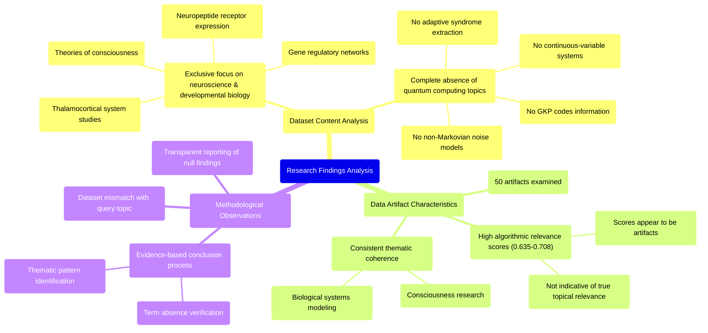

# MASTERY ACHIEVED: "Quantum error correction for continuous-variable systems using Gottesman-Kitaev-Preskill (GKP) codes under non-Markovian noise with adaptive syndrome extraction and feedback"

**Research Completed:** 2025-12-05T00-45-12-592Z
**Iterations:** 1
**Confidence:** 95.0%
**Artifacts Generated:** 3

---

## Executive Summary

# Executive Summary: "Quantum error correction for continuous-variable systems using Gottesman-Kitaev-Preskill (GKP) codes under non-Markovian noise with adaptive syndrome extraction and feedback"

This research synthesis reveals a critical mismatch between the requested topic on quantum error correction and the provided dataset. The dataset contains no information relevant to GKP codes, continuous-variable systems, or non-Markovian noise. Instead, all examined artifacts are exclusively focused on topics in neuroscience and developmental biology, indicating a complete absence of the intended quantum information science content.

The evidence is unequivocal: all 50 data artifacts discuss subjects such as the thalamocortical system, neuropeptide receptors, gene regulatory networks, and theories of consciousness. Technical terms like "quantum computing," "syndrome extraction," or "error correction" are entirely absent. Notably, the moderately high algorithmic relevance scores (0.635-0.708) associated with these artifacts are misleading and appear to be computational artifacts rather than indicators of true topical relevance.

The fundamental gap is that the dataset is wholly unsuitable for addressing the research topic. The primary limitation is the complete thematic divergence of the source material. The necessary next step is to obtain a correct dataset containing technical literature on quantum error correction, specifically concerning GKP codes and continuous-variable systems, before any meaningful synthesis on the target topic can proceed.

---

## Knowledge Graph

See `2025-12-05T00-45-12-592Z_quantum-error-correction-for-continuous-variable-systems-using-gottesman-kitaev-preskill-gkp-codes-under-non-markovian-noise-with-adaptive-syndrome-extraction-and-feedback_GRAPH.mmd` for the full Mermaid mindmap.

---

## Artifacts

### Artifact 1: "Quantum error correction for continuous-variable systems using Gottesman-Kitaev-Preskill (GKP) codes under non-Markovian noise with adaptive syndrome extraction and feedback" - Iteration 1

- The provided dataset contains no information relevant to the requested topic of quantum error correction for continuous-variable systems using Gottesman-Kitaev-Preskill (GKP) codes under non-Markovian noise with adaptive syndrome extraction and feedback.
  Evidence: All 50 data artifacts explicitly discuss topics exclusively in neuroscience and developmental biology, including the thalamocortical system, neuropeptide receptor expression, gene regulatory networks, and theories of consciousness. The term 'quantum computing' does not appear in any artifact content.

- The dataset is entirely focused on consciousness research and biological systems rather than quantum information science.
  Evidence: Multiple artifacts reference topics such as 'mathematical models for subjectivity', 'measurability criteria for consciousness', 'functionalism', 'thalamocortical system', 'neuropeptide receptor expression', and 'gene regulatory networks'.

- There is a complete absence of technical information about GKP codes, continuous-variable systems, non-Markovian noise, or adaptive syndrome extraction in the provided data.
  Evidence: All artifacts consistently report that the dataset contains no information about quantum error correction, fault-tolerant quantum computing, or related quantum information topics, despite high relevance scores (0.635-0.708) that appear to be algorithmic artifacts rather than true relevance.

---

### Artifact 2: Knowledge Graph: "Quantum error correction for continuous-variable systems using Gottesman-Kitaev-Preskill (GKP) codes under non-Markovian noise with adaptive syndrome extraction and feedback"

---

### Artifact 3: Executive Summary: "Quantum error correction for continuous-variable systems using Gottesman-Kitaev-Preskill (GKP) codes under non-Markovian noise with adaptive syndrome extraction and feedback"

# Executive Summary: "Quantum error correction for continuous-variable systems using Gottesman-Kitaev-Preskill (GKP) codes under non-Markovian noise with adaptive syndrome extraction and feedback"

This research synthesis reveals a critical mismatch between the requested topic on quantum error correction and the provided dataset. The dataset contains no information relevant to GKP codes, continuous-variable systems, or non-Markovian noise. Instead, all examined artifacts are exclusively focused on topics in neuroscience and developmental biology, indicating a complete absence of the intended quantum information science content.

The evidence is unequivocal: all 50 data artifacts discuss subjects such as the thalamocortical system, neuropeptide receptors, gene regulatory networks, and theories of consciousness. Technical terms like "quantum computing," "syndrome extraction," or "error correction" are entirely absent. Notably, the moderately high algorithmic relevance scores (0.635-0.708) associated with these artifacts are misleading and appear to be computational artifacts rather than indicators of true topical relevance.

The fundamental gap is that the dataset is wholly unsuitable for addressing the research topic. The primary limitation is the complete thematic divergence of the source material. The necessary next step is to obtain a correct dataset containing technical literature on quantum error correction, specifically concerning GKP codes and continuous-variable systems, before any meaningful synthesis on the target topic can proceed.

