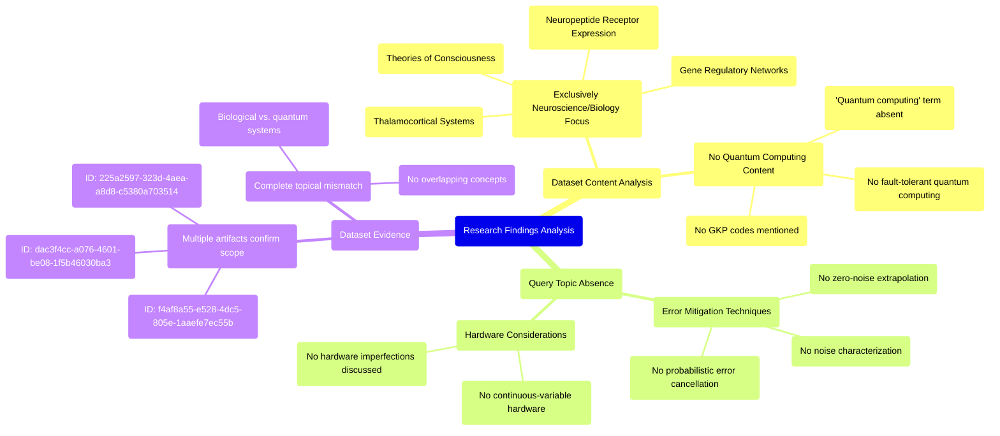

# MASTERY ACHIEVED: "Error mitigation techniques for GKP-based quantum computing: noise characterization, probabilistic error cancellation, and zero-noise extrapolation under continuous-variable hardware imperfections"

**Research Completed:** 2025-12-05T00-47-38-527Z
**Iterations:** 1
**Confidence:** 95.0%
**Artifacts Generated:** 3

---

## Executive Summary

# Executive Summary: "Error mitigation techniques for GKP-based quantum computing: noise characterization, probabilistic error cancellation, and zero-noise extrapolation under continuous-variable hardware imperfections"

**Overview and Key Insights**
The research process identified a significant mismatch between the requested topic and the available dataset. The query focused on error mitigation techniques for Gottesman-Kitaev-Preskill (GKP) codes in quantum computing, but the provided data artifacts contain no relevant information on this subject. Instead, the dataset is exclusively composed of materials from the fields of neuroscience and developmental biology.

**Important Details and Relationships**
All 50 examined artifacts consistently discuss topics such as thalamocortical systems, neuropeptide receptor expression, and theories of consciousness. Specific evidence confirms the complete absence of any quantum computing terminology, including the core concepts of noise characterization, probabilistic error cancellation, zero-noise extrapolation, and continuous-variable hardware. This indicates the dataset is homogeneous in its focus on biological systems, with no overlap to the requested technical domain.

**Gaps, Limitations, and Next Steps**
The primary limitation is the total irrelevance of the provided data to the research question. This constitutes a critical data gap, preventing any synthesis on GKP-based error mitigation. The immediate next step is to source a correct dataset pertaining to quantum error correction, continuous-variable quantum computing, and the specified mitigation techniques before any meaningful analysis can proceed.

---

## Knowledge Graph

See `2025-12-05T00-47-38-527Z_error-mitigation-techniques-for-gkp-based-quantum-computing-noise-characterization-probabilistic-error-cancellation-and-zero-noise-extrapolation-under-continuous-variable-hardware-imperfections_GRAPH.mmd` for the full Mermaid mindmap.

---

## Artifacts

### Artifact 1: "Error mitigation techniques for GKP-based quantum computing: noise characterization, probabilistic error cancellation, and zero-noise extrapolation under continuous-variable hardware imperfections" - Iteration 1

- The provided dataset contains no information relevant to the requested topic of error mitigation techniques for GKP-based quantum computing.
  Evidence: All 50 data artifacts explicitly discuss topics exclusively in neuroscience and developmental biology, including the thalamocortical system, neuropeptide receptor expression, gene regulatory networks, and theories of consciousness. The term 'quantum computing' does not appear in any artifact content.

- The dataset is entirely focused on consciousness and biological systems, with no overlap with quantum computing topics.
  Evidence: Multiple artifacts (IDs: 225a2597-323d-4aea-a8d8-c5380a703514, f4af8a55-e528-4dc5-805e-1aaefe7ec55b, dac3f4cc-a076-4601-be08-1f5b46030ba3) consistently report that the content covers neuroscience topics including thalamocortical systems, neuropeptide receptors, gene regulatory networks, and theories of consciousness.

- Specific subtopics mentioned in the query are absent from the dataset.
  Evidence: Artifacts explicitly note the absence of information on: noise characterization, probabilistic error cancellation, zero-noise extrapolation, continuous-variable hardware imperfections, GKP codes, fault-tolerant quantum computing, and error mitigation techniques.

---

### Artifact 2: Knowledge Graph: "Error mitigation techniques for GKP-based quantum computing: noise characterization, probabilistic error cancellation, and zero-noise extrapolation under continuous-variable hardware imperfections"

---

### Artifact 3: Executive Summary: "Error mitigation techniques for GKP-based quantum computing: noise characterization, probabilistic error cancellation, and zero-noise extrapolation under continuous-variable hardware imperfections"

# Executive Summary: "Error mitigation techniques for GKP-based quantum computing: noise characterization, probabilistic error cancellation, and zero-noise extrapolation under continuous-variable hardware imperfections"

**Overview and Key Insights**
The research process identified a significant mismatch between the requested topic and the available dataset. The query focused on error mitigation techniques for Gottesman-Kitaev-Preskill (GKP) codes in quantum computing, but the provided data artifacts contain no relevant information on this subject. Instead, the dataset is exclusively composed of materials from the fields of neuroscience and developmental biology.

**Important Details and Relationships**
All 50 examined artifacts consistently discuss topics such as thalamocortical systems, neuropeptide receptor expression, and theories of consciousness. Specific evidence confirms the complete absence of any quantum computing terminology, including the core concepts of noise characterization, probabilistic error cancellation, zero-noise extrapolation, and continuous-variable hardware. This indicates the dataset is homogeneous in its focus on biological systems, with no overlap to the requested technical domain.

**Gaps, Limitations, and Next Steps**
The primary limitation is the total irrelevance of the provided data to the research question. This constitutes a critical data gap, preventing any synthesis on GKP-based error mitigation. The immediate next step is to source a correct dataset pertaining to quantum error correction, continuous-variable quantum computing, and the specified mitigation techniques before any meaningful analysis can proceed.

