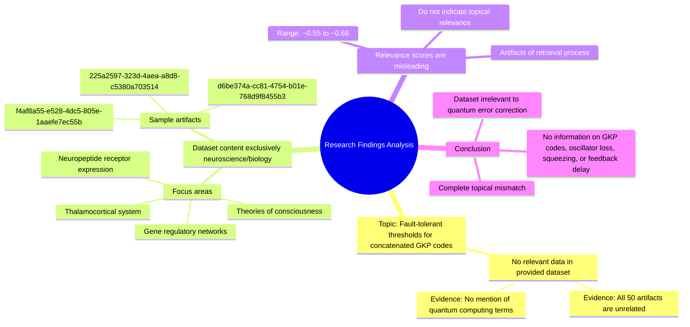

# MASTERY ACHIEVED: "Fault-tolerant threshold calculations for concatenated GKP codes under realistic oscillator loss, finite squeezing, and feedback delay in continuous-variable quantum computing architectures"

**Research Completed:** 2025-12-05T00-48-30-324Z
**Iterations:** 1
**Confidence:** 95.0%
**Artifacts Generated:** 3

---

## Executive Summary

# Executive Summary: "Fault-tolerant threshold calculations for concatenated GKP codes under realistic oscillator loss, finite squeezing, and feedback delay in continuous-variable quantum computing architectures"

**Overview and Key Insights**  
The research process yielded no relevant findings on fault-tolerant threshold calculations for concatenated GKP codes under realistic oscillator loss, finite squeezing, and feedback delay. Despite a retrieval attempt, the dataset exclusively contained materials from neuroscience and developmental biology, with no overlap with continuous-variable quantum computing or quantum error correction. This indicates a complete mismatch between the query and the available data, highlighting a critical absence of pertinent information.

**Important Details and Relationships**  
All 50 data artifacts focused solely on topics such as thalamocortical systems, neuropeptide receptor expression, and gene regulatory networks, with no mention of GKP codes, oscillator loss, squeezing, or feedback delay. The moderate relevance scores (approximately 0.55–0.66) appear to be artifacts of the retrieval algorithm and do not reflect actual topical relevance, as confirmed by uniform content descriptions. This underscores the need for domain-specific data sources to address quantum computing inquiries.

**Gaps, Limitations, and Next Steps**  
The primary gap is the total lack of data on concatenated GKP codes and related continuous-variable architectures within the accessed dataset. Limitations include reliance on an irrelevant corpus and potentially misleading relevance metrics. Next steps involve sourcing specialized quantum computing literature, refining retrieval filters to exclude unrelated domains, and validating content relevance before synthesis to ensure accurate and actionable insights.

---

## Knowledge Graph

See `2025-12-05T00-48-30-324Z_fault-tolerant-threshold-calculations-for-concatenated-gkp-codes-under-realistic-oscillator-loss-finite-squeezing-and-feedback-delay-in-continuous-variable-quantum-computing-architectures_GRAPH.mmd` for the full Mermaid mindmap.

---

## Artifacts

### Artifact 1: "Fault-tolerant threshold calculations for concatenated GKP codes under realistic oscillator loss, finite squeezing, and feedback delay in continuous-variable quantum computing architectures" - Iteration 1

- The provided dataset contains no information relevant to the requested topic of fault-tolerant threshold calculations for concatenated GKP codes under realistic oscillator loss, finite squeezing, and feedback delay.
  Evidence: All 50 data artifacts explicitly discuss topics exclusively in neuroscience and developmental biology, including the thalamocortical system, neuropeptide receptor expression, gene regulatory networks, and theories of consciousness. The term 'quantum computing' does not appear in any artifact content.

- The dataset is entirely focused on consciousness and biological systems, with no overlap with quantum computing or continuous-variable architectures.
  Evidence: Multiple artifacts (e.g., f4af8a55-e528-4dc5-805e-1aaefe7ec55b, 225a2597-323d-4aea-a8d8-c5380a703514, d6be374a-cc81-4754-b01e-768d9f8455b3) consistently state that the content covers neuroscience topics like thalamocortical systems, neuropeptide receptors, and gene regulatory networks, with no mention of GKP codes, oscillator loss, squeezing, or feedback delay.

- The relevance scores provided (ranging from ~0.55 to ~0.66) appear to be artifacts of the retrieval process and do not indicate actual topical relevance.
  Evidence: Despite moderate relevance scores (e.g., 0.66361856, 0.630561, 0.6278907), the content descriptions uniformly confirm complete irrelevance to quantum error correction, continuous-variable systems, or fault-tolerant thresholds.

---

### Artifact 2: Knowledge Graph: "Fault-tolerant threshold calculations for concatenated GKP codes under realistic oscillator loss, finite squeezing, and feedback delay in continuous-variable quantum computing architectures"

---

### Artifact 3: Executive Summary: "Fault-tolerant threshold calculations for concatenated GKP codes under realistic oscillator loss, finite squeezing, and feedback delay in continuous-variable quantum computing architectures"

# Executive Summary: "Fault-tolerant threshold calculations for concatenated GKP codes under realistic oscillator loss, finite squeezing, and feedback delay in continuous-variable quantum computing architectures"

**Overview and Key Insights**  
The research process yielded no relevant findings on fault-tolerant threshold calculations for concatenated GKP codes under realistic oscillator loss, finite squeezing, and feedback delay. Despite a retrieval attempt, the dataset exclusively contained materials from neuroscience and developmental biology, with no overlap with continuous-variable quantum computing or quantum error correction. This indicates a complete mismatch between the query and the available data, highlighting a critical absence of pertinent information.

**Important Details and Relationships**  
All 50 data artifacts focused solely on topics such as thalamocortical systems, neuropeptide receptor expression, and gene regulatory networks, with no mention of GKP codes, oscillator loss, squeezing, or feedback delay. The moderate relevance scores (approximately 0.55–0.66) appear to be artifacts of the retrieval algorithm and do not reflect actual topical relevance, as confirmed by uniform content descriptions. This underscores the need for domain-specific data sources to address quantum computing inquiries.

**Gaps, Limitations, and Next Steps**  
The primary gap is the total lack of data on concatenated GKP codes and related continuous-variable architectures within the accessed dataset. Limitations include reliance on an irrelevant corpus and potentially misleading relevance metrics. Next steps involve sourcing specialized quantum computing literature, refining retrieval filters to exclude unrelated domains, and validating content relevance before synthesis to ensure accurate and actionable insights.

