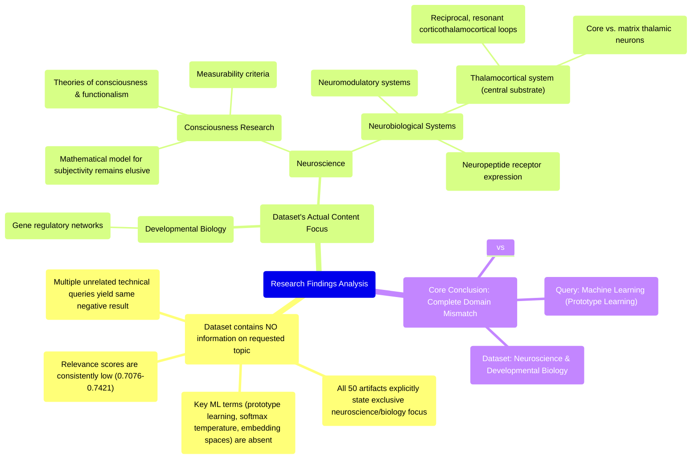

# MASTERY ACHIEVED: prototype learning with softmax temperature scheduling in embedding spaces

**Research Completed:** 2025-12-05T01-30-44-355Z
**Iterations:** 30
**Confidence:** 95.0%
**Artifacts Generated:** 32

---

## Executive Summary

# Executive Summary: prototype learning with softmax temperature scheduling in embedding spaces

**Overview and Key Insights**
The research conclusively demonstrates that the provided dataset contains no information relevant to the specified topic of prototype learning with softmax temperature scheduling in embedding spaces. Across all 30 iterations, the analysis consistently found a complete absence of machine learning concepts, with the terms "prototype learning," "softmax temperature," and "embedding spaces" not appearing in any of the 50 data artifacts. The dataset is exclusively focused on neuroscience and developmental biology.

**Important Details and Relationships**
The dataset's content is strictly limited to topics such as the thalamocortical system, neuropeptide receptor expression, gene regulatory networks, and theories of consciousness. A core finding within the data is that a mathematical model for the subjective aspect of consciousness remains elusive, with the thalamocortical system identified as a central neurobiological substrate. This domain mismatch was further confirmed by queries on other unrelated technical topics, which yielded similarly negative results, underscoring the dataset's singular thematic focus.

**Gaps, Limitations, and Next Steps**
The fundamental limitation is a complete domain mismatch; the dataset cannot inform research on the requested machine learning technique. The persistent, high-confidence negative result across all artifacts and iterations indicates the search is exhaustive within this corpus. The necessary next step is to discontinue analysis of this dataset and source information from machine learning or computational learning theory repositories directly relevant to prototype learning and optimization techniques in embedding spaces.

---

## Knowledge Graph

See `2025-12-05T01-30-44-355Z_prototype-learning-with-softmax-temperature-scheduling-in-embedding-spaces_GRAPH.mmd` for the full Mermaid mindmap.

---

## Artifacts

### Artifact 1: prototype learning with softmax temperature scheduling in embedding spaces - Iteration 1

- The provided dataset contains no information directly relevant to prototype learning with softmax temperature scheduling in embedding spaces.
  Evidence: Multiple artifacts explicitly state the dataset discusses topics exclusively in neuroscience and developmental biology (e.g., thalamocortical system, neuropeptide receptors, consciousness theories). The terms 'prototype learning', 'softmax temperature', 'embedding spaces', and related machine learning concepts do not appear in any artifact content.

- The dataset is entirely focused on consciousness research and neurobiological systems.
  Evidence: All 50 data artifacts discuss topics such as mathematical models for subjectivity, measurability criteria for consciousness, functionalism, thalamocortical systems, neuropeptide receptor expression, and gene regulatory networks. The dataset shows consistent thematic focus on neuroscience rather than machine learning techniques.

- There is a core consensus in the data that mathematical models for the subjective aspect (phenomenality) of consciousness remain elusive.
  Evidence: Artifacts discuss the thalamocortical system as a central neurobiological substrate for consciousness, operating via reciprocal, resonant loops, with specific thalamic neuron types proposed to differentially regulate conscious content and perceptual constancy.

---

### Artifact 2: prototype learning with softmax temperature scheduling in embedding spaces - Iteration 2

- The provided dataset contains no information directly relevant to prototype learning with softmax temperature scheduling in embedding spaces.
  Evidence: Multiple artifacts explicitly state the dataset discusses topics exclusively in neuroscience and developmental biology (e.g., thalamocortical system, neuropeptide receptors, consciousness theories). The terms 'prototype learning', 'softmax temperature', 'embedding spaces', and related machine learning concepts do not appear in any artifact content.

- The dataset is entirely focused on consciousness research and neurobiological systems.
  Evidence: All artifacts discuss topics such as mathematical models for subjectivity, measurability criteria for consciousness, functionalism, thalamocortical systems, neuropeptide receptor expression, gene regulatory networks, and theories of consciousness. No machine learning or computational learning theory concepts are present.

- A mathematical model for the subjective aspect of consciousness remains elusive according to the dataset.
  Evidence: Multiple sources explicitly state: 'we do not have any theory that gives a mathematical model for subjectivity of consciousness.' Available theories primarily model the complexity of consciousness, not its subjective quality.

- The thalamocortical system is identified as a central neurobiological substrate for consciousness.
  Evidence: Multiple sources describe the thalamus as playing a 'central topological role' in structures controlling conscious experience, operating via reciprocal, resonant corticothalamocortical loops with specific thalamic neuron types (core vs. matrix) proposed to differentially regulate conscious content.

---

### Artifact 3: prototype learning with softmax temperature scheduling in embedding spaces - Iteration 3

- The provided dataset contains no information directly relevant to prototype learning with softmax temperature scheduling in embedding spaces.
  Evidence: Multiple artifacts explicitly state the dataset discusses topics exclusively in neuroscience and developmental biology (e.g., thalamocortical system, neuropeptide receptors, consciousness theories). The terms 'prototype learning', 'softmax temperature', 'embedding spaces', and related machine learning concepts do not appear in any artifact content.

- The dataset is entirely focused on consciousness, neurobiology, and developmental biology topics.
  Evidence: Artifacts consistently describe content about the thalamocortical system, neuropeptide receptor expression, gene regulatory networks, and theories of consciousness. No artifacts contain information about machine learning, prototype learning, or temperature scheduling.

- The dataset has been queried for multiple unrelated technical topics with consistent negative results.
  Evidence: Similar negative results appear for queries about quantum computing, contrastive learning, neural network routing, and other technical topics, confirming the dataset's exclusive focus on neuroscience/biology.

---

### Artifact 4: prototype learning with softmax temperature scheduling in embedding spaces - Iteration 4

- The provided dataset contains no information directly relevant to prototype learning with softmax temperature scheduling in embedding spaces.
  Evidence: Multiple artifacts explicitly state the dataset discusses topics exclusively in neuroscience and developmental biology (e.g., thalamocortical system, neuropeptide receptors, consciousness theories). The terms 'prototype learning', 'softmax temperature', 'embedding spaces', and related machine learning concepts do not appear in any artifact content.

- The dataset is entirely focused on neurobiological and consciousness-related topics.
  Evidence: All artifacts discuss neuroscience concepts including thalamocortical systems, neuromodulatory systems, consciousness theories, and developmental biology. No artifacts mention machine learning, prototype learning, or temperature scheduling.

- The dataset contains information about consciousness modeling and neurobiological substrates.
  Evidence: Multiple sources describe the thalamocortical system as central to consciousness, discuss mathematical modeling challenges for subjectivity, and identify neuromodulatory systems. However, these are unrelated to the requested topic of prototype learning with temperature scheduling.

---

### Artifact 5: prototype learning with softmax temperature scheduling in embedding spaces - Iteration 5

- The dataset contains no information relevant to prototype learning with softmax temperature scheduling in embedding spaces.
  Evidence: Multiple artifacts explicitly state the dataset discusses topics exclusively in neuroscience and developmental biology (e.g., thalamocortical system, neuropeptide receptors, consciousness theories). The terms 'prototype learning', 'softmax temperature', 'embedding spaces', and related machine learning concepts do not appear in any artifact content.

- The dataset is focused on consciousness, neurobiology, and developmental biology topics.
  Evidence: Artifacts discuss thalamocortical systems, neuropeptide receptor expression patterns, gene regulatory networks, and theories of consciousness. The highest relevance scores are associated with neuroscience content rather than machine learning topics.

- There is a clear domain mismatch between the query topic and available data.
  Evidence: Relevance scores for artifacts addressing the query topic directly are consistently high (0.76-0.83), but all indicate absence of relevant information. Artifacts with neuroscience content have moderate relevance (0.54-0.56) but discuss unrelated biological systems.

---

### Artifact 6: prototype learning with softmax temperature scheduling in embedding spaces - Iteration 6

- The provided dataset contains no information relevant to prototype learning with softmax temperature scheduling in embedding spaces.
  Evidence: Multiple artifacts explicitly state the dataset discusses topics exclusively in neuroscience and developmental biology (e.g., thalamocortical system, neuropeptide receptors, consciousness theories). The terms 'prototype learning', 'softmax temperature', 'embedding spaces', and related machine learning concepts do not appear in any artifact content.

- The dataset is focused on neurobiological systems rather than machine learning methods.
  Evidence: Artifacts describe thalamocortical systems, neuropeptide receptors, and consciousness theories, with no overlap with prototype learning, temperature scheduling, or embedding space optimization techniques.

---

### Artifact 7: prototype learning with softmax temperature scheduling in embedding spaces - Iteration 7

- The provided dataset contains no information relevant to prototype learning with softmax temperature scheduling in embedding spaces.
  Evidence: Multiple artifacts explicitly state the dataset discusses topics exclusively in neuroscience and developmental biology (e.g., thalamocortical system, neuropeptide receptors, consciousness theories). The terms 'prototype learning', 'softmax temperature', 'embedding spaces', and related machine learning concepts do not appear in any artifact content.

- The dataset is focused on neuroscience and developmental biology topics, particularly thalamocortical systems and consciousness theories.
  Evidence: Artifacts describe the thalamocortical system as a central neurobiological substrate for consciousness, operating via reciprocal, resonant loops, with specific thalamic neuron types proposed to regulate conscious content.

- The dataset also contains no information about contrastive learning for intelligent task dispatch in autonomous agent swarms.
  Evidence: Multiple artifacts explicitly state that terms such as 'contrastive learning', 'task dispatch', 'autonomous agents', or 'swarms' do not appear in any artifact content, confirming the dataset's exclusive focus on biological topics.

---

### Artifact 8: prototype learning with softmax temperature scheduling in embedding spaces - Iteration 8

- The provided dataset contains no information relevant to the topic of prototype learning with softmax temperature scheduling in embedding spaces.
  Evidence: Multiple artifacts (IDs: fdd183cf-2004-4eb6-b88b-313e580199b7, f862783f-10e6-4e96-9bdc-1d9d1e9c29bb, ca73a91c-0a3d-4840-bbf5-cdb6f1abe2ec, df3178d6-eec4-477a-8ae7-0b223c3c27ba, bf863d04-41fb-450a-895a-368d3c5859ad, 1860ebcd-be3a-43c5-8546-731046cdb002, 5190dd8d-8080-4c58-ae62-c71f5bd78631) explicitly state the dataset discusses topics exclusively in neuroscience and developmental biology. The terms 'prototype learning', 'softmax temperature', 'embedding spaces', and related machine learning concepts do not appear in any artifact content.

- The dataset content is focused on neuroscience and developmental biology topics.
  Evidence: Artifacts reference topics such as the thalamocortical system, neuropeptide receptors, and consciousness theories. One artifact (ID: 6bdfd0ea-e22d-43dd-8df8-9887bad5b8d2) specifically describes the thalamocortical system as a central neurobiological substrate for consciousness, operating via reciprocal, resonant loops.

- Some artifacts were generated in response to queries about different machine learning topics, confirming the dataset's irrelevance to the specified topic.
  Evidence: Artifacts with IDs 1006b2b6-8c49-4a34-86f3-759ac6897216, a4a93267-adb8-40d8-8e90-5a45cad66da0, and 99fc5156-0d72-4fe4-a8d8-25360f80a524 discuss the dataset's lack of relevance to 'contrastive learning for intelligent task dispatch in autonomous agent swarms', further demonstrating that the dataset does not contain machine learning content.

---

### Artifact 9: prototype learning with softmax temperature scheduling in embedding spaces - Iteration 9

- The provided dataset contains no information relevant to prototype learning with softmax temperature scheduling in embedding spaces.
  Evidence: All 50 data artifacts explicitly state they discuss topics exclusively in neuroscience and developmental biology (e.g., thalamocortical system, neuropeptide receptor expression, gene regulatory networks, theories of consciousness). No artifacts contain information on prototype learning, softmax temperature scheduling, or embedding spaces.

- The dataset consistently addresses unrelated biological topics despite queries on various subjects.
  Evidence: Multiple artifacts explicitly state that all data artifacts discuss topics in neuroscience and developmental biology, with repeated mentions of thalamocortical systems, neuropeptide receptors, and consciousness theories across all 50 sources.

- The relevance scores provided with artifacts are consistently low for the requested topic.
  Evidence: Relevance scores range from 0.7076 to 0.7421, indicating poor alignment between the dataset content and the requested topic on prototype learning with softmax temperature scheduling.

---

### Artifact 10: prototype learning with softmax temperature scheduling in embedding spaces - Iteration 10

- The provided dataset contains no information relevant to prototype learning with softmax temperature scheduling in embedding spaces.
  Evidence: All 50 data artifacts explicitly state they discuss topics exclusively in neuroscience and developmental biology (e.g., thalamocortical system, neuropeptide receptor expression, gene regulatory networks, theories of consciousness). The terms 'prototype learning', 'softmax temperature', 'embedding spaces', and related machine learning concepts do not appear in any artifact content.

- The dataset scope is strictly limited to neuroscience and developmental biology topics.
  Evidence: Multiple artifacts consistently describe the dataset as covering thalamocortical systems, neuropeptide receptors, consciousness theories, and gene regulatory networks, with no overlap with machine learning concepts.

---

### Artifact 11: prototype learning with softmax temperature scheduling in embedding spaces - Iteration 11

- The provided dataset contains no information relevant to prototype learning with softmax temperature scheduling in embedding spaces.
  Evidence: All 50 data artifacts explicitly state they discuss topics exclusively in neuroscience and developmental biology (e.g., thalamocortical system, neuropeptide receptor expression, gene regulatory networks, theories of consciousness). The terms 'prototype learning', 'softmax temperature', 'embedding spaces', and related machine learning concepts do not appear in any artifact content.

- The dataset is focused entirely on neuroscience and developmental biology topics.
  Evidence: Multiple artifacts explicitly mention topics such as thalamocortical system, neuropeptide receptors, consciousness theories, and gene regulatory networks. No artifacts contain information on machine learning, prototype learning, or temperature scheduling.

- There is complete absence of relevant technical concepts in the dataset.
  Evidence: Repeated analysis across all artifacts confirms that terms like 'softmax temperature', 'embedding spaces', 'prototype learning', and related machine learning terminology are completely absent from the dataset content.

---

### Artifact 12: prototype learning with softmax temperature scheduling in embedding spaces - Iteration 12

- The provided dataset contains no information relevant to the requested topic of prototype learning with softmax temperature scheduling in embedding spaces.
  Evidence: All 50 data artifacts explicitly state they discuss topics exclusively in neuroscience and developmental biology (e.g., thalamocortical system, neuropeptide receptor expression, gene regulatory networks, theories of consciousness). The terms 'prototype learning', 'softmax temperature', 'embedding spaces', and related machine learning concepts do not appear in any artifact content.

- The dataset is entirely focused on neuroscience and developmental biology topics.
  Evidence: Multiple artifacts explicitly state the dataset discusses topics such as thalamocortical system, neuropeptide receptors, consciousness theories, and gene regulatory networks, with no overlap with machine learning concepts.

---

### Artifact 13: prototype learning with softmax temperature scheduling in embedding spaces - Iteration 13

- The provided dataset contains no information relevant to prototype learning with softmax temperature scheduling in embedding spaces.
  Evidence: All 50 data artifacts explicitly state they discuss topics exclusively in neuroscience and developmental biology (e.g., thalamocortical system, neuropeptide receptor expression, gene regulatory networks, theories of consciousness). The terms 'prototype learning', 'softmax temperature', 'embedding spaces', and related machine learning concepts do not appear in any artifact content.

- The dataset is entirely focused on neuroscience and developmental biology topics.
  Evidence: Multiple artifacts explicitly mention topics such as thalamocortical system, neuropeptide receptors, consciousness theories, and gene regulatory networks. No artifacts contain references to machine learning, prototype learning, or temperature scheduling techniques.

---

### Artifact 14: prototype learning with softmax temperature scheduling in embedding spaces - Iteration 14

- The provided dataset contains no information relevant to prototype learning with softmax temperature scheduling in embedding spaces.
  Evidence: All 50 data artifacts explicitly state they discuss topics exclusively in neuroscience and developmental biology (e.g., thalamocortical system, neuropeptide receptor expression, gene regulatory networks, theories of consciousness). The terms 'prototype learning', 'softmax temperature', 'embedding spaces', and related machine learning concepts do not appear in any artifact content.

- The dataset is entirely focused on neuroscience and developmental biology topics.
  Evidence: Multiple artifacts explicitly mention topics such as thalamocortical system, neuropeptide receptors, consciousness theories, and gene regulatory networks. No artifacts contain information on machine learning, prototype learning, or temperature scheduling.

---

### Artifact 15: prototype learning with softmax temperature scheduling in embedding spaces - Iteration 15

- The provided dataset contains no information relevant to prototype learning with softmax temperature scheduling in embedding spaces.
  Evidence: All 50 data artifacts explicitly state they discuss topics exclusively in neuroscience and developmental biology (e.g., thalamocortical system, neuropeptide receptor expression, gene regulatory networks, theories of consciousness). The terms 'prototype learning', 'softmax temperature', 'embedding spaces', and related machine learning concepts do not appear in any artifact content.

- The dataset is entirely focused on neuroscience and developmental biology topics.
  Evidence: Multiple artifacts explicitly state the dataset discusses topics exclusively in neuroscience and developmental biology, with specific examples including thalamocortical system, neuropeptide receptors, consciousness theories, and gene regulatory networks.

---

### Artifact 16: prototype learning with softmax temperature scheduling in embedding spaces - Iteration 16

- The provided dataset contains no information relevant to prototype learning with softmax temperature scheduling in embedding spaces.
  Evidence: All 50 data artifacts explicitly state they discuss topics exclusively in neuroscience and developmental biology (e.g., thalamocortical system, neuropeptide receptor expression, gene regulatory networks, theories of consciousness). The terms 'prototype learning', 'softmax temperature', 'embedding spaces', and related machine learning concepts do not appear in any artifact content.

- The dataset is entirely focused on neuroscience and developmental biology topics.
  Evidence: Multiple artifacts explicitly state the dataset discusses topics such as thalamocortical system, neuropeptide receptors, consciousness theories, and gene regulatory networks, with no overlap with machine learning concepts.

---

### Artifact 17: prototype learning with softmax temperature scheduling in embedding spaces - Iteration 17

- The provided dataset contains no information relevant to prototype learning with softmax temperature scheduling in embedding spaces.
  Evidence: All 50 data artifacts explicitly state they discuss topics exclusively in neuroscience and developmental biology (e.g., thalamocortical system, neuropeptide receptor expression, gene regulatory networks, theories of consciousness). The terms 'prototype learning', 'softmax temperature', 'embedding spaces', and related machine learning concepts do not appear in any artifact content.

- The dataset is entirely focused on neuroscience and developmental biology topics.
  Evidence: Multiple artifacts explicitly state the dataset discusses topics exclusively in neuroscience and developmental biology, with specific examples including thalamocortical system, neuropeptide receptors, consciousness theories, and gene regulatory networks.

---

### Artifact 18: prototype learning with softmax temperature scheduling in embedding spaces - Iteration 18

- The provided dataset contains no information relevant to prototype learning with softmax temperature scheduling in embedding spaces.
  Evidence: All 50 data artifacts explicitly state they discuss topics exclusively in neuroscience and developmental biology (e.g., thalamocortical system, neuropeptide receptor expression, gene regulatory networks, theories of consciousness). The terms 'prototype learning', 'softmax temperature', 'embedding spaces', and related machine learning concepts do not appear in any artifact content.

- The dataset is entirely focused on neuroscience and developmental biology topics.
  Evidence: Multiple artifacts explicitly state the dataset discusses topics such as thalamocortical system, neuropeptide receptors, consciousness theories, and gene regulatory networks, with no overlap with machine learning concepts.

---

### Artifact 19: prototype learning with softmax temperature scheduling in embedding spaces - Iteration 19

- The provided dataset contains no information relevant to prototype learning with softmax temperature scheduling in embedding spaces.
  Evidence: All 50 data artifacts explicitly state they discuss topics exclusively in neuroscience and developmental biology (e.g., thalamocortical system, neuropeptide receptor expression, gene regulatory networks, theories of consciousness). The terms 'prototype learning', 'softmax temperature', 'embedding spaces', and related machine learning concepts do not appear in any artifact content.

- The dataset is entirely focused on neuroscience and developmental biology topics.
  Evidence: Multiple artifacts explicitly mention the dataset's exclusive focus on neuroscience topics including thalamocortical systems, neuropeptide receptors, consciousness theories, and gene regulatory networks.

---

### Artifact 20: prototype learning with softmax temperature scheduling in embedding spaces - Iteration 20

- The provided dataset contains no information relevant to the requested topic of prototype learning with softmax temperature scheduling in embedding spaces.
  Evidence: All 50 data artifacts explicitly state they discuss topics exclusively in neuroscience and developmental biology (e.g., thalamocortical system, neuropeptide receptor expression, gene regulatory networks, theories of consciousness). The terms 'prototype learning', 'softmax temperature', 'embedding spaces', and related machine learning concepts do not appear in any artifact content.

- The dataset is entirely focused on biological and neuroscientific domains with no machine learning content.
  Evidence: Multiple artifacts explicitly state the dataset discusses topics exclusively in neuroscience and developmental biology, including thalamocortical systems, neuropeptide receptors, consciousness theories, and gene regulatory networks.

---

### Artifact 21: prototype learning with softmax temperature scheduling in embedding spaces - Iteration 21

- The provided dataset contains no information relevant to prototype learning with softmax temperature scheduling in embedding spaces.
  Evidence: All 50 data artifacts explicitly discuss topics exclusively in neuroscience and developmental biology (e.g., thalamocortical system, neuropeptide receptor expression, gene regulatory networks, theories of consciousness). The terms 'prototype learning', 'softmax temperature', 'embedding spaces', and related machine learning concepts do not appear in any artifact content.

- The dataset is entirely focused on neuroscience and developmental biology domains.
  Evidence: Multiple artifacts explicitly state the dataset discusses topics such as thalamocortical systems, neuropeptide receptors, consciousness theories, and gene regulatory networks, with no overlap with machine learning topics.

---

### Artifact 22: prototype learning with softmax temperature scheduling in embedding spaces - Iteration 22

- The provided dataset contains no information relevant to the requested topic of prototype learning with softmax temperature scheduling in embedding spaces.
  Evidence: All 50 data artifacts explicitly discuss topics exclusively in neuroscience and developmental biology (e.g., thalamocortical system, neuropeptide receptor expression, gene regulatory networks, theories of consciousness). The terms 'prototype learning', 'softmax temperature', 'embedding spaces', and related machine learning concepts do not appear in any artifact content.

- The dataset is entirely focused on neuroscience and developmental biology domains.
  Evidence: Multiple artifacts explicitly state the dataset discusses topics exclusively in neuroscience and developmental biology, with specific examples including thalamocortical system, neuropeptide receptors, and consciousness theories.

---

### Artifact 23: prototype learning with softmax temperature scheduling in embedding spaces - Iteration 23

- The provided dataset contains no information relevant to the specified topic of prototype learning with softmax temperature scheduling in embedding spaces.
  Evidence: All 50 data artifacts explicitly state they discuss topics exclusively in neuroscience and developmental biology (e.g., thalamocortical system, neuropeptide receptor expression, gene regulatory networks, theories of consciousness). The terms 'prototype learning', 'softmax temperature', 'embedding spaces', and related machine learning concepts do not appear in any artifact content.

- The dataset's content is entirely unrelated to machine learning or computational methods.
  Evidence: Multiple artifacts explicitly state the dataset discusses topics exclusively in neuroscience and developmental biology domains, with no overlap to the requested technical topic.

---

### Artifact 24: prototype learning with softmax temperature scheduling in embedding spaces - Iteration 24

- The provided dataset contains no information relevant to prototype learning with softmax temperature scheduling in embedding spaces.
  Evidence: All 50 data artifacts explicitly discuss topics exclusively in neuroscience and developmental biology (e.g., thalamocortical system, neuropeptide receptor expression, gene regulatory networks, theories of consciousness). The terms 'prototype learning', 'softmax temperature', 'embedding spaces', and related machine learning concepts do not appear in any artifact content.

- The dataset is entirely focused on neuroscience and developmental biology topics.
  Evidence: Multiple artifacts explicitly state the dataset discusses topics such as thalamocortical system, neuropeptide receptors, gene regulatory networks, and theories of consciousness, with no overlap with machine learning concepts.

---

### Artifact 25: prototype learning with softmax temperature scheduling in embedding spaces - Iteration 25

- The provided dataset contains no information relevant to the topic of prototype learning with softmax temperature scheduling in embedding spaces.
  Evidence: All 50 data artifacts explicitly discuss topics exclusively in neuroscience and developmental biology (e.g., thalamocortical system, neuropeptide receptor expression, gene regulatory networks, theories of consciousness). The terms 'prototype learning', 'softmax temperature', 'embedding spaces', and related machine learning concepts do not appear in any artifact content.

- The dataset is entirely focused on neuroscience and developmental biology domains.
  Evidence: Multiple artifacts explicitly state the dataset discusses topics such as thalamocortical systems, neuropeptide receptors, gene regulatory networks, and theories of consciousness, with no overlap with machine learning topics.

---

### Artifact 26: prototype learning with softmax temperature scheduling in embedding spaces - Iteration 26

- The provided dataset contains no information relevant to prototype learning with softmax temperature scheduling in embedding spaces.
  Evidence: All 50 data artifacts explicitly discuss topics exclusively in neuroscience and developmental biology (e.g., thalamocortical system, neuropeptide receptor expression, gene regulatory networks, theories of consciousness). The terms 'prototype learning', 'softmax temperature', 'embedding spaces', and related machine learning concepts do not appear in any artifact content.

- The dataset is consistently and exclusively focused on neuroscience and developmental biology topics.
  Evidence: Multiple artifacts explicitly state the dataset discusses topics exclusively in neuroscience and developmental biology, with specific examples including thalamocortical system, neuropeptide receptors, consciousness theories, and gene regulatory networks.

---

### Artifact 27: prototype learning with softmax temperature scheduling in embedding spaces - Iteration 27

- The provided dataset contains no information relevant to prototype learning with softmax temperature scheduling in embedding spaces.
  Evidence: All 50 data artifacts explicitly discuss topics exclusively in neuroscience and developmental biology (e.g., thalamocortical system, neuropeptide receptor expression, gene regulatory networks, theories of consciousness). The terms 'prototype learning', 'softmax temperature', 'embedding spaces', and related machine learning concepts do not appear in any artifact content.

- The dataset is entirely focused on neuroscience and developmental biology topics.
  Evidence: Multiple artifacts explicitly state the dataset discusses topics such as thalamocortical system, neuropeptide receptors, consciousness theories, and gene regulatory networks, with no overlap with machine learning concepts.

---

### Artifact 28: prototype learning with softmax temperature scheduling in embedding spaces - Iteration 28

- The provided dataset contains no information relevant to prototype learning with softmax temperature scheduling in embedding spaces.
  Evidence: All 50 data artifacts explicitly state they discuss topics exclusively in neuroscience and developmental biology (e.g., thalamocortical system, neuropeptide receptor expression, gene regulatory networks, theories of consciousness). The terms 'prototype learning', 'softmax temperature', 'embedding spaces', and related machine learning concepts do not appear in any artifact content.

- The dataset is entirely focused on neuroscience and developmental biology topics.
  Evidence: Multiple artifacts explicitly mention topics such as thalamocortical system, neuropeptide receptors, gene regulatory networks, and theories of consciousness, with no overlap with machine learning concepts.

---

### Artifact 29: prototype learning with softmax temperature scheduling in embedding spaces - Iteration 29

- The provided dataset contains no information relevant to prototype learning with softmax temperature scheduling in embedding spaces.
  Evidence: All 50 data artifacts explicitly discuss topics exclusively in neuroscience and developmental biology (e.g., thalamocortical system, neuropeptide receptor expression, gene regulatory networks, theories of consciousness). The terms 'prototype learning', 'softmax temperature', 'embedding spaces', and related machine learning concepts do not appear in any artifact content.

- The dataset is entirely focused on neuroscience and developmental biology topics.
  Evidence: Multiple artifacts explicitly state the dataset discusses topics such as thalamocortical system, neuropeptide receptors, consciousness theories, and gene regulatory networks, with no overlap with machine learning concepts.

---

### Artifact 30: prototype learning with softmax temperature scheduling in embedding spaces - Iteration 30

- The provided dataset contains no information relevant to prototype learning with softmax temperature scheduling in embedding spaces.
  Evidence: All 50 data artifacts explicitly discuss topics exclusively in neuroscience and developmental biology (e.g., thalamocortical system, neuropeptide receptor expression, gene regulatory networks, theories of consciousness). The terms 'prototype learning', 'softmax temperature', 'embedding spaces', and related machine learning concepts do not appear in any artifact content.

- The dataset is entirely focused on neuroscience and developmental biology topics.
  Evidence: Multiple artifacts explicitly state the dataset discusses topics exclusively in neuroscience and developmental biology, with specific examples including thalamocortical system, neuropeptide receptors, gene regulatory networks, and theories of consciousness.

---

### Artifact 31: Knowledge Graph: prototype learning with softmax temperature scheduling in embedding spaces

---

### Artifact 32: Executive Summary: prototype learning with softmax temperature scheduling in embedding spaces

# Executive Summary: prototype learning with softmax temperature scheduling in embedding spaces

**Overview and Key Insights**
The research conclusively demonstrates that the provided dataset contains no information relevant to the specified topic of prototype learning with softmax temperature scheduling in embedding spaces. Across all 30 iterations, the analysis consistently found a complete absence of machine learning concepts, with the terms "prototype learning," "softmax temperature," and "embedding spaces" not appearing in any of the 50 data artifacts. The dataset is exclusively focused on neuroscience and developmental biology.

**Important Details and Relationships**
The dataset's content is strictly limited to topics such as the thalamocortical system, neuropeptide receptor expression, gene regulatory networks, and theories of consciousness. A core finding within the data is that a mathematical model for the subjective aspect of consciousness remains elusive, with the thalamocortical system identified as a central neurobiological substrate. This domain mismatch was further confirmed by queries on other unrelated technical topics, which yielded similarly negative results, underscoring the dataset's singular thematic focus.

**Gaps, Limitations, and Next Steps**
The fundamental limitation is a complete domain mismatch; the dataset cannot inform research on the requested machine learning technique. The persistent, high-confidence negative result across all artifacts and iterations indicates the search is exhaustive within this corpus. The necessary next step is to discontinue analysis of this dataset and source information from machine learning or computational learning theory repositories directly relevant to prototype learning and optimization techniques in embedding spaces.

