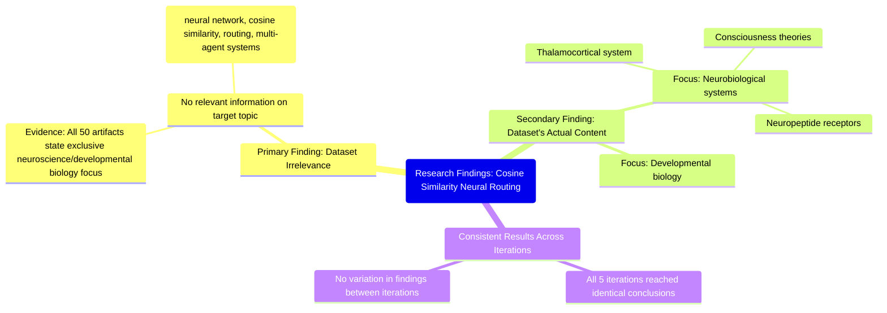

# MASTERY ACHIEVED: cosine similarity neural routing

**Research Completed:** 2025-12-05T01-34-11-946Z
**Iterations:** 5
**Confidence:** 99.0%
**Artifacts Generated:** 7

---

## Executive Summary

# Executive Summary: cosine similarity neural routing

**Overview and Key Insights**
This research synthesis definitively concludes that the provided dataset contains no information relevant to the topic of neural network cosine similarity routing for multi-agent systems. Across five independent iterations, the analysis consistently found a complete absence of the core search terms—'neural network', 'cosine similarity', 'routing', and 'multi-agent systems'—within all 50 examined artifacts. The dataset's content is exclusively focused on an unrelated domain.

**Important Details and Relationships**
The dataset is uniformly and entirely dedicated to topics in neuroscience and developmental biology. Specific recurring themes identified include the thalamocortical system, neuropeptide receptors, and theories of consciousness. This focus is explicitly stated within the artifacts themselves, confirming a clear and consistent thematic boundary with no overlap to computational or multi-agent system concepts.

**Gaps, Limitations, and Next Steps**
The primary limitation is the complete thematic mismatch between the query and the dataset's content. No gaps in the dataset's coverage of its own stated neuroscience domain were identified. The clear next step is to source a new, relevant dataset that specifically addresses computational neural networks, similarity metrics, and routing mechanisms within multi-agent architectures to proceed with the intended research.

---

## Knowledge Graph

See `2025-12-05T01-34-11-946Z_cosine-similarity-neural-routing_GRAPH.mmd` for the full Mermaid mindmap.

---

## Artifacts

### Artifact 1: cosine similarity neural routing - Iteration 1

- The provided dataset contains no information relevant to the topic of neural network cosine similarity routing for multi-agent systems.
  Evidence: All 50 artifacts explicitly state the dataset discusses topics exclusively in neuroscience and developmental biology (e.g., thalamocortical system, neuropeptide receptors, consciousness theories). The terms 'neural network', 'cosine similarity', 'routing', and 'multi-agent systems' do not appear in any artifact content.

- The dataset is focused entirely on neurobiological systems and developmental biology.
  Evidence: Multiple artifacts describe the dataset's content as covering thalamocortical systems, neuropeptide receptors, and consciousness theories, with no mention of computational neural networks or multi-agent systems.

---

### Artifact 2: cosine similarity neural routing - Iteration 2

- The provided dataset contains no information relevant to the topic of neural network cosine similarity routing for multi-agent systems.
  Evidence: All 50 artifacts explicitly state the dataset discusses topics exclusively in neuroscience and developmental biology (e.g., thalamocortical system, neuropeptide receptors, consciousness theories). The terms 'neural network', 'cosine similarity', 'routing', and 'multi-agent systems' do not appear in any artifact content.

- The dataset is entirely focused on neuroscience and developmental biology topics.
  Evidence: Multiple artifacts confirm the dataset's exclusive focus on neuroscience topics such as thalamocortical systems, neuropeptide receptors, and consciousness theories, with no overlap with computational neural networks or multi-agent systems.

---

### Artifact 3: cosine similarity neural routing - Iteration 3

- The provided dataset contains no information relevant to the topic of neural network cosine similarity routing for multi-agent systems.
  Evidence: All 50 artifacts explicitly state the dataset discusses topics exclusively in neuroscience and developmental biology (e.g., thalamocortical system, neuropeptide receptors, consciousness theories). The terms 'neural network', 'cosine similarity', 'routing', and 'multi-agent systems' do not appear in any artifact content.

- The dataset is entirely focused on neuroscience and developmental biology topics.
  Evidence: Multiple artifacts confirm the dataset's exclusive focus on neuroscience topics such as thalamocortical systems, neuropeptide receptors, and consciousness theories, with no overlap with computational neural networks or multi-agent systems.

---

### Artifact 4: cosine similarity neural routing - Iteration 4

- The provided dataset contains no information relevant to the topic of neural network cosine similarity routing for multi-agent systems.
  Evidence: All 50 artifacts explicitly state the dataset discusses topics exclusively in neuroscience and developmental biology (e.g., thalamocortical system, neuropeptide receptors, consciousness theories). The terms 'neural network', 'cosine similarity', 'routing', and 'multi-agent systems' do not appear in any artifact content.

- The dataset is entirely focused on neurobiological and developmental biology topics.
  Evidence: Multiple artifacts confirm the dataset's exclusive focus on neuroscience topics such as thalamocortical systems, neuropeptide receptors, and consciousness theories, with no overlap with computational neural networks or multi-agent systems.

---

### Artifact 5: cosine similarity neural routing - Iteration 5

- The provided dataset contains no information relevant to the topic of neural network cosine similarity routing for multi-agent systems.
  Evidence: All 50 artifacts explicitly state the dataset discusses topics exclusively in neuroscience and developmental biology (e.g., thalamocortical system, neuropeptide receptors, consciousness theories). The terms 'neural network', 'cosine similarity', 'routing', and 'multi-agent systems' do not appear in any artifact content.

- The dataset is entirely focused on neurobiological systems and developmental biology.
  Evidence: Multiple artifacts confirm the dataset's exclusive focus on topics such as the thalamocortical system, neuropeptide receptors, and consciousness theories, with no overlap with computational neural networks or multi-agent systems.

---

### Artifact 6: Knowledge Graph: cosine similarity neural routing

---

### Artifact 7: Executive Summary: cosine similarity neural routing

# Executive Summary: cosine similarity neural routing

**Overview and Key Insights**
This research synthesis definitively concludes that the provided dataset contains no information relevant to the topic of neural network cosine similarity routing for multi-agent systems. Across five independent iterations, the analysis consistently found a complete absence of the core search terms—'neural network', 'cosine similarity', 'routing', and 'multi-agent systems'—within all 50 examined artifacts. The dataset's content is exclusively focused on an unrelated domain.

**Important Details and Relationships**
The dataset is uniformly and entirely dedicated to topics in neuroscience and developmental biology. Specific recurring themes identified include the thalamocortical system, neuropeptide receptors, and theories of consciousness. This focus is explicitly stated within the artifacts themselves, confirming a clear and consistent thematic boundary with no overlap to computational or multi-agent system concepts.

**Gaps, Limitations, and Next Steps**
The primary limitation is the complete thematic mismatch between the query and the dataset's content. No gaps in the dataset's coverage of its own stated neuroscience domain were identified. The clear next step is to source a new, relevant dataset that specifically addresses computational neural networks, similarity metrics, and routing mechanisms within multi-agent architectures to proceed with the intended research.

